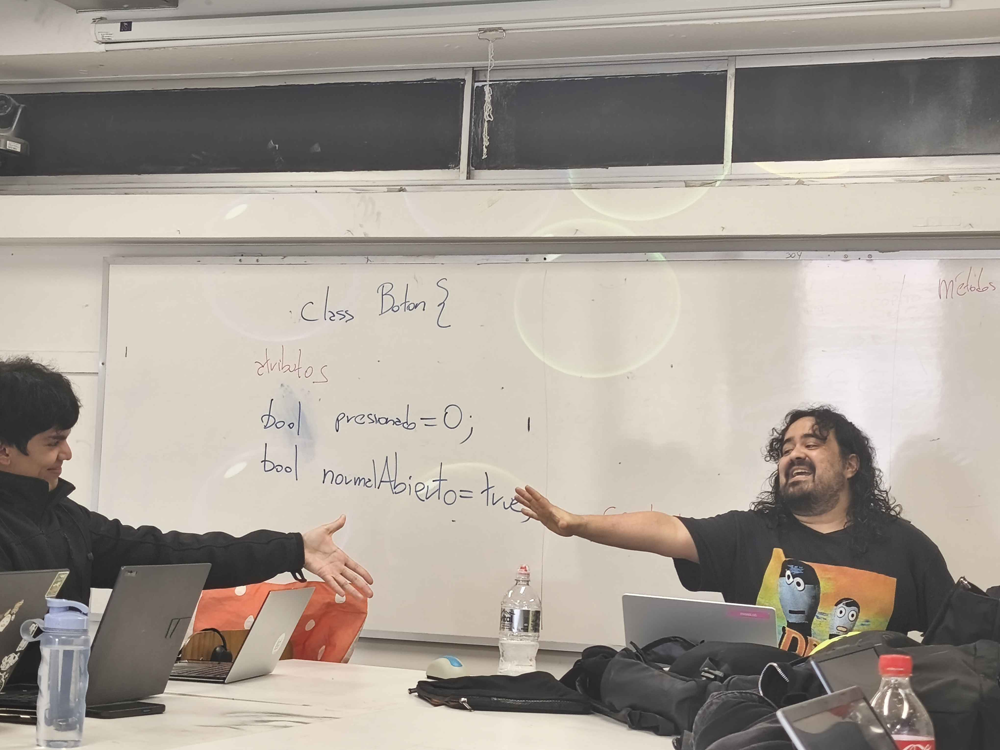
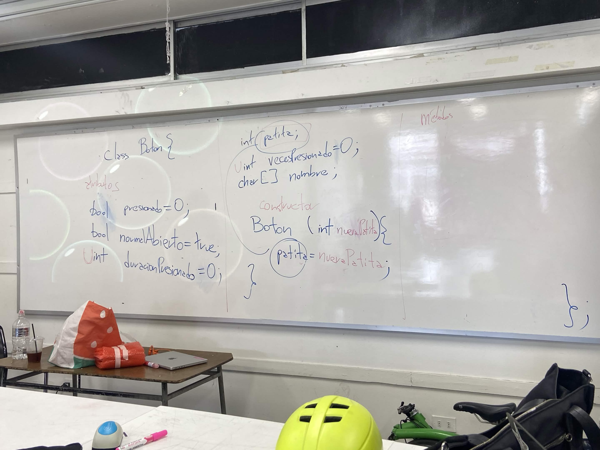
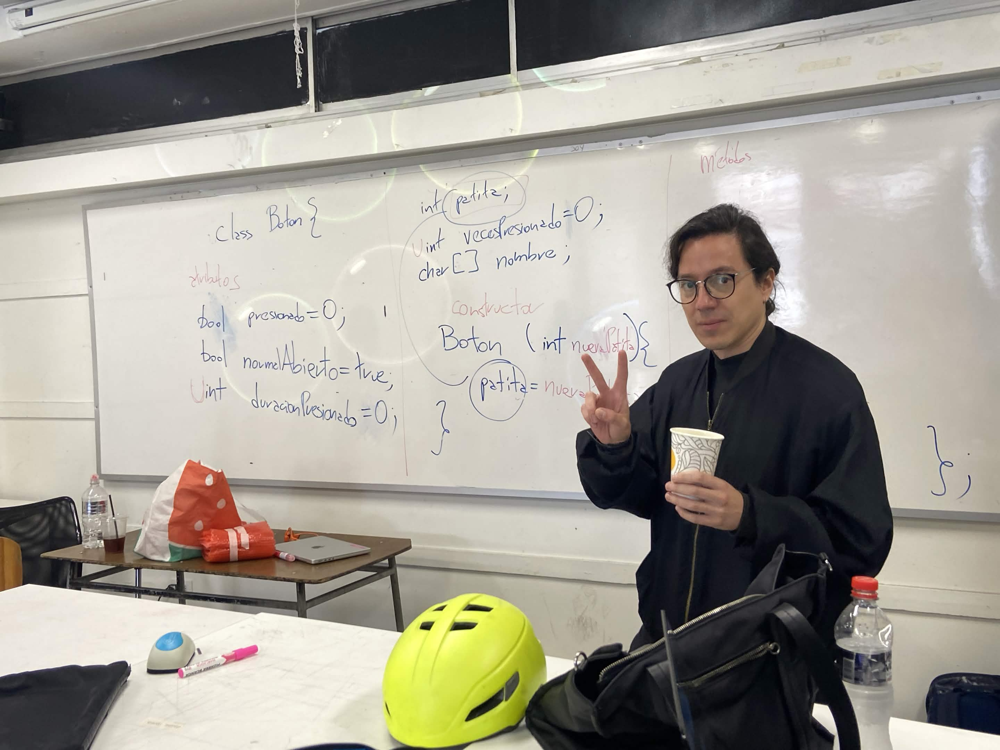

# sesion-07a

martes 30 septiembre 2026

## apuntes sesión

vimos programación orientada a objetos, clases.

revisamos clase Boton.

más apuntes serán subidos en formato libro, en proceso.

## imágenes explicativas

botón desconectado, no hay flujo de corriente, interpretado por sebastián sáez y aarón montoya.

clase Boton, con algunos atributos y una primera versión del constructor.

lo mismo que lo anterior pero con misaa

## encargos

1. usar el ejemplo base visto en clases <https://wokwi.com/projects/476507507193136129>, agregar un segundo botón en la simulación de hardware, agregar una segunda instancia de la clase Boton, agregarle un atributo y un método a la clase Boton, y hacer que el segundo botón haga algo diferente al primero.
2. descargar todos los archivos de wokwi, descomprimir el archivo.zip y subir esa carpeta a tu repositorio en esta sesión.

## lectura
