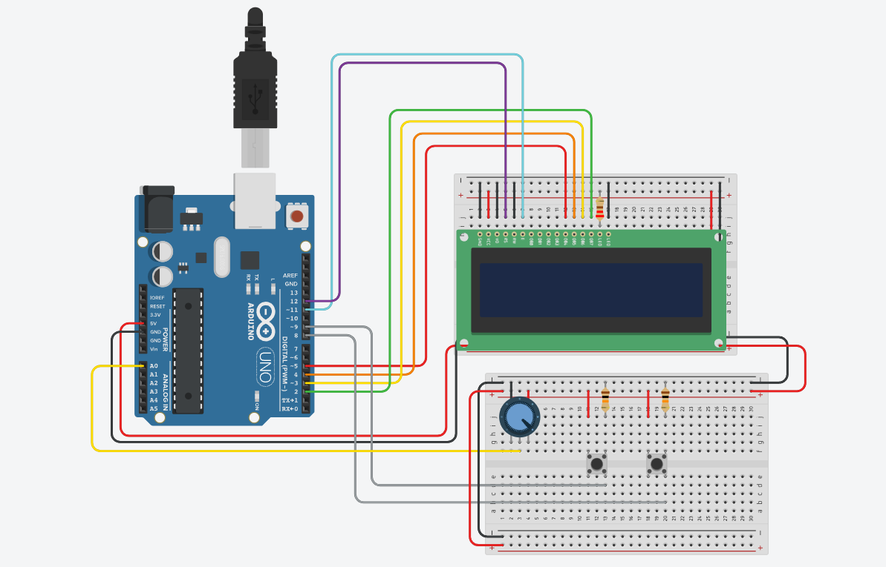
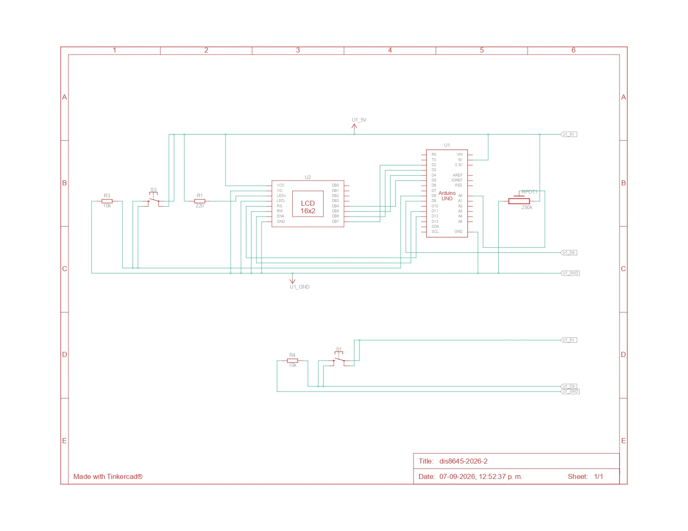

# proyecto-01

## Licencia 

Esta obra y su documentación están bajo una [Licencia Creative Commons Atribución-CompartirIgual 4.0 Internacional](https://creativecommons.org/licenses/by-sa/4.0/).

© 2026 [Dayana Pañitrur, Camila Ramírez, Bianka Vilchez]

<br>

## Poema

El poema elegido fue: $\textcolor{red}{When\ Our\ Two\ Souls\ Up\}$ 

Por: $\textcolor{red}{Elizabeth\ Barrett\ Browning\}$

Data del año [RELLENAR CON INFO Y CONTEXTO XFA xd]

Elizabeth Barret Browning nació en el año 1806 en Inglaterra. Reconocida por su reputación literaria, en una época en la cuál era poco frecuente que las mujeres fueran más reconocidas que los hombres en muchos contextos, pero por sobre todo en el ámbito académico, por las normas morales que existían sobre el rol de la mujer, Elizabeth estaba casada con Robert Browning, quién también era poeta. Su familia tenía una situación económica privilegiada, pero ella discrepaba con la mayoría de las ideas colonialistas que tenían, en contra de la esclavización que ellos mismos efectuaban y que les generaba el gran poder económico que tenían.

La obra de Elizabeth que elegimos se llama Soneto 22 y es parte de la colección *Sonetos del portugués*. Que data entre 1845 y 1846.

Según la *Academia de Poetas Americanos* el poema se encuentra en dominio público.

Interpretamos el poema como la intención de rehusarse a la muerte por la causa del amor. Desprenderse de lo terrenal implicaría dejar de sentir y vivir el amor romántico como se vive día a día, para someter amor al cielo y a la eternidad, lugar en el que ya no sería permitido el estar con su ser amado.

<br>

### Poema original  

<br>

When our two souls stand up erect and strong,

Face to face, silent, drawing nigh and nigher,

Until the lengthening wings break into fire

At either curvèd point,—what bitter wrong

Can the earth do to us, that we should not long

Be here contented? Think. In mounting higher,

The angels would press on us and aspire

To drop some golden orb of perfect song

Into our deep, dear silence. Let us stay

Rather on earth, Belovèd,—where the unfit

Contrarious moods of men recoil away

And isolate pure spirits, and permit

A place to stand and love in for a day,

With darkness and the death-hour rounding it.

<br>

> **Aviso de Dominio Público:** El material _When Our Two Souls Up_ utilizado en este repositorio se encuentra en el dominio público. Ha sido identificado como libre de restricciones bajo los derechos de autor (PDM 1.0).

<br>

<br>

### Poema traducido

<br>

**Cuando nuestras dos almas se eleven**

<br>

Cuando nuestras dos almas se eleven, firmes y fuertes,

frente a frente, en silencio, acercándose más y más, 

hasta que las alas que se alargan estallan en fuego 

en cada punta curva ¿qué mal amargo 

puede hacernos la tierra, que no debiéramos 

quedarnos aquí, contentos? Piénsalo. Al subir más alto, 

los ángeles nos oprimirían y aspirarían 

a dejar caer algún áureo orbe de canto perfecto

en nuestro hondo, querido silencio. Quedémonos

mejor en la tierra, Amado mío, donde los ánimos

contrarios e injustos de los hombres retroceden

y aíslan a los espíritus puros, y permiten

un lugar donde estar y amar por un día,

con la oscuridad y la hora de la muerte rodeándolo.

<br> 

> Traducción elaborada por Dayana Pañitrur, Camila Ramírez y Bianka Vilchez (2026).
>
> Distribuido bajo la licencia CC BY-SA 4.0. Para ver una copia de esta licencia, visita https://creativecommons.org/licenses/by-sa/4.0/

<br>

---

## Bill of materials

| Componente | Cantidad | Link de compra |
| :--- | :---: | ---: |
| Arduino UNO R4 Wifi | 1 | Dato 3 |
| Pantalla LCD Azul 16x02 | 1 | Dato 3 |
| Potenciómetro lineal (valor) | 1 | Dato 3 |
| Botón (tipo) | 2 | Dato 3 |

### Pantalla LCD Azul 16X02

A diferencia de la mayoría de los grupos decidimos utilizar esta pantalla, debido a su mayor tamaño y por su configuración, ya que está pensada para solo mostrar texto, es más sencillo, sumado que posee un controlador estandarizado. Pero todo eso lo veremos ahora con las caracterisiticas de esta pantalla


> Directamente desde [Afel](https://afel.cl/products/pantalla-lcd-azul-16x02)

#### Caracteristicas

- **Formato** 16 caracteres por 2 lineas

- **Voltaje funcionamiento** 5V

- **Controlador** SPLC780D1 o compatible con HD44780

- **Retroiluminación (Backlight)** LED de color azul con caracteres blancos.

- **Interfaz** Paralela, configurable para operación de 4 bits u 8 bits.

- **Tipo de Pantalla** STN (Super-twisted Nematic) de tipo negativo.

<br>

## Código

### Coreografía

1.Inicia el Arduino

2.El texto avanzará de manera continua hasta que se presionen los botones o se manipule el potenciómetro 

3.En caso de ser solo 1, el texto se congela y no sigue avanzando hasta que se deje de presionar

4.Si son los 2 botones, se detiene el texto y desaparece

5.Mientras esto ocurre, se consulta en qué sección del texto se encuentra

6.En base a la sección del texto mostrado, se visualizará una palabra clave

7.Al dejar de presionar un botón, vuelve a ocurrir el punto 3

8.Si se sueltan ambos botones, desaparece la palabra

9.Luego continúa avanzando el texto desde el mismo punto en el que quedó

10.En caso de ser manipulado el potenciómetro, se modificará la velocidad del texto (mientras más lejos del centro, más rápido el cambio)

11.Si se rota hacia la derecha avanza de manera normal solo variando la velocidad

12.Si se rota hacia la izquierda retrocede el texto, según qué tan lejos del centro esté

<br>

Además de esto realizamos el primer diagrama de flujo relacionado al funcionamiento del código


> Bastante básico en relación a la complejidad que posee el código

<br>


> Ahora podemos entender de mejor manera el funcionamiento del código

<br>


> Grafico que muestra la relación del potenciómetro con la velocidad del poema

<br>

## Arduino

Conexión representada en Tinkercad

[](https://youtu.be/ZCfgRzy07II)

>Link de [YouTube](https://youtu.be/ZCfgRzy07II)



<br>

## Proceso

### Etapa inicial

- chao poema de victoria Ramírez 

- por copyright (xd)

- buscar alguna solución

- Encontrar poema

- Traducir poema

- Acreditar licencia

- Conceptualizar

### Pseudo código

- Hacer listado de pasos

- Ponerse en situaciones que podrían entrar en conflicto (del código, no nosotras xd)

- Realizar esquema / hacer pruebas

- definir variables

- definir posibles funciones

### Codi-Gooooo

- Realizar un test funcionamiento del inicio (licencia, nombre y autora del poema)

```cpp

// adjuntar codigo con fallo inicial

```


> Explicar que fallo (todo ocurre en parelelo y sin un desfase, se pelean por quien se muestra en la pantalla)
>
> Mencionar elementos claves del código, funciones, variables, etc
>
> > set.display(0,0) por ejemplo

```cpp

// codigo con inicio listo

```

> Explicar que se solucionó, que cambiamos y que mantuvimos (el porque)

- Agregamos la parte que visualiza el poema de manera completa

  
```cpp

// codigo con poema (el que genero la daya)

```
> hablar de que elementos podemos entender que aparecen y porque, mencionar que instrucciones se le dieron a la ia, agregar prompt
>
> mencionar como pensamos agregar la siguiente función y que conflictos podriamos tener el código

- Agregar pote

```cpp

// codigo pote xd

```
> que cambio, genero algun error?, existe algun valor que queramos editar
>
> mencionar ejercicio en clase que fue utilizado como base

## agregar botones (solo congelar)

```cpp
// codigo botones solo congelar xddd
```
> que se le pidió a la ia, que sabemos de lo que se generó, algo que solucionar??

El prompt que se escribió a la IA para integrar los botones incluyó el código de *prueba_03.1*, con la intención de que no modificara nada del código que ya estábamos escribiendo.

prompt:

  *Estoy trabajando en un proyecto de arduino, para presentar un poema en una pantalla led, específicamente esta: Pantalla LCD Azul 16x02. Tengo un código inicial funcional.*

*A continuación te indico cuales son las cosas que queremos que pasen:*

1. *Inicia el Arduino*
2. *El texto versosPoema[] avanzará de manera continua hasta que se presionen los botones o se manipule el potenciómetro*
3. *En caso de ser solo 1, el texto se congela y no sigue avanzando hasta que se deje de presionar*
4. *Si son los 2 botones, se detiene el texto y desaparece*
5. *Mientras esto ocurre, se consulta en qué sección del texto se encuentra*
6. *Acción a: si los 2 botones se mantienen presionados menos de 1 segundo:*
   *En base a la sección del texto mostrado, se visualizará una palabra clave que nosotros elegimos por cada verso:*
   *"firme y fuerte", "acercandose", "estallan", "en cada", "tierra", "contentos", "oprimiran", "algun", "silencio", "amado mio", "injusto", "aislan", "lugar", "muerte"*
7. *Acción b: Si los 2 botones se mantienen presionados por más de 1 segundo: aparece un nuevo poema conformado por las palabras anteriores en una sola linea.*
8. *Para que esto ocurra sin interferencias considera esperar un tiempo mayor a 1 segundo (ej: 1,2 o 1,5) desde que se presionan ambos botones para definir cual de las dos posibles acciones ocurre según el tiempo accionado.*
9. *En el caso de que mientras esté ocurriendo la acción b se deje de presionar 1 solo botón, vuelve a versosPoema[] al punto donde quedó el verso congelado.*
10. *Pero si se sueltan ambos botones, desaparece el poemaNuevo[]*
11. *Luego continúa avanzando el versoPoema[] desde el punto exacto en el que quedó congelado*
12. *En caso de ser manipulado el potenciómetro, se modificará la velocidad del texto (mientras más lejos del centro, más rápido el cambio)*
12. *Si se rota hacia la derecha avanzá de manera normal solo variando la velocidad*
13. *Si se rota hacia la izquierda retrocede el texto, según qué tan lejos del centro esté.*

*Entonces:*

*a. ayúdame a integrar 2 botones, sin alterar otras cosas que no sean necesarias en el código. Y una vez listo indicame como realizar una prueba en thinkercad.*

*b. No borres los comentarios que ya están en el código original, ya que son importantes para nosotros entender que es lo que hemos hecho.*

<details>
<summary> <b> Código botones </b> </summary>

```cpp
  #include <LiquidCrystal.h>

// versos del poema
const char *versosPoema[] = {
  "Cuando estan nuestras almas frente a frente,", 
  "mudas, erguidas, fuertes, ya muy proximas,",
  "y sus alas se encienden al tocarse,",
  "en cada punta curva ?que mal amargo",
  "puede hacernos la tierra, que no debiéramos",
  "quedarnos aqui, contentos? Piensalo. Al subir más alto,",
  "los angeles nos oprimirian y aspirarian",
  "a dejar caer algun aureo orbe de canto perfecto",
  "en nuestro hondo, querido silencio. Quedemonos",
  "mejor en la tierra, Amado mio, donde los animos",
  "contrarios e injustos de los hombres retroceden",
  "y aislan a los espiritus puros, y permiten",
  "un lugar donde estar y amar por un dia,",
  "con la oscuridad y la hora de la muerte rodeandolo."
};

// corresponde a los pines que utiliza la pantalla 
// pantalla lcd verde 16 x 02 con controlador SPLC780D1 o HD44780
LiquidCrystal lcd(12, 11, 5, 4, 3, 2);

// texto que se muestra al inciar el dispositivo
const char textoInicialCC[] = "[PLACEHOLDER] - CC BY-SA 4.0"; // licencia de uso, Creative Commons BY-SA 4.0
const char textoInicialTitulo[] = "Cuando nuestras dos almas se eleven"; // titulo del poema
const char textoInicialAutora[] = "Elizabeth Barret Brown"; // autora del poema

// --- variables para los botones y nuevas acciones ---
const int boton1Pin = 6;
const int boton2Pin = 7;
int estadoActual = 0; // 0: Normal, 1: Congelado (1 botón), 2: Dos botones presionados
unsigned long tiempoInicioDosBotones = 0;
unsigned long lastScrollNuevoPoema = 0;
int posNuevoPoema = 0;

// palabras clave por cada verso
const char *palabrasClave[] = {
  "firme y fuerte", "acercandose", "estallan", "en cada", "tierra", 
  "contentos", "oprimiran", "algun", "silencio", "amado mio", 
  "injusto", "aislan", "lugar", "muerte"
};

// nuevo poema conformado por las palabras clave
const char poemaNuevo[] = "firme y fuerte acercandose estallan en cada tierra contentos oprimiran algun silencio amado mio injusto aislan lugar muerte";


//------- variables pote ------
// variables y constantes
// para lectura potenciometro
const int potePatita = A0;
int poteLectura = -1;
int poteFiltrado = -1;

// funcion entera
// para tomar una variable entera original
// y dividirla por otro entero para perder resolucion
int filtrarConDivision(int valor, int divisor) {
  int resultado = valor / divisor;
  return resultado;
}
// ---- fin variables pote -----


// determinar dirección y calcular velocidad
// relacionada al desplazamiento del poema
int direccion = 0; // variable asociada a si el texto avanza o retrocede
int pausa = 0;
int v = 0;
int pos = 0; // variable que determina la posición del texto


// ----- inicio de funcionamiento ----

void setup() {
  
  Serial.begin(9600);
  lcd.begin(16, 2); //define el tamaño de la pantalla

  // Configuración de pines para los botones usando resistencias internas del Arduino
  pinMode(boton1Pin, INPUT_PULLUP);
  pinMode(boton2Pin, INPUT_PULLUP);

  // --- texto inicial 1: textoInicialCC / Creative Commons BY - SA --- 

  lcd.setCursor(0, 0); //define la seccion superior de la pantalla
  for(int i = 0; i < 16 && textoInicialCC[i] != '\0'; i++) {
    lcd.print(textoInicialCC[i]);
  }
  lcd.setCursor(0, 1); //define la seccion inferior de la pantalla
  lcd.print(textoInicialCC + 16); 
  
  delay(4000); 
  lcd.clear();


  // --- texto inicial 2: Carrusel de textoInicialB en la fila inferior (0, 0) ---
  int largoB = strlen(textoInicialTitulo); // calculam el largo (35 letras)
  
  // calcula cuántos pasos debe avanzar para mostrarlo todo
  // si el texto es más corto de 16, no se mueve (0 pasos)
  int pasosTotales = (largoB > 16) ? (largoB - 16 + 3) : 0; // +3 para dejar unos espacios al final
  
  for(int pos = 0; pos <= pasosTotales; pos++) {
    lcd.setCursor(0, 0);
    
    // imprime la "ventana" de 16 caracteres
    for(int i = 0; i < 16; i++) {
      if (pos + i < largoB) {
        lcd.print(textoInicialTitulo[pos + i]);
      } else {
        lcd.print(' '); // rellena con espacios en blanco cuando se acaba el texto
      }
    }
    
    // si esta en el primer cuadro (pos = 0), hace una pausa más larga
    // para que se pueda empezar a leer antes de que se mueva
    if (pos == 0) {
      delay(2000); 
    } else {
      delay(500); // velocidad del carrusel (350ms por letra)
    }
  }
  
  lcd.clear();


  // --- texto inicial 3: textoInicialC / autora---
  lcd.setCursor(0, 0);
  for(int i = 0; i < 16 && textoInicialAutora[i] != '\0'; i++) {
    lcd.print(textoInicialAutora[i]);
  }
  lcd.setCursor(0, 1);
  lcd.print(textoInicialAutora + 16); 
  
  delay(4000); 
  lcd.clear();
}

void loop() {
  
  // Lectura de los botones (LOW significa presionado porque usamos INPUT_PULLUP)
  bool b1 = digitalRead(boton1Pin) == LOW;
  bool b2 = digitalRead(boton2Pin) == LOW;

  // LÓGICA DE LOS BOTONES
  if (b1 && b2) {
    // Si se presionan ambos botones
    if (estadoActual != 2) {
      estadoActual = 2;
      tiempoInicioDosBotones = millis();
      lcd.clear(); // Borra el texto de golpe
      posNuevoPoema = 0; // Prepara el nuevo poema desde el inicio
      lastScrollNuevoPoema = millis();
    }

    unsigned long tiempoPresionado = millis() - tiempoInicioDosBotones;

    if (tiempoPresionado < 1200) { // Acción A: Menos de 1.2 segundos (1200 ms)
      lcd.setCursor(0, 0);
      lcd.print(palabrasClave[v]); // Muestra la palabra clave de la sección actual
      
      // Rellena el resto de la pantalla con espacios para que no quede basura visual
      for(int i = strlen(palabrasClave[v]); i < 16; i++) {
        lcd.print(' ');
      }
    } else { // Acción B: Más de 1.2 segundos (Nuevo poema largo que avanza)
      unsigned long currentMillis = millis();
      
      // Controla la velocidad a la que avanza el poema nuevo sin usar delay
      if (currentMillis - lastScrollNuevoPoema > 300) { 
        posNuevoPoema++;
        int largoPoemaNuevo = strlen(poemaNuevo);
        if (posNuevoPoema > largoPoemaNuevo - 16) {
          posNuevoPoema = 0; // Si llega al final, vuelve a empezar
        }
        lastScrollNuevoPoema = currentMillis;
      }

      lcd.setCursor(0, 0);
      for (int i = 0; i < 16; i++) {
        if (posNuevoPoema + i < strlen(poemaNuevo)) {
          lcd.print(poemaNuevo[posNuevoPoema + i]);
        } else {
          lcd.print(' ');
        }
      }
    }
    return; // Sale del loop para que no se ejecute el potenciómetro ni avance el verso normal
  } 
  else if (b1 || b2) {
    // Si se presiona solo 1 botón (o se soltó uno estando en la Acción B)
    if (estadoActual != 1) {
      estadoActual = 1;
      lcd.clear(); // Limpia para asegurar que se borre el poemaNuevo si veníamos de ahí
    }
    
    // Imprime el texto original tal cual estaba, congelado en su posición actual
    int largoVerso = strlen(versosPoema[v]);
    lcd.setCursor(0, 0);
    for (int i = 0; i < 16; i++) {
      if (pos + i < largoVerso && pos + i >= 0) {
        lcd.print(versosPoema[v][pos + i]);
      } else {
        lcd.print(' ');
      }
    }
    return; // Sale del loop para que no actualice la posición y se quede congelado
  } 
  else {
    // Ningún botón presionado: Funcionamiento normal con el potenciómetro
    if (estadoActual != 0) {
      estadoActual = 0;
      lcd.clear(); // Limpia la pantalla para quitar rastro de las acciones de botones
    }

    // ------ lectura pote --------
    // función para leer el potenciometro 
    // lectura de pin A0
    // conectar pin 2 de pote 
    // lectura va de 0 a 1024
    poteLectura = analogRead(potePatita);
  
    // division de lectura de pote
    // valor resultante va de 0 a 255
    poteFiltrado = filtrarConDivision(poteLectura, 4);
  
    // imprimir en el monitor serial el poteFiltrado
    Serial.print("valor filtrado ");
    Serial.println(poteFiltrado);
    // ------- fin lectura pote ---------
  
    if (poteFiltrado >= 135) {
      direccion = 1; // Avanzar
      // Mapea desde 135 (el mínimo para avanzar) hasta 255 (velocidad máxima)
      pausa = map(poteFiltrado, 135, 255, 600, 50); 
    } 
    else if (poteFiltrado <= 120) {
      direccion = -1; // Retroceder
      // Mapea desde 120 (el mínimo para retroceder) hasta 0 (velocidad máxima en reversa)
      pausa = map(poteFiltrado, 120, 0, 600, 50); 
    } 
    else {
      direccion = 0; // Pausa / Zona muerta al centro (valores entre 121 y 134)
      pausa = 200;   // Pequeño delay de espera
    }
  
    // calcula el verso actual
    int totalVersos = sizeof(versosPoema) / sizeof(versosPoema[0]);
    int largoVerso = strlen(versosPoema[v]);
    int pasosTotales = (largoVerso > 16) ? (largoVerso - 16 + 3) : 0;
  
    //  imprimir el texto en la pantalla
    lcd.setCursor(0, 0);
    for (int i = 0; i < 16; i++) {
      if (pos + i < largoVerso && pos + i >= 0) {
        lcd.print(versosPoema[v][pos + i]);
      } else {
        lcd.print(' ');
      }
    }
  
    // 4. Aplicar la velocidad calculada
    delay(pausa);
  
    // 5. Actualizar la posición para el siguiente ciclo
    pos += direccion;
  
    // 6. Lógica para cambiar de verso si llegamos al límite (avanzando o retrocediendo)
    if (pos > pasosTotales) {
      // Si avanza más allá del verso actual, pasa al siguiente
      pos = 0;
      v++;
      if (v >= totalVersos) v = 0; // Vuelve al inicio si terminó el poema
      lcd.clear();
      delay(100); // Pausa visual al cambiar de línea
    } 
    else if (pos < 0) {
      // Si retrocede más allá del inicio, vuelve al verso anterior
      v--;
      if (v < 0) v = totalVersos - 1; // Va al último verso si retrocede desde el inicio
      
      // Recalcula el tamaño del nuevo verso para posicionarse al final de este
      largoVerso = strlen(versosPoema[v]);
      pasosTotales = (largoVerso > 16) ? (largoVerso - 16 + 3) : 0;
      pos = pasosTotales; 
      
      lcd.clear();
      delay(100);
    }
  }
}
```
</details>

Aquí se definen las nuevas variables para ambos botones, en conjunto con las nuevas acciones. 

```cpp
// --- variables para los botones y nuevas acciones ---
const int boton1Pin = 6;
const int boton2Pin = 7;
int estadoActual = 0; // 0: Normal, 1: Congelado (1 botón), 2: Dos botones presionados
unsigned long tiempoInicioDosBotones = 0;
unsigned long lastScrollNuevoPoema = 0;
int posNuevoPoema = 0;

```

Además por predeterminado nos da los valores predeterminados de 6 y 7 para los pines en los que se conectará cada botón: 

```cpp

const int boton1Pin = 6;
const int boton2Pin = 7;

```

Lo cuál nos hizo darnos cuenta de que en el prompt no se mencionó que entradas utilizaríamos para conectar ambos botones.
Entonces en vez de cambiar la conexión física, cambiamos simplemente los valores por 8 y 9, que es dónde ya teníamos ambos botones:

```cpp

const int boton1Pin = 8;
const int boton2Pin = 9;

```

A continuación se definen las palabras claves correspondientes a cada verso, que se ejecutarán con la acción de presionar ambos botones rapidamente.

```cpp

const char *palabrasClave[] = {
  "firme y fuerte", "acercandose", "estallan", "en cada", "tierra", 
  "contentos", "oprimiran", "algun", "silencio", "amado mio", 
  "injusto", "aislan", "lugar", "muerte"
};

```

Otro cambio: ```HIGH```por ```LOW```. No queríamos que los botones se mantuvieran constantemente presionados, si no que al presionarlos sucedieran las acciones que integramos con los botones.

```cpp

// Lectura de los botones (HIGH significa presionado porque usamos configuración pull-down)
  bool b1 = digitalRead(boton1Pin) == HIGH;
  bool b2 = digitalRead(boton2Pin) == HIGH;

```

Asignamos menos de 1 segundo para que ocurra la acción A, entonces cuando se presionen los botones por más de 1 segundo ocurre automáticamente la acción B.

```cpp

unsigned long tiempoPresionado = millis() - tiempoInicioDosBotones;

    if (tiempoPresionado < 1000) { // Acción A: Menos de 1 segundo (1000 ms)
      lcd.setCursor(0, 0);
      lcd.print(palabrasClave[v]); // Muestra la palabra clave de la sección actual
      
      // Rellena el resto de la pantalla con espacios para que no quede basura visual
      for(int i = strlen(palabrasClave[v]); i < 16; i++) {
        lcd.print(' ');
      }
    } else { // Acción B: Más de 1.0 segundos (Nuevo poema largo que avanza)
      unsigned long currentMillis = millis();

```

- codigo final
