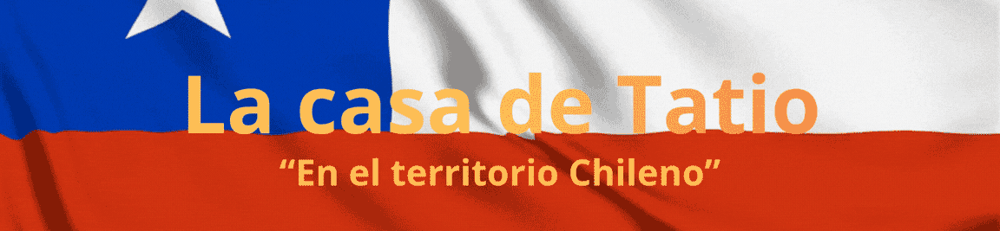

**Realizado por:**  
*Francisca Palma (frannciscapalma)*
&nbsp;&nbsp;&nbsp;&nbsp;&nbsp;&nbsp;&nbsp;&nbsp;&nbsp;&nbsp;&nbsp;&nbsp;&nbsp;&nbsp;&nbsp;&nbsp;
*Nicolás Valdés (nicolasvaldesgreve)*&nbsp;&nbsp;&nbsp;&nbsp;&nbsp;&nbsp;&nbsp;&nbsp;&nbsp;&nbsp;&nbsp;&nbsp;&nbsp;&nbsp;&nbsp;&nbsp;
*Santiago Cifuentes Vélez (santiagocifuvelez)*

  

# Poema  
No es un poema en prosa, no es tampoco una página con letras que riman, y ya..., es una experiencia que nace de la observación del entorno; el amarillo cálido del sol, la grandeza de la cordillera de los Andes, la ternura de la jerga para hacer sentir cómodo al prójimo, el canto de los colibríes, la sensualidad de vestirse de blanco y desvestirse por el sol, etc...

Dice así:

"**Chile mapu mew...***
*En el territorio Chileno*

> *No somos poetas con titulo,*  
*pero las palabras plasmadas aquí, crecieron de nuestro ser*  
*como las flores en primeravera.*  

>*La primavera de Santiago de Chile, ¡Que coincidencia!*  
*estamos en primavera.*  

>*Bienvenidx*  

>*Con amor: Francisca, Nicolas y Santiago.*  

*¿Qué pasa cuando la luz del sol aparece detrás de la cordillera?*  

*En Chile, los Romeros florecen*    
*- (FLores creciendo)*  

*En Chile, los Colibríes cantan*  
*- (Colibries revoloteando)*  

*En Chile, el cielo es rosado, y cuando te ofrecen un peda**CITO**, significa que es uno grande**CITO***  
*- (Pedazo de queque)*  

*En Chile, los Andes se visten de novia en las noches, y se desvisten revelándose de día.*  
*- (Cordillera en pixeles épicos)*  

*Pero...*  

*En Chile, los chirihues dan conciertos, y las libélulas danzan.*  
*- Bandera de Chile*  

*Mientras el sol siga saliendo detrás de la cordillera,*  
*y se pose sobre tu cabeza,*  
*es un día más para sentirlo.*  

*En Chile, las Chinchineras saltan y las Turcas cabriolean.*  
*En Chile, el Zorro culpeo no tiene la culpa.*  
*En Chile, el Romero florece...*  
*Pero también, ya en tu pecho florecerán,*
*colores de amor.*  

*Florecerán...*

> *(Escrito por Santiago Cifuentes Vélez..., para el proyecto 01 de taller semestre 2 del 2026, inspirado en la sutileza de mis amigues Nico y Fran, y la imponente cordillera de los Andes, lugar donde me he encontrado de cara con la vida misma)*
> 
##### Licencia
© 2026 [Santiago Cifuentes Vélez]. El poema está bajo la licencia [Creative Commons Atribución-NoComercial-SinDerivadas 4.0 Internacional (CC BY-NC-ND 4.0)](https://creativecommons.org/licenses/by-nc-nd/4.0/deed.es).

# Diagrama de flujo 

# Esquemático 

El concepto de realizar un living de hogar, fue por la calidez que suele ocupar en la casa,
así mismo como los recuerdos en nuestra mente, que palpitan en el corazón, y sentimos en el estomago.

Nostálgico, de silencio y cuidado.
Donde se atienden a lxs amigues, 
así como el país que le habitamos, nos atiende, y nos sorprende. 

## Bocetos:
El escenario consta de 2 partes: 

*1. El living.*  
*2. El control remoto del tv y la lampara del techo.*  

# Código

# Referentes
1. "Mira niñita", una canción de los Jaivas.
2. "La danza de la libélulas", una canción de Manuel García.
3. "La exiliada del sur", un poema de Violeta Parra.
4. "Un día más", una canción de Jósean Log
