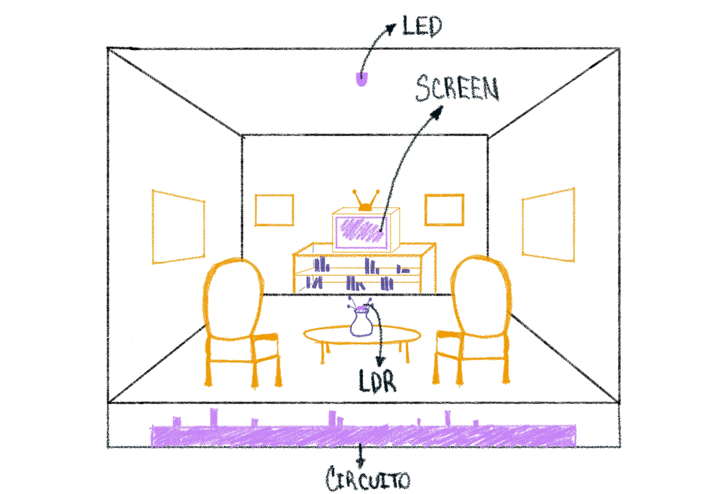
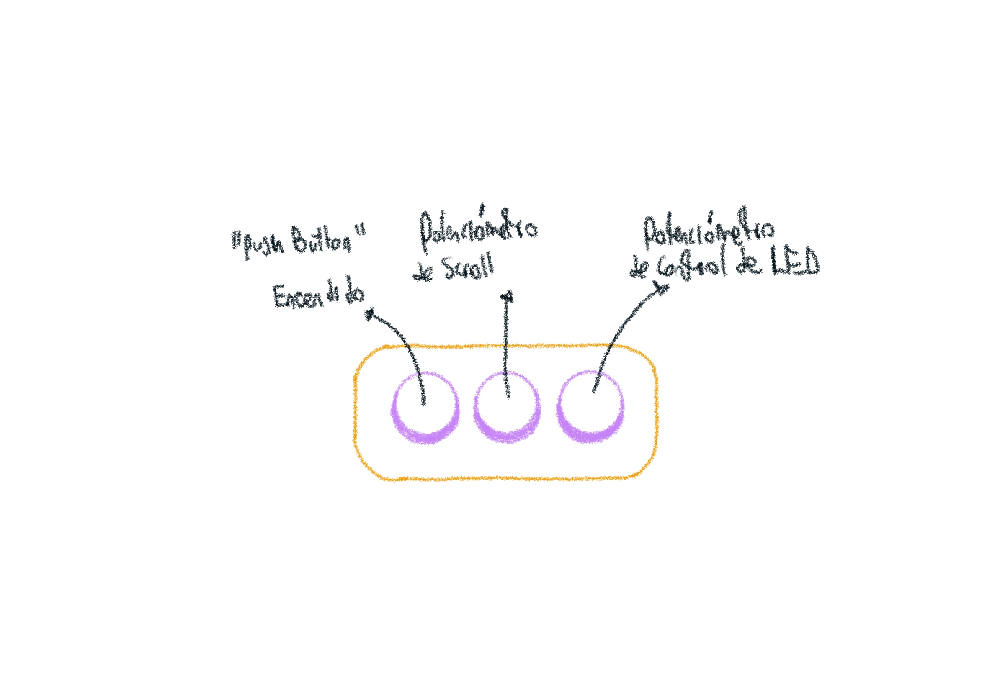

Realizamos esquematico del prototipo.






Para hacer las animaciones, debemos continuar esta estructura:
```cpp
//1. CLEAR  → wipe the old frame
//2. DRAW   → draw the new frame
//3. SHOW   → push it to the screen
//4. UPDATE → change your variables for next time
//5. WAIT   → small delay to control speed
//(repeat forever, since this is inside loop())
```
