# **Proyecto 1: ;p0ema** 

*Tomás Catrileo (tomascarti)*                
*Kristel Ladrón de Guevara (kristelagj)*                
*Angel Sabogal (angel-udp)*

<br>

## **1\. Concepto y Extracto Escogido**

Nuestro grupo eligió ;p0ema de Leonor Olmos. Es el extracto del poema 4, página 9\. 

> Este poema nada puede resolver.  
> Adentro del poema, la muerte se consume.
>
> Ya, dilo de nuevo, el porcentaje de pureza  
> mezclado con un poco de sol.  
> Con un poco de hambre
>
> Todo acaba aquí y de pronto no.  
> Un nuevo servidor, un poema electrónico, un mesías.
>
> Poema bajando desde el cielo  
> Solo los elegidos contemplan su propia destrucción.
>
> No, en serio, este poema nada puede resolver.

Es difícil decir el porqué escogimos este extracto porque nuestra respuesta sería “nos gusto por lo complejo que es”. Cada uno, hasta el día de hoy, mientras más lo leemos, más significados encontramos, pero esta es la gracia de este poema, no entender y creemos que jamás lo comprenderemos porqué si lo analizamos—teniendo en cuenta todo el libro— la autora habla siempre de su cuerpo pero a su vez lo que pasa alrededor como lo es la quimica, música, sistema económico, etc. 

Lo que nosotros queremos hacer con esta entrega es poder hacer más cercano este poema, presentar como lo entendemos y experimentar en la marcha. 

## **2\. Corpus y Licencias**

La obra original establece en su página legal: *"Ninguna parte de esta publicación puede ser reproducida o transmitida mediante cualquier soporte sin la expresa autorización de la editorial"*.

Para cumplir con las normativas de derechos de autor nos contactamos directamente con la editorial vía correo electrónico, la cual nos otorgó el permiso para su uso meramente académico. 

<p align="center">
  
</p>

## **3\. Referentes y desarollo**

### Referentes

En cuanto a los referentes, tomamos como inspiración la clase del año pasado:
https://github.com/disenoUDP/dis8645-2025-2-procesos

Con esto pudimos corroborar lo que se había hecho anteriormente y exigirnos dentro de nuestras posibilidades, además de saber cómo mejorar la entrega de nuestro proyecto.

Y además tuvimos al ayudante Sebastián Sáez como referente para explorar el nodo conexión HW-517 que va entre el Arduino y motor vibratorio, para poder hacer más interactiva la lectura del poema a la hora de presionar el botón.

Y en el proceso vimos bastantes videos o proyectos que estaban en redes sociales con un punto de visualización final similar a lo que buscamos, aunque decidimos tomar nuestro camino e interpretarlo en base a lo que vimos del poema que elegimos para poder expresarlo de una mejor manera.

| Proceso 1 | Proceso 2 |
|:---:|:---:|
|  |  |

| Proceso 3 | Proceso 4 |
|:---:|:---:|
|  |  |

## **4\. Idea general**

Lo primero que hicimos fue entender cada verso para poder representarlo en las pantallas, pero no completo ya que, como mencionamos, era difícil de entender y hasta el último día entendíamos cosas distintas. 
Como grupo no queríamos limitarnos a solo el uso de la pantalla; es por esto que experimentamos con los límites del hardware. Inicialmente, evaluamos usar dos pantallas, una I2C y otra TFT las cuales tienen 2 lenguajes distintos; la TFT nos entrega mayores posibilidades de contenido multimedia (videos).

| Código I2C TFT | Pruebas pantalla TFT | Experimentación I2C 1 |
|:---:|:---:|:---:|
|  | 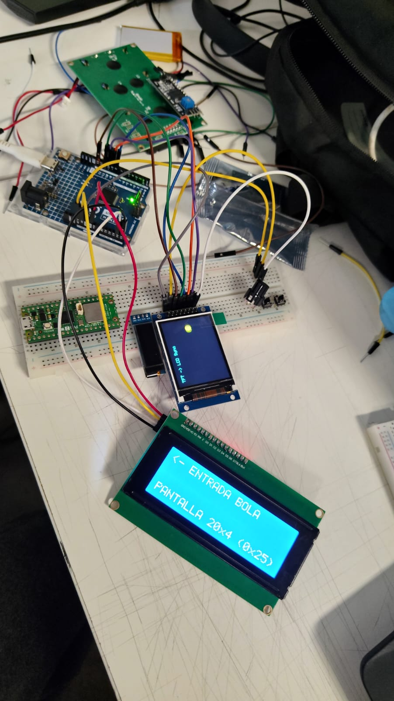 |  |

| Experimentación I2C 2 | Experimentación I2C 3 | Experimentación I2C 4 |
|:---:|:---:|:---:|
| 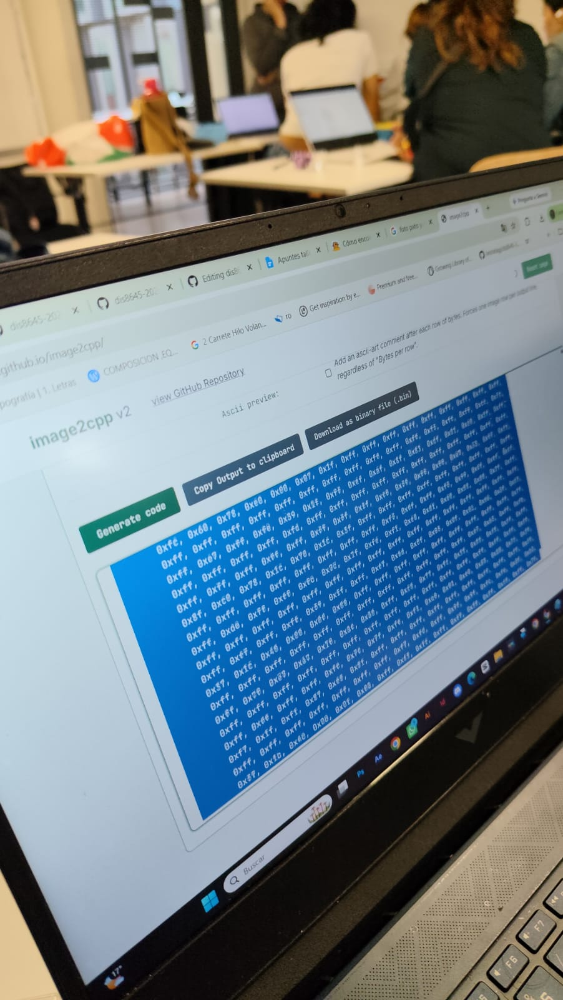 | 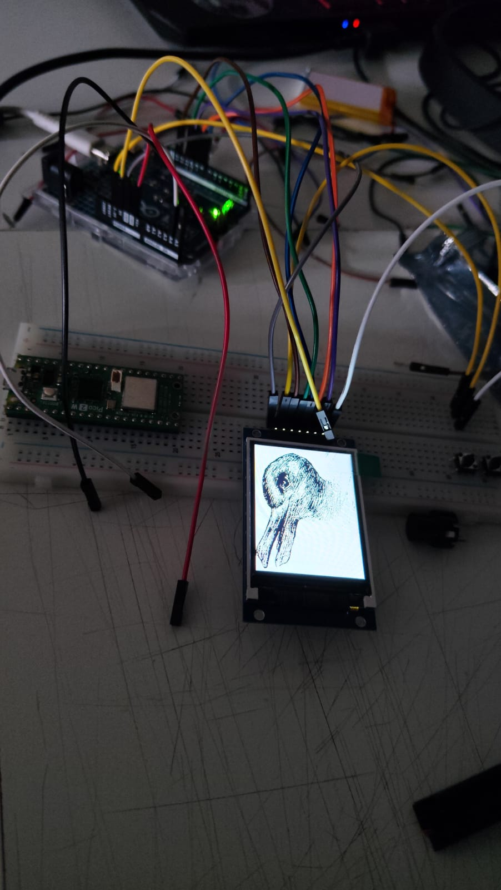 |  |

A partir de la retroalimentación, se nos entregaron dos pantallas I2C para que estas hablaran el mismo idioma y no se crearan 2 animaciones por separado. Destacamos esta opción solamente por cómo se veían gráficamente las pantallas. Finalmente, lo que realizamos como grupo fue que en la pantalla TFT se encontrará la animación del poema y en la I2C indicaciones que el usuario debe realizar mediante cada verso.  

| Pantallas | 2 pantallas funcionando |
|:---:|:---:|
|  | 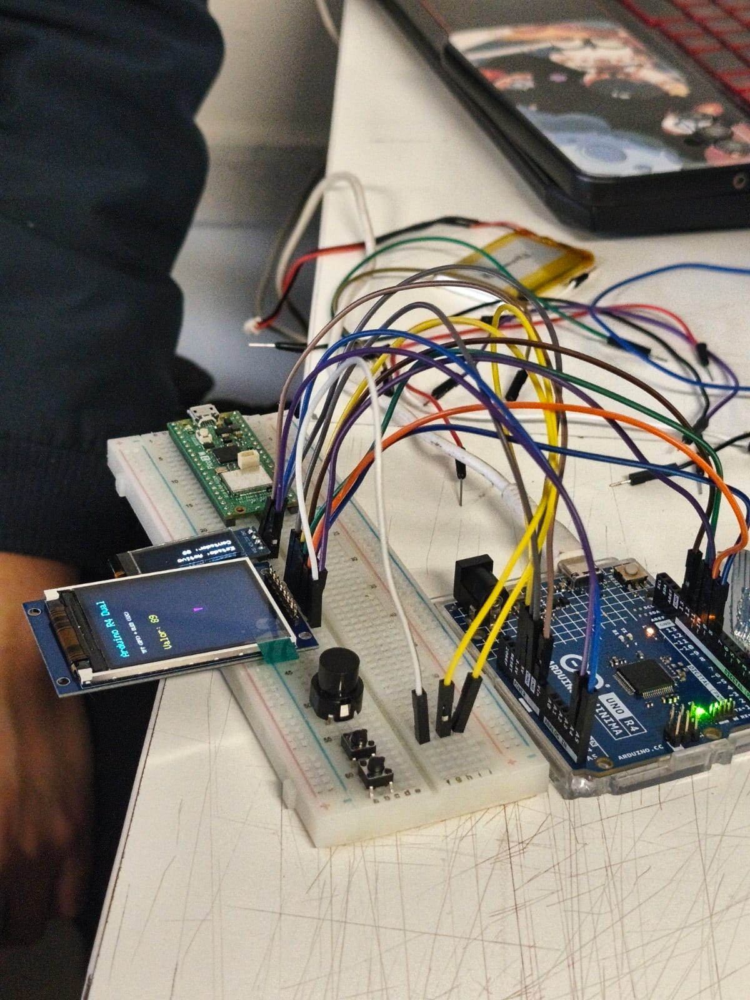 |

Además, tuvimos la posibilidad de utilizar 3 motores para el proyecto; primero queríamos hacer explotar un diodo representando el caos, pero esto podría afectar el uso del Arduino, dejándonos sin ninguna retroalimentación a las pantallas, entonces descartamos la idea al encontrar esta segunda opción.

O sea, lo que queríamos era que no representara tan solo gráficamente en las pantallas, sino sonora y sensorialmente. Esto nos dio a entender que ARDUINO no se limita, sino nosotros. 

<p align="center">
  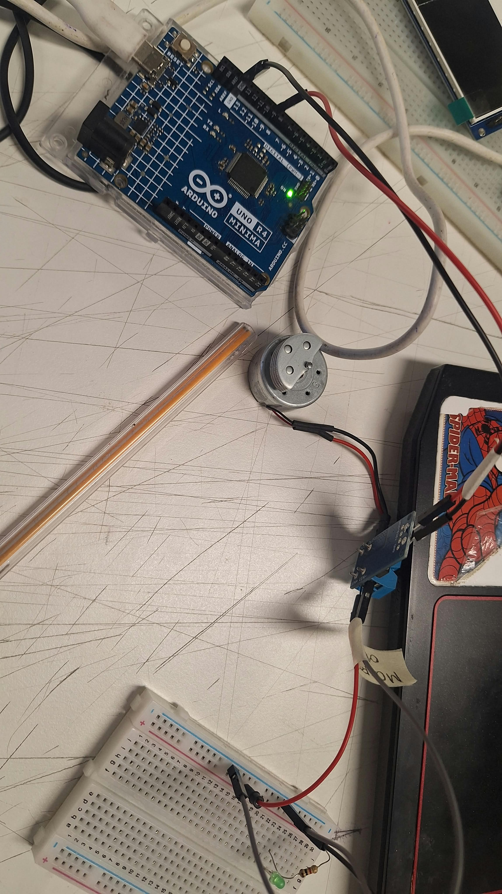
</p>

### Poema proceso tecnico 

Programa para Arduino Uno R4 Minima, TFT ST7789V de 240 × 320 y OLED SSD1306 de 128 × 32. Se coloca la TFT, en horizontal (320 × 240), y la OLED a la derecha.
TFT alimentada a 3,3 V, OLED a 5 V y batería externa marcada 3,7 V / 1200 mAh / 60350 dedicada exclusivamente a los motores. La batería no alimenta Arduino. Eran 4 motores, pero al final nos quedamos con tres motores porque uno dejó de funcionar. Por lo que esta versión usa esos tres motores, mediante los drivers de D3, D5 y D6. D9 queda forzado a nivel bajo y sin motor conectado. Se conserva el control por los drivers HW-517 del montaje original.

### Conexiones de señales

Este mapa corresponde exactamente al programa. Si tu montaje de prueba usa otros pines, adapta el cableado o las constantes antes de cargarlo.
| Componente | Pin del módulo | Uno R4 Minima |
|---|---|---|
| OLED | SDA | A4 / SDA |
| OLED | SCL | A5 / SCL |
| OLED | VCC | 5 V |
| OLED | GND | GND |
| TFT | SDA, datos SPI | D11 / COPI (MOSI), |
| TFT | SCL, reloj SPI | D13 / SCK, |
| TFT | CS | D10, |
| TFT | DC | D8, |
| TFT | RST | D7,  |
| TFT | VCC | 3,3 V |
| TFT | GND | GND |
| TFT | BL | |
| Potenciómetro | Terminal central | A0 |
| Potenciómetro | Terminales exteriores | 5 V y GND |
| Pulsador | Dos contactos que se unen al pulsar | D2 y GND |
| LED externo | Ánodo | D4 mediante resistencia de 1 kΩ |
| LED externo | Cátodo | GND |
| Driver motor 1 | Entrada de control | D3 |
| Driver motor 2 | Entrada de control | D5 |
| Driver motor 3 | Entrada de control | D6 |
| Salida retirada | Sin motor conectado | D9, mantenido apagado |

Referencia del mapa de pines: [pinout oficial de Uno R4 Minima](https://docs.arduino.cc/resources/pinouts/ABX00080-full-pinout.pdf). La distinción entre alimentación y señales puede verse en los módulos de [Adafruit con regulador y adaptación de nivel incorporados](https://www.adafruit.com/product/3787); 

### pasos claves que realizamos

1. Abrir el archivo en Arduino IDE. Instala el soporte para Uno R4 si aún no está instalado y seleccionar **Arduino Uno R4 Minima** y su puerto.
2. Instalar desde el gestor de bibliotecas **Adafruit GFX Library**, **Adafruit ST7735 and ST7789 Library**, **Adafruit SSD1306** y **Adafruit BusIO**, aceptando las dependencias.
3. Compila y carga. 
4. Poner el potenciómetro cerca del extremo inicial y enciende Arduino. El poema comienza directamente en la escena 1. Gira para avanzar o retroceder en cualquier momento, incluso durante las animaciones.

La configuración de la TFT sigue el [ejemplo ST7789 de Adafruit](https://github.com/adafruit/Adafruit-ST7735-Library/blob/master/examples/graphicstest_st7789/graphicstest_st7789.ino); la OLED usa su [ejemplo SSD1306 de 128 × 32 por I2C](https://github.com/adafruit/Adafruit_SSD1306/blob/master/examples/ssd1306_128x32_i2c/ssd1306_128x32_i2c.ino).

## Cómo responde al potenciómetro
La posición del mando selecciona la escena dentro del recorrido actual: girar permite avanzar y retroceder, con la excepción del salto 10 → 2 descrito más abajo. No hay tiempos mínimos, retención de tres recorridos ni obligación de pulsar el botón. Al salir de una escena y volver a entrar, su animación comienza desde cero. Un giro rápido puede saltar escenas intermedias.
El recorrido está dividido en doce zonas iguales: `1, 2, 3, 4, 5, 6a, 6b, 6c, 7, 8, 9, 10`. En los ciclos siguientes, el recorrido se reparte siempre entre los dos extremos físicos en once zonas, omitiendo la escena 1. Las tres zonas de la escena 6 muestran una, dos y tres frases respectivamente. Se retiran al girar en sentido contrario. Permanecer en una zona no añade frases por tiempo.
Se aplica un pequeño margen en las fronteras para evitar que el ruido del potenciómetro cambie escenas. Al encender, se muestra siempre la escena 1; tras el primer movimiento, se adopta la posición real del mando. Para comenzar un recorrido continuo desde el principio, coloca el mando en el extremo inicial antes de encenderlo.
Se restaura el bucle original: al llegar a la escena 10 y devolver el mando, salta a la 2 sin exigir que alcance el tope físico ni esperar la animación. Continuar en ese sentido recorre 2 → 3 → … → 10. Al devolverlo de nuevo, vuelve a comenzar desde 2. Dentro de cada recorrido se puede avanzar y retroceder libremente; volver a una escena reinicia su animación. La excepción es la escena 10, cuyo regreso abre el siguiente ciclo. La escena 1 solo pertenece al recorrido inicial. Tomamos esta decisión de bucle, ya que el final e inicio del poema eran lo mismo, y como nosotros lo interpretamos, sentíamos que reforzaba aún más el mensaje de la autora.

### Escenas

| Escena | Comportamiento |
|---|---|
| 1 | La TFT conserva verso → números → `syntax error`, con esa escritura solicitada. La OLED dice únicamente «Girar potenciómetro». |
| 2 | Texto que se contrae y se desintegra. Se reinicia al volver a entrar. |
| 3 | Píxeles negros se convierten aleatoriamente en blancos y permanecen blancos, hasta absorber también las letras. Tras un segundo de pantalla completamente blanca aparece «Con un poco de hambre» en negro y conserva su desintegración. Al regresar, el verso de pureza aparece de inmediato. |
| 4 | «Todo acaba aquí» estático, |
| 5 | «Y de pronto no.» |
| 6a | Arriba en la TFT: «Un nuevo servidor,». |
| 6b | Se añade debajo «un poema electrónico,». |
| 6c | Se añade debajo «un mesías.». La OLED muestra «Girar potenciómetro» en las tres etapas. |
| 7 | «Poema bajando desde el cielo» cae palabra por palabra. Las palabras se acumulan y quedan en dos líneas al pie de la TFT. La OLED mantiene «Girar potenciómetro». |
| 8 | Verso en la TFT; únicamente «Presiona el botón» en la OLED. El LED parpadea continuamente mientras estás en esta escena. Pulsar acelera el parpadeo durante 1,8 segundos y mantiene los motores activos mientras el botón esté presionado. Al soltarlo, se detienen. Después recupera el parpadeo normal; una nueva pulsación reinicia el intervalo rápido. Se puede salir en cualquier momento; al salir se apagan. |
| 9 | «No, en serio» con tres puntos cuadrados de 5 × 5 píxeles que aparecen y desaparecen. |
| 10 | «Este poema nada puede resolver.»; la OLED indica «Girar potenciómetro / hacia el otro lado» solo si el mando está en un extremo físico; fuera de los extremos dice «Girar potenciómetro». Al devolver el mando, salta a la escena 2 y abre otro ciclo. |

Las animaciones temporales siguen desarrollándose mientras se permanezca en su escena. La OLED es monocromática; la desaparición gradual se hace retirando píxeles.

### Ajustes y primera prueba

- `POT_MIN` y `POT_MAX`: extremos de lectura del potenciómetro (0–1023 con la resolución configurada). Ajústalos si tu montaje no alcanza ambos extremos. Alimenta el potenciómetro con el 5 V de Arduino según el mapa, no desde la batería de motores.
- `NAV_HYSTERESIS`: margen entre zonas; subirlo reduce cambios por ruido pero exige más movimiento en cada frontera.
- `FAST_BLINK_DURATION_MS`, `MOTOR_POWER` y `MOTORS_ENABLED`: duración del parpadeo rápido, PWM y habilitación de motores, después de verificar la alimentación y los drivers.
- Si queremos rotar TFT, cambiamos `setRotation(1)` por `setRotation(3)` para conservar la orientación horizontal.

### Texto de la segunda pantalla

La OLED muestra «Girar potenciómetro». Solo al terminar el recorrido, en la escena 10 y junto al tope físico final, cambia a «Girar potenciómetro / hacia el otro lado». Al alejarse del tope vuelve al mensaje normal, aunque siga en la escena 10 o ya esté recorriendo el poema de vuelta. En el extremo inicial de la primera pasada sigue diciendo «Girar potenciómetro». Volver al inicio de un recorrido no bloquea el mando: puedes avanzar otra vez. El rango de navegación permanece fijo entre los dos topes para evitar zonas inaccesibles al cambiar de sentido.

En la escena 8 tiene prioridad «Presiona el botón»; pulsarlo es opcional.

LED en la escena 8: `LED_NORMAL_MS=500` alterna encendido y apagado cada medio segundo. Al pulsar, `LED_FAST_MS=100` alterna cada 100 ms durante `FAST_BLINK_DURATION_MS=1800`. Al salir de la escena, el LED se apaga inmediatamente. La pulsación y la vibración siguen siendo opcionales.
Configuración actual: tres motores en D3, D5 y D6, activos durante todo el tiempo que mantengas presionado el botón en la escena 8. Al soltar el botón o salir de la escena, se apagan. El motor averiado; D9 no se utiliza y queda apagado. Se conserva el parpadeo continuo del LED y su aceleración al pulsar.

## **5\. Carcasa**

Para la carcasa concordamos que necesitábamos espacio para que los motores que agregamos a nuestro proyecto tuvieran el espacio suficiente para moverse y a su vez no complicarnos con la estructura, entonces buscamos una caja idónea a nuestras necesidades. 

La pantalla TFT (principal) irá al lado izquierdo y la I2C al derecho la cual nos entregará las indicaciones. El botón con su luz de aviso se encontrarán al lado derecho y el potenciómetro en el izquierdo, estas decisiones fueron tomadas a partir de la comodidad del usuario y el espacio que tenemos para distribuir. 

| Proceso de carcasa 1 | Proceso de carcasa 2 |
|:---:|:---:|
| 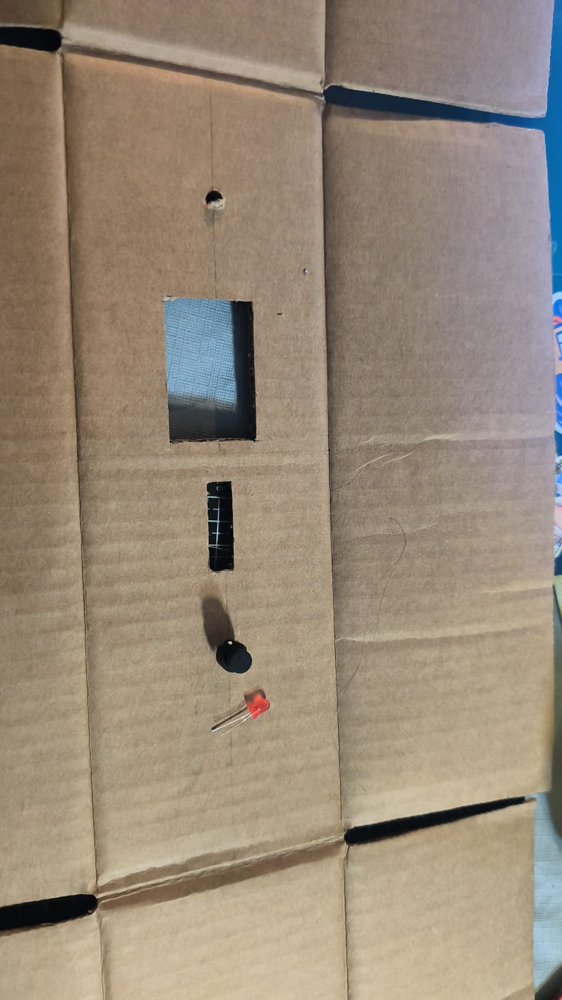 | 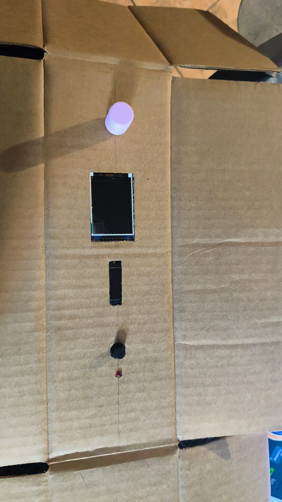 |

| Proceso de carcasa 3 | Proceso de carcasa 4 |
|:---:|:---:|
| 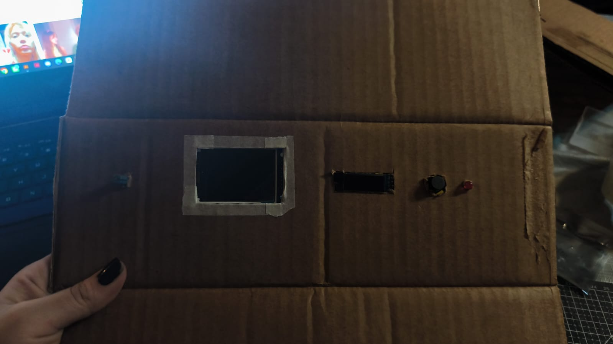 | 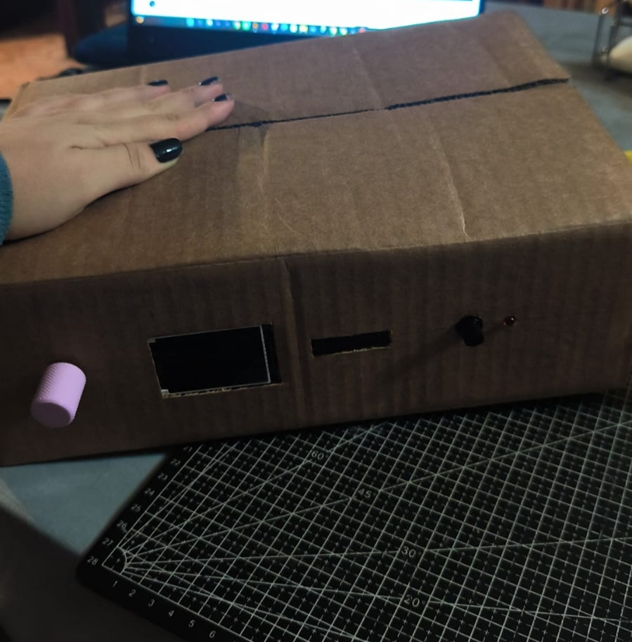 |

## **6\. Proceso del Código y elección de componentes**

El proceso de código fue iterativo, apoyándonos en ejemplos de años anteriores y herramientas de IA (Gemini) para entender la sintaxis.
Pruebas de Potenciómetro y Pantalla: El primer paso fue probar un potenciómetro B500k para cambiar números (1 al 7) en la pantalla OLED 128x32.
Filtro de Ruido: Encontramos que los números eran muy susceptibles al cambio físico (ruido). Añadimos un filtro de paso bajo (Exponential Moving Average) y probamos mapear arreglos de texto usando una canción de Akriila como prueba piloto.
Motores Vibratorios y Módulo HW-517: Para la línea "Solo los elegidos contemplan su propia destrucción", decidimos simular caos físico. Descartamos hacer explotar un condensador o fundir un LED. Optamos por motores vibratorios (JQ24-35E360). Descubrimos que el motor necesita un MOSFET (HW-517 V0.0.1) y alimentación externa. Desarrollamos un código para controlar la potencia PWM por consola y ejecutar patrones de alerta.
Pantallas: 

Storyboard - Coreografía Visual:
"Este poema nada puede resolver": Aparece esta parte del texto, luego se convierte en números que de a poco se multiplican acaparando la pantalla para dar Syntax Error (ambas pantallas). Representa la "utilidad" del arte en la cotidianidad.
"Adentro del poema, la muerte se consume": Las palabras se desintegran/consumen hacia adentro.
"Ya, dilo de nuevo...": Va solo. Abajo: "el porcentaje de pureza mezclado con un poco de sol". Se convierte en blanco de a poco. "Con un poco de hambre": las palabras desaparecen gradualmente.
"Todo acaba aquí": El potenciómetro entra en acción. El texto gira y luego se queda estático (duración aprox. de 3 rotaciones del potenciómetro).
"Y de pronto no": Aparece en grande en la pantalla inferior de manera consecutiva.
"Un nuevo servidor, un poema electrónico, un mesías": En la pantalla grande aparece "un nuevo servidor", abajo "un poema electrónico", y luego "UN MESÍAS". Intercalado con imágenes pasando rápido sobre tecnología y transmisión de mensajes.
"Poema bajando desde el cielo": Literalmente el poema baja lentamente de la pantalla grande a la pequeña.
"Solo los elegidos contemplan su propia destrucción": Caos. Un LED en el botón empieza a parpadear y se activa el motor vibratorio dentro de la caja. En la segunda pantalla dice "Presiona el botón".
"No, en serio": Pantalla grande con tres puntos suspensivos (...) que aparecen y desaparecen.
"Este poema nada puede resolver": Se repite y entra en bucle. Al girar el potenciómetro hacia atrás, la animación se reinicia de forma reactiva.

<p align="center">
  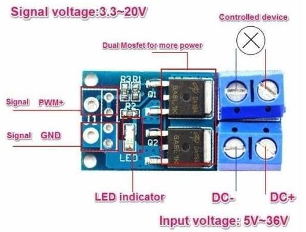
</p>

## **7\. Diagrama de Flujo**

<p align="center">
  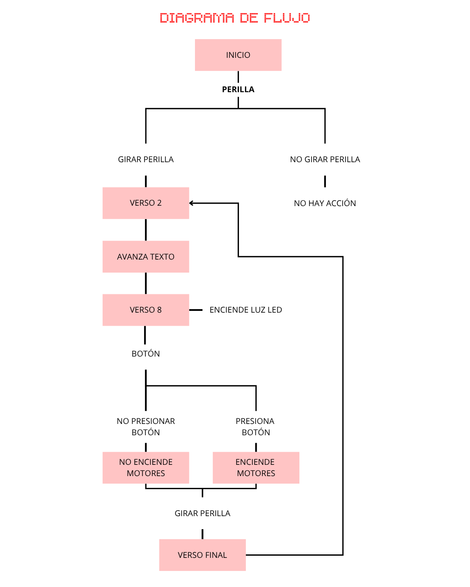
</p>

## **8\. Referencias y Bibliografía (Normas APA)**

* AliExpress. (s.f.). *Módulo de pantalla / Componente electrónico*. Recuperado de [https://es.aliexpress.com/item/1005005912666580.html](https://www.google.com/search?q=https://es.aliexpress.com/item/1005005912666580.html)  
* Búsqueda en Google. (s.f.). *If statement C++ with potentiometer*. Recuperado de [https://www.google.com/search?q=if+statement+c%2B%2B+with+potenciometer](https://www.google.com/search?q=if+statement+c%2B%2B+with+potenciometer)  
* Chang, Y.-H. (s.f.). *THE EXPERIMENT IS DEMOCRACY, FASCISM IS THE CONTROL*. Young-Hae Chang Heavy Industries. Recuperado de [https://www.yhchang.com/THE\_EXPERIMENT\_IS\_DEMOCRACY\_FASCISM\_IS\_THE\_CONTROL.html](https://www.yhchang.com/THE_EXPERIMENT_IS_DEMOCRACY_FASCISM_IS_THE_CONTROL.html)  
* HackMD. (s.f.). *Espacio de documentación*. Recuperado de [https://hackmd.io/](https://hackmd.io/)  
* Holocubic. (s.f.). *Búsqueda de referentes visuales y carcasas*. Recuperado de Google Search.  
* Instructables. (s.f.). *How to Find I2C Address of Any Device Using Arduino*. Recuperado de [https://www.instructables.com/How-to-Find-I2C-Address-of-Any-Device-Using-Arduin/](https://www.instructables.com/How-to-Find-I2C-Address-of-Any-Device-Using-Arduin/)  
* Olmos, L. (s.f.). *;p0ema* (Extracto del poema 4, p. 9). \[Permiso de uso académico otorgado por la editorial\]. [http://letras.mysite.com/lolm161123.html](http://letras.mysite.com/lolm161123.html)  
* Registros en Redes Sociales (TikTok e Instagram). (s.f.). *Recopilación de referentes visuales, tipografía cinética y displays electrónicos*. Recuperados de:  
  * [https://vt.tiktok.com/ZSVpbG8bQ/](https://vt.tiktok.com/ZSVpbG8bQ/)  
  * [https://vt.tiktok.com/ZSVpgYtxS/](https://vt.tiktok.com/ZSVpgYtxS/)  
  * [https://www.instagram.com/p/DOOgrXoDQiO/](https://www.google.com/search?q=https://www.instagram.com/p/DOOgrXoDQiO/)  
  * [https://www.instagram.com/p/DU7\_EDjjBA5/](https://www.google.com/search?q=https://www.instagram.com/p/DU7_EDjjBA5/)  
  * [https://www.instagram.com/reel/DMZrnJaI7lF/](https://www.instagram.com/reel/DMZrnJaI7lF/)  
  * [https://www.instagram.com/reel/DbQOnoAqbF9/](https://www.google.com/search?q=https://www.instagram.com/reel/DbQOnoAqbF9/)  
  * [https://www.instagram.com/reel/Db3WYYjhMdQ/](https://www.instagram.com/reel/Db3WYYjhMdQ/)  
  * [https://www.instagram.com/reel/CwSyB\_Dq3gJ/](https://www.instagram.com/reel/CwSyB_Dq3gJ/)  
  * [https://www.instagram.com/p/C\_TPtmoxHe8/](https://www.google.com/search?q=https://www.instagram.com/p/C_TPtmoxHe8/)  
* Registros visuales y pruebas de clase. (s.f.). *Uso de extracto de Akriila en clases*. Recuperado de YouTube: [https://www.youtube.com/shorts/XyG0R0R\_QLA](https://www.youtube.com/shorts/XyG0R0R_QLA) y [https://youtube.com/shorts/wRhWjAYHneg](https://www.google.com/search?q=https://youtube.com/shorts/wRhWjAYHneg)


## **9\. Anexos: Historial de Códigos y Versiones**

**Versión 01:** Prueba inicial de mapeo de Potenciómetro (1 al 7) 
https://share.gemini.google/2QejoApvxbC1
https://github.com/tomascatri/dis8645-2026-2-procesos-1/tree/main/00-proyecto-1/grupo-03/codigos/codigos-pruebas/contador-del-1-7-con-potenciometro

**Versión 02:** Incorporación de Filtro de Ruido y arreglos de texto (Prueba Akriila)
https://share.gemini.google/2QejoApvxbC1
https://github.com/tomascatri/dis8645-2026-2-procesos-1/tree/main/00-proyecto-1/grupo-03/codigos/codigos-pruebas/letra-akrilla-moviendonse-con-potencimetro-mas-filtro-de-ruido

**Versión 03:** Experimentacion con pantalla TFT
https://share.gemini.google/wD9R5q2mUXu4
https://github.com/tomascatri/dis8645-2026-2-procesos-1/tree/main/00-proyecto-1/grupo-03/codigos/codigos-pruebas/prueba-animacion-tft

**Versión 04:** Experimentación con pantalla OLED 20 x 4 y pantalla TFT
https://share.gemini.google/wD9R5q2mUXu4
https://github.com/tomascatri/dis8645-2026-2-procesos-1/tree/main/00-proyecto-1/grupo-03/codigos/codigos-pruebas/pantalla-i2c-mas-tft

**Versión 05:** Prueba y Control de Motor Vibratorio (Hardware HW-517)
https://github.com/tomascatri/dis8645-2026-2-procesos-1/tree/main/00-proyecto-1/grupo-03/codigos/codigos-pruebas/prueba-motor-vibratorio-y-modulo-hw-517
https://share.gemini.google/BSsl6DHlf5yU

**Version final** 
https://chatgpt.com/s/cx_6aa32f0da6d881919a586751a2dd9690

```cpp
/* Poema electronico — UNO R4 Minima / ST7789V 240x320 / SSD1306 128x32.
   Instalar: Adafruit GFX, Adafruit ST7735 and ST7789, Adafruit SSD1306
   y Adafruit BusIO. Leer LEEME.md antes de conectar los motores.
   Prototipo: texto y animaciones; no requiere tarjeta SD.
*/
#include <Arduino.h>
#include <Wire.h>
#include <SPI.h>
#include <Adafruit_GFX.h>
#include <Adafruit_ST7789.h>
#include <Adafruit_SSD1306.h>

constexpr uint8_t TFT_CS=10, TFT_DC=8, TFT_RST=7;
constexpr uint8_t POT=A0, BUTTON=2, BUTTON_LED=4;
constexpr uint8_t MOTOR_PINS[3]={3,5,6};
constexpr uint8_t UNUSED_MOTOR_PIN=9;
constexpr bool MOTORS_ENABLED=true; // Tres motores del montaje que el usuario confirma operativo.
constexpr uint8_t MOTOR_POWER=160;   // PWM 0..255; NO sustituye regular la fuente.
constexpr int POT_MIN=0, POT_MAX=1023, POT_DEADBAND=7;
constexpr int NAV_HYSTERESIS=4;
constexpr int END_TOLERANCE=7; // Margen ADC para reconocer los topes fisicos.
constexpr uint8_t SLOT_SCENE[12]={1,2,3,4,5,6,6,6,7,8,9,10};
constexpr uint32_t FRAME_MS=80, FAST_BLINK_DURATION_MS=1800;
constexpr uint32_t LED_NORMAL_MS=500, LED_FAST_MS=100; // Tiempo de cada estado ON/OFF.

Adafruit_ST7789 tft(TFT_CS,TFT_DC,TFT_RST);
Adafruit_SSD1306 oled(128,32,&Wire,-1);
GFXcanvas1 screen(320,240);
GFXcanvas1 wordCanvas(320,32);
uint16_t rgbRow[320];
uint32_t rowHash[240];
uint16_t backgroundColor=ST77XX_BLACK, foregroundColor=ST77XX_WHITE;
uint16_t lastBackground=ST77XX_BLACK, lastForeground=ST77XX_WHITE;
bool paletteChanged=false;
bool sceneVisited[11]={false}, sceneReentered=false;
bool firstFrame=true, oledOK=false, running=false, fatalError=false;
uint8_t scene=0;
uint32_t sceneStart=0, frameAt=0, buttonChanged=0, blinkStart=0;
bool buttonRaw=HIGH, buttonStable=HIGH, pressed=false, fastBlink=false;
bool interactionDone=false, navArmed=false, redraw=true, framePending=false;
int potFiltered=0, potAnchor=0, navSlot=0, revealStage=1, flushRow=0;
uint32_t potSampleAt=0;
bool repeatCycle=false, sweepForward=true, atPotEnd=false;
int endPeak=POT_MAX;

uint32_t noise(uint32_t n) {
  n ^= n >> 16; n *= 0x7feb352dUL; n ^= n >> 15;
  n *= 0x846ca68bUL; return n ^ (n >> 16);
}
float progress(uint32_t t,uint32_t start,uint32_t duration) {
  if(t<=start) return 0;
  if(t-start>=duration) return 1;
  return float(t-start)/duration;
}
int letters(const char *s) {
  int n=0; while(*s) { if((uint8_t(*s)&0xc0)!=0x80) ++n; ++s; } return n;
}
// Fuente basica con acentos dibujados: conserva el texto UTF-8 del poema.
void textAt(Adafruit_GFX &g,int x,int y,const char *s,int size=1,uint16_t ink=1) {
  while(*s) {
    uint8_t c=uint8_t(*s++); bool acute=false, tilde=false;
    if(c==0xc3 && *s) {
      uint8_t d=uint8_t(*s++);
      switch(d) {
        case 0xa1:c='a';acute=true;break; case 0xa9:c='e';acute=true;break;
        case 0xad:c='i';acute=true;break; case 0xb3:c='o';acute=true;break;
        case 0xba:c='u';acute=true;break; case 0x81:c='A';acute=true;break;
        case 0x89:c='E';acute=true;break; case 0x8d:c='I';acute=true;break;
        case 0x93:c='O';acute=true;break; case 0x9a:c='U';acute=true;break;
        case 0xb1:c='n';tilde=true;break; default:c='?';break;
      }
    }
    g.drawChar(x,y,c,ink,ink,size);
    if(acute) g.drawLine(x+2*size,y-size,x+3*size,y-2*size,ink);
    if(tilde) g.drawLine(x+size,y-size,x+4*size,y-size,ink);
    x+=6*size;
  }
}
void centered(Adafruit_GFX &g,int y,const char *s,int size=1,uint16_t ink=1) {
  textAt(g,(g.width()-letters(s)*6*size)/2,y,s,size,ink);
}
void eraseNoise(Adafruit_GFX &g,float amount,int x0,int y0,int w,int h,uint16_t ink=0) {
  uint32_t threshold=uint32_t(amount*65535.0f);
  for(int y=y0;y<y0+h;++y) for(int x=x0;x<x0+w;++x)
    if(amount>=1 || (noise(uint32_t(y)*401+x)&65535)<threshold) g.drawPixel(x,y,ink);
}
void collapse(Adafruit_GFX &g,int y,const char *s,int size,float p) {
  wordCanvas.fillScreen(0); textAt(wordCanvas,0,5,s,size);
  int w=letters(s)*6*size, h=8*size+5;
  int cx=g.width()/2, cy=y+h/2;
  for(int sy=0;sy<h;++sy) for(int sx=0;sx<w;++sx) {
    if(wordCanvas.getPixel(sx,sy) && (noise(sy*401+sx)&65535)>=p*65535.0f && p<1)
      g.drawPixel(cx+int((sx-w/2)*(1-p)),cy+int((sy-h/2)*(1-p)),1);
  }
}
void opening(Adafruit_GFX &g,uint32_t t,bool small) {
  if(t<3300) {
    int s=small?1:3;
    centered(g,small?6:85,"Este poema nada",s);
    centered(g,small?19:122,"puede resolver",s);
    if(t>1800) {
      float p=progress(t,1800,1500);
      eraseNoise(g,p,0,0,g.width(),g.height());
      for(int i=0;i<int(p*30);++i) {
        int x=noise(i+19)%g.width(),y=noise(i+77)%(g.height()-8);
        char digit[2]={char('0'+noise(i)%10),0}; textAt(g,x,y,digit);
      }
    }
  } else if(t<9000) {
    int s=small?1:2, cols=g.width()/(6*s), rows=g.height()/(8*s);
    float density=t<6000?progress(t,3300,2700):1-progress(t,6000,3000);
    for(int i=0;i<cols*rows;++i) {
      if((noise(i+3)&65535)<density*65535) {
        char digit[2]={char('0'+noise(i+21)%10),0};
        textAt(g,(i%cols)*6*s,(i/cols)*8*s,digit,s);
      }
    }
  } else centered(g,small?12:108,"sintax error",small?1:3);
}
void stopMotors() {
  for(uint8_t p:MOTOR_PINS) analogWrite(p,0);
  digitalWrite(BUTTON_LED,LOW); fastBlink=false;
}
void enterScene(uint8_t next,uint32_t now) {
  stopMotors(); sceneReentered=sceneVisited[next]; sceneVisited[next]=true;
  scene=next; sceneStart=now;
  interactionDone=false; redraw=true;
  Serial.print("Escena "); Serial.println(scene);
}
void updateButton(uint32_t now) {
  pressed=false; bool r=digitalRead(BUTTON);
  if(r!=buttonRaw) {buttonRaw=r;buttonChanged=now;}
  if(now-buttonChanged>=30 && r!=buttonStable) {
    buttonStable=r; if(r==LOW) pressed=true;
  }
}
void updateHaptics(uint32_t now) {
  if(scene!=8 || !running) { stopMotors(); return; }
  if(pressed) {
    fastBlink=true; blinkStart=now; interactionDone=true;
  }
  if(fastBlink && now-blinkStart>=FAST_BLINK_DURATION_MS) fastBlink=false;
  uint32_t blinkInterval=fastBlink ? LED_FAST_MS : LED_NORMAL_MS;
  uint32_t blinkTime=fastBlink ? now-blinkStart : now-sceneStart;
  digitalWrite(BUTTON_LED,(blinkTime/blinkInterval)%2==0 ? HIGH : LOW);
  for(uint8_t p:MOTOR_PINS)
    analogWrite(p,(buttonStable==LOW && buttonRaw==LOW && MOTORS_ENABLED) ? MOTOR_POWER : 0);
}
void navigate(uint32_t now) {
  if(now-potSampleAt<5) return;
  potSampleAt=now;
  potFiltered=(potFiltered+analogRead(POT))/2;
  bool atEnd=potFiltered<=POT_MIN+END_TOLERANCE || potFiltered>=POT_MAX-END_TOLERANCE;
  if(atEnd!=atPotEnd) {atPotEnd=atEnd;redraw=true;}
  // Iniciar en 1 incluso si el mando estaba en otro punto al encender.
  // Al primer movimiento se adopta su posicion absoluta.
  if(!navArmed) {
    if(abs(potFiltered-potAnchor)<POT_DEADBAND) return;
    navArmed=true;
  }
  int position=constrain(potFiltered,POT_MIN,POT_MAX);
  // Al devolver el mando desde 10, comenzar otro recorrido desde 2.
  // Basta invertir el giro: no exige alcanzar una lectura ADC extrema.
  if(scene==10) {
    if(sweepForward) endPeak=max(endPeak,position);
    else endPeak=min(endPeak,position);
    int retreat=sweepForward ? endPeak-position : position-endPeak;
    if(retreat>=POT_DEADBAND) {
      repeatCycle=true; sweepForward=!sweepForward;
      navSlot=0; revealStage=1; enterScene(2,now); return;
    }
  }
  int count=repeatCycle?11:12;
  int span=POT_MAX-POT_MIN+1;
  int value=position-POT_MIN;
  if(repeatCycle) {
    value=sweepForward ? position-POT_MIN : POT_MAX-position;
  }
  const long scaled=long(value)*count;
  int previous=navSlot;
  while(navSlot<count-1 && scaled>=long(navSlot+1)*span+NAV_HYSTERESIS*count) ++navSlot;
  while(navSlot>0 && scaled<long(navSlot)*span-NAV_HYSTERESIS*count) --navSlot;
  if(navSlot==previous) return;
  int tableSlot=navSlot+(repeatCycle?1:0);
  revealStage=tableSlot>=5 && tableSlot<=7 ? tableSlot-4 : 1;
  uint8_t target=SLOT_SCENE[tableSlot];
  if(target!=scene) {
    enterScene(target,now);
    if(target==10) endPeak=position;
  }
  redraw=true;
}
void render(uint32_t t) {
  screen.fillScreen(0); oled.clearDisplay();
  backgroundColor=ST77XX_BLACK; foregroundColor=ST77XX_WHITE;
  switch(scene) {
    case 1:
      opening(screen,t,false);
      
      
       break;
    case 2: {
      float p=progress(t,1800,4300);
      collapse(screen,60,"Adentro del poema,",2,p);
      collapse(screen,109,"la muerte",3,p); collapse(screen,151,"se consume.",3,p);
      
       break;
    }
    case 3: {
      if(t<8500) {
        centered(screen,34,"Ya, dilo de nuevo",2);
        if(t>=1800 || sceneReentered) {
          centered(screen,87,"El porcentaje de",2);
          centered(screen,115,"pureza mezclado",2);
          centered(screen,143,"con un poco de sol",2);
        }
        // Patron fijo, umbral creciente: cada pixel infectado queda blanco.
        // Tambien invade el contorno y los huecos de las letras hasta fundirlas con el fondo.
        float infection=progress(t,3500,5000);
        eraseNoise(screen,infection,0,0,320,240,1);
      } else if(t<9500) {
        // Un segundo completamente blanco, sin ningun verso.
        screen.fillScreen(1);
      } else {
        backgroundColor=ST77XX_WHITE; foregroundColor=ST77XX_BLACK;
        centered(screen,192,"Con un poco de hambre",2);
        float p=progress(t,10700,2500);
        // Se conserva la desintegracion del hambre sobre el fondo blanco.
        eraseNoise(screen,p,0,188,320,24,0);
      }
      break;
    }
    case 4:
      centered(screen,107,"Todo acaba aquí",3);  break;
    case 5:
      centered(screen,107,"Y de pronto no.",3);  break;
    case 6:
      centered(screen,61,"Un nuevo servidor,",2);
      if(revealStage>=2) centered(screen,105,"un poema electrónico,",2);
      if(revealStage>=3) centered(screen,155,"un mesías.",3);
      break;
    case 7: {
      const char *words[5]={"Poema","bajando","desde","el","cielo"};
      const int xs[5]={82,154,76,148,184};
      const int ys[5]={190,190,216,216,216};
      // Una palabra cada vez; las que llegan se quedan abajo en la TFT.
      for(int i=0;i<5;++i) {
        uint32_t start=uint32_t(i)*1200;
        if(t<start) continue;
        float p=progress(t,start,1100);
        int y=-20+int((ys[i]+20)*p*p);
        textAt(screen,xs[i],y,words[i],2);
      }
      break;
    }
    case 8:
      centered(screen,59,"Solo los elegidos",2);
      centered(screen,95,"contemplan su",2);
      centered(screen,131,"propia destrucción.",2);
      
      
      break;
    case 9: {
      centered(screen,99,"No, en serio",3); int phase=(t/450)%6;
      int count=phase<=3?phase:6-phase;
      for(int i=0;i<count;++i) screen.fillRect(140+i*18,141,5,5,1);
      break;
    }
    case 10:
      centered(screen,81,"Este poema nada",3);
      centered(screen,121,"puede resolver.",3);
        break;
  }
  // La OLED solo muestra la accion correspondiente a la escena actual.
  if(scene==8) {
    centered(oled,12,"Presiona el botón");
  } else if(scene==10 && atPotEnd) {
    centered(oled,7,"Girar potenciómetro");
    centered(oled,21,"hacia el otro lado");
  } else {
    centered(oled,12,"Girar potenciómetro");
  }
}
void present() {
  uint8_t *b=screen.getBuffer();
  // Se envian solo las filas modificadas, sin borrar la TFT entre fotogramas.
  if(!framePending) return;
  int limit=min(flushRow+8,240);
  for(int rowIndex=flushRow;rowIndex<limit;++rowIndex) {
    // Permutacion de filas: evita una frontera de barrido de arriba abajo.
    int y=(rowIndex*73)%240;
    uint32_t hash=2166136261UL;
    for(int i=0;i<40;++i) hash=(hash^b[y*40+i])*16777619UL;
    if(!firstFrame && !paletteChanged && hash==rowHash[y]) continue;
    rowHash[y]=hash;
    for(int x=0;x<320;++x) rgbRow[x]=(b[y*40+x/8]&(0x80>>(x&7)))?foregroundColor:backgroundColor;
    tft.startWrite(); tft.setAddrWindow(0,y,320,1);
    tft.writePixels(rgbRow,320); tft.endWrite();
  }
  flushRow=limit;
  if(flushRow==240) {firstFrame=false;framePending=false;}
}
void setup() {
  Serial.begin(115200); pinMode(BUTTON,INPUT_PULLUP); pinMode(BUTTON_LED,OUTPUT);
  analogReadResolution(10); analogWriteResolution(8);
  pinMode(UNUSED_MOTOR_PIN,OUTPUT); digitalWrite(UNUSED_MOTOR_PIN,LOW);
  for(uint8_t p:MOTOR_PINS) {pinMode(p,OUTPUT);analogWrite(p,0);}
  stopMotors(); potFiltered=potAnchor=analogRead(POT);
  tft.init(240,320); tft.setRotation(1); tft.setSPISpeed(8000000);
  tft.fillScreen(ST77XX_BLACK); Wire.begin();
  // Busca las dos direcciones usuales; begin() por si solo no detecta desconexion.
  uint8_t addr=0;
  for(uint8_t a=0x3c;a<=0x3d;++a) {
    Wire.beginTransmission(a); if(Wire.endTransmission()==0) {addr=a;break;}
  }
  if(addr) oledOK=oled.begin(SSD1306_SWITCHCAPVCC,addr);
  if(!screen.getBuffer() || !wordCanvas.getBuffer() || !oledOK) {
    fatalError=true; tft.setTextColor(ST77XX_WHITE); tft.setTextSize(2);
    tft.setCursor(8,60); tft.println("Revisar OLED / RAM");
    Serial.println("Fallo: OLED I2C o memoria."); return;
  }
  atPotEnd=potFiltered<=POT_MIN+END_TOLERANCE || potFiltered>=POT_MAX-END_TOLERANCE;
  running=true; enterScene(1,millis());
  render(0); oled.display(); paletteChanged=true;
  lastBackground=backgroundColor; lastForeground=foregroundColor;
  framePending=true; flushRow=0; redraw=false;
  present(); frameAt=millis();
}
void loop() {
  if(fatalError) {stopMotors();return;}
  uint32_t now=millis(); updateButton(now);
  navigate(now); updateHaptics(now);
  if(redraw || (!framePending && now-frameAt>=FRAME_MS)) {
    frameAt=now; render(now-sceneStart); oled.display();
    // Si se interrumpe un cambio de paleta, completar la siguiente con todas sus filas.
    paletteChanged=(framePending && paletteChanged) || backgroundColor!=lastBackground || foregroundColor!=lastForeground;
    lastBackground=backgroundColor; lastForeground=foregroundColor;
    framePending=true; flushRow=0; redraw=false;
  }
  // Transferencias cortas para volver a leer mando y boton entre bloques.
  present();
}
```
