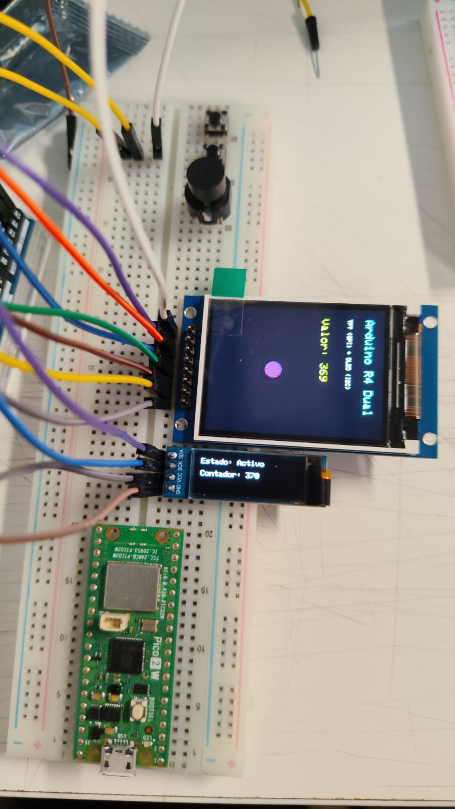

# **Proyecto 1: ;p0ema** 

*Tomás Catrileo (tomascarti)*                
*Kristel Ladrón de Guevara (kristelagj)*                
*Angel Savolgal (angel-udp)*

 

## **1\. Concepto y Extracto Escogido**

Nuestro grupo eligió ;p0ema de Leonor Olmos. Es el extracto del poema 4, página 9\. 

> Este poema nada puede resolver.  
> Adentro del poema, la muerte se consume.
>
> Ya, dilo de nuevo, el porcentaje de pureza  
> mezclado con un poco de sol.  
> Con un poco de hambre
>
> Todo acaba aquí y de pronto no.  
> Un nuevo servidor, un poema electrónico, un mesías.
>
> Poema bajando desde el cielo  
> Solo los elegidos contemplan su propia destrucción.
>
> No, en serio, este poema nada puede resolver.

Es difícil decir el porqué escogimos este extracto porque nuestra respuesta sería “nos gusto por lo complejo que es”. Cada uno, hasta el día de hoy, mientras más lo leemos, más significados encontramos, pero esta es la gracia de este poema, no entender y creemos que jamás lo comprenderemos porqué si lo analizamos—teniendo en cuenta todo el libro— la autora habla siempre de su cuerpo pero a su vez lo que pasa alrededor como lo es la quimica, música, sistema económico, etc. 

Lo que nosotros queremos hacer con esta entrega es poder hacer más cercano este poema, presentar como lo entendemos y experimentar en la marca. 

## **2\. Corpus y Licencias (Legal)**

La obra original establece en su página legal: *"Ninguna parte de esta publicación puede ser reproducida o transmitida mediante cualquier soporte sin la expresa autorización de la editorial"*.

Para cumplir con las normativas de derechos de autor nos contactamos directamente con la editorial vía correo electrónico, la cual nos otorgó el permiso para su uso meramente académico. 

  

## **3\. Referentes y Valores de Diseño**

## **4\. Proceso**

Lo primero que hicimos fue entender cada verso para poder representarlo en las pantallas, pero no concretó ya que como mencionamos, era difícil de entender y hasta el último día, entendíamos cosas distintas, pero como grupo no queríamos limitarnos a solo el uso de la pantalla; Es por esto que experimentamos con los límites del hardware. Inicialmente evaluamos usar dos pantallas I2C Y TFT las cuales tienen 2 lenguajes distintos, la cual la TFT nos entrega mayores posibilidades de contenido multimedia (videos).

A partir de la retroalimentación, se nos entregaron dos pantallas I2C para que estas hablaran el mismo idioma y no se crearán 2 animaciones por separado. Destacamos esta opción, solamente por cómo se veían gráficamente las pantallas. Finalmente, lo que realizamos como grupo fue que en la pantalla TFT se encontrará la animación del poema y en la I2C indicaciones que el usuario debe realizar mediante cada verso. 

  

Además, tuvimos la posibilidad de utilizar 3 motores para el proyecto, primero queríamos hacer explotar un diodo representando el caos, pero esto podría afectar el uso del arduino, dejándonos sin ninguna retroalimentación a las pantallas, entonces descartamos la idea al encontrar esta segunda opción. 

Osea, lo que queríamos era que no representar tan sólo gráficamente en las pantallas, sino sonora y sensorialmente. Esto nos dio a entender que ARDUINO no se limita, si no nosotros. 

## **5\. Carcasa**

Para la carcasa concordamos que necesitábamos espacio para que los motores que agregamos a nuestro proyecto tuvieran el espacio suficiente para moverse y a su vez no complicarnos con la estructura, entonces buscamos una caja idónea a nuestras necesidades. 

La pantalla TFT (principal) irá al lado izquierdo y la I2C al derecho la cual nos entregará las indicaciones. El botón con su luz de aviso se encontrarán al lado derecho y el potenciómetro en el izquierdo, estas decisiones fueron tomadas a partir de la comodidad del usuario y el espacio que tenemos para distribuir. 

(COLOCAR FOTOGRAFIAS)

## **6\. Proceso del Código y elección de componentes**

## **7\. Diagrama de Flujo**

## **8\. Referencias y Bibliografía (Normas APA)**

* AliExpress. (s.f.). *Módulo de pantalla / Componente electrónico*. Recuperado de [https://es.aliexpress.com/item/1005005912666580.html](https://www.google.com/search?q=https://es.aliexpress.com/item/1005005912666580.html)  
* Búsqueda en Google. (s.f.). *If statement C++ with potentiometer*. Recuperado de [https://www.google.com/search?q=if+statement+c%2B%2B+with+potenciometer](https://www.google.com/search?q=if+statement+c%2B%2B+with+potenciometer)  
* Chang, Y.-H. (s.f.). *THE EXPERIMENT IS DEMOCRACY, FASCISM IS THE CONTROL*. Young-Hae Chang Heavy Industries. Recuperado de [https://www.yhchang.com/THE\_EXPERIMENT\_IS\_DEMOCRACY\_FASCISM\_IS\_THE\_CONTROL.html](https://www.yhchang.com/THE_EXPERIMENT_IS_DEMOCRACY_FASCISM_IS_THE_CONTROL.html)  
* HackMD. (s.f.). *Espacio de documentación*. Recuperado de [https://hackmd.io/](https://hackmd.io/)  
* Holocubic. (s.f.). *Búsqueda de referentes visuales y carcasas*. Recuperado de Google Search.  
* Instructables. (s.f.). *How to Find I2C Address of Any Device Using Arduino*. Recuperado de [https://www.instructables.com/How-to-Find-I2C-Address-of-Any-Device-Using-Arduin/](https://www.instructables.com/How-to-Find-I2C-Address-of-Any-Device-Using-Arduin/)  
* Olmos, L. (s.f.). *;p0ema* (Extracto del poema 4, p. 9). \[Permiso de uso académico otorgado por la editorial\]. [http://letras.mysite.com/lolm161123.html](http://letras.mysite.com/lolm161123.html)  
* Registros en Redes Sociales (TikTok e Instagram). (s.f.). *Recopilación de referentes visuales, tipografía cinética y displays electrónicos*. Recuperados de:  
  * [https://vt.tiktok.com/ZSVpbG8bQ/](https://vt.tiktok.com/ZSVpbG8bQ/)  
  * [https://vt.tiktok.com/ZSVpgYtxS/](https://vt.tiktok.com/ZSVpgYtxS/)  
  * [https://www.instagram.com/p/DOOgrXoDQiO/](https://www.google.com/search?q=https://www.instagram.com/p/DOOgrXoDQiO/)  
  * [https://www.instagram.com/p/DU7\_EDjjBA5/](https://www.google.com/search?q=https://www.instagram.com/p/DU7_EDjjBA5/)  
  * [https://www.instagram.com/reel/DMZrnJaI7lF/](https://www.instagram.com/reel/DMZrnJaI7lF/)  
  * [https://www.instagram.com/reel/DbQOnoAqbF9/](https://www.google.com/search?q=https://www.instagram.com/reel/DbQOnoAqbF9/)  
  * [https://www.instagram.com/reel/Db3WYYjhMdQ/](https://www.instagram.com/reel/Db3WYYjhMdQ/)  
  * [https://www.instagram.com/reel/CwSyB\_Dq3gJ/](https://www.instagram.com/reel/CwSyB_Dq3gJ/)  
  * [https://www.instagram.com/p/C\_TPtmoxHe8/](https://www.google.com/search?q=https://www.instagram.com/p/C_TPtmoxHe8/)  
* Registros visuales y pruebas de clase. (s.f.). *Uso de extracto de Akriila en clases*. Recuperado de YouTube: [https://www.youtube.com/shorts/XyG0R0R\_QLA](https://www.youtube.com/shorts/XyG0R0R_QLA) y [https://youtube.com/shorts/wRhWjAYHneg](https://www.google.com/search?q=https://youtube.com/shorts/wRhWjAYHneg)
