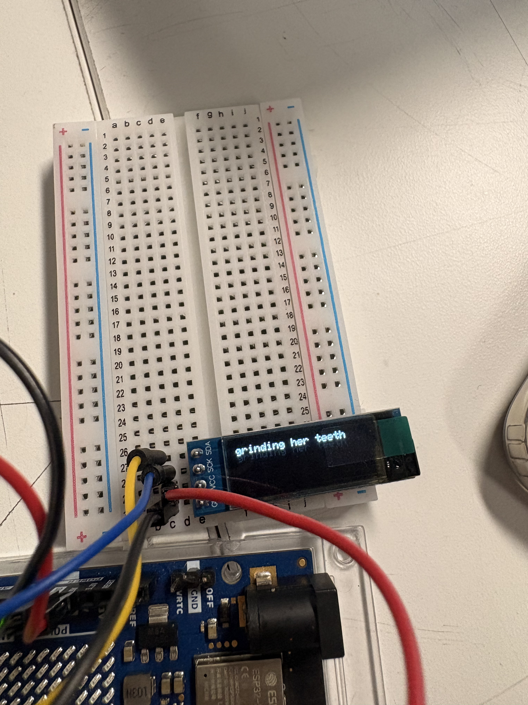
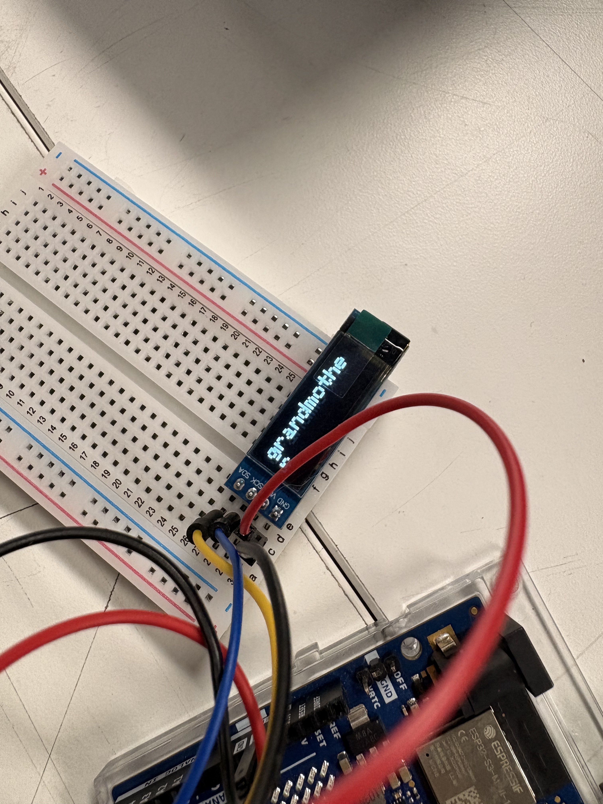

**PROYECTO 1 — BITÁCORA DE PROCESO**

Integrantes: Isidora Díaz — Natalia Gutiérrez — Carlo Martínez

Poema escogido: Pepper Sauce — Malika Booker

Antes de leerlo queremos informar que el poema contiene situaciones de violencia y abuso que pueden ser sensibles para algunos espectadores.

```cpp
I pray for that grandmother, grinding her teeth,
one hand pushing in fresh hot peppers, seeds and all, turning
the handle of that old iron mill, squeezing the limes, knowing
          they will burn and cut raw like acid.

She pours in vinegar and gets Anne to chop five onions
          with a whole bulb of garlic,
          Chop them up real fine girl, you hear?
And Anne dicing, and crying, relieved that no belt has blistered her
skin,
          no knife handle smashed down onto her knuckles
until they bleed for stealing money from she grandmother purse.
 

I hear she made Anne pour in the oil and vinegar
          and stir up that hot sauce, how she hold her down.
I hear she tied that girl to the bedposts,
          strung her out naked, like she there lying on a crucifix.
I hear she spread she out, then say,
          I go teach you to go and steal from me, Miss Lady.


I hear she scoop that pepper sauce out of a white enamel bowl,
          and pack it deep into she granddaughter’s pussy,
I hear there was one piece of screaming in the house that day.


          Anne bawl till she turn hoarse,
               bawl till the hair on the neighbours skin raise up,
               bawl till she start hiss through her teeth,
               bawl till she mouth could make no more sound, 
          I hear how she turn raw,
          how that grandmother leave her there all day,
         
          I hear how she couldn’t walk or talk for weeks.
```

Elegimos Pepper Sauce porque muestra cómo la violencia familiar puede estar conectada con traumas 
heredados desde la esclavitud y el colonialismo en el Caribe. También elegimos a Malika Booker porque 
su trabajo habla mucho de memoria, identidad caribeña y de cómo esas heridas históricas siguen presentes entre generaciones.

Licencia: Copyright © 2013 Malika Booker. All rights reserved. 
El poema no presenta una licencia Creative Commons o licencia abierta. 
Su reproducción y la creación de obras derivadas requieren autorización del titular de los derechos, 
salvo las excepciones legales aplicables a usos educativos, investigación o cita.

**Inicio del proyecto**

Partimos entendiendo que el objetivo no era simplemente poner el poema en una pantalla OLED, sino interpretarlo mediante código.

Como todavía estamos aprendiendo C++ y trabajando con una pantalla OLED muy pequeña de 128 × 32 px, 
decidimos partir con recursos relativamente simples y reutilizables:

cambios de velocidad;
cambios de tamaño;
movimiento;
pausas;
pantalla vacía;
acumulación de texto;
brillo;
dibujos simples en píxeles.

Desde el comienzo descartamos hacer una animación completamente distinta para cada frase porque probablemente 
terminaríamos con un caos de código. La idea era construir unas pocas herramientas y reutilizarlas dependiendo 
de lo que necesitara cada parte del poema.

También agregamos un aviso dentro del código indicando que el poema pertenece a Malika Booker, que lo estamos
utilizando para un proyecto académico sin fines de lucro y que nuestra intervención corresponde a una reinterpretación visual.

Mientras comenzábamos a trabajar con el texto aprendimos a usar arreglos de caracteres en vez de depender solamente de String.

```cpp
char nombre[6] = "aaron";
```

Esto nos ayudó a entender el texto como una secuencia de caracteres 
y apareció una idea que después fue súper útil para ordenar el proyecto:

un poemario es un arreglo de páginas → una página es un arreglo de líneas → una línea es un arreglo de caracteres.

También empezamos a trabajar con for, que primero usamos para recorrer conjuntos y después terminaría siendo 
importante para controlar posiciones, movimientos, brillo y otras animaciones.

**Interpretar el poema**

Antes de escribir las animaciones en C++, decidimos definir qué queríamos que ocurriera visualmente en cada parte.

La idea general fue que el poema partiera tranquilo y aumentara progresivamente su intensidad.

Al comienzo queríamos:

- poco texto;
- bastante espacio;
- movimientos lentos;
- pausas largas.

A medida que avanzara:

- más velocidad;
- más tamaño;
- movimientos más bruscos;
- más brillo;
- menos descanso;
- más acumulación.

Y después del punto de mayor intensidad queríamos volver a disminuir todo hasta terminar en una pantalla vacía.

Primera estrofa

Para:

I pray / for that / grandmother

pensamos en una aparición lenta y separada.

Luego, en:

grinding her teeth

aumentaríamos un poco la velocidad.

En:

turning the handle of that old iron mill

queríamos un movimiento horizontal repetitivo relacionado con el movimiento del molino.

Y para:

BURN / CUT / RAW / ACID

queríamos golpes visuales completamente distintos al resto: 
fondo blanco, letras negras, tamaño grande y apariciones rápidas.

Desde ahí empezamos a establecer una lógica que se repetiría durante todo el proyecto:

contenido del poema → decisión gráfica → comportamiento en código.

Segunda estrofa

En esta parte aparece constantemente la acción de cortar.

Por eso decidimos fragmentar:

Chop them up / real fine girl / you hear?

y hacer que aparecieran rápidamente uno después del otro.

Para:

dicing / crying

queríamos seguir con la fragmentación, pero además hacer que las palabras crecieran y disminuyeran.

Cuando aparece la violencia de manera más directa, como en:

no knife handle smashed down onto her knuckles

decidimos cambiar de golpe el comportamiento del texto para marcar que la intensidad estaba aumentando.

Tercera estrofa

Acá aparece constantemente:

I hear

y nos pareció que esa repetición podía transformarse en un recurso visual.

Nuestra idea fue que cada nueva aparición tuviera cada vez más presencia.

Para:

stir up that hot sauce

pensamos en un movimiento repetitivo que recordara la acción de revolver.

En:

crucifix

decidimos usar por primera vez un dibujo simple en píxeles: una cruz.

Y:

Miss Lady

quedaría completamente sola y en tamaño grande.

Cuarta estrofa

Esta parte contiene el momento más explícito del poema, por lo que decidimos colocar un ***trigger warning*** antes de mostrarla.

También decidimos no hacer una representación literal de la violencia sexual. En vez de eso trabajaríamos principalmente mediante:

- lentitud;
- brillo;
- pausas;
- tensión;
- acumulación.

Para SCREAMING sí queríamos un cambio muy fuerte: que la palabra creciera progresivamente hasta 
convertirse en uno de los puntos de mayor intensidad del poema.

Quinta estrofa y final

En la repetición de bawl queríamos que el texto dejara de desaparecer inmediatamente y comenzara a acumularse.

La pantalla se iría llenando progresivamente hasta llegar a un punto de saturación.

Después:

todo desaparece de golpe.

La pantalla queda completamente vacía durante un momento y desde ahí comienza una bajada de intensidad.

El último verso:

I hear how she couldn’t walk or talk for weeks

aparecería lentamente, completamente solo, y terminaría apagándose hasta dejar nuevamente la pantalla vacía.

```cpp
// primera estrofa

// mostrar "I pray for that grandmother" lentamente
// hacer que aparezca primero i pray
// for that
// grandmother 
// dejar una pausa al terminar

// mostrar "grinding her teeth"
// aumentar un poco la velocidad respecto a la frase anterior
// hacer que se sienta como el primer cambio de intensidad

// mostrar "one hand pushing in fresh hot peppers, seeds and all"
// mantener una velocidad intermedia
// mostrar el texto de forma más continua

// mostrar "turning the handle of that old iron mill"
// mover el texto horizontalmente
// hacer que el texto rebote y se vaya hacía la izquierda


// mostrar "squeezing the limes, knowing"
// volver a una lectura más estable
// mantener una pausa breve antes del cierre de la estrofa

// mostrar "they will burn and cut raw like acid"
// aumentar nuevamente la intensidad
// destacar las palabras "burn", "cut", "raw" y "acid" en fondo blanco con letras negra y tamaño de toda la pantalla.
// hacer que aparezcan de forma más brusca o rápida

// dejar la pantalla vacía por un momento
// terminar la primera estrofa


// segunda estrofa

// mostrar "She pours in vinegar and gets Anne to chop five onions"
// mantener una velocidad intermedia
// hacer que el texto avance de forma relativamente continua
// empezar a preparar visualmente la acción de cortar

// mostrar "with a whole bulb of garlic"
// mantener el mismo ritmo
// dejar una pausa breve al terminar

// mostrar "Chop them up real fine girl, you hear?"
// cortar la frase en partes
// mostrar cada parte por separado
// hacer que aparezcan más rápido entre sí
// relacionar la forma de aparición con la acción de cortar

// mostrar "And Anne dicing, and crying"
// continuar con apariciones fragmentadas
// hacer que "dicing" y "crying" aparezcan separadas
// aumentar un poco la tensión agrandando y achicando el texto

// mostrar "relieved that no belt has blistered her skin"
// bajar un poco la velocidad
// mostrar más texto junto
// mantener una lectura más estable antes del siguiente cambio

// mostrar "no knife handle smashed down onto her knuckles"
// hacer que el texto aparezca de golpe
// generar un cambio brusco respecto a lo anterior
// marcar desde aquí un aumento más evidente de violencia

// mostrar "until they bleed"
// mantener la aparición brusca
// destacar "bleed" dejándola sola por un momento

// mostrar "for stealing money from she grandmother purse"
// volver a mostrar más texto junto
// mantener una velocidad intermedia
// dejar una pausa al terminar la estrofa


// tercera estrofa

// mostrar "I hear she made Anne pour in the oil and vinegar"
// mantener una velocidad intermedia
// hacer que "I hear" aparezca primero como una frase que comienza a repetirse en esta parte

// mostrar "and stir up that hot sauce, how she hold her down"
// hacer que "stir up that hot sauce" tenga un movimiento circular o repetitivo, como las burbujas de windows 
// relacionar el movimiento con la acción de revolver
// mantener el resto de la frase más estable

// mostrar "I hear she tied that girl to the bedposts"
// volver a mostrar "I hear"
// ir colocando las letras lentamente como máquina de escribir lenta
// mostrar el resto del verso de forma más continua

// mostrar "strung her out naked, like she there lying on a crucifix"
// mantener una aparición más lenta y pesada
// destacar la palabra "crucifix"
// hacer aparecer un dibujo simple de una cruz en píxeles junto a la palabra
// dejar una pausa breve

// mostrar "I hear she spread she out, then say"
// volver a mostrar "I hear"
// hacer que la repetición se empiece a sentir más insistente, llenar la pantalla de la frase 
// mantener una velocidad intermedia

// mostrar "I go teach you to go and steal from me, Miss Lady"
// mostrar primero la frase de forma continua
// separar "Miss Lady" del resto
// hacer que "Miss Lady" aparezca sola y más grande
// dejarla en pantalla por un momento
// dejar una pausa antes de continuar con la siguiente estrofa


// cuarta estrofa

// mostrar un trigger warning antes de comenzar esta parte
// avisar que la siguiente sección contiene violencia sexual y abuso
// dejar una pausa suficiente para que se pueda leer

// mostrar "I hear she scoop that pepper sauce out of a white enamel bowl"
// volver a usar "I hear" como inicio repetitivo
// mantener una velocidad más lenta y tensa
// mostrar el resto de la frase de forma continua

// mostrar la “ and pack it deep into she granddaughter’s pussy,”
// evitar una animación demasiado literal
// trabajar principalmente con pausas, lentitud y acumulación
// hacer que la lectura se sienta más pesada que en las estrofas anteriores

// mostrar "I hear there was one piece of screaming in the house that day"
// hacer aparecer "I hear" nuevamente
// destacar "screaming"
// hacer que "screaming" aumente de tamaño o ocupe gran parte de la pantalla
// dejar el resto de la frase aparecer después

// dejar la pantalla vacía por un momento
// marcar el punto de mayor intensidad hasta ahora


// quinta estrofa

// mostrar "Anne bawl till she turn hoarse"
// empezar a acumular más texto en pantalla
// aumentar la intensidad respecto a la estrofa anterior
// destacar "bawl" como palabra que se repetirá

// mostrar "bawl till the hair on the neighbours skin raise up"
// volver a mostrar "bawl"
// hacer que aparezca más grande o más rápido que antes
// mantener parte del verso anterior visible para generar acumulación

// mostrar "bawl till she start hiss through her teeth"
// repetir nuevamente "bawl"
// seguir aumentando el tamaño o la velocidad
// hacer que la pantalla se sienta cada vez más llena

// mostrar "bawl till she mouth could make no more sound"
// mostrar la última repetición de "bawl"
// alcanzar el punto de mayor acumulación
// hacer que el texto ocupe gran parte de la pantalla

// borrar todo de golpe
// dejar la pantalla completamente vacía
// mantener una pausa más larga

// mostrar "I hear how she turn raw"
// volver a una velocidad lenta
// hacer que aparezca poco texto a la vez
// bajar la intensidad después del momento anterior

// mostrar "how that grandmother leave her there all day"
// mantener el ritmo lento
// mostrar la frase de forma continua
// dejar una pausa al terminar


// ultimo verso

// mostrar "I hear how she couldn’t walk or talk for weeks"
// mostrar la frase sola
// mantener una aparición lenta
// dejarla en pantalla durante más tiempo
// terminar con una pausa larga
// dejar la pantalla vacía al final
```

**Ideas a código**

Una vez que tuvimos definida la interpretación, guardamos todo el poema en la parte superior del código.

Usamos nombres como:

```cpp
e1_v1
e1_v2
e2_v1
```
donde:

e = estrofa
v = verso o fragmento

Algunas palabras como:

BURN
CUT
RAW
ACID

las guardamos individualmente porque iban a tener comportamientos propios.

Esto terminó siendo una decisión súper importante porque apareció una estructura 
que seguimos utilizando hasta ahora:

VARIABLE = qué texto es
FUNCIÓN = cómo aparece
ESTROFA = combinación de ambos

Así dejamos de meter cada frase directamente dentro del programa y empezamos a construir un 
sistema mucho más ordenado.

**Primera estrofa**

Ya teníamos la función:

```cpp
escribirLetraPorLetra()
```

que recorre el texto carácter por carácter.

La usamos para:

I pray / for that / grandmother

cambiando solamente los tiempos.

La lógica era algo como:

I
I p
I pr
I pra
I pray

Para grinding her teeth reutilizamos exactamente la misma función, pero disminuimos el tiempo entre caracteres.

Ahí entendimos algo muy simple pero súper útil:

menos tiempo = texto más rápido = más intensidad.




No necesitábamos crear una función nueva cada vez que quisiéramos cambiar la sensación de una frase.

Después apareció uno de los primeros límites reales del proyecto: la pantalla es MINI.

Con solo 128 × 32 px, los versos largos no caben fácilmente. Decidimos no quedarnos pegados todavía r
esolviendo eso y avanzar primero con los comportamientos principales.

Para el molino sí necesitábamos algo nuevo, así que creamos:

```cpp
moverMolino()
```
Usamos un for para cambiar la posición X del texto:

derecha → izquierda → derecha

Fue la primera animación donde realmente vimos el texto desplazándose.

Y para:

BURN / CUT / RAW / ACID

creamos:

```cpp
mostrarGolpe()
```

La función utiliza:

pantalla blanca → letras negras → texto grande → poca duración → vacío

y funcionó.

Por primera vez la estrofa empezaba a tener una progresión visual que se parecía a lo que 
habíamos pensado inicialmente.

Después de ACID dejamos la pantalla vacía para separar ambas partes.

**Ordenar el código antes de seguir**

Cuando empezamos la segunda estrofa nos dimos cuenta de que cada vez había más variables, funciones y fragmentos repartidos por todas partes.

Llegó un punto donde simplemente:

NOS PERDIMOS EN EL CÓDIGO.

Así que paramos antes de seguir agregando cosas y reorganizamos todo.

La estructura quedó:

LIBRERÍAS
↓
CONFIGURACIÓN OLED
↓
TEXTOS DEL POEMA
↓
DECLARACIONES DE FUNCIONES
↓
SETUP
↓
LOOP
↓
FUNCIONES DE ANIMACIÓN
↓
ESTROFAS

También dejamos de reemplazar el código completo cada vez que hacíamos un cambio. Desde ahí empezamos a trabajar solamente con los fragmentos que había que agregar o reemplazar.

Eso hizo muchísimo más fácil seguir el proceso.

**Botones y potenciometros**

Hasta este punto el poema era principalmente una animación preprogramada.

Después empezamos a agregar los controles físicos:

BOTÓN 1 → PLAY
BOTÓN 2 → STOP
BOTÓN 3 → REPEAT
POTENCIÓMETRO → tamaño de letra

Definimos:

PLAY → pin 2
STOP → pin 3
REPEAT → pin 4
POTENCIÓMETRO → A0

Y empezamos a trabajar con variables como:

reproduciendo
repetir

La lógica inicial era:

PLAY → comienza el poema
STOP → detiene el poema
REPEAT → activa o desactiva la repetición

Potenciómetro

El potenciómetro entrega valores entre 0 y 1023.

Decidimos dividirlos en tres rangos y transformarlos en:

tamaño 1 / tamaño 2 / tamaño 3

Para eso creamos:

```cpp
leerTamanoLetra()
```

Lo que más nos gustó fue que la función podía consultar constantemente el valor del potenciómetro.

Eso significa que el tamaño del texto puede cambiar mientras el poema está corriendo.

Acá el proyecto dejó de ser solamente una animación preprogramada y comenzó realmente a tener interacción.


**ERROR STOP**

Después apareció un problema importante.

Si utilizábamos:

delay(2000)

Arduino quedaba esperando esos dos segundos.

Si apretábamos STOP durante ese tiempo, el programa simplemente no lo detectaba hasta terminar el delay().

Entonces creamos:

pausaControlada()

Esta función sigue esperando, pero durante la espera ejecuta constantemente:

leerControles()

Desde ahí empezamos a reemplazar gran parte de los delay().

Para permitir que STOP pudiera interrumpir una animación también tuvimos que modificar varias funciones.

Algunas dejaron de ser:

void

y pasaron a ser:

bool

Si todo termina correctamente:

return true

Si STOP interrumpe:

return false

Entonces el error va subiendo:

STOP
↓
animación = false
↓
estrofa = false
↓
poema = false
↓
se detiene todo

Después agregamos debounce, porque los botones físicos pueden generar varias señales muy seguidas aunque uno los presione solamente una vez.

Guardamos:

estado anterior;
tiempo de última pulsación;
tiempo de antirrebote.

Con eso cada presión comenzó a registrarse de manera mucho más estable.

Volvimos a la segunda estrofa.

Los primeros versos siguieron utilizando escritura letra por letra a una velocidad media.

Para:

Chop them up / real fine girl / you hear?

como ya habíamos guardado cada fragmento por separado, simplemente los mostramos uno tras otro mucho más rápido.

No necesitamos ninguna función nueva.

Separar previamente el texto había sido un acierto.

Para:

dicing / crying

queríamos sumar un pequeño cambio de tamaño.

Pero antes de hacerlo dejamos funcionando toda la estrofa de manera normal para asegurarnos de que compilara.

Y ahí:

ERRORRRRRR.

Arduino mostró:

```cpp
ambiguating new declaration of 'bool segundaEstrofa()'
```

y después varios:

too few arguments

Descubrimos que teníamos dos versiones del código mezcladas.

En una parte aparecía:

void segundaEstrofa();

y en otra:

bool segundaEstrofa();

La declaración y la función tenían que coincidir.

Así que dejamos únicamente:

bool segundaEstrofa();

Después encontramos otro problema del mismo caos.

Había quedado una versión antigua de:

escribirLetraPorLetra()

que pedía:

texto / x / y / velocidad / tamaño

mientras el código nuevo la estaba utilizando solamente con:

texto / velocidad

Decidimos unificar todo.

Desde ese momento:

```cpp
escribirLetraPorLetra(texto, velocidad)
```

y el tamaño dejó de entregarse manualmente porque se obtiene directamente desde el potenciómetro.

COMPILA.

Pulso

Ahora sí creamos:

mostrarPulso()

El tamaño base viene del potenciómetro.

Si está en 1:

1 → 2 → 1

Si está en 2:

2 → 3 → 2

Lo usamos solamente para:

dicing
crying

La primera versión funcionó, pero físicamente aparecía demasiado rápido.

No modificamos nada de la estrofa, solamente cambiamos los tiempos internos de la función.

Pasamos aproximadamente de:

120 / 180 ms

a:

300 / 350 ms

y quedó mucho más legible.

**Tercera estrofa**

En vez de llenar terceraEstrofa() con instrucciones repetidas, decidimos crear varias funciones nuevas:

cambiarBrillo()
mostrarConBrillo()
moverRevolver()
mostrarCrucifix()
mostrarRepeticionBrillo()

A esta altura la estructura ya estaba muchísimo más clara:

variables = contenido
funciones = comportamiento
estrofas = combinación

Brillo

La pantalla OLED controla el contraste entre 0 y 255.

Como no queríamos trabajar pensando constantemente en esos valores, hicimos que nuestra función recibiera porcentajes entre 0 y 100.

Entonces podíamos escribir, por ejemplo:

cambiarBrillo(45)

y la función hacía internamente la conversión.

El brillo pasó a ser otra herramienta narrativa.

Para I hear decidimos aumentar progresivamente su presencia:

40 % → 70 % → 100 %

Así la repetición no dependía únicamente del contenido del texto, sino también de su intensidad visual.

Revolver

Para:

stir up that hot sauce

creamos un movimiento utilizando distintas posiciones X/Y.

No es un círculo perfecto, sino una serie de pequeños desplazamientos que dan la sensación de estar dando una vuelta.

La referencia mental eran esas burbujitas o movimientos antiguos de Windows JAJA.

Crucifijo

En crucifix usamos por primera vez dibujo real.

Con display.drawLine() hicimos:

línea vertical + línea horizontal = cruz

Además disminuimos el brillo para que ese momento se sintiera más pesado y no como otro golpe rápido.

Miss Lady

Al final de la estrofa borramos todo lo anterior y dejamos:

Miss Lady

sola, en tamaño 3, durante un momento.

También queríamos hacer un efecto donde el brillo aumentara de 0 a 100 mientras aparecía cada letra.

Nuestra primera versión todavía no hacía un fade completamente sincronizado.

Por ahora hacía:

brillo 0 → escribe → brillo 100

Decidimos dejarlo así temporalmente.

Primero queríamos conseguir que todo el poema compilara y después refinar detalles.

**CUARTA ESTROFA**

Antes de entrar en esta parte agregamos un trigger warning.

La primera versión simplemente mostraba:

TRIGGER WARNING
violence and abuse

durante unos segundos.

Funcionaba, pero visualmente no tenía suficiente presencia.

Sin modificar el resto de la estrofa, reemplazamos solamente:

mostrarWarning()

La nueva versión alternaba:

NEGRO + TEXTO BLANCO
↓
BLANCO + TEXTO NEGRO
↓
NEGRO
↓
BLANCO

Usamos:

i % 2

para saber si cada repetición era par o impar.

Hicimos seis cambios de aproximadamente 600 ms y después una pausa.

Quedó muchísimo mejor y decidimos dejarlo.

SCREAMING

Creamos:

mostrarScreaming()

Acá aumentan simultáneamente:

tamaño + brillo

Entonces ocurre algo como:

pequeño + tenue
↓
mediano + más brillante
↓
grande + brillo máximo

Este terminó siendo uno de los peaks visuales del poema.

Después hicimos exactamente lo contrario.

El brillo comienza en 100 y baja progresivamente hasta terminar en negro.

Así la transición no pasa directamente de máxima intensidad a pantalla vacía, sino que se va apagando.


**QUINTA ESTROFA**

Para la repetición de bawl apareció una idea nueva.

En vez de reemplazar cada verso queríamos que lo anterior siguiera presente.

Creamos:

mostrarAcumulacion()

La lógica fue:

primera vuelta: 1
segunda: 1 + 2
tercera: 1 + 2 + 3
cuarta: 1 + 2 + 3 + 4

Además, cada aparición ocurre un poco más rápido que la anterior.

La intención era que la pantalla se sintiera progresivamente más llena y saturada.

Obviamente apareció nuevamente nuestro problema principal:

128 × 32 px.

Cuatro versos largos no caben cómodamente.

Pero preferimos probar primero el concepto de acumulación y después resolver los límites físicos de la pantalla.

Después de la acumulación:

borramos TODO de golpe.

Dejamos la pantalla completamente vacía durante un momento.

Luego el texto reaparece con un brillo bajo que aumenta poco a poco:

25 → 40 → 55 → 70 → 85

La idea es que después del peak anterior el poema comience a bajar nuevamente.

El problema de las palabras cortadas

Cuando el poema ya estaba casi completo quisimos solucionar otro problema.

A veces aparecía:

fre

y en la siguiente línea:

sh

Queríamos que fresh comenzara directamente en la siguiente línea, pero sin perder el efecto:

f → fr → fre → fres → fresh

Primer intento: bug horrible

Agregamos una función para evitar que las palabras se cortaran.

Y de repente empezaron a aparecer cosas como:

hoholalala
comomo
essstasass

Al principio pensamos que el problema podía ser:

la quinta estrofa;
REPEAT;
la acumulación;
dos funciones ejecutándose al mismo tiempo.

Así que hicimos una prueba simple:

sacamos la nueva lógica de corte de palabras.

Y todo volvió a funcionar.

Entonces pudimos aislar el problema.

La quinta estrofa estaba bien.
REPEAT no era el responsable.
La acumulación tampoco.

El error estaba en la función nueva.

Lo que ocurría era que la escritura letra por letra muestra estados parciales:

h → ho → hol → hola

Pero la función nueva intentaba reorganizar esos estados parciales como si fueran textos terminados.

Cada frame terminaba redibujando partes anteriores y aparecían las duplicaciones.

Decidimos sacarla y seguir.

Primero terminaríamos el poema y después volveríamos al problema.

Último verso

Creamos:

ultimoVerso()

La frase final aparece sola y lentamente.

Se mantiene un momento y después el brillo comienza a disminuir:

100 → 90 → 80 → … → 0

Finalmente queda la pantalla vacía y hacemos una pausa larga.

Con eso conseguimos tener el poema completo funcionando desde el inicio hasta el final.

Segundo intento con las palabras

Una vez terminado el poema volvimos al problema.

En el primer intento nuevo decidimos no mostrar ninguna palabra hasta que estuviera completamente formada.

Técnicamente solucionaba el salto de línea, pero destruía por completo nuestra escritura letra por letra.

No servía.

Entonces cambiamos la lógica.

Antes de empezar cada palabra calculamos:

¿la palabra completa cabe en el espacio restante de esta línea?

Si cabe, comienza ahí.

Si no cabe, su posición inicial pasa directamente a la siguiente línea.

Pero una vez elegida esa posición seguimos mostrando:

f → fr → fre → fres → fresh

Eso sí mantenía ambas cosas:

palabra completa dentro de una línea;
efecto letra por letra.

En la última estrofa todavía existen algunos casos donde pueden cortarse palabras porque estamos combinando:

pantalla de 128 × 32;
versos largos;
potenciómetro;
posibilidad de llegar a tamaño 3.

Podríamos seguir agregando excepciones, pero también corríamos el riesgo de volver a romper funciones que ya estaban estables.

Así que decidimos priorizar:

que funcione → que siga letra por letra → que funcionen las animaciones → que funcionen los controles.

**COMO QUEDO**

Actualmente tenemos funcionando:

pantalla OLED;

portada;

poema completo;

primera, segunda, tercera, cuarta y quinta estrofa;

trigger warning;

último verso;

PLAY;

STOP;

REPEAT;

debounce;

potenciómetro;

tamaños 1, 2 y 3;

cambio de tamaño en vivo;

escritura letra por letra;

distintas velocidades;

movimiento del molino;

pulso en dicing / crying;

control de brillo;

movimiento de revolver;

cruz en píxeles;

repetición de I hear;

Miss Lady en tamaño grande;

warning parpadeante;

crecimiento de SCREAMING;

acumulación de texto;

fade out;

pantalla vacía final.

Algo que nos queda súper claro mirando todo el proceso es que al principio pensábamos casi verso por verso:

“¿qué animación le ponemos a esto?”

Ahora el código funciona mucho más como un sistema:

TEXTOS
↓
guardan el poema

FUNCIONES
↓
definen comportamientos

ESTROFAS
↓
combinan texto y comportamiento

CONTROLES
↓
permiten que el usuario intervenga

***DESARROLLO DE CAJA**


Sumando a todo esto empezamos a pensar en la caja del proyecto.

Como el poema gira en torno a la preparación de la salsa, se nos ocurrió que la caja podía tener forma de tabla de picar.

Y de ahí salió otra idea que nos gustó MUCHO: que uno de los controles no fuera simplemente un botón puesto porque sí.

Queremos crear un contacto en la tabla para que, cuando el cuchillo toque una zona determinada, el poema se pause.

Así el botón empieza a tener relación con el mismo objeto y con las acciones que aparecen en el poema, en vez de sentirse como algo aparte.

Todavía estamos viendo bien cómo hacerlo físicamente, pero la idea de la tabla ya quedó como base para seguir desarrollando la caja.


**PROBLEMA CON REPEAT**

Cuando por fin empezamos a probar los botones de verdad apareció otro problema

El botón REPEAT no está funcionando como esperábamos.

Nos dimos cuenta de que sí funciona si:

STOP
↓
activamos REPEAT
↓
volvemos a empezar el ciclo.

PERO si el poema ya está corriendo y apretamos REPEAT…

no pasa nada.

Queda como si el botón no estuviera haciendo nada mientras el poema está en reproducción.

Por ahora sabemos que el problema está ahí, pero todavía tenemos que revisar bien la lógica para entender por qué REPEAT solamente se está leyendo correctamente en ese momento.

Así que intentamos arreglarlo pero no logramos encontrar la causa del problema.


