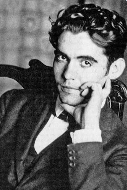
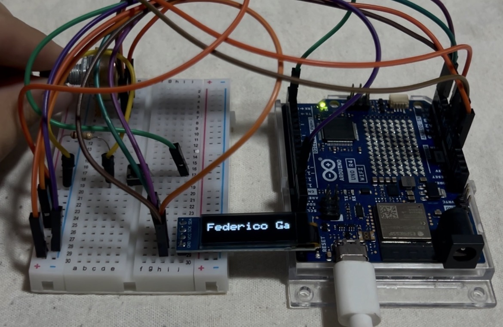
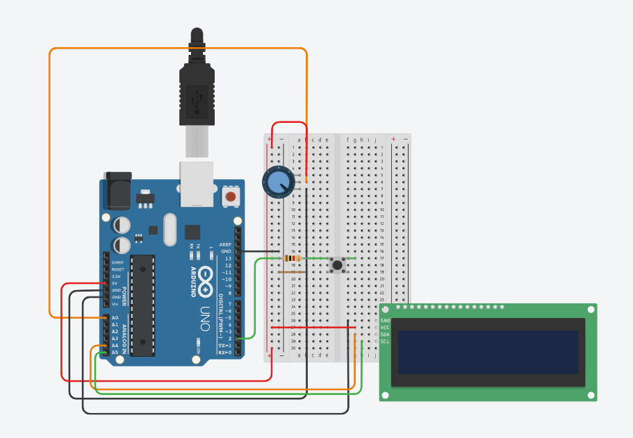
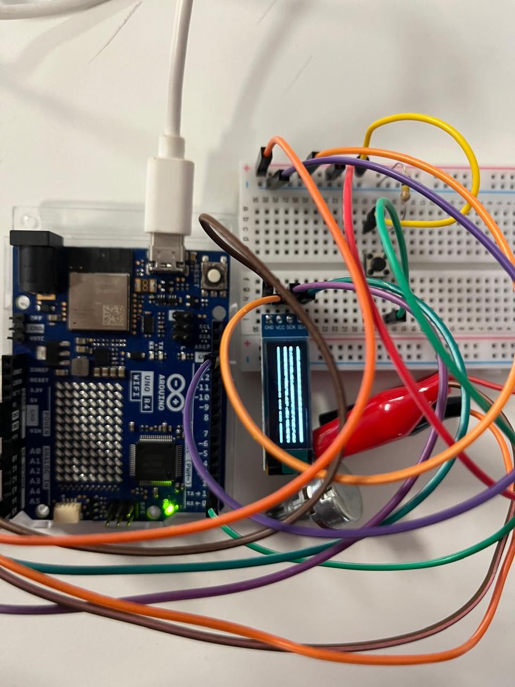

# Proyecto 01
*Vanessa García*

*Isidora Pérez*

*Narely Riquelme*

## Licencia 

Las obras originales de Federico García Lorca se encuentran en dominio público, por lo que su uso no requiere autorización previa ni el pago de derechos de explotación.

## Federico García Lorca

Federico García Lorca (1898–1936) fue un poeta y dramaturgo español, considerado uno de los escritores más importantes de la Generación del 27. Nació el 5 de junio de 1898 en Fuente Vaqueros, Granada. Su obra se caracteriza por el uso de un lenguaje poético, la presencia de elementos de la cultura popular andaluza y temas como el amor, la muerte, la libertad y el destino.

Entre sus obras más conocidas se encuentra Romancero gitano, publicado en 1928. Esta obra reúne una serie de romances en los que Lorca combina la tradición popular con un lenguaje poético y elementos simbólicos.

Como proyecto, seleccionamos la obra Romancero gitano y trabajaremos específicamente con el poema “Romance de la luna, luna”. En este poema, Lorca presenta un encuentro entre la luna y un niño gitano. La luna es un elemento importante dentro del poema y tiene un significado simbólico. A través de sus versos, se pueden apreciar algunos de los principales elementos de la poesía de Lorca, como el lenguaje poético, el simbolismo, la muerte y la cultura gitana.



Figura 1. Retrato de Federico García Lorca. Fuente: Historia National Geographic (2024).


### Poema
**“Romance de la luna, luna”**

La luna vino a la fragua

con su polisón de nardos.

El niño la mira, mira.

El niño la está mirando. 

En el aire conmovido 

mueve la luna sus brazos 

y enseña, lúbrica y pura,

sus senos de duro estaño. 

Huye luna, luna, luna.

Si vinieran los gitanos, 

harían con tu corazón

collares y anillos blancos. 

Niño, déjame que baile.

Cuando vengan los gitanos, 

te encontrarán sobre el yunque 

con los ojillos cerrados. 

Huye luna, luna, luna, 

que ya siento sus caballos. 

Niño, déjame, no pises

mi blancor almidonado.

El jinete se acercaba 

tocando el tambor del llano.

Dentro de la fragua el niño

tiene los ojos cerrados. 

Por el olivar venían, 

bronce y sueño, los gitanos.

Las cabezas levantadas 

y los ojos entornados. 


Cómo canta la zumaya, 

¡ay, cómo canta en el árbol! 

Por el cielo va la luna

con un niño de la mano. 

Dentro de la fragua lloran,

dando gritos, los gitanos. 

El aire la vela, vela.

El aire la está velando. 


**Corpus escogido**
```
Huye luna, luna, luna. 
Si vinieran los gitanos, 
harían con tu corazón
collares y anillos blancos. 

Niño, déjame que baile.
Cuando vengan los gitanos, 
te encontrarán sobre el yunque 
con los ojillos cerrados. 
Huye luna, luna, luna, 
que ya siento sus caballos. 
Niño, déjame, no pises 
mi blancor almidonado.
```
### Descripción del proyecto

El objetivo principal del proyecto es invitar al espectador a interactuar con nuestra propuesta y, al mismo tiempo, permitirle reconocer una obra de Federico García Lorca. Buscamos proporcionarle una experiencia inmersiva, en la que tenga el control total de sus tiempos de lectura. De esta manera, los tiempos de reproducción y avance del proyecto son determinados por el propio usuario.

El proyecto consiste en reproducir, mediante una pantalla LCD OLED de 0,91", un fragmento del poema Romance de la luna, luna, perteneciente al libro Romancero gitano. El proyecto fue desarrollado mediante código en C++, utilizando un Arduino R4 WiFi. Además, integra un botón y un potenciómetro para realizar las acciones correspondientes.

Para que el usuario pueda interactuar con el proyecto y leer el fragmento del poema que se reproduce en la pantalla, se utiliza un potenciómetro, cuya principal función es desplazar la frase por la pantalla para poder leerla de manera correcta y completa. También se utiliza un botón que, al ser presionado, permite cambiar a la siguiente frase. De esta manera, el usuario puede controlar tanto el desplazamiento del texto como el momento en que desea avanzar a la siguiente frase.


https://youtu.be/fOX_0zksPlA?si=51IJRl3PwZZpNhPD

### Pasos del proceso

1. **Seleccionar el libro:** *Romancero gitano*.
2. **Seleccionar el poema:** *Romance de la luna, luna*.
3. **Seleccionar las estrofas** que se utilizarán: 3, 4 y 5.
4. **Definir cómo se visualizará** el contenido.
5. **Determinar los recursos visuales:** se utilizarán frases y animaciones.
6. **Conectar el Arduino y la pantalla** para realizar las pruebas.
7. **Probar los códigos** y comprobar su funcionamiento.
8. **Verificar y corregir posibles errores** en el código y las conexiones.
9. **Construir y ensamblar la carcasa** del proyecto.

### Coreografía y secuencia 
1. Se enciende el arduino y aparece la primera frase en la pantalla.
2. Para avanzar se deberá manipular el potenciómetro y así la frase se desplazará hacia la derecha.
3. La frase llegará a su fin.
4. Para cambiar a la siguiente frase, se deberá presionar el botón.
5. Repetir hasta el final. 
6. Una vez que se llega al final del poema, vuelve la frase inicial. 

### Diagrama de flujo y esquema de conexiones
> Esquema de conexiones en Tinkercad


> Diagrama de flujo
agregar aquí

### Tabla de materiales

|Componente|Cantidad|Precio|Link|
|---|---|---|---|
|Arduino UNO R4 Mínima|1|$32.990|<https://mcielectronics.cl/shop/product/arduino-uno-r4-minima/>|
|Pantalla LCD Oled 0,91" I2C|1|$3.990|<https://afel.cl/products/pantalla-lcd-oled-0-91?_pos=1&_sid=f1b122119&_ss=r>|
|Protoboard|1|$1.500|<https://afel.cl/products/mini-protoboard-400-puntos>|
|Botón Táctil|1|$400|<https://afel.cl/products/boton-tactil-tapa-12x12x7-3-interruptor?_pos=3&_sid=a0018323a&_ss=r>|
|Cables dupont pack 20|11|$1.000|<https://afel.cl/products/pack-20-cables-de-conexion-macho-macho>|
|Potenciómetro B100k|1|$500|<https://afel.cl/products/potenciometro-10k-ohm>|
|Resistencia 100k|1|$1.090|<https://www.victronics.cl/resistencias/resistencia-100k-1-4w-5-236mm-100u/>
|Cable USB-C|1| $1.800|<https://altronics.cl/cable-usb-tipo-c-datos-alimentacion>

### Carcasa

La carcasa consiste en una caja de cartón representada como un ataúd, haciendo referencia a la muerte del niño mencionada en el poema, que corresponde a la intención principal del fragmento utilizado. A partir de nuestra interpretación del poema, decidimos representar este elemento mediante un ataúd, ya que consideramos que refleja directamente uno de los temas principales del fragmento.

El ataúd está decorado con telas de colores y otros elementos que lo acompañan, haciendo referencia a los gitanos, su cultura y su forma de vestir. De esta manera, buscamos que la carcasa tenga sentido tanto con la temática del poema como con su contexto y la cultura gitana presente en la obra.

### Fotogramas

Los fotogramas que utilizamos fueron obtenidos de Internet y posteriormente modificados por nosotras. Realizamos cambios en sus tamaños para poder adaptarlos a las dimensiones y necesidades de nuestro proyecto.


### Prueba y error

Durante el desarrollo del proyecto realizamos distintas pruebas para adaptar el código a nuestro objetivo. Uno de los primeros desafíos fue modificar el movimiento del texto para que se desplazara horizontalmente mediante el potenciómetro y pudiera desaparecer al llegar al límite de la pantalla. Después de varias pruebas y modificaciones en el código, logramos el resultado esperado.

También tuvimos problemas con el botón encargado de cambiar las frases, debido a errores en las conexiones y a la falta de una resistencia. Luego de corregir las conexiones y agregar la resistencia correspondiente, conseguimos que funcionara correctamente.

Otro error importante fue utilizar inicialmente un potenciómetro de tipo A en lugar de uno de tipo B. Al necesitar un movimiento lineal, reemplazamos el potenciómetro por uno de tipo B, logrando un funcionamiento adecuado.

Finalmente, después de un incidente con el potenciómetro, la pantalla comenzó a mostrar píxeles dispersos y no reproducía correctamente los códigos. Luego de reiniciar el Arduino, el problema se solucionó y el sistema volvió a funcionar con normalidad.




### Documentación del uso de inteligencia artificial

Para el desarrollo de los códigos de nuestro proyecto contamos con la asistencia de las herramientas de inteligencia artificial Gemini y Claude. Toda la información utilizada, junto con las capturas de pantalla y conversaciones que evidencian su uso, se encuentra recopilada en el archivo PDF.

### Bibliografía 

https://www.cervantesvirtual.com/portales/federico_garcia_lorca/biografia/
