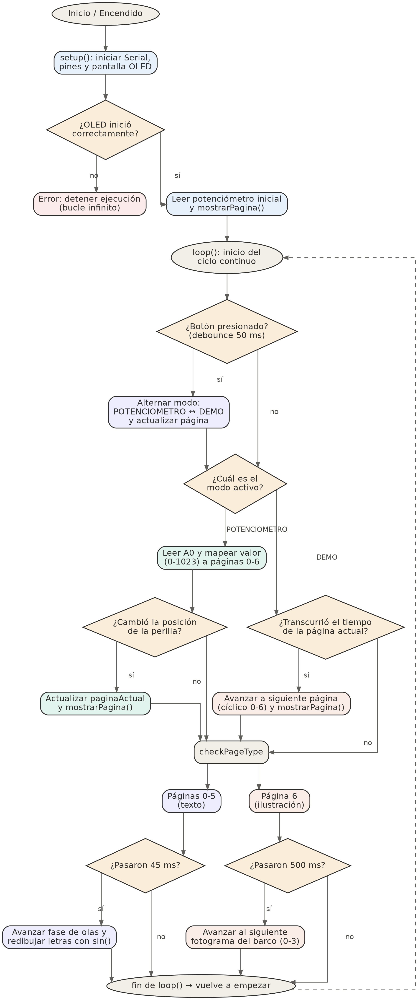
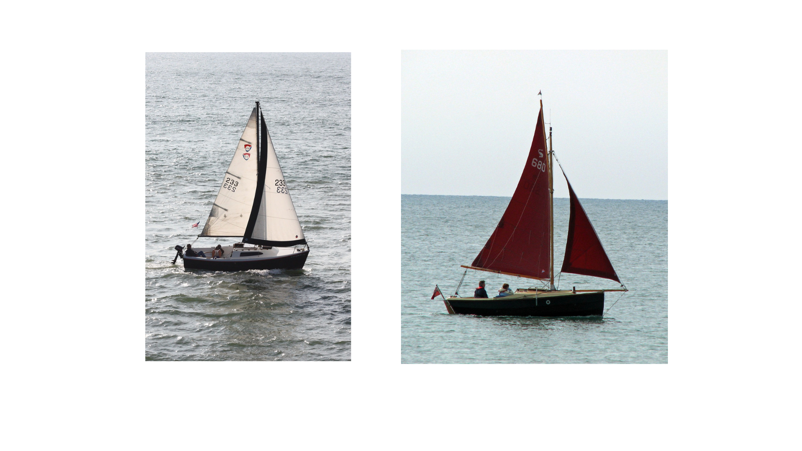
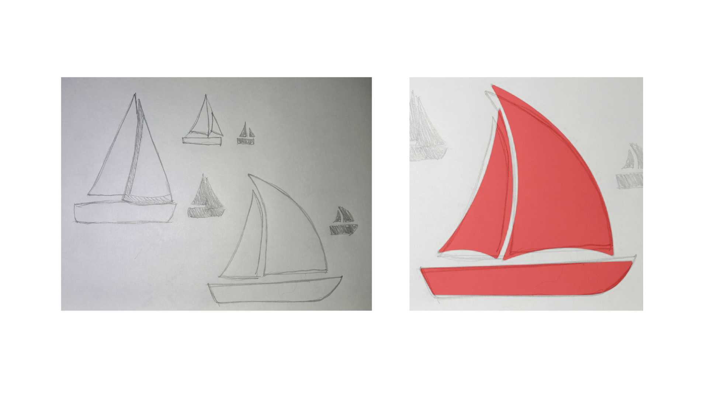
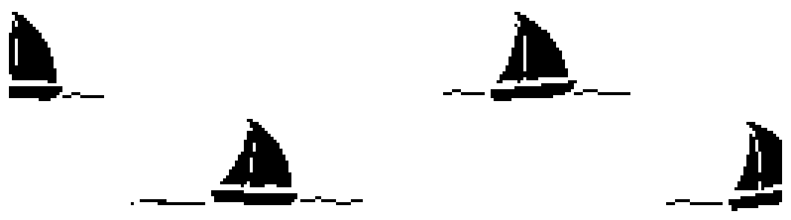
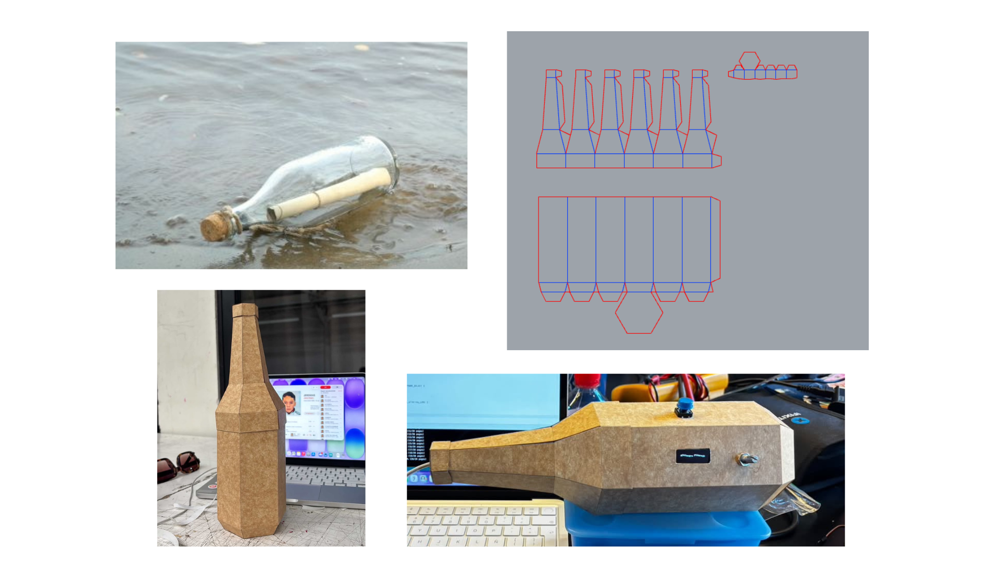

# Proyecto 01


**Integrantes:**

- *Antonia Loch ([antoloch](https://github.com/antoloch/))*

- *Anais Marschhausen ([anaisbmg](https://github.com/anaisbmg/))*

- *Hugo Montoya ([hugosmontoya](https://github.com/hugosmontoya/))*

- *Carla Nuñez ([ccarlabelenn](https://github.com/ccarlabelenn/))*

- *Natalia Pilar ([sz-mada](https://github.com/sz-mada/))*

## Descripción de proyecto

**"Irse y no volver..."** nació como nuestra primera aproximación a la programación dentro del taller, el desafío era elegir un poema y encontrar la forma de traducirlo a un objeto físico e interactivo, usando código. Elegimos un fragmento de Puerto adelante, de Alejandra Pizarnik, y detrás de esa elección hubo que resolver, cómo convertir un verso en algo programable.

El proyecto corre en un Arduino Uno R4 WiFi y despliega el poema en una pantalla OLED SSD1306 (128x32, I2C), controlado por un potenciómetro y un botón pulsador. Técnicamente, el código está organizado como una máquina de estados `(enum ModoOperacion)` que alterna entre dos formas de recorrer el poema: un modo manual, donde `analogRead()` sobre el potenciómetro se mapea matemáticamente a 7 páginas del texto `(valor * NUM_PAGINAS / 1024)`, y un modo demo, donde cada verso avanza solo según duraciones propias definidas en un arreglo `(DURACIONES_PAGINA)`.

Todo el temporizado del programa, el cambio de página, la animación del texto y los cuadros del barco se maneja sin usar `delay()`, mediante el patrón de timing no bloqueante basado en `millis()`, lo que permite que el botón y el potenciómetro sigan respondiendo en todo momento. El botón, además, pasa por una rutina de debounce por software para filtrar el rebote eléctrico y detectar una sola pulsación real.

El efecto visual más particular es el texto ondulando letra por letra, como si flotara sobre el mar, se logra dibujando cada carácter por separado y desplazándolo verticalmente con una función seno desfasada según su posición `(sin(fase + i * 0.65))`, donde fase avanza con el tiempo para que la ola nunca se detenga. La animación final del barco, en cambio, no usa gráficos vectoriales: son 4 bitmaps monocromos codificados y almacenados en memoria flash `(PROGMEM)` para no saturar la RAM del microcontrolador.

> Este proyecto fue el primer lugar donde entendimos que programar también es una forma de leer e interpretar un texto.

## Poema

### Sobre el poema

No incluimos el poema completo por derechos de autor, solo el fragmento que da forma a esta instalación.

> "Irse y no volver... / puerto adelante"
— Alejandra Pizarnik

## Licencia

Al ser una edición colombiana, buscamos en la [Fundación Pública de Colombia](https://www.funcionpublica.gov.co/eva/gestornormativo/norma.php?i=3431) sobre la ley de los derechos de autor, la ley 23 de 1982 que está en vigencia, los temas son de derechos de autor y dirección nacional de derechos de autor.

> “ARTÍCULO 31.- Es permitido citar a un autor transcribiendo los pasajes necesarios, siempre que éstos no sean tantos y seguidos que razonadamente puedan considerarse como una reproducción simulada y sustancial, que redunde en perjuicio del autor de la obra de donde se toman. En cada cita deberá mencionarse el nombre del autor de la obra citada y el título de dicha obra.” (Departamento Administrativo de la Función Pública, 28 Enero 1982, artículo 31).

Además buscamos la información de Chile sobre los derechos de autor

Según la [Biblioteca Del Congreso Nacional De Chile](https://www.bcn.cl/leychile/navegar?idNorma=28933) Ley 17336 sobre la propiedad intelectual y derechos de autor de 1970

> “Artículo 71 M. Es lícito, sin remunerar ni obtener autorización del autor, reproducir y traducir para fines educacionales, en el marco de la educación formal o autorizada por el Ministerio de Educación, pequeños fragmentos de obras o de obras aisladas de carácter plástico, fotográfico o figurativo, excluidos los textos escolares y los manuales universitarios, cuando tales actos se hagan únicamente para la ilustración de las actividades educativas, en la medida justificada y sin ánimo de lucro, siempre que se trate de obras ya divulgadas y se incluyan el nombre del autor y la fuente, salvo en los casos en que esto resulte imposible. ” (Biblioteca Del Congreso Nacional De Chile, 2 Octubre 1970, artículo 71 M).

En este trabajo utilizaremos un pequeño fragmento del poema Puerto Adelante de Alejandra Pizarnik, como no podemos exponer el poema completo utilizaremos un breve contexto sobre una persona que en una noche tranquila, observa el puerto que desea escapar y desaparecer.
Con el fragmento podemos explicar y complementar la actividad de nuestra solemne 01, por la cual no habrá ganancia monetaria, sin ánimo de lucro. Solo existirá ganancia de conocimiento.

## Diagrama de flujo



## Materiales

|Componente|Cantidad|
|---|---|
|Arduino UNO R4 WIFI|1|
|Pantalla LCD OLED 0,91" I2C|1|
|Botón táctil|1|
|Potenciómetro B100k|1|
|Cables dupont|11|
|Protoboard|1|
|Cartón dúplex|1|
|Doble contacto|1|

## Conexiones

| Componente         | Pata                         | Va a                                   |
|--------------------|------------------------------|----------------------------------------|
| Pantalla OLED      | GND                          | GND                                    |
| Pantalla OLED      | VCC                          | 5V                                     |
| Pantalla OLED      | SCK                          | A5                                     |
| Pantalla OLED      | SDA                          | A4                                     |
| Potenciómetro      | Pata extremo 1               | 5V (mismo riel que la pantalla)        |
| Potenciómetro      | Pata extremo 2               | GND (mismo riel que la pantalla)       |
| Potenciómetro      | Pata central (wiper)         | A0                                     |
| Botón              | Pata 1                       | Pin digital 2                          |
| Botón              | Pata 2                       | GND (mismo riel)                       |

## Desarrollo de código

Este es el proceso mediante el cual fuimos armando el código de este proyecto. No es un historial literal palabra por palabra, sino una versión ordenada y representativa de las preguntas que nos hicimos y las decisiones técnicas que fuimos tomando, con ayuda de Claude como asistente de programación.

La idea de dejar este registro es doble: por un lado, mostrar que programar rara vez es un proceso lineal, se avanza a tropezones, se prueba, se corrige y por otro, dejar documentado *por qué* el código quedó estructurado como quedó, más allá de *qué* hace cada línea.

## 1. El punto de partida: de un poema a un circuito

**Prompt:**
> "Tenemos que elegir un poema para el taller y representarlo con Arduino, botón, potenciómetro y pantalla OLED. Elegimos un fragmento de *Puerto adelante*, de Alejandra Pizarnik. ¿Cómo empezamos a pensar esto en términos de código?"

**En resumen, así lo enfocamos:**
Antes de escribir una sola línea, había que traducir el poema a *estructura de datos*. Un poema tiene versos; un microcontrolador entiende arreglos e índices. Así nació la idea de tratar el poema como una lista de "páginas" navegables:

```cpp
// 0: Irse
// 1: y
// 2: no
// 3: volver...
// 4: puerto adelante
// 5: autora
// 6: ilustración
const int NUM_PAGINAS = 7;
```

Esa decisión temprana, convertir versos en páginas numeradas, terminó siendo la columna vertebral de todo el programa, casi todas las funciones que vinieron después giran en torno a la pregunta "¿en qué página estamos?".

## 2. Los versos del poema (y por qué no aparece completo)

**Prompt:**
> "Ya tenemos claro qué fragmento del poema vamos a usar, pero no queremos publicar el poema completo en el repositorio. ¿Cómo lo dejamos documentado igual, sin infringir derechos de autor?"

**Así lo resolvimos:**
*Puerto adelante* es una obra con derechos de autor vigentes, así que en este repositorio (tanto en el código como en la documentación) solo se incluye el breve fragmento que efectivamente se muestra en la pantalla, a modo de referencia y homenaje. Para leer el poema completo, recomendamos buscar la edición oficial de Alejandra Pizarnik.

> *"Irse / y no volver... / puerto adelante"*
> — Alejandra Pizarnik

Ese fragmento fue, además, el que definió directamente el arreglo de páginas de texto en el código: cada verso (o incluso cada palabra suelta, como "y" o "no") se convirtió en una constante independiente, pensada para ocupar su propia página en la pantalla:

```cpp
const char LINEA_IRSE[]    = "Irse";
const char LINEA_Y[]       = "y";
const char LINEA_NO[]      = "no";
const char LINEA_VOLVER[]  = "volver...";
const char LINEA_PUERTO[]  = "puerto adelante";
const char LINEA_AUTOR_1[] = "Alejandra Pizarnik";
```

Separar el fragmento palabra por palabra (en vez de mostrarlo todo junto) fue también una decisión de lectura, en pantallas tan pequeñas (128x32 píxeles), forzar todo el verso de una vez lo haría ilegible, así que el propio límite técnico terminó dictando el ritmo de lectura del poema, verso a verso.

## 3. Primeros pasos con la pantalla OLED

**Prompt:**
> "Tenemos una pantalla OLED SSD1306 de 128x32 con I2C. ¿Cómo la inicializamos y cómo mostramos texto simple para probar que funciona?"

**Así lo resolvimos:**
Se explicó que la pantalla se comunica por el protocolo I2C (dos cables, SDA/SCL) y que las bibliotecas `Adafruit_GFX` + `Adafruit_SSD1306` hacen todo el trabajo pesado. Lo importante era declarar bien la resolución (128x32, no 128x64, que es la variante más común) y la dirección I2C (`0x3C`):

```cpp
#define SCREEN_WIDTH 128
#define SCREEN_HEIGHT 32
#define SCREEN_ADDRESS 0x3C

Adafruit_SSD1306 display(SCREEN_WIDTH, SCREEN_HEIGHT, &Wire, OLED_RESET);
```

También aprendimos algo que nos costó un rato entender: nada de lo que se "dibuja" con `display.print()` aparece en la pantalla física hasta llamar a `display.display()`. Todo se arma primero en un buffer en memoria.

## 4. Que el potenciómetro "pase las páginas"

**Prompt:**
> "Queremos que, al girar el potenciómetro, se recorra el poema de principio a fin. El potenciómetro da valores de 0 a 1023, pero tenemos 7 páginas. ¿Cómo hacemos ese mapeo?"

**Así lo resolvimos:**
La clave fue una simple regla de tres, ajustada con enteros para evitar decimales:

```cpp
int determinarPaginaPorPotenciometro() {
  valorPotenciometro = analogRead(PIN_POTENCIOMETRO);
  long pagina = (long)valorPotenciometro * NUM_PAGINAS / 1024;
  return constrain((int)pagina, 0, NUM_PAGINAS - 1);
}
```

Aquí surgió una duda técnica interesante: ¿por qué usar `long` en vez de `int` para el cálculo intermedio? Porque al multiplicar `valorPotenciometro * NUM_PAGINAS` antes de dividir, el resultado temporal podía acercarse al límite de un entero normal en Arduino. Usar `long` es una costumbre de seguridad frente a ese tipo de *overflow*, aunque en este caso específico el número nunca llegara a ser tan grande.

## 5. El botón no es tan simple como parece

**Prompt:**
> "Agregamos un botón para cambiar de modo, pero a veces detecta una pulsación como si fueran dos o tres. ¿Qué está pasando?"

**En resumen, así lo resolvimos:**
Descubrir que un botón mecánico "rebota" eléctricamente al presionarse, generando varias transiciones falsas en milisegundos antes de estabilizarse. La solución es una técnica clásica llamada **debounce por software**, que espera a que la señal se mantenga estable durante un tiempo mínimo antes de darla por válida:

```cpp
bool debounceBoton() {
  bool lectura = digitalRead(PIN_BOTON);
  ...
  if ((millis() - ultimoCambioBoton) > TIEMPO_DEBOUNCE) {
    if (lectura != estadoBotonActual) {
      estadoBotonActual = lectura;
      if (estadoBotonActual == LOW) pulsacionDetectada = true;
    }
  }
  ...
}
```

También configuramos el pin como `INPUT_PULLUP`, lo que evitó tener que añadir una resistencia física externa: el pin queda en `HIGH` por defecto y baja a `LOW` solo cuando se presiona el botón.

## 6. Convertir el botón en un interruptor de modos

**Prompt:**
> "Ahora que el botón detecta bien la pulsación, queremos que alterne entre 'modo manual' (potenciómetro) y 'modo automático' (el poema avanzando solo). ¿Cómo organizamos eso?"

**Así lo resolvimos:**
Se introdujo el concepto de **máquina de estados**, usando un `enum` para no manejar números sueltos por el código:

```cpp
enum ModoOperacion { MODO_POTENCIOMETRO, MODO_DEMO };
ModoOperacion modoActual = MODO_POTENCIOMETRO;
```

Cada vez que `debounceBoton()` confirma una pulsación real, `leerBoton()` simplemente invierte el estado actual. Fue la primera vez en el proyecto donde el programa "recuerda" en qué situación está, en vez de solo reaccionar a lo que lee en el instante.

## 7. El modo demo: que el poema respire solo

**Prompt:**
> "En modo automático, cada verso debería quedarse en pantalla un tiempo distinto — 'puerto adelante' necesita más tiempo de lectura que 'y'. ¿Cómo le damos ese ritmo sin trabar el programa?"

**Así lo resolvimos:**
Se definieron duraciones individuales por página:

```cpp
const unsigned long DURACIONES_PAGINA[NUM_PAGINAS] = {
  900, 600, 700, 1200, 2200, 2500, 4000
};
```

Y en vez de usar `delay()` —que congelaría todo el programa, incluida la lectura del botón—, se adoptó el patrón de **timing no bloqueante** con `millis()`, que se terminó repitiendo en casi todas las animaciones del proyecto:

```cpp
if (millis() - tiempoInicioPaginaDemo >= DURACIONES_PAGINA[paginaActual]) {
  // avanzar a la siguiente página
}
```

Este fue un punto de inflexión conceptual: entender que en Arduino "esperar" no significa "detener todo", sino "seguir revisando el reloj en cada vuelta del `loop()`".

## 8. Que las letras "floten": la animación de olas

**Prompt:**
> "Queremos que el texto no aparezca estático, sino que se mueva suavemente, como si las palabras flotaran sobre el mar. ¿Es posible animar letra por letra?"

**Así lo resolvimos:**
La solución involucró tres ideas combinadas:

1. Dibujar la palabra **letra por letra** en vez de de una sola vez, midiendo el ancho de cada carácter con `getTextBounds()`
2. Aplicar a cada letra un pequeño desplazamiento vertical calculado con una función seno.
3. Desfasar esa función según la *posición* de la letra en la palabra, para que no se muevan todas al mismo tiempo:

```cpp
int desplazamiento = (int)(sin(fase + i * 0.65) * 2.5);
```

La variable `fase` (`faseOlas`) se incrementa constantemente en el `loop()`, así que la ola nunca se detiene, incluso si el texto en pantalla no cambia.

## 9. Armar todas las piezas en el `loop()`

**Prompt:**
> "Ya tenemos el botón, el potenciómetro, el modo demo, la animación de olas y la animación del barco funcionando por separado. ¿Cómo los unimos sin que se interfieran entre sí?"

**En resumen, así lo resolvimos:**
Este fue el último gran ajuste: ordenar el `loop()` para que cada sistema se revisara en cada vuelta, sin bloquear a los demás. Gracias a que ya todo estaba construido sobre `millis()` en vez de `delay()`, la integración terminó siendo un ejercicio de orden:

```cpp
void loop() {
  leerBoton();                     // ¿cambió el modo?
  // según el modo, revisa potenciómetro o temporizador de demo
  // anima olas si es página de texto
  // anima el barco si es la página 6
  delay(5);                        // pausa mínima, casi imperceptible
}
```

El único `delay()` que sobrevivió en todo el programa es ese último, de apenas 5 milisegundos — más una formalidad para darle un respiro al procesador que un bloqueo real.

## Animación

### La animación del barco

Ya que el poema de Pizarnik alude al mar, comenzamos con la idea de incluir una animación de 4 fotogramas que fuera acorde al texto. Como el fragmento que trabajamos es *"...irse, y no volver"*, decidimos utilizar el verso completo como referencia: *"Muy junto a ese barco gigante de rayas rojas y blancas y verdes... irse, y no volver"*. Por lo tanto, se realizó un dibujo de un barco navegando desde el lado izquierdo de la pantalla hasta el derecho, simbolizando este viaje sin retorno.

### Referentes visuales

El desarrollo de la animación comenzó mirando referentes. Principalmente mezclamos el diseño de dos imágenes referenciales que encontramos, ambas con licencia Creative Commons.



### Bocetos y digitalización

Se realizaron dos dibujos basados en estas imágenes, en los que notamos que las velas de estos botes eran notoriamente rectas. Por eso, al tercer dibujo se le agregó dinamismo por medio de curvatura en las velas, simbolizando el movimiento del viento. Este dibujo se pasó luego a Photoshop para digitalizarlo.



## Composición del canvas y rotación

La animación se trabajó en un canvas de 128 x 32 px, simulando la pantalla OLED del proyecto, donde se ordenaron 4 copias del velero para simular su movimiento a través de la pantalla. Con la idea de evitar que la animación se viese estática, en cada fotograma se rotó levemente el barco, simulando el balanceo causado por las olas.



## Resultado final

Finalmente, la animación termina viéndose así:


## Carcasa

Decidimos que parte de nuestro componente fundamental tuviera sentido con lo que quiere transmitir el poema, así que decidimos hacer una botella para hacer referencia a las cartas que viajaban sin rumbo dentro de una botella de vidrio, enviadas por mar, a lo desconocido. La botella no es solo un contenedor, es una metáfora del mensaje que se abandona a la deriva. Si bien la materialidad es parte de los aspectos esenciales, consideramos que el cartón también logra un mensaje ya que es un material frágil y perecedero, un objeto simbólico.



## Conclusiones

Puerto adelante habla de una partida sin retorno, este proyecto, en cambio, fue exactamente lo contrario, un punto de partida al que sabemos que vamos a volver. Aprendimos que `millis()` puede sostener un ritmo sin detener el tiempo, que una máquina de estados no es solo un concepto abstracto sino la forma más honesta de decirle a un programa "recuerda dónde estás". El barco que cierra la animación son cuatro arreglos de ceros y unos guardados en la memoria flash del microcontrolador, y aun así logra parecer que navega hacia algún lugar.Si algo nos deja esta primera experiencia programando es la certeza de que una pantalla de 128x32 píxeles puede ser tan buen lugar para leer a Alejandra Pizarnik como el papel, solo hace falta traducir con cuidado, línea por línea, bit por bit.

## Referencias

Nuestra mayor referencia fue el mismo poema, para poder procesar figuras, movimientos, objetos. En parte de referentes de arduino.

Para poder mostrar imágenes y no solo texto en la pantalla, investigamos diferentes formas, primero aprendimos como funcionan los [mapas de bits](https://cl.pinterest.com/pin/425238389838553781/), y fue el método que usamos para poder agregar la animación del barco en nuestro proyecto.

Con este ejemplo exploramos las diferentes maneras que podían ir pasando las palabras que aparecían en la pantalla, y que no solo aparecieran de forma secuencial, en nuestro caso nos inspiramos de [esta referencia](https://cl.pinterest.com/pin/936537685030039604/) para hacer que las letras vayan pasando como si fueran las olas del mar.

Como en el último verso del poema dice “irse para no volver” tuvimos la idea en su momento de usar [sensores](https://cl.pinterest.com/pin/332492385014077254/) de distancia de manera que a medida que el usuario se vaya alejando o acercando al sensor, el código haga una cosa u otra.

[Este](https://cl.pinterest.com/pin/701646816990186067/) es un claro ejemplo del uso del botón y que al pulsarlo haga que vaya cambiando de pantalla, en nuestro caso al pulsar el botón lo que sucede es que la pantalla muestra automáticamente las diferentes pantallas que van pasando a medida que uno mueve la perilla del potenciómetro.

## Registro Audiovisual

- Prueba DVD: <https://youtube.com/shorts/z-0BPoiBQfk?si=0qSdlS1f18qVM-iO>
- Bmp fondo blanco: <https://youtube.com/shorts/AxZaHyCdHzo?si=08-Gyri_ptey6Hnq>
- Prueba en protoboard: <https://youtube.com/shorts/1N-9M-5V0MI?si=x_T6ccilc9W6-WuB>
- Resultado final: <https://youtu.be/i0yggEGqufM?feature=shared>
