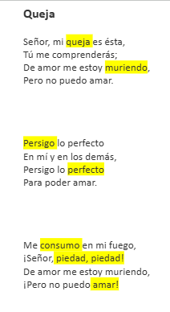

# Proyecto-1 / grupo-07

Fecha entrega: 2026-09-11

## Integrantes:

Emilia Contreras / [hazzaily](https://github.com/hazzaily) 

Monserrat Paredes / [Monserrat-Paredes](https://github.com/Monserrat-Paredes) 

Katalina Riquelme / [riyakatalinaa](https://github.com/riyakatalinaa) 


---


## Poetisa escogida → **Alfonsina Storni**

Esta poetisa argentina nacida en 1892 en Suiza es uno de los íconos de la literatura posmodernista. Con una infancia difícil y con carencias y luego una vida con recurrentes enfermedades, su poesía está impregnada de lucha, audacia, amor y una reivindicación del género femenino. Algunos de sus poemas a resaltar son: ¡Adiós!, Alma desnuda, La caricia perdida, Razones y paisajes de amor, Queja, Tu dulzura, Dolor y Frente al mar.

Toda su obra refleja dramatismo, lucha y una audacia inusual para la época. Su temática es, sobre todo, amorosa, feminista y profunda, en donde se refleja un carácter singular, marcado muchas veces por la neurosis.

Su muerte, continúa la huella de su transgresora personalidad. Su trágico suicidio, en las aguas de la playa "La Perla", de Mar del Plata, el 25 de octubre de 1938, le permitió huir de una penosa enfermedad oncológica y de la soledad que la invadía.

Información sacada de → https://www.poemas-del-alma.com/alfonsina-storni.htm#block-bio

## Licencia asociada a Alfonsina Storni

**Alfonsina Storni** nació en Suiza el 22 de Mayo de 1892 y murió el 25 de Octubre de 1938. Información rescatada de [Wikipedia](https://es.wikipedia.org/wiki/Alfonsina_Storni)

Y según la legislación Argentina [Ley 11723](https://www.argentina.gob.ar/normativa/nacional/42755/actualizacion?utm_source=chatgpt.com) después de 70 años del 01 de Enero del año siguiente la muerte de una persona, su obra se se vuelve de dominio público pagante, lo que significa que podría estar sujeta a que determinados usos de obras en dominio público pueden estar sujetos a declaración y al pago de un arancel ante el Fondo Nacional de las Artes. 

Para nuestra suerte, los 70 años se cumplieron en 2009, y la misma ley nos exenta de pagos debido a que en el artículo 36 nos dice que:

```
"Sin embargo, será lícita y estará exenta del pago de derechos de autor y de los intérpretes que establece el artículo 56, la representación, la ejecución y la recitación de obras literarias o artísticas ya publicadas, en actos públicos organizados por establecimientos de enseñanza, vinculados con el cumplimiento de sus fines educativos, planes y programas de estudio, siempre que el espectáculo no sea difundido fuera del lugar donde se realice y la concurrencia y la actuación de los intérpretes sea gratuita."
```

Así que podemos utilizar sus poemas con fines educativos.

## Poema escogido

Queja

Señor, mi queja es ésta,

Tú me comprenderás;

De amor me estoy muriendo,

Pero no puedo amar.

Persigo lo perfecto

En mí y en los demás,

Persigo lo perfecto

Para poder amar.

Me consumo en mi fuego,

¡Señor, piedad, piedad!

De amor me estoy muriendo,

¡Pero no puedo amar!.

Poema sacado de → https://www.cultura.gob.ar/9-poemas-imprescindibles-de-alfonsina-storni-8463/


### Análisis:

El poema expresa un conflicto interno entre el deseo de amar y la incapacidad de hacerlo. Ella se siente “muriendo de amor”, pero al mismo tiempo no logra entregarse emocionalmente porque busca constantemente la perfección, tanto en ella misma como en los demás.

Expresa un amor frustrado y posiblemente no correspondido, pero principalmente muestra un conflicto interno: el deseo de amar, pero su búsqueda de la perfección le impide entregarse al amor.

---

## Bill of Materials

|Componente|Cantidad|Precio|Link|
|---|---|---|---|
|Arduino UNO R4 WIFI|1|$32.990|<https://mcielectronics.cl/shop/product/arduino-uno-r4-minima/>|
|Pantalla LCD Oled 0,91" I2C|1|$3.990|<https://afel.cl/products/pantalla-lcd-oled-0-91?_pos=1&_sid=f1b122119&_ss=r>|
|Protoboard|1|$1.500|<https://afel.cl/products/mini-protoboard-400-puntos>|
|Botón Táctil|1|$400|<https://afel.cl/products/boton-tactil-tapa-12x12x7-3-interruptor?_pos=3&_sid=a0018323a&_ss=r>|
|cables|6|$1.000|<https://afel.cl/products/pack-20-cables-de-conexion-macho-macho>|
|Potenciómetro B10k|1|$500|<https://afel.cl/products/potenciometro-10k-ohm>|


---

## ¿Qué queremos que pase? (texto)
- Cambio de dirección 2: de derecha a izquierda. Lo que queremos es que lo que se proyecte en la pantalla represente el poema, por ende, puede ser que solo se proyectan ciertas palabras y no todo el texto, que son palabras claves representativas (palabras intensas).
- Que la velocidad del texto cambie según la perilla del potenciómetro (verso por verso).
- A través de un botón, tener la posibilidad de presionarlo y que se inviertan los colores mostrando las palabras claves representativas (palabras intensas).
- Que a ciertas palabras del poema se les pueda bajar o subir la opacidad con el potenciómetro.
- perfeccionismo = control = pausar/reanudar (botón)
- cambio = velocidad de reproducción (potenciómetro)
- cambio = dirección del texto (botón)
- dirección inicial del texto: arriba hacia abajo
- cambio de dirección 1: de izquierda a derecha
- poner al comienzo el nombre de la poetisa Alfonsina Storni

## Paso a paso de que queremos que suceda

- lo primero en proyectarse en la pantalla es el nombre de la poetisa "Alfonsina Storni"
- se despliega la animación inicial con el nombre del poema "Queja"
- el poema comienza a proyectarse y avanza verso por verso de manera interactiva a medida que el usuario gira la perilla del potenciometro
- al llegar a versos con palabras claves representativas (palabras intensas), el tamaño de la tipografía es mas grande que el resto del verso, para simular un efecto de "grito"
- entre medio de las dos primeras estrofas, la pantalla reproduce una animación visual
- al presionar el botón, se invierte los colores de la pantalla y se muestran únicamente las palabras clave representativas (palabras de tamaño de la tipografía es mas grande)


## Proceso código y registro

[intentoUnoPoema](https://github.com/disenoUDP/dis8645-2026-2-procesos-1/tree/main/00-proyecto-1/grupo-07/codigos/intentoUnoPoema) → 28/08/26

versión 0 que solo visualiza el poema en el serial monitor en loop

```cpp
// poema "queja"
// de alfonsina storni

// Señor, mi queja es ésta,
// Tú me comprenderás;
// De amor me estoy muriendo,
// Pero no puedo amar.
// Persigo lo perfecto
// En mí y en los demás,
// Persigo lo perfecto
// Para poder amar.
// Me consumo en mi fuego,
// ¡Señor, piedad, piedad!
// De amor me estoy muriendo,
// ¡Pero no puedo amar.

// char = caracter
// por ende
// esta parte del codigo
// separa el poema en versos
// y al haber definido en clases
// que una linea como un arreglo de caracteres
// por eso se utiliza char

char *misVersos[] = {
  "Señor, mi queja es ésta,",
  "Tú me comprenderás",
  "De amor me estoy muriendo,",
  "Pero no puedo amar.",
  "Persigo lo perfecto",
  "En mí y en los demás,",
  "Persigo lo perfecto",
  "Para poder amar.",
  "Me consumo en mi fuego,",
  "¡Señor, piedad, piedad!",
  "De amor me estoy muriendo,",
  "¡Pero no puedo amar!"
};

void setup() {

  // 9600 baud (simbolos) es un numero moderado
  // y no puede ser cualquiera
  // debe ser el resultado de un 2 elevado a algo
  Serial.begin(9600);
}

void loop() {

  // recorrer el arreglo
  // for es para recorrer conjuntos
  // adentro tiene 3 mini lineas
  // inicio de los tiempos
  // oye pero cuando paro
  // que hago despues de cada iteracion
  for (int i = 0; i < 5; i++) {
    Serial.println(misVersos[i]);
  }
}
```

## Palabras claves representativas 

Como grupo decidimos destacar la parte emocional del poema, identificamos **palabras claves representativas** de mayor intensidad que actúan como puntos de mayor tensión.

Si bien todo el poema transmite una emoción constante, las **palabras claves** las representamos en un tamaño tipográfico más grande al resto del verso. Esta variación de escala busca simular visualmente la sensación de un **grito**, evitando el uso de mayúsculas para mantener la estética y ritmo del poema.

Como se puede apreciar en la imagen, las palabras subrayadas son las **palabras claves** que van en un tamaño mayor



## Animaciones

Animación 1: después del nombre de la poetisa de Alfonsina Storni, titulo "Queja"

**imagen de la animación**

Animación 2: después de la primera estrofa, corazón roto

**imagen de la animación**


Animación 3: después de la segunda estrofa, fueguito

**imagen de la animación**

## Roles

- **Emilia:** encargada de las animaciones y sus respectivos códigos
- **Monserrat:** encargada de los códigos
- **Katalina:** encargada de registro en github
