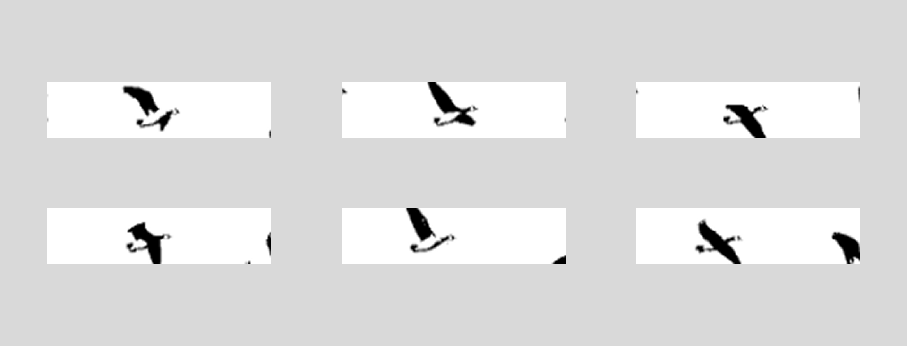

# proyecto 1

***Integrantes:***

> *Magdalena Balart (magdalenabalart)*
&nbsp;&nbsp;&nbsp;&nbsp;&nbsp;&nbsp;&nbsp;&nbsp;&nbsp;&nbsp;&nbsp;&nbsp;&nbsp;&nbsp;&nbsp;&nbsp;
*Catalina Oyadenel (catalinaoyanedel-01)*&nbsp;&nbsp;&nbsp;&nbsp;&nbsp;&nbsp;&nbsp;&nbsp;&nbsp;&nbsp;&nbsp;&nbsp;&nbsp;&nbsp;&nbsp;&nbsp; <br><br>
*Yaira Ruiz (yairaruiz)*&nbsp;&nbsp;&nbsp;&nbsp;&nbsp;&nbsp;&nbsp;&nbsp;&nbsp;&nbsp;&nbsp;&nbsp;&nbsp;&nbsp;&nbsp;&nbsp; *Marcela Zuñiga (marcezm)* 
## Poema a trabajar

### Gansos salvajes - Mary Oliver

> "No tienes que ser buena.
>
> No tienes que recorrer el desierto de rodillas, arrepintiéndote.
>
> Sólo deja que el suave animal de tu cuerpo ame lo que ama.
>
> Háblame del dolor, del tuyo, yo te hablaré del mío.
>
> Mientras tanto, el mundo sigue.
>
> Mientras tanto, el sol y las claras piedritas de la lluvia
>
> recorren los paisajes, caen
>
> sobre los prados y los árboles frondosos, las montañas y los ríos.
>
> Mientras tanto, los gansos salvajes, allá arriba, en el cielo azul y limpio,
>
> emprenden rumbo de vuelta a casa.
>
> Seas quien seas, por más sola que te sientas,
>
> el mundo está ahí para tu imaginación, llamándote,
>
> como los gansos salvajes, rudamente, emocionante:
>
> anunciando una y otra vez
>
> tu lugar entre todo lo que existe."


Elegimos este poema ya que sentimos que representa la autoexigencia y la idea de tener que ser perfecta en los distintos ámbitos de la vida, dando la posibilidad de luchar contra eso, de rendirse ante las expectativas que están impuestas y darse el tiempo de existir, contemplar y tratarse con más autocompasión.


### Licencia

El poema está bajo la licencia de copyright, donde todos los derechos están reservados, pero se puede utilizar bajo el concepto legal del uso legítimo, ya que es sin fines de lucro y con propósitos educativos. "Proyecto académico / Fragmento de 'Wild Geese' por Mary Oliver / Uso educativo no comercial"

> "No tienes que ser buena.
>
> No tienes que recorrer el desierto de rodillas, arrepintiéndote.
>
> Sólo deja que el suave animal de tu cuerpo ame lo que ama.
>
> Háblame del dolor, del tuyo, yo te hablaré del mío.
>
> Mientras tanto, el mundo sigue."

© Wild Geese, 1986 Mary Oliver

## Proceso código

### Martes 25 de agosto
Empezamos por analizar el código que nos dieron de ejemplo, viendo que era lo que nos servía y lo que no. Eliminamos lo que era animación y movimiento de texto, dejando solo el que se desplaza a la izquierda, reemplazando el texto por el primer verso de nuestro poema hasta que funcionara. A partir de esto, se fue duplicando esta estructura con cada verso.

Ejemplo de la estructura inicial:

```cpp
void testscrolltext(void) {
  
 display.setTextSize(1); // Draw 2X-scale text
  display.setTextColor(SSD1306_WHITE);

  // primer verso 
  display.setCursor(10, 0);
  display.println(F("No tienes")); // primera linea de texto
  display.setCursor(0, 10);
  display.println(F("que ser buena.")); // segunda linea de texto
 
  display.display();      // Show initial text
  delay(2500);

  // borrar primer verso
  display.clearDisplay();

  // segundo verso parte 1
  display.setCursor(0, 0);
  display.println(F("No tienes que"));
  display.setCursor(0, 10);
  display.println(F("recorrer el"));
  display.setCursor(0, 20);
  display.println(F("desierto de"));

  display.display();
  delay(2500);
```

### Viernes 28 de agosto
En esta clase se terminó de colocar todos los versos en el código, definimos el diagrama de flujo, para estructurar nuestra interacción, y empezamos a desarrollar la animación. 

#### Interacción 
Para realizar el diagrama, utilizamos Chat GPT y utilizamos el siguiente prompt:

_"Crea estructura conceptual del siguiente flujo para trabajar Arduino con pantalla pantalla OLED I2C SSD1306, con potenciómetro y botón._

_La estructura debe entenderse como una secuencia de interacción progresiva. Al iniciar el sistema, la pantalla muestra primero un texto de licencia y una pequeña animación. Después aparece un aviso que invita a presionar el botón. Con esa primera presión se presenta el título del poema y cada nueva presión del botón permite avanzar verso por verso: la primera muestra el verso 01, la segunda el verso 02, la tercera el verso 03, la cuarta el verso 04 y la quinta el verso 05._

_Solo una vez que se ha mostrado el quinto verso, y por lo tanto después de completar las cinco presiones correspondientes a los versos, la pantalla se limpia y se habilita el uso del potenciómetro. Aunque este se encuentre conectado físicamente desde el inicio, el programa debe ignorar su lectura hasta llegar a esta etapa. Al mover el potenciómetro, el nombre de la autora debe revelarse progresivamente, letra por letra, según la posición del control. Finalmente, cuando el sistema se encuentre en esta última etapa, una doble presión rápida del botón debe reiniciar toda la experiencia y volver al texto de licencia inicial."_

Nos dio como resultado:


#### Animación
Para poder realizar la animación, primero elegimos un video en pixabay subido por Bell Alvarez. Gracias a su licencia, desde esta página se permite usar el contenido gratis,  sin tener que dar crédito al autor (aunque siempre es apreciado) y modificar o adaptar el contenido en obras nuevas. 

Elegimos este video donde se muestran a gansos salvajes volando, ya que referencia explícitamente el título y versos del poema, donde se utilizan como un recurso para hacerle recordar al receptor que hay un mundo para observar más allá  de su mente, y para aceptar nuestra propia naturaleza, como la de un suave animal.

https://pixabay.com/es/videos/ganso-salvaje-aterrizaje-de-gansos-342468/

Lo primero que hicimos fue pasar el video a Adobe Premiere Pro, editarlo para dejarlo en blanco y negro y sacar frames, quedando este resultado



Luego, pasamos estos frames a esta herramienta https://javl.github.io/image2cpp/, donde los convirtió en hexadecimales y a código de Arduino.

Parte del código, ejemplo con un frame:

```cpp
// 'frames animacion_1', 128x32px
const unsigned char epd_bitmap_frames_animacion_1 [] PROGMEM = {
  0xff, 0xff, 0xff, 0xff, 0xff, 0xff, 0xff, 0xff, 0xff, 0xff, 0xff, 0xff, 0xff, 0xff, 0xff, 0xff, 
  0xff, 0xff, 0xff, 0xff, 0xff, 0xff, 0xff, 0xff, 0xff, 0xff, 0xff, 0xff, 0xff, 0xff, 0xff, 0xff, 
  0xff, 0xff, 0xff, 0xff, 0xff, 0xff, 0xff, 0xff, 0xff, 0xff, 0xff, 0xff, 0xff, 0xff, 0xff, 0xff, 
  0xff, 0xff, 0xff, 0xff, 0xff, 0xf0, 0x03, 0xff, 0xff, 0xff, 0xff, 0xff, 0xff, 0xff, 0xff, 0xff, 
  0xff, 0xff, 0xff, 0xff, 0xff, 0xf0, 0x00, 0xff, 0xff, 0xff, 0xff, 0xff, 0xff, 0xff, 0xff, 0xff, 
  0xff, 0xff, 0xff, 0xff, 0xff, 0xf0, 0x00, 0x3f, 0xff, 0xff, 0xff, 0xff, 0xff, 0xff, 0xff, 0xff, 
  0xff, 0xff, 0xff, 0xff, 0xff, 0xfc, 0x00, 0x1f, 0xff, 0xff, 0xff, 0xff, 0xff, 0xff, 0xff, 0xff, 
  0xff, 0xff, 0xff, 0xff, 0xff, 0xfe, 0x00, 0x0f, 0xff, 0xff, 0xff, 0xff, 0xff, 0xff, 0xff, 0xff, 
  0xff, 0xff, 0xff, 0xff, 0xff, 0xff, 0x80, 0x0f, 0xff, 0xff, 0xff, 0xff, 0xff, 0xff, 0xff, 0xff, 
  0xff, 0xff, 0xff, 0xff, 0xff, 0xff, 0xe0, 0x07, 0xff, 0xff, 0xff, 0xff, 0xff, 0xff, 0xff, 0xff, 
  0xff, 0xff, 0xff, 0xff, 0xff, 0xff, 0xf0, 0x07, 0xff, 0xff, 0xff, 0xff, 0xff, 0xff, 0xff, 0xff, 
  0xff, 0xff, 0xff, 0xff, 0xff, 0xff, 0xf8, 0x07, 0xff, 0xff, 0xff, 0xff, 0xff, 0xff, 0xff, 0xff, 
  0xff, 0xff, 0xff, 0xff, 0xff, 0xff, 0xf8, 0x03, 0xff, 0xff, 0xff, 0xff, 0xff, 0xff, 0xff, 0xff, 
  0xff, 0xff, 0xff, 0xff, 0xff, 0xff, 0xf8, 0x01, 0xff, 0xff, 0xff, 0xff, 0xff, 0xff, 0xff, 0xff, 
  0xff, 0xff, 0xff, 0xff, 0xff, 0xff, 0xfc, 0x01, 0xff, 0xff, 0xff, 0xff, 0xff, 0xff, 0xff, 0xff, 
  0xff, 0xff, 0xff, 0xff, 0xff, 0xff, 0xfe, 0x00, 0xff, 0xff, 0xff, 0xff, 0xff, 0xff, 0xff, 0xff, 
  0xff, 0xff, 0xff, 0xff, 0xff, 0xff, 0xfe, 0x31, 0xfe, 0xdf, 0xff, 0xff, 0xff, 0xff, 0xff, 0xff, 
  0xff, 0xff, 0xff, 0xff, 0xff, 0xff, 0xff, 0x3f, 0xf0, 0xdf, 0xff, 0xff, 0xff, 0xff, 0xff, 0xff, 
  0xff, 0xff, 0xff, 0xff, 0xff, 0xff, 0xff, 0xbf, 0xf1, 0xff, 0xff, 0xff, 0xff, 0xff, 0xff, 0xff, 
  0xff, 0xff, 0xff, 0xff, 0xff, 0xff, 0xff, 0xff, 0xc1, 0xff, 0xff, 0xff, 0xff, 0xff, 0xff, 0xff, 
  0xff, 0xff, 0xff, 0xff, 0xff, 0xff, 0xff, 0xff, 0x83, 0xff, 0xff, 0xff, 0xff, 0xff, 0xff, 0xff, 
  0xff, 0xff, 0xff, 0xff, 0xff, 0xff, 0xf3, 0xff, 0x03, 0xff, 0xff, 0xff, 0xff, 0xff, 0xff, 0xff, 
  0xff, 0xff, 0xff, 0xff, 0xff, 0xff, 0xf1, 0xfc, 0x07, 0xff, 0xff, 0xff, 0xff, 0xff, 0xff, 0xff, 
  0xff, 0xff, 0xff, 0xff, 0xff, 0xff, 0xe3, 0xf8, 0x07, 0xff, 0xff, 0xff, 0xff, 0xff, 0xff, 0xff, 
  0xff, 0xff, 0xff, 0xff, 0xff, 0xff, 0xfa, 0x07, 0x8f, 0xff, 0xff, 0xff, 0xff, 0xff, 0xff, 0xff, 
  0xff, 0xff, 0xff, 0xff, 0xff, 0xff, 0xfc, 0xff, 0x9f, 0xff, 0xff, 0xff, 0xff, 0xff, 0xff, 0xff, 
  0xff, 0xff, 0xff, 0xff, 0xff, 0xff, 0xff, 0xff, 0x9f, 0xff, 0xff, 0xff, 0xff, 0xff, 0xff, 0xff, 
  0xff, 0xff, 0xff, 0xff, 0xff, 0xff, 0xff, 0xff, 0xbf, 0xff, 0xff, 0xff, 0xff, 0xff, 0xff, 0xff, 
  0xff, 0xff, 0xff, 0xff, 0xff, 0xff, 0xff, 0xff, 0xff, 0xff, 0xff, 0xff, 0xff, 0xff, 0xff, 0xfe, 
  0xff, 0xff, 0xff, 0xff, 0xff, 0xff, 0xff, 0xff, 0xff, 0xff, 0xff, 0xff, 0xff, 0xff, 0xff, 0xfe, 
  0xff, 0xff, 0xff, 0xff, 0xff, 0xff, 0xff, 0xff, 0xff, 0xff, 0xff, 0xff, 0xff, 0xff, 0xff, 0xfe, 
  0xff, 0xff, 0xff, 0xff, 0xff, 0xff, 0xff, 0xff, 0xff, 0xff, 0xff, 0xff, 0xff, 0xff, 0xff, 0xfe
};
```

Se intentó colocar directamente en donde traía la animación el código de ejemplo, pero no funcionó, así que con Gemini AI le preguntamos por qué no funcionaba 


### Martes 01 de septiembre

### Viernes 04 de septiembre

## Carcasa
