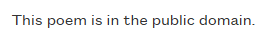
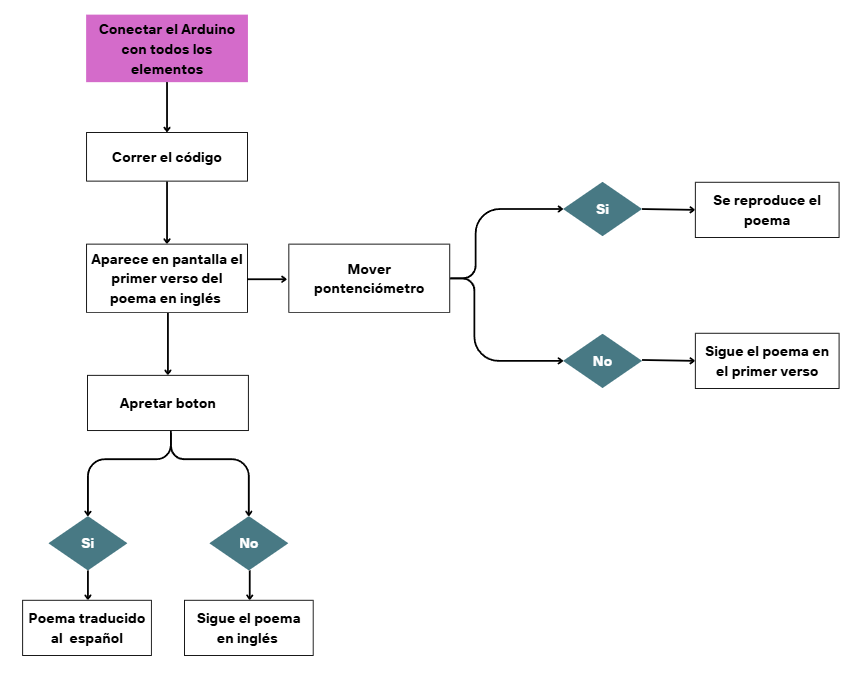

# Proyecto 1/ Grupo 10
**Integrantes:**

- Belén Castillo / [bombobby](https://github.com/bombobby) 

- Martina Fernandez / [pumpkinguurl](https://github.com/pumpkinguurl) 

- Maite Villarroel / [maiteev](https://github.com/maiteev) 

- Nacha Zamudio / [nachazamudio](https://github.com/nachazamudio) 

  
# Poema
Este proyecto busca exponer el poema "Hope is the thing with feathers" del año 1861 y publicado por primera vez de forma póstuma en 1891. Fue escrito por la poeta estadounidense Emily Dickinson.

**Poema original:**
--
“Hope is the thing with feathers

That perches in the soul,

And sings the tune without the words,

And never stops at all,
***
And sweetest in the gale is heard,

And sore must be the storm,

That could abash the little bird,

That kept so many warm.
***

I’ve heard it in the chillest land,

And on the strangest sea,

Yet, never, in extremity,

It asked a crumb of me”

**Poema traducido al español:**
--
“La esperanza es esa cosa con plumas

que se posa en el alma

y canta la melodía sin palabras,

y nunca se detiene.
***
Y se oye más dulcemente en la tempestad,

y muy fuerte debe ser la tormenta

que pudiera acobardar al pajarito

que a tantos les dio calor.
***
La he oído en la tierra más fría

y en el mar más extraño,

pero nunca, en la adversidad,

me pidió una migaja” 

# Licencias explícitas del corpus

Se verificó el estado de derechos de autor de las obras utilizadas. En el caso del poema Hope is the thing with feathers, de Emily Dickinson, la fuente utilizada, Academy of American Poets (Poets.org), declara explícitamente que la obra se encuentra en el dominio público: “This poem is in the public domain.” Esta indicación aparece directamente en la página de la obra, después del texto del poema.
Por lo tanto, el poema fue incorporado al corpus bajo la condición de dominio público, utilizando como evidencia la declaración explícita de la fuente.

| Obra | Autor/a | Fuente | Licencia / estado | Evidencia |
| :--- | :--- | :--- | :--- | :--- |
| *Hope is the thing with feathers* | Emily Dickinson | Academy of American Poets | Dominio público | https://poets.org/poem/hope-thing-feathers-254 |

Evidencia:

 

# Flujo de trabajo 
 

# Proceso código 

