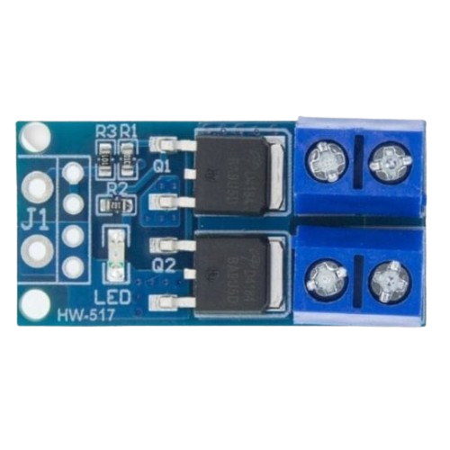

# sesion-04b

## apuntes sesión

* Hoy dia empezamos la clase con la llegada de misaa, en donde explico su viaje y ademas presentacion de el y tambien trajo dulces
* Tema trabajo del poema, seguimos experimentando los limites, santi nos ayudo ya que al querer usar dos pantallas queriamos ver los limites de la multimedia, lo que llegamos fue que videos es complicado hacerlo funcionar por tema de limitacion de hardware, la pico 2 W seria una solucion a esto pero santi nos dijo que por temas de tiempo quizas no alcanzaremos, asi que lo mejor po ahora sera realizar un storyboard sin tomar en cuenta el uso de videos y usaremos imagenes.

---

### Storyboard + explicación del porqué

* Hoy día empezamos la clase con la llegada de Misaa, donde nos explicó sobre su viaje, se presentó y además trajo dulces.
* **Tema trabajo del poema:** seguimos experimentando los límites. Santi nos ayudó ya que, al querer usar dos pantallas, queríamos ver los límites del contenido multimedia. A lo que llegamos fue que con videos es complicado hacerlo funcionar por un tema de limitación de hardware; la Pico 2 W sería una solución, pero Santi nos dijo que por temas de tiempo quizás no alcancemos. Así que lo mejor por ahora será armar un storyboard sin considerar videos, usando solo imágenes.


**1. Este poema nada puede resolver** > *Esto le quita el sentido y el peso al poema en general; se podría interpretar como un manifiesto del autor sobre el estigma de la sociedad frente al arte y su "utilidad" en la vida diaria.  
> Concepto: cotidiano. Poner una o varias imágenes del día a día de mucha gente para representar a la sociedad y a los individuos. Otra opción podría ser poner fotos de cosas importantes para nosotros.*

**2. Adentro del poema, la muerte se consume.** > *Las imágenes se desintegran y entran las palabras.*

**3. Ya, dilo de nuevo, el porcentaje de pureza mezclado con un poco de sol. Con un poco de hambre** > *Al hablar de la pureza, el sol y el hambre lo interpreto con la naturaleza, lo casero, lo convencional.  
> Idea: Kriss hace las letras a mano de esta parte del poema y las vamos pasando tipo GIF.*

**4. Todo acaba aquí** > *Los primeros segundos no hay nada; después aparece en la pantalla de arriba "Todo acaba aquí".*

**5. Y de pronto no.** > *Aparece esto en grande en la pantalla de abajo.*

**6. Un nuevo servidor, un poema electrónico, un mesías.** > *Las letras van pasando arriba mientras abajo aparecen las imágenes. Luego aparece en grande en la pantalla de abajo: "UN MESÍAS".  
> Las imágenes deben estar relacionadas con tecnología encargada de transmitir mensajes o información; la idea es que sean muchas imágenes pasando rápido.* > **(Ojo: en caso de ser muy brígido, poner alerta de epilepsia y añadir un botón de inicio para el poema).** > *Adentro del poema, la muerte se consume.*

**7. Poema bajando desde el cielo** > *¿Nos vamos por lo literal? Lo interpreto medio bíblico, como cuando dicen que los ángeles bajarán del cielo a matar a los pecadores o una volá así de brígida. Tenemos que mostrar algo suave, como los ángeles, para después...*

**8. Solo los elegidos contemplan su propia destrucción.** > *...mostrar el caos, tal como el que ocasionarán cuando bajen.* > *Propuesta: usar motores vibratorios dentro de la caja para simular esto. Al principio queríamos hacer explotar un condensador polarizado, pero pensamos que sería demasiado; luego pensamos en fundir un LED, pero nos dio pena. Así que la vibración quedó como el punto medio de caos tolerable.*

**9. No, en serio** > *Poner "No, en serio" en la pantalla grande con tres puntos suspensivos que van apareciendo y desapareciendo uno por uno.*

**10. No, en serio, este poema nada puede resolver.** > *Se repite y entra en bucle.*

---

Bien, con el storyboard listo queremos implementar la vibración, así que toca investigar. Con la ayuda de Santi descubrimos que el motor necesita un MOSFET para regular su velocidad; en específico encontramos el módulo **HW-517 V0.0.1**, el cual probaremos ahora.

La combinación de estas dos cosas necesita además una fuente de poder externa aparte para el Arduino. El módulo se compone de 6 conexiones:
* `OUT+` y `OUT-`: aquí va conectado el motor.
* `GND` y `TRIG/PWM`: van conectados al Arduino.
* `VIN+` y `VIN-`: van a la batería/fuente externa.




Para el código de Arduino usaremos uno donde podamos controlar el motor mediante la consola: que permita dar una mini pulsación, un botón para detener, un botón a toda potencia y selección manual de potencia en un rango de 0 a 255.

Adjunto el código y la conversación con Gemini con la que se generó: https://share.gemini.google/PuVXHlj1Jx1S

```cpp
// Control de motor vibratorio JQ24-35E360 vía HW-517
// Entrada de comandos por Monitor Serie

const uint8_t MOTOR_PIN = 9;
int currentDuty = 0;

void printHelp() {
  Serial.println(F("\n--- CONTROL DE MOTOR VIBRATORIO ---"));
  Serial.println(F("Comandos:"));
  Serial.println(F("  0 a 255 : Ajusta el valor PWM directamente"));
  Serial.println(F("  s       : Detiene el motor (PWM = 0)"));
  Serial.println(F("  m       : Potencia máxima (PWM = 255)"));
  Serial.println(F("  p       : Ejecuta una secuencia de pulsos (alerta)"));
  Serial.println(F("  ?       : Muestra este menú"));
  Serial.println(F("-----------------------------------\n"));
}

void setup() {
  pinMode(MOTOR_PIN, OUTPUT);
  analogWrite(MOTOR_PIN, 0);

  Serial.begin(115200);
  // Espera a que el puerto USB nativo del R4 se enlace (máximo 3 s)
  while (!Serial && millis() < 3000);

  printHelp();
  Serial.print(F("Estado: Apagado (0/255)\n> "));
}

void loop() {
  if (Serial.available() > 0) {
    char firstChar = Serial.peek();

    // 1. Si el primer carácter es un número, leemos el entero completo
    if (isDigit(firstChar)) {
      int value = Serial.parseInt();
      currentDuty = constrain(value, 0, 255);
      analogWrite(MOTOR_PIN, currentDuty);

      Serial.print(F("PWM fijado en: "));
      Serial.print(currentDuty);
      Serial.print(F(" ("));
      Serial.print((currentDuty * 100) / 255);
      Serial.println(F("%)"));
    } 
    // 2. Si es una letra o carácter de comando
    else {
      char cmd = Serial.read();
      
      // Descartar retornos de carro o espacios en blanco
      if (cmd == '\n' || cmd == '\r' || cmd == ' ') return;

      switch (cmd) {
        case 's':
        case 'S':
          currentDuty = 0;
          analogWrite(MOTOR_PIN, 0);
          Serial.println(F("Motor detenido (0%)"));
          break;

        case 'm':
        case 'M':
          currentDuty = 255;
          analogWrite(MOTOR_PIN, 255);
          Serial.println(F("Potencia máxima (100%)"));
          break;

        case 'p':
        case 'P':
          Serial.println(F("Disparando patrón de alerta..."));
          for (int i = 0; i < 3; i++) {
            analogWrite(MOTOR_PIN, 220);
            delay(120);
            analogWrite(MOTOR_PIN, 0);
            delay(80);
          }
          analogWrite(MOTOR_PIN, currentDuty); // Vuelve al estado previo
          Serial.println(F("Patrón finalizado"));
          break;

        case '?':
        case 'h':
        case 'H':
          printHelp();
          break;

        default:
          Serial.print(F("Comando no reconocido: '"));
          Serial.print(cmd);
          Serial.println(F("'. Escribe '?' para ver las opciones."));
          break;
      }
    }

    // Limpia caracteres de fin de línea remanentes
    while (Serial.available() > 0 && (Serial.peek() == '\n' || Serial.peek() == '\r')) {
      Serial.read();
    }
    Serial.print(F("> "));
  }
}
```

Estamos en la duda de si usar botones o potenciómetro, ya que sentimos que los botones podrían ser una forma ordenada y ayudarían al tema de repetir el poema donde termina. Tal vez usar 4 motores, por lo que quedarían los materiales como:
4 motores, junto a su módulo
Batería externa
Arduino o pico 2 W (depende de si nos da la potencia).
2 botones o 1 potenciómetro.


## encargos

## lectura
