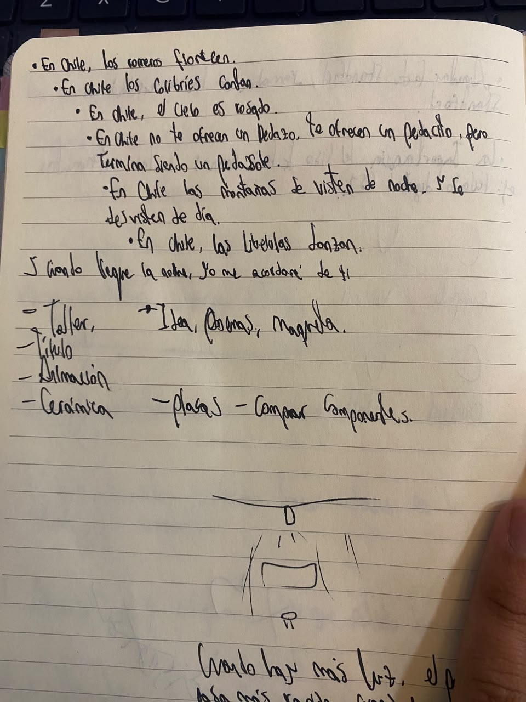
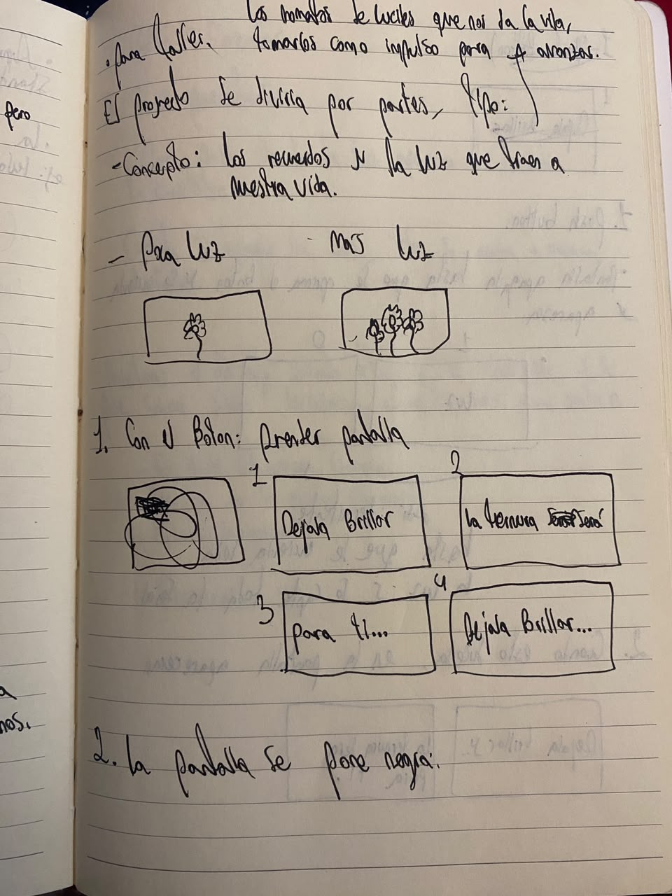
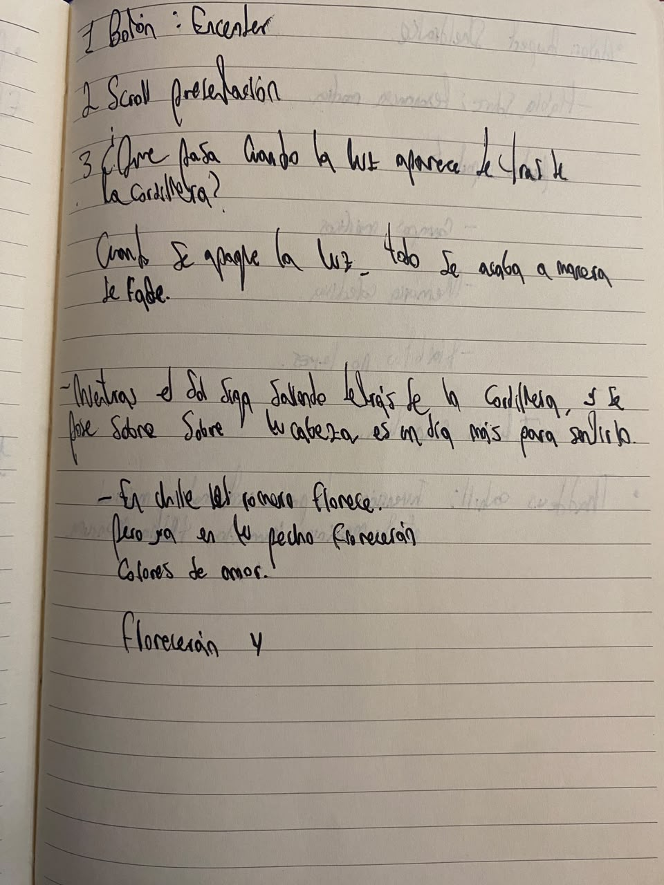

# sesion-04a
Hola profe Aarón, Misa y Emi, espero que se encuentren muy bien en el día de hoy. 
Hoy día, estuvimos trabajando en el proyecto 01 en clase.

## Trabajo en proyecto 01
Para este momento, desistimos hacer nuestro proyecto con los poemas de Elvira Sastre, aunque tuvieran Licencia de Copyrigh, decidimos no usarlo y crear nuestro propio poema, y así, apropiarnos de él con total libertad. 

Entonces, mientras era creado el poema oficial que íbamos a usar, continuamos explorando el código que teníamos hasta el momento el cual había sido creado para trabajar con los poemas de Elvira, y este se basaba en el scroll por lineas, usando `/ln`.

Luego, refrescamos el concepto del lenguaje C++, en como `Strings` solo funciona para Arduino, mientras que `Char` se puede implementar en un lenguaje universal: si copio y pego el código en otro tipo de lenguaje, por ejemplo pyhton, este le entendera. Es como el Ingles del código. En el mundo, algunas personas hablan ingles para poderse comunicar con personas de otras lenguas, por eso le llaman el "lenguaje universal".

Después de refrescar estos conceptos, la curiosidad comenzó a gobernarnos y nos cuestionamos: Por que no trabajar con la placa Rasberi Pi co 2w, y lo intentamos y no funcionó.

## Creación del poema

Más adelante en ese mismo día, en mi lugar favorito udp, la biblioteca Nicanor Parra, comencé a escribir textos que se me vienen a la cabeza cuando voy por la ciudad en el metro, en el uber, o en mis pies sobre Santiago de Chile, su gente y el paraíso que es:

Primer borrador:

Pero luego, en la noche al llegar a casa, la nostalgia, el cariño y la alegría se apoderaron de mi..., y fue cuando surgió esta idea, pero aún no estaba estructurado de manera oficial el poema.

## lectura
Agregar resumen 
