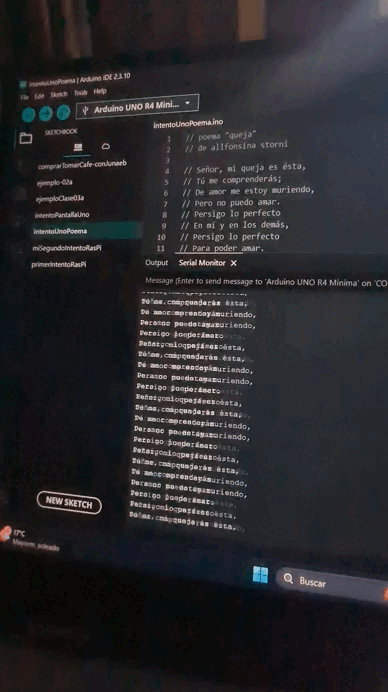

# sesion-03b

2026-08-28

## Strings

Tienden a ser un problema (elementos fundamentales de la comunicación).

Son una clase (comienzan con mayúsculas).

Existen distintas versiones. No hay solo una manera de hacer las cosas.

"" string

' ' para palabras 

```c++
// en este lugar hago un string que dice cuantos caracteres tendrá en el
String  thisString = String(13);
```

```c++
//
charAt() =  extraer un caracter en especifico de una cadena de texto

//
setCharAt() = modificar un caracter especifiico dentro de una cadena de texto 
```


String = difícil

En Arduino también existe string (en minúscula).

Se puede utilizar el String con un arreglo (array), por ejemplo con "char".

```c++
// arreglo de datos
// "Str4", "Str5", "Str6", pueden ser otro nombre, ejemplo "palabrita"
char Str4[] = "arduino";
char Str5[8] = "arduino";
char Str6[15] = "arduino";
```

Ejemplo edades del curso

```c++
// declarar
int edades[36] = {20, 21, 22, 23, 24}
```

Otro ejemplo de las edades:

```c++
// declaracion de arreglo de enteros
// que se llama edades
int edades[3] = { 37, 22, 24 };

void setup() {
  Serial.begin(9600);
}

void loop() {
  Serial.print(edades[0]);
  Serial.print(", ");
  Serial.print(edades[1]);
  Serial.print(", ");
  Serial.println(edades[2]);
}
```

Ejemplo nombres del curso:

```c++
char nombre[5] = "emilia";

void setup() {
  Serial.begin(9600);
}

void loop() {
  Serial.print(nombre[0]);
  Serial.print(nombre[1]);
  Serial.print(nombre[2]);
  Serial.print(nombre[3]);
  Serial.println(nombre[4]);
}
```
Importante: 

```c++
// un poemario
// es un arreglo de paginas
// una pagina es un arreglo de lineas
// una linea es un arreglo de caracteres
```

(*) = (pointer). Permiten hacer un arreglo de arreglos, para no preocuparnos por cuánto mide.

```c++
char *misVersos[] = {
  "Mami, no te haga' de rogar",
  "No me gustaría perder el tiempo",
  "Que tenemo' pa' poderte tocar",
  "Y estás con otro, esa mierda no lo entiendo, yeah",
  "Que te lo juro, no eres nada pa' mí, te lo juro, ah",};

// bah que raro
// con 5 no funciono
char nombre[6] = "aaron";

void setup() {
  Serial.begin(9600);
}

void loop() {
  Serial.println(misVersos[0]);
}
```

Importante: sólo se repite la primera línea

En cambio, aquí se repiten las 5 líneas que componen un verso.

```c++
void loop() {

  // recorrer el arreglo
  // for es para recorrer conjuntos
  // adentro tiene 3 mini lineas
  // inicio de los tiempos
  // oye pero cuando paro
  // que hago despues de cada iteracion
  for (int i = 0; i < 5; i++) {
    Serial.println(misVersos[i]);
  }
}
```

Entre corchetes = [qué tan grande es el arreglo (array)] 

Luego realizamos un ejemplo con nuestro poema de lo que se hizo en clase con Akrilla.

El código se encuentra más abajo en el encargo, pero aquí pondré un gif de eso corriendo el serial monitor de Arduino.

Gif del código corriendo en el serial monitor de arduino en mi computador.



## encargos

encargo-03b:

1. apuntes personales de String, string, array, con bibliografia y con pantallazos de resultados, y dudas textuales.
2. subir código a su bitácora ordenado con el formato de backticks a continuación, del proyecto hasta ahora.
3. definir y escribir el corpus a usar: autora, poemas, licencias, poblarlo en la carpeta 00-proyecto-1

Esto fue lo que hicimos en clases:

[intentoUnoPoema](https://github.com/disenoUDP/dis8645-2026-2-procesos-1/tree/main/00-proyecto-1/grupo-07/codigos/intentoUnoPoema) (2026-08-28)

versión 0 que solo visualiza el poema en el serial monitor en loop

```cpp
// poema "queja"
// de allfonsina storni

// Señor, mi queja es ésta,
// Tú me comprenderás;
// De amor me estoy muriendo,
// Pero no puedo amar.
// Persigo lo perfecto
// En mí y en los demás,
// Persigo lo perfecto
// Para poder amar.
// Me consumo en mi fuego,
// ¡Señor, piedad, piedad!
// De amor me estoy muriendo,
// ¡Pero no puedo amar.

// char = caracter
// por ende
// esta parte del codigo
// separa el poema en versos
// y al haber definido en clases
// que una linea como un arreglo de caracteres
// por eso se utiliza char

char *misVersos[] = {
  "Señor, mi queja es ésta,",
  "Tú me comprenderás",
  "De amor me estoy muriendo,",
  "Pero no puedo amar.",
  "Persigo lo perfecto",
  "En mí y en los demás,",
  "Persigo lo perfecto",
  "Para poder amar.",
  "Me consumo en mi fuego,",
  "¡Señor, piedad, piedad!",
  "De amor me estoy muriendo,",
  "¡Pero no puedo amar!"
};

void setup() {

  // 9600 baud (simbolos) es un numero moderado
  // y no puede ser cualquiera
  // debe ser el resultado de un 2 elevado a algo
  Serial.begin(9600);
}

void loop() {

  // recorrer el arreglo
  // for es para recorrer conjuntos
  // adentro tiene 3 mini lineas
  // inicio de los tiempos
  // oye pero cuando paro
  // que hago despues de cada iteracion
  for (int i = 0; i < 5; i++) {
    Serial.println(misVersos[i]);
  }
}

```

La poetisa que escogimos fue **Alfonsina Storni**, quién nació en Suiza el 22 de Mayo de 1892 y murió el 25 de Octubre de 1938. Información rescatada de [Wikipedia](https://es.wikipedia.org/wiki/Alfonsina_Storni)

Y según la legislación Argentina [Ley 11723](https://www.argentina.gob.ar/normativa/nacional/42755/actualizacion?utm_source=chatgpt.com) después de 70 años del 01 de Enero del año siguiente la muerte de una persona, su obra se se vuelve de dominio público pagante, lo que significa que podría estar sujeta a que determinados usos de obras en dominio público pueden estar sujetos a declaración y al pago de un arancel ante el Fondo Nacional de las Artes. 

Para nuestra suerte, los 70 años se cumplieron en 2009, y la misma ley nos exenta de pagos debido a que en el artículo 36 nos dice que:

```
"Sin embargo, será lícita y estará exenta del pago de derechos de autor y de los intérpretes que establece el artículo 56, la representación, la ejecución y la recitación de obras literarias o artísticas ya publicadas, en actos públicos organizados por establecimientos de enseñanza, vinculados con el cumplimiento de sus fines educativos, planes y programas de estudio, siempre que el espectáculo no sea difundido fuera del lugar donde se realice y la concurrencia y la actuación de los intérpretes sea gratuita."
```

Así que podemos utilizar sus poemas con fines educativos.

## lectura

