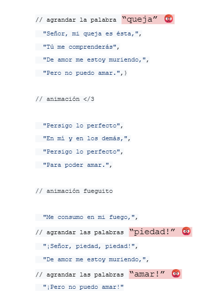
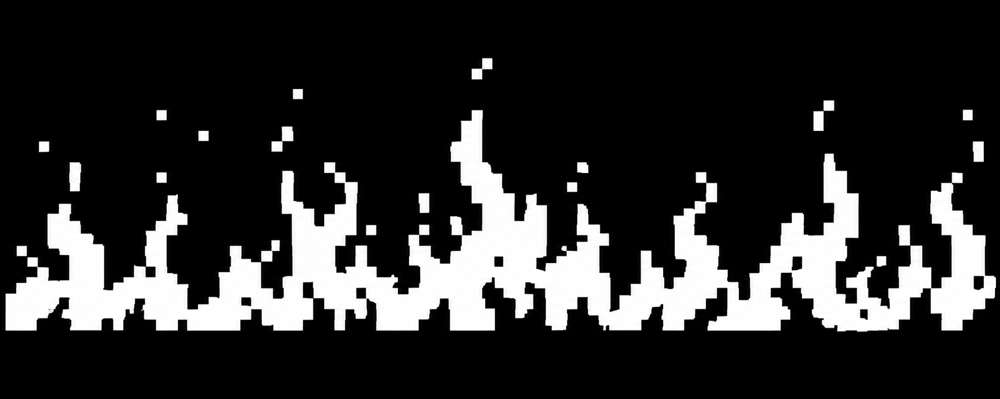

# sesion-04a

2026-09-01

## Estructura final poema

Durante esta clase revisamos la estructura final del poema en la pantalla, el cual quedo así:



Aquí podemos ver palabras destacadas y más grandes, estas son las que agrandaremos en el poema. Esto para que resalten entre las otras porque son las que definen el carácter del poema.

## ¿Cómo hacer animaciones en una pantalla de 0.91" y no morir en el intento?

Spoiler: Morimos en el intento.

Revisamos el repositorio de nuestra compañera [catalinaoyanedel-01](https://github.com/catalinaoyanedel-01) buscando inspiración y una guía de cómo hacer las animaciones, esto porque su grupo lo había logrado.

Nuestra sorpresa fue que el método que intentaron no funcionó y recurrimos a Seba.

Nos recomendó una página llamada [Stonez56](https://tools.stonez56.com/u8g2/getBitmap.php) que sirve para convertir imágenes en "bitmaps", que son el formato para mostra imágenes/animaciones en arduino.

Aquí tampoco lo logramos porque no encontrábamos una imagen que nos gustara para poder probarlo, así que recurrimos a ChatGPT, a que nos hiciera una imagen de 128x32px de llamas para pasarla por página y el resultado no fue bueno.

Imagen generada por ChatGPT para generar bitmap.



Esto más que nada porque realmente no había coherencia de pixeles, tamaño, formato de la imagen, etc.

Aún así no todo es malo, y logramos hacer nuestra primera animación. La cual después cambiamos porque estaba muy pequeña


El código de esto lo voy a adjuntar aquí acortado:

```cpp
 // frame 0

 // Bitmap generated for 128x32 display
// Image: intentoAnimacion01
// Method: Ordered (Bayer)
// Format: 128x32, 1 bit/pixel, LSB first

#ifndef INTENTOANIMACION01_BITMAP_H
#define INTENTOANIMACION01_BITMAP_H

// Width: 128
// Height: 32

static const unsigned char PROGMEM intentoAnimacion00_bitmap[512] = {
  0x00,0x00,0x00,0x00,0x00,0x00,0x00,0x00,0x00,0x00,0x00,0x00,0x00,0x00,0x00,0x00,
  0x00,0x00,0x00,0x00,0x00,0x00,0x00,0x00,0x00,0x00,0x00,0x00,0x00,0x00,0x00,0x00,
  0x00,0x00,0x00,0x00,0x00,0x00,0x00,0x00,0x00,0x00,0x00,0x00,0x00,0x00,0x00,0x00,
  0x00,0x00,0x00,0x00,0x00,0x00,0x00,0x00,0x00,0x00,0x00,0x00,0x00,0x00,0x00,0x00,
  0x00,0x00,0x00,0x00,0x00,0x00,0x00,0x00,0x00,0x00,0x00,0x00,0x00,0x00,0x00,0x00,
  0x00,0x00,0x00,0x00,0x00,0x00,0x00,0x00,0x00,0x00,0x00,0x00,0x00,0x00,0x00,0x00,
  0x00,0x00,0x00,0x00,0x00,0x00,0x00,0x00,0x00,0x00,0x00,0x00,0x00,0x00,0x00,0x00,
  0x00,0x00,0x00,0x00,0x00,0x00,0x00,0x00,0x00,0x00,0x00,0x00,0x00,0x00,0x00,0x00,
  0x00,0x00,0x00,0x00,0x00,0x00,0x00,0x00,0x00,0x00,0x00,0x00,0x00,0x00,0x00,0x00,
  0x00,0x00,0x00,0x00,0x00,0x00,0x00,0x00,0x00,0x00,0x00,0x00,0x00,0x00,0x00,0x00,
  0x00,0x00,0x00,0x00,0x00,0x00,0x00,0x00,0x00,0x00,0x00,0x00,0x00,0x00,0x00,0x00,
  0x00,0x00,0x00,0x00,0x00,0x00,0x00,0x00,0x00,0x00,0x00,0x00,0x00,0x00,0x00,0x00,
  0x00,0x00,0x00,0x00,0x00,0x00,0x00,0x00,0x00,0x00,0x00,0x00,0x00,0x00,0x00,0x00,
  0x00,0x00,0x00,0x00,0x00,0x00,0x00,0x00,0x00,0x00,0x00,0x00,0x00,0x00,0x00,0x00,
  0x00,0x00,0x00,0x00,0x00,0x00,0x00,0x00,0x00,0x00,0x00,0x00,0x00,0x00,0x00,0x00,
  0x00,0x00,0x00,0x00,0x00,0x00,0x00,0x00,0x00,0x00,0x00,0x00,0x00,0x00,0x00,0x00,
  0x00,0x00,0x00,0x00,0x00,0x00,0x00,0x00,0x00,0x00,0x00,0x00,0x00,0x00,0x00,0x00,
  0x00,0x00,0x00,0x00,0x00,0x00,0x00,0x00,0x00,0x00,0x00,0x00,0x00,0x00,0x00,0x00,
  0x00,0x00,0x00,0x00,0x00,0x00,0x00,0x00,0x00,0x00,0x00,0x00,0x00,0x00,0x00,0x00,
  0x00,0x00,0x00,0x00,0x00,0x00,0x00,0x00,0x00,0x00,0x00,0x00,0x00,0x00,0x00,0x00,
  0x00,0x00,0x00,0x00,0x00,0x00,0x00,0x00,0x00,0x00,0x00,0x00,0x00,0x00,0x00,0x00,
  0x00,0x00,0x00,0x00,0x00,0x00,0x00,0x00,0x00,0x00,0x00,0x00,0x00,0x00,0x00,0x00,
  0x00,0x00,0x00,0x00,0x00,0x00,0x00,0x00,0x00,0x00,0x00,0x00,0x00,0x00,0x00,0x00,
  0x00,0x00,0x00,0x00,0x00,0x00,0x00,0x00,0x00,0x00,0x00,0x00,0x00,0x00,0x00,0x00,
  0x00,0x00,0x00,0x00,0x00,0x00,0x00,0x00,0x00,0x00,0x00,0x00,0x00,0x00,0x00,0x00,
  0x00,0x00,0x00,0x00,0x00,0x00,0x00,0x00,0x00,0x00,0x00,0x00,0x00,0x00,0x00,0x00,
  0x00,0x00,0x00,0x00,0x00,0x00,0x00,0x00,0x00,0x00,0x00,0x00,0x00,0x00,0x00,0x00,
  0x00,0x00,0x00,0x00,0x00,0x00,0x00,0x00,0x00,0x00,0x00,0x00,0x00,0x00,0x00,0x00,
  0x00,0x00,0x00,0x00,0x00,0x00,0x00,0x00,0x00,0x00,0x00,0x00,0x00,0x00,0x00,0x00,
  0x00,0x00,0x00,0x00,0x00,0x00,0x00,0x00,0x00,0x00,0x00,0x00,0x00,0x00,0x00,0x00,
  0x00,0x00,0x00,0x00,0x00,0x00,0x00,0x00,0x00,0x00,0x00,0x00,0x00,0x00,0x00,0x00,
  0x00,0x00,0x00,0x00,0x00,0x00,0x00,0x00,0x00,0x00,0x00,0x00,0x00,0x00,0x00,0x00
};

// (...) 25 frames más tarde

 // frame 27

 // Bitmap generated for 128x32 display
// Image: intentoAnimacion01
// Method: Ordered (Bayer)
// Format: 128x32, 1 bit/pixel, LSB first


// Width: 128
// Height: 32

static const unsigned char PROGMEM intentoAnimacion27_bitmap[512] = {
  0x00,0x00,0x00,0x00,0x00,0x00,0x00,0x00,0x00,0x00,0x00,0x00,0x00,0x00,0x00,0x00,
  0x00,0x00,0x00,0x00,0x00,0x00,0x00,0x00,0x00,0x00,0x00,0x00,0x00,0x00,0x00,0x00,
  0x00,0x00,0x00,0x00,0x00,0x00,0x00,0x00,0x00,0x00,0x00,0x00,0x00,0x00,0x00,0x00,
  0x00,0x00,0x00,0x00,0x00,0x00,0x00,0x00,0x00,0x00,0x00,0x00,0x00,0x00,0x00,0x00,
  0x00,0x00,0x00,0x00,0x00,0x00,0x00,0x00,0x00,0x00,0x00,0x00,0x00,0x00,0x00,0x00,
  0x00,0x00,0x00,0x00,0x00,0x00,0x00,0x00,0x00,0x00,0x00,0x00,0x00,0x00,0x00,0x00,
  0x00,0x00,0x00,0x00,0x00,0x00,0x00,0x00,0x00,0x00,0x00,0x00,0x00,0x00,0x00,0x00,
  0x00,0x00,0x00,0x00,0x00,0x00,0x00,0x00,0x00,0x00,0x00,0x00,0x00,0x00,0x00,0x00,
  0x00,0x00,0x00,0x00,0x00,0x00,0x00,0x00,0x00,0x00,0x00,0x00,0x00,0x00,0x00,0x00,
  0x00,0x00,0x00,0x00,0x00,0x00,0x00,0x00,0x00,0x00,0x00,0x00,0x00,0x00,0x00,0x00,
  0x00,0x00,0x00,0x00,0x00,0x00,0x00,0x00,0x00,0x00,0x00,0x00,0x00,0x00,0x00,0x00,
  0x00,0x00,0x00,0x00,0x00,0x00,0x00,0x00,0x00,0x00,0x00,0x00,0x00,0x00,0x00,0x00,
  0x00,0x00,0x00,0x00,0x00,0x00,0x00,0x00,0x00,0x00,0x00,0x00,0x00,0x00,0x00,0x00,
  0x00,0x00,0x00,0x00,0x00,0x00,0x00,0x00,0x00,0x00,0x00,0x00,0x00,0x00,0x00,0x00,
  0x00,0x00,0x00,0x00,0x00,0x00,0x00,0x00,0x00,0x00,0x00,0x00,0x00,0x00,0x00,0x00,
  0x00,0x00,0x00,0x00,0x00,0x00,0x00,0x00,0x00,0x00,0x00,0x00,0x00,0x00,0x00,0x00,
  0x00,0x00,0x00,0x00,0x00,0x00,0x00,0x00,0x00,0x00,0x00,0x00,0x00,0x00,0x00,0x00,
  0x00,0x00,0x00,0x00,0x00,0x00,0x00,0x00,0x00,0x00,0x00,0x00,0x00,0x00,0x00,0x00,
  0x00,0x00,0x00,0x00,0x00,0x00,0x00,0x00,0x00,0x00,0x00,0x00,0x00,0x00,0x00,0x00,
  0x00,0x00,0x00,0x00,0x00,0x00,0x00,0x00,0x00,0x00,0x00,0x00,0x00,0x00,0x00,0x00,
  0x00,0x00,0x00,0x00,0x00,0x00,0x00,0x00,0x00,0x00,0x00,0x00,0x00,0x00,0x00,0x00,
  0x00,0x00,0x00,0x00,0x00,0x00,0x00,0x00,0x00,0x00,0x00,0x00,0x00,0x00,0x00,0x00,
  0x00,0x00,0x00,0x00,0x00,0x00,0x00,0x00,0x00,0x00,0x00,0x00,0x00,0x00,0x00,0x00,
  0x00,0x00,0x00,0x00,0x00,0x00,0x00,0x00,0x00,0x00,0x00,0x00,0x00,0x00,0x00,0x00,
  0x00,0x00,0x00,0x00,0x00,0x00,0x00,0x00,0x00,0x00,0x00,0x00,0x00,0x00,0x00,0x00,
  0x00,0x00,0x00,0x00,0x00,0x00,0x00,0x00,0x00,0x00,0x00,0x00,0x00,0x00,0x00,0x00,
  0x00,0x00,0x00,0x00,0x00,0x00,0x00,0x00,0x00,0x00,0x00,0x00,0x00,0x00,0x00,0x00,
  0x00,0x00,0x00,0x00,0x00,0x00,0x00,0x00,0x00,0x00,0x00,0x00,0x00,0x00,0x00,0x00,
  0x00,0x00,0x00,0x00,0x00,0x00,0x00,0x00,0x00,0x00,0x00,0x00,0x00,0x00,0x00,0x00,
  0x00,0x00,0x00,0x00,0x00,0x00,0x00,0x00,0x00,0x00,0x00,0x00,0x00,0x00,0x00,0x00,
  0x00,0x00,0x00,0x00,0x00,0x00,0x00,0x00,0x00,0x00,0x00,0x00,0x00,0x00,0x00,0x00,
  0x00,0x00,0x00,0x00,0x00,0x00,0x00,0x00,0x00,0x00,0x00,0x00,0x00,0x00,0x00,0x00
};


const unsigned char* const framesLlamas[] = {
  intentoAnimacion00_bitmap,  intentoAnimacion01_bitmap,  intentoAnimacion02_bitmap,
  intentoAnimacion03_bitmap,  intentoAnimacion04_bitmap,  intentoAnimacion05_bitmap,
  intentoAnimacion06_bitmap,  intentoAnimacion07_bitmap,  intentoAnimacion08_bitmap,
  intentoAnimacion09_bitmap,  intentoAnimacion10_bitmap,  intentoAnimacion11_bitmap,
  intentoAnimacion12_bitmap,  intentoAnimacion13_bitmap,  intentoAnimacion14_bitmap,
  intentoAnimacion15_bitmap,  intentoAnimacion16_bitmap,  intentoAnimacion17_bitmap,
  intentoAnimacion18_bitmap,  intentoAnimacion19_bitmap,  intentoAnimacion20_bitmap,
  intentoAnimacion21_bitmap,  intentoAnimacion22_bitmap,  intentoAnimacion23_bitmap,
  intentoAnimacion24_bitmap,  intentoAnimacion25_bitmap,  intentoAnimacion26_bitmap,
  intentoAnimacion27_bitmap
};
 
const int numFramesLlamas = sizeof(framesLlamas) / sizeof(framesLlamas[0]);
 
// Delay entre frames (ms). Ajustalo a gusto para hacer la llama más lenta o más rápida.
const int frameDelayLlamas = 60;
 
#endif // ANIMACIONLLAMAS_H

```

## Visualización del poema en loop en el serial monitor

Para esto nos basamos en un ejemplo que dió Aarón con la Akriila:

Lo que hace este código es que reproduce el poema en loop solo en el serial monitor. No en la pantalla (jajan´t).

```cpp

// poema "queja"
// de allfonsina storni

// Señor, mi queja es ésta,
// Tú me comprenderás;
// De amor me estoy muriendo,
// Pero no puedo amar.
// Persigo lo perfecto
// En mí y en los demás,
// Persigo lo perfecto
// Para poder amar.
// Me consumo en mi fuego,
// ¡Señor, piedad, piedad!
// De amor me estoy muriendo,
// ¡Pero no puedo amar.

// char = caracter
// por ende
// esta parte del codigo
// separa el poema en versos
// y al haber definido en clases
// que una linea como un arreglo de caracteres
// por eso se utiliza char

char *misVersos[] = {
  "Señor, mi queja es ésta,",
  "Tú me comprenderás",
  "De amor me estoy muriendo,",
  "Pero no puedo amar.",
  "Persigo lo perfecto",
  "En mí y en los demás,",
  "Persigo lo perfecto",
  "Para poder amar.",
  "Me consumo en mi fuego,",
  "¡Señor, piedad, piedad!",
  "De amor me estoy muriendo,",
  "¡Pero no puedo amar!"
};

void setup() {

  // 9600 baud (simbolos) es un numero moderado
  // y no puede ser cualquiera
  // debe ser el resultado de un 2 elevado a algo
  Serial.begin(9600);
}

void loop() {

  // recorrer el arreglo
  // for es para recorrer conjuntos
  // adentro tiene 3 mini lineas
  // inicio de los tiempos
  // oye pero cuando paro
  // que hago despues de cada iteracion
  for (int i = 0; i < 5; i++) {
    Serial.println(misVersos[i]);
  }
}

```

## Primera visualización del poema en la pantalla

Emoción.

Esto lo logró mi compañera Monserrat experimentando distintas formas bajo la biblioteca de Adafruit.

```cpp

// poema "Queja" de Alfonsina Storni
// sketch para mostrar el poema en pantalla OLED 0,91" I2C (128x32)
// usando Adafruit_GFX + Adafruit_SSD1306


#include <Wire.h>              // maneja la comunicación I2C entre el Arduino y la pantalla
#include <Adafruit_GFX.h>      // librería base de gráficos (dibuja texto, líneas, formas)
#include <Adafruit_SSD1306.h>  // librería específica para el chip controlador SSD1306 de la OLED
#include <string.h>            // nos da funciones para manejar texto: strlen, strcpy, strncpy

// definimos el tamaño de la pantalla en píxeles (ancho x alto)
#define SCREEN_WIDTH 128
#define SCREEN_HEIGHT 32

// -1 significa que la pantalla comparte el pin de reset con el Arduino
// (no usa un pin de reset propio)
#define OLED_RESET -1

// dirección I2C típica de estos módulos OLED (si no funciona, probar 0x3D)
#define SCREEN_ADDRESS 0x3C

// creamos el objeto "display" que representa nuestra pantalla física,
// indicando ancho, alto, el bus I2C a usar (&Wire) y el pin de reset
Adafruit_SSD1306 display(SCREEN_WIDTH, SCREEN_HEIGHT, &Wire, OLED_RESET);

// arreglo con los versos ORIGINALES (con tildes), que se usan
// para imprimir el poema completo y correcto en el Monitor Serie
char *misVersos[] = {
  "Señor, mi queja es ésta,",
  "Tú me comprenderás",
  "De amor me estoy muriendo,",
  "Pero no puedo amar.",
  "Persigo lo perfecto",
  "En mí y en los demás,",
  "Persigo lo perfecto",
  "Para poder amar.",
  "Me consumo en mi fuego,",
  "¡Señor, piedad, piedad!",
  "De amor me estoy muriendo,",
  "¡Pero no puedo amar!"
};

// arreglo con los mismos versos SIN tildes ni signos especiales,
// porque la fuente por defecto de Adafruit_GFX no los dibuja bien
char *versosPantalla[] = {
  "Senor, mi queja es esta,",
  "Tu me comprenderas",
  "De amor me estoy muriendo,",
  "Pero no puedo amar.",
  "Persigo lo perfecto",
  "En mi y en los demas,",
  "Persigo lo perfecto",
  "Para poder amar.",
  "Me consumo en mi fuego,",
  "Senor, piedad, piedad!",
  "De amor me estoy muriendo,",
  "Pero no puedo amar!"
};

// cantidad total de versos (para no tener que contarlos a mano en el for)
const int totalVersos = 12;

// setup() se ejecuta UNA sola vez, al encender o resetear la placa
void setup() {
  Serial.begin(9600); // inicia la comunicación serial a 9600 baudios

  // intentar inicializar la pantalla. SSD1306_SWITCHCAPVCC le dice que
  // genere su propio voltaje interno para el panel OLED
  if (!display.begin(SSD1306_SWITCHCAPVCC, SCREEN_ADDRESS)) {
    Serial.println(F("Error al iniciar la pantalla OLED")); // si falla, avisa por Serial
    for (;;);   // Bucle infinito vacío: detiene el programa acá si la pantalla no arrancó
  }

  display.clearDisplay();       // borra cualquier contenido inicial de la pantalla
  display.setTextSize(1);       // tamaño de letra: 1 = el más chico (6x8 px por caracter aprox)
  display.setTextColor(SSD1306_WHITE); // Color del texto (en OLED monocromo, "blanco" = encendido)
}

// loop() se ejecuta UNA Y OTRA VEZ, sin parar
void loop() {
  // Recorremos ambos arreglos en paralelo usando el mismo índice i
  for (int i = 0; i < totalVersos; i++) {
    mostrarVerso(versosPantalla[i]); // muestra en la OLED la versión sin tildes
    Serial.println(misVersos[i]);    // imprime por Serial la versión completa con tildes
    delay(2500);                     // espera 2.5 segundos antes del siguiente verso
  }
  // al terminar el for (mostró los 12 versos), loop() arranca de nuevo desde el principio
}

// función que recibe un verso y lo dibuja en pantalla,
// partiéndolo en dos líneas si no entra completo en el ancho disponible
void mostrarVerso(char *verso) {
  char linea1[35] = ""; // String vacío donde armamos la primera línea
  char linea2[35] = ""; // String vacío donde armamos la segunda línea (si hace falta)

  int len = strlen(verso); // cantidad de caracteres del verso
  int maxChars = 21;       // caracteres aprox. que entran en 128px con fuente tamaño 1

  if (len <= maxChars) {
    // si el verso entra en una sola línea, lo copiamos completo a linea1
    strcpy(linea1, verso);
  } else {
    // si es más largo, buscamos dónde cortarlo
    int corte = maxChars;

    // retrocedemos desde el límite hasta encontrar un espacio,
    // para no cortar una palabra por la mitad
    while (corte > 0 && verso[corte] != ' ') corte--;

    // si no hay ningún espacio antes del límite, cortamos igual ahí
    if (corte == 0) corte = maxChars;

    strncpy(linea1, verso, corte); // copia los primeros "corte" caracteres a linea1
    linea1[corte] = '\0';          // cierra el string (fin de cadena en C)

    strcpy(linea2, verso + corte + 1); // copia el resto del verso (después del espacio) a linea2
  }

  display.clearDisplay();      // borra lo que estaba dibujado antes
  display.setCursor(0, 0);     // posiciona el cursor en x=0, y=0 (primera línea, arriba)
  display.println(linea1);     // escribe la primera línea (println además baja el cursor)
  display.setCursor(0, 12);    // mueve el cursor a x=0, y=12 (segunda línea, más abajo)
  display.println(linea2);     // escribe la segunda línea (vacía si no hizo falta cortar)
  display.display();           // envía todo el contenido al panel físico para que se vea
}

```

## encargos

## lectura

Acabo de comenzar el capítulo 2, honestamente no creí llegar tan lejos.

**Citas:**

 1. "With linked lists, you never have to move your items." (pág. 26).

Con esta línea comienza el último párrafo que nos explica qué son las "Linked lists" y en qué se diferencian de los "Arrays".

Entonces, una linked list es una estructura en donde cada elemento necesita del anterior para ser encontrado. Como dice en el mismo libro, es como una: "Treasure hunt", en donde cada elemento te da una pista nueva de a donde ir.

 2. "With a linked list, the elements aren´t next to each other, so you can´t instantly calculate the position of the fifth element in the memory—you have to go to the first element to get the adress to the second element, the go to the second element to get the adress of the third element, and so on until you get to the fifth element." (pág 27).

Esta cita ya está en la explicación de los "arrays", pero aún así me ayudó a comprender mejor las linked< lists siendo alguien que no conocía ninguno de los dos. Además que lo vinculas a la Big O notation que vi en las citas de la semana pasada.

Más que nada, por eso la escogí. 

Actualmente voy en la página 27.

**Opiniones generales:**

En ciertas partes se me  complica un poco comprender así que igualmente me estoy apoyando con google, wikipedia y chatgpt para poder comprender terminos que no estoy absorbiendo de manera correcta. Y estoy considerando crear un glosario a partir de la próxima semana.

No lo había hecho porque las 2 primeras semanas fueron más fáciles de comprender, pero a medida que avanza se pone más complejo.

PD: Oh, sorpresa. Aún está en inglés.
