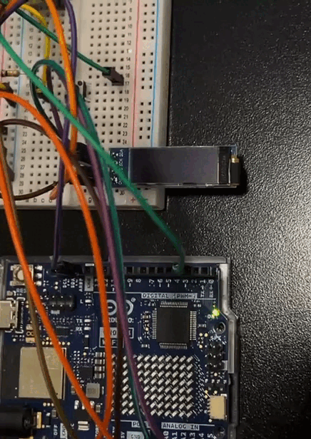
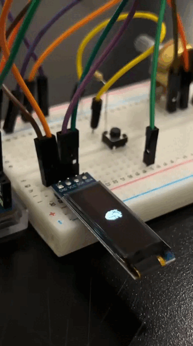
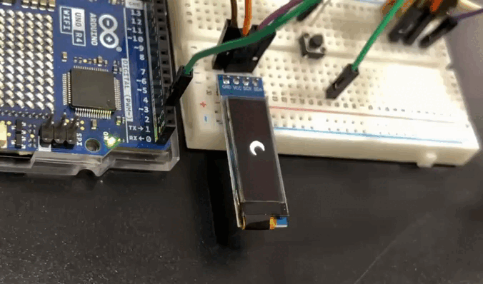
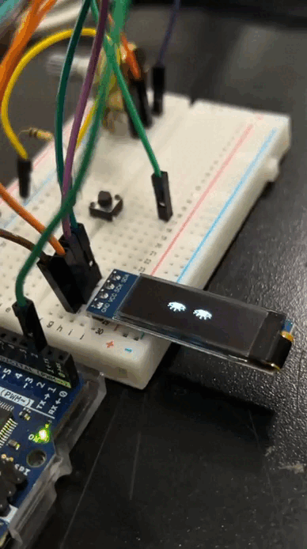

# sesion-04a

## apuntes sesión

**Sesión de trabajo en clases: resolver fotogramas.**

Como queríamos que nuestro caballo pasara corriendo por la pantalla, probamos imágenes, códigos y, entre varias pruebas, logramos que la animación funcionara correctamente. También continuamos con las otras animaciones que queríamos integrar a nuestro proyecto, como el corazón palpitando, los ojos cerrándose y la luna en crecimiento. Buscamos rigurosamente qué imágenes nos funcionaban correctamente y generamos los códigos correspondientes, que están incluidos en nuestro proyecto.

Hubo un pequeño incidente que nos hizo entender de mejor manera la función de los potenciómetros y sus tipos, ya que, por equivocación, continuamos usando un potenciómetro de tipo A, el cual nos estaba funcionando, pero no de la forma correcta, ya que los de tipo A no son lineales. Terminamos cambiándolo por uno de tipo B, que sí es lineal. Fue una lección aprendida.

## lectura

### reading writing interfaces: from the digital to the bookbound

**por lori emerson**

**citas del texto**

“Sin atención a las formas en que las interfaces son cualquier cosa menos invisibles en la forma en que enmarcan lo que puede y no se puede decir…”(Emerson, 2014, p. 1).

"Los seres humanos son criaturas físicas; nos gusta interactuar directamente con objetos. Simplemente estamos conectados de esta manera. Los gestos interactivos permiten a los usuarios interactuar de forma natural con objetos digitales de forma física, como lo hacemos con objetos físicos". (Emerson, 2014, p. 6).

**páginas leidas:** 1 a la 7 

> 💭 **reflexión sobre la lectura**
> En estas primeras páginas del primer capítulo, Emerson comienza a hablar de cómo las interfaces se han vuelto cada vez más invisibles y de que, aunque parezcan simples y fáciles de usar, en realidad son mucho más complejas de lo que vemos. Además, no son tan neutrales como parecen, ya que organizan y condicionan la forma en que hacemos las cosas, leemos y nos comunicamos. Siempre existen decisiones y estructuras detrás de las interfaces que influyen, de una u otra manera, en nuestras acciones. Al hacer que las interfaces sean, entre comillas, “fáciles”, “simples” o “invisibles”, se busca que no nos detengamos a cuestionarlas ni a pensar en lo que hay detrás de ellas, sino que simplemente las usemos.

