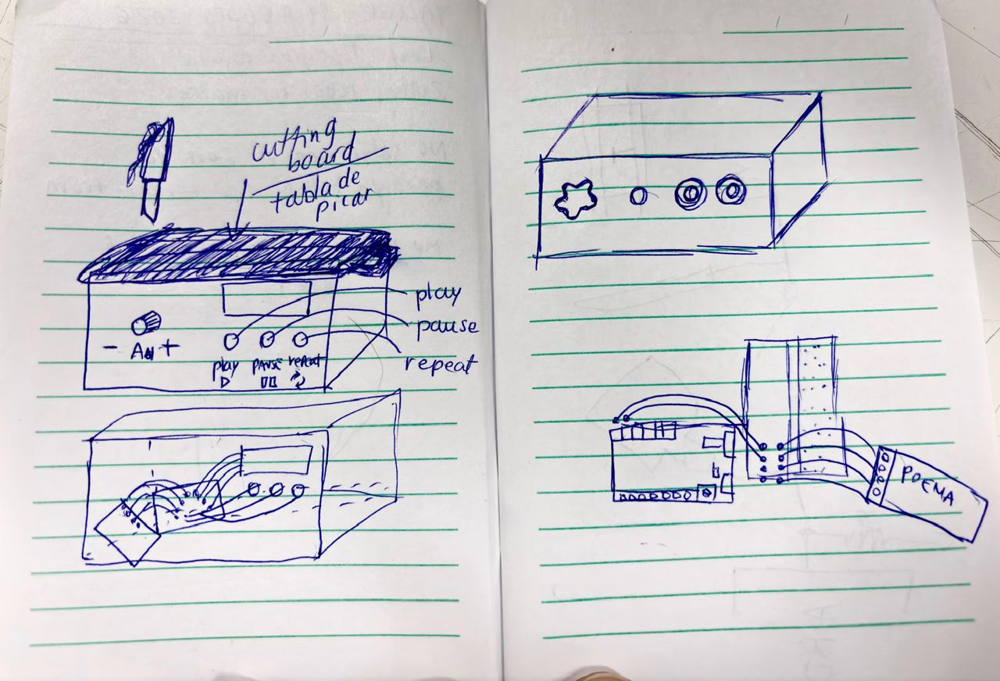

# sesion-04b

## apuntes sesión

Llegamos y como no teníamos las cosas, partimos viendo el diseño de la caja. Pensamos cómo acomodar las cosas y en cómo extender la conexión de la pantalla, todo suena lindo ahora antes de hacerlo, pero HAY QUE HACERLO.

Para el diseño pensamos la pantalla, debajo los tres botones y a un lado el potenciómetro. Queremos que la parte superior sea una tabla de picar, haciendo alusión al poema. (adjunto “boceto”)

El profe nos dio la idea de hacer un botón con la acción de chop, o sea, que el cuchillo tocando la tabla de picar tendría la acción. Tiene que ser metálica toda la conexión (onda con cables). El código queda tal cual porque esto reemplazaría un botón!! Hay que descubrir las logísticas.

Pensamos si sacar el botón repeat, porque tenemos ese, play y pause, para alivianar la carga. Pero no sabíamos si el botón solo pasa electricidad cuando lo apretamos o si es todo el rato. Si es lo primero lo dejamos, pero si es lo segundo hay que alivianar.

Confirmamos que los botones solo pasan electricidad al presionarlos, YY consumen muy poco, así que podemos dejar los tres botones. Y también confirmamos que se puede dejar los botones play - pause, además del cuchillo y la tabla, o sea que cumplan la misma función. (En caso de que la tabla no nos resulte, igual podemos hacer pasar el poema).

  

ELECTRICIDAD

LED = Light Emitting Diode

→ conduce corriente = prende luz.

Mientras más grande la resistencia = menos electrones pasan.

Las resistencias se usan para distintas cosas, pero sigue siendo la misma resistencia.

Cortocircuito = si juntamos positivo y negativo sin control!!

Diferencia de potencia = diferencia de voltaje.

Voltaje = qué tan + o - es uno respecto del otro.

Caudal = la cantidad de electrones.

→ corriente (I)

Resistencia = limitadora de corriente.

Los cables tienen casi cero resistencia, por eso son necesarias.

LEY DE OHM

I = V / R

V = I · R

BOTÓN / SEÑAL

Rising edge → 0 → 1

sube de apagado a prendido.

Falling edge → 1 → 0

baja de prendido a apagado.

int ledActual

int ledAnterior

Esto sirve para comparar el estado actual con el anterior.

PULL DOWN

La resistencia 10K pull down mantiene el estado en 0 cuando el botón no está presionado.

Cuando se presiona → pasa a 5V / 1.

Un interruptor apagado = resistencia infinita ∞.

USB

USB → pasa siempre 5V.

USB-C → pasa lo que el Arduino necesita

→ no tiene un voltaje propio.

ESTADOS DEL BOTÓN

00 = apagado

01 = se prendió

11 = sigue apretado, pero no hará nada a menos que se configure

10 = se apagó

## encargos

## lectura
