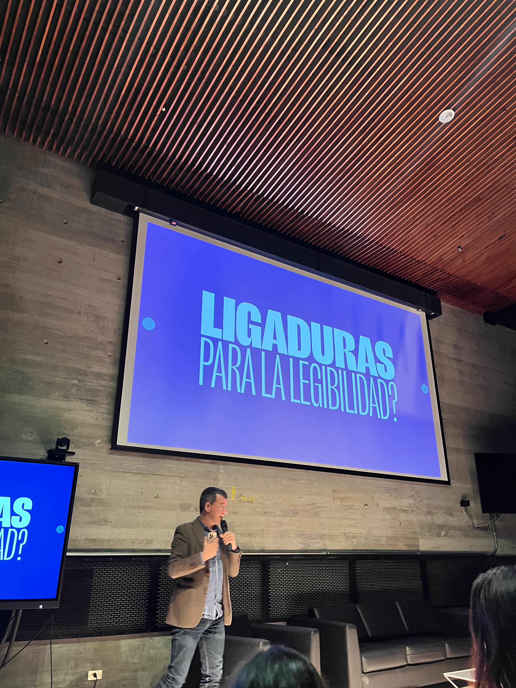
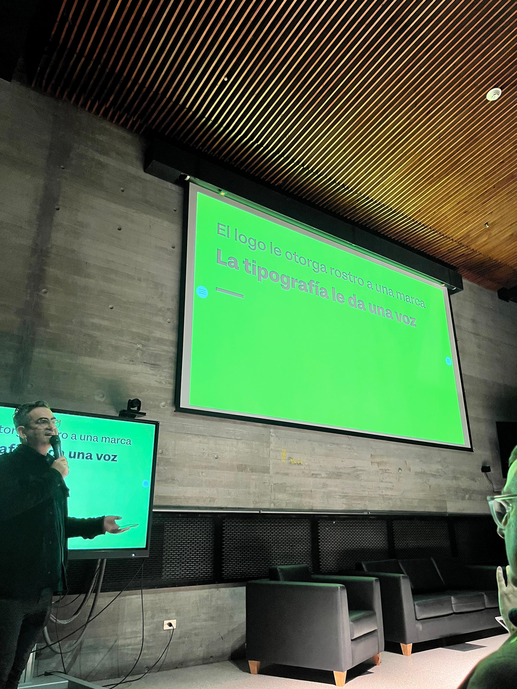
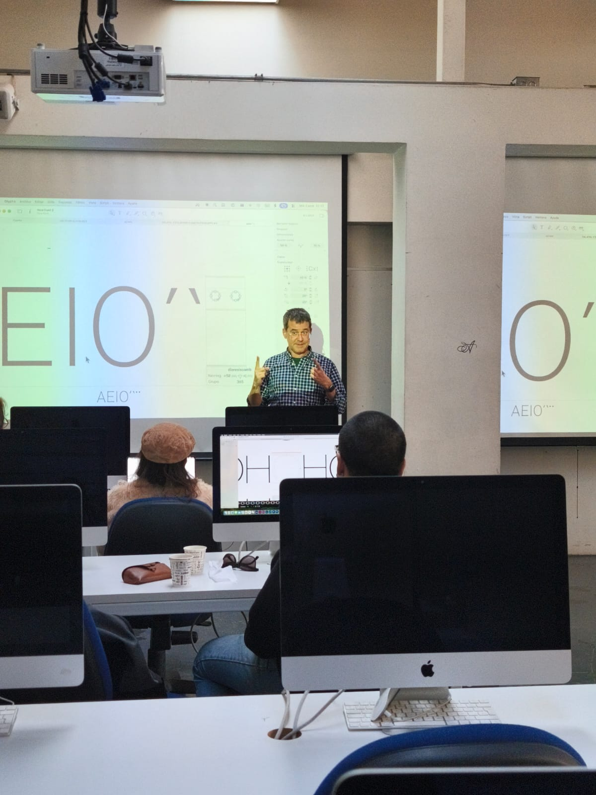
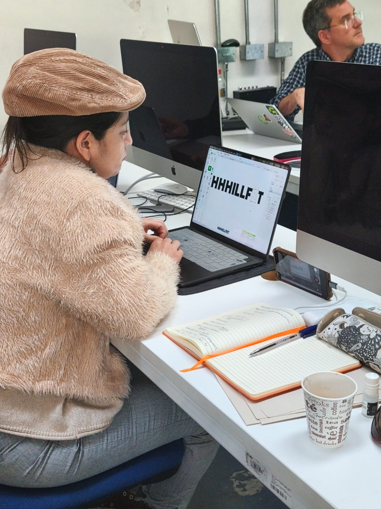
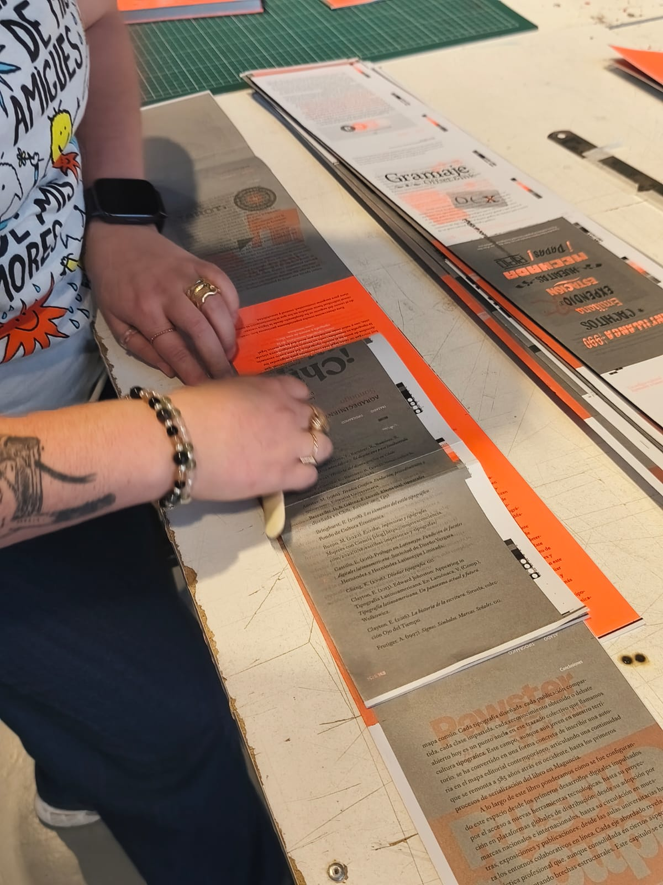
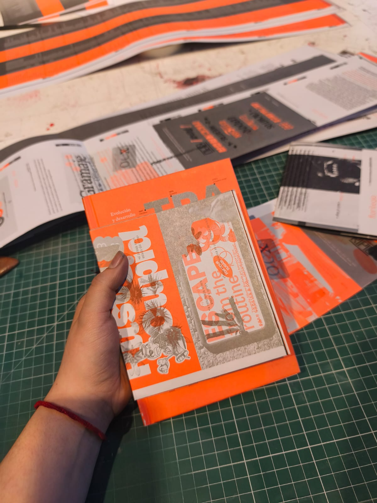
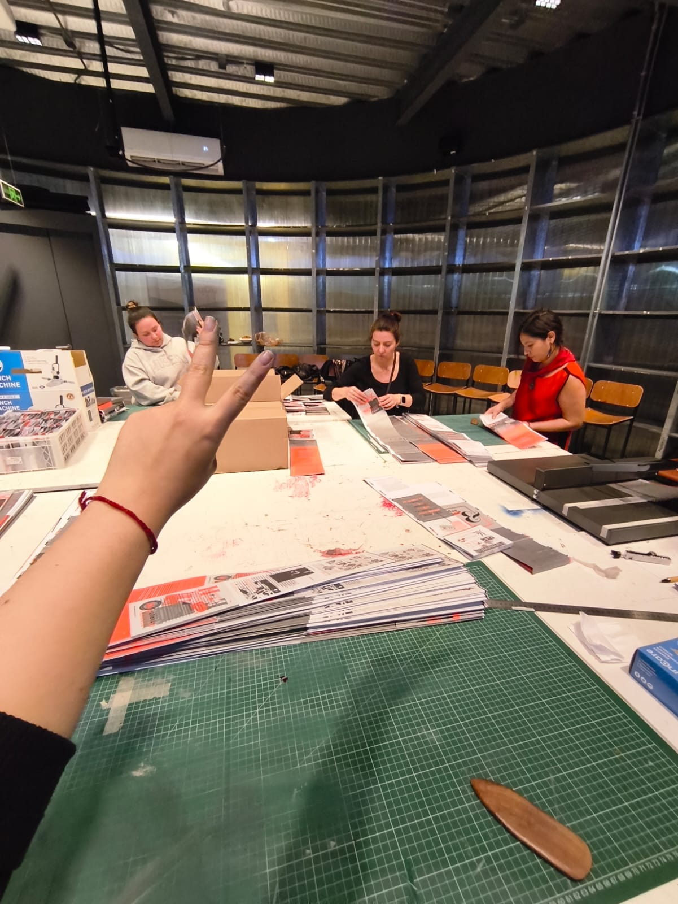
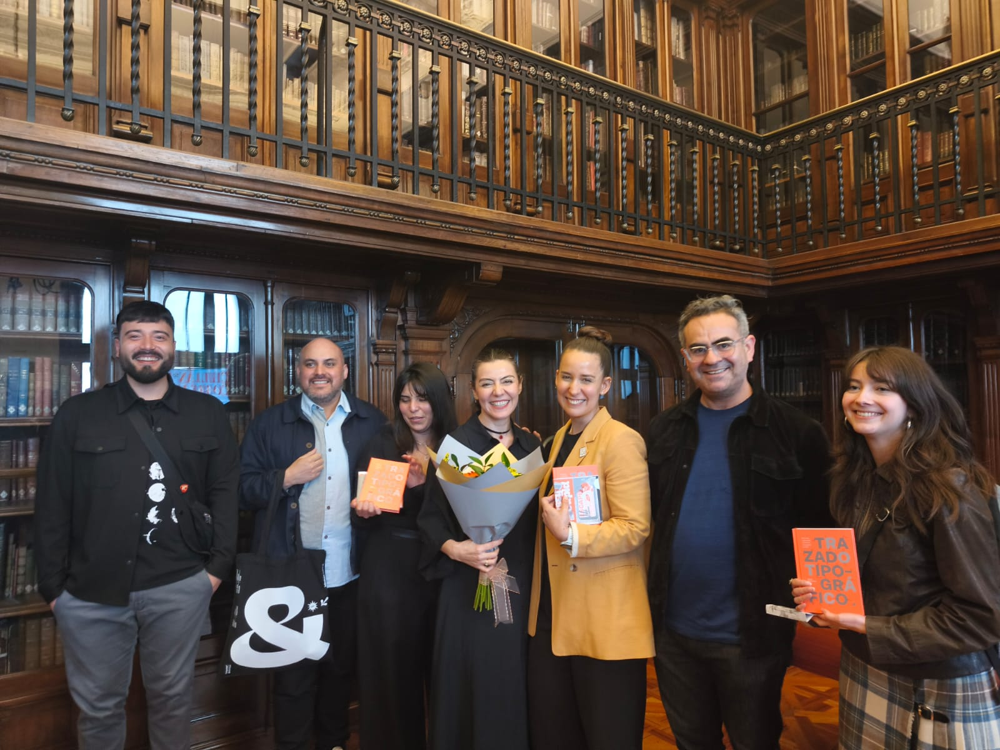
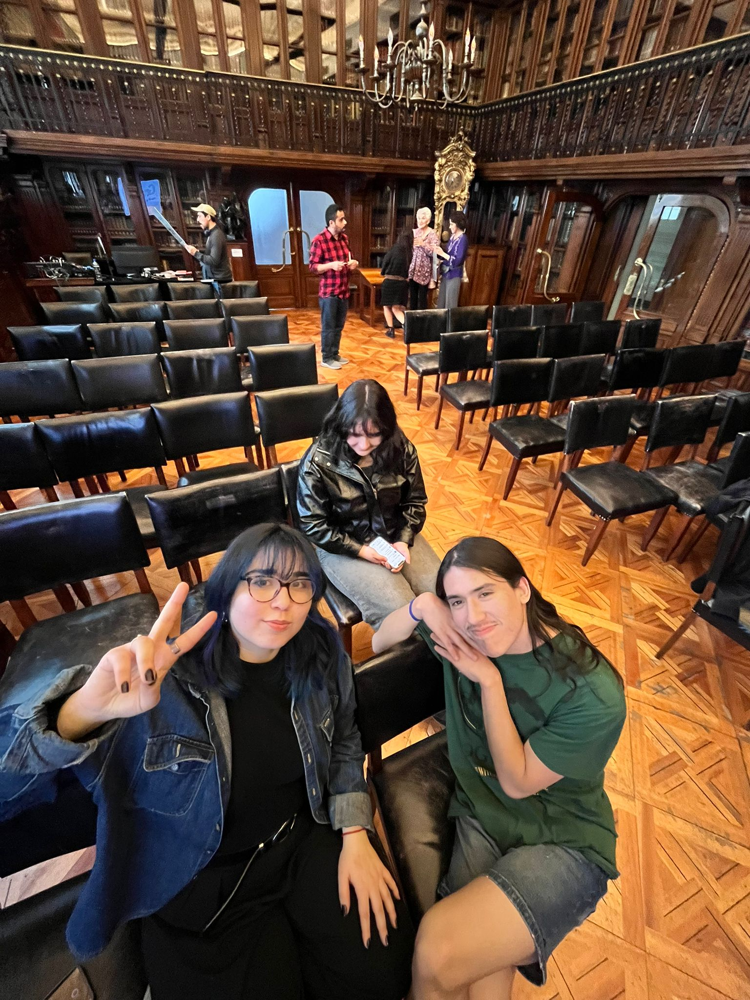

# sesion-04b

## apuntes sesión

## Clase 040926

### pre-clase

El día de hoy no asistí a esta clase ya que fui partícipe de la semana “Republica tipográfica”, donde soy ayudante. Comenzamos el día lunes con la charla inaugural junto a el equipo de latino type, Reiner Scheichelbauer del equipo de Glyphs y Fernanda Aguilera. 

Durante los otros días, fueron dos cursos, uno para docentes sobre Glyphs 4 y el siguiente el curso pagado sobre el mismo finalizando el día sábado. Pero, el día viernes se realizó el lanzamiento del libro “ trazado tipografico” de Guisela “Coto” Mendoza en la Biblioteca Nacional. Para mi, es un gran hito para el mundo tipografico en chile, porque un evento como este sucedio hace 3 años atrás en la Bienal de tipografía en el MUT y que esto se esté realizando en la UDP quiere decir que si hay un interés desde la escuela y que el proximo diplomado de tipografia sea un exito. 

Agradezco nuevamente la flexibilidad de los docentes por darme la libertad en poder participar de estas actividades. 

En simultáneo y no menos importante, era la llegada de Misaa a la clase, se que conversaron de varias cosas, utilizaron mucho la pizarra para las explicaciones y trajo dulces para compartir. 

<table>
  <tr>
    <td></td>
    <td></td>
    <td></td>
  </tr>
  <tr>
    <td></td>
    <td></td>
    <td></td>
  </tr>
  <tr>
    <td></td>
    <td></td>
    <td></td>
  </tr>
</table>

### clase

Agradezco mucho a mi compañero Tomás por asistir a la clase de hoy. Como equipo decidimos que lo que él decidiera hoy, nosotros seguimos lo que él nos mencionara y que tomara decisiones. El avanzó en ciertas cosas y tuvo una muy buena idea de agregar motores para representar una parte de nuestro poema. 

## encargos

### post-clase

El día sábado nos juntamos para realizar ciertas cosas que nos faltaban y tomar las últimas decisiones. 

Tomás nos contaba que utilizó unos motores que él tenía y que nos ayudaría a representar la parte del caos que en nuestro poema habla. 

## lectura
