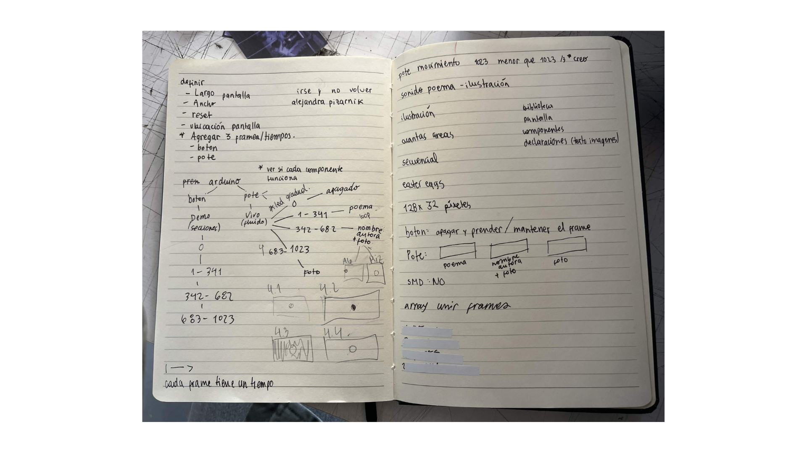
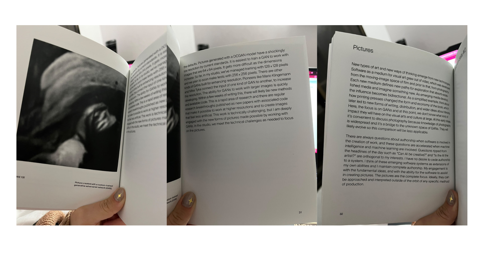

# sesion-04a

## apuntes sesión
En esta clase parte del desafío fue darle forma y ordenar nuestras ideas, porque teníamos muchas propuestas y no sabíamos bien cuáles elegir ni cómo llevarlas a cabo. 
El primer paso fue entender el código, identificar qué debíamos agregar y cómo hacerlo. Aun así, seguíamos explorando referentes y nuevas opciones LED, sensores, botones, potenciómetros. Sentíamos que eran demasiadas posibilidades y todavía no teníamos claro cómo integrarlas.

De a poco empezamos a aterrizar lo que realmente queríamos lograr. El grupo fue creciendo y con ello llegaron nuevas ideas y miradas que nos ayudaron a definir mejor el proyecto. Nos quedamos después de clases para avanzar y concretar decisiones, y realizamos un boceto que nos permitió visualizar lo que estábamos discutiendo.

Aunque fue difícil organizarnos, paso a paso logramos ordenar el proceso y darle dirección al trabajo:)))))

## lectura

“This work is technically challenging, but I am deeply engaged in the new forms of pictures made possible by working with GANs.”(pág31)

Dice que aunque es difícil, lo motiva la posibilidad de hacer imágenes nuevas con GANs.Me gusta porque muestra que el esfuerzo técnico vale la pena si te abre caminos creativos distintos.

“Can AI be creative? … I have no desire to cede authorship to a system.”(pág32)  
Aquí deja claro que la IA no es artista, la autoría sigue siendo humana. Estoy de acuerdo, porque sin intención humana lo que hace la máquina se siente vacío.  

La IA y las GANs son herramientas que expanden la creatividad, pero el artista sigue siendo el que da sentido. Y yo creo que esa mezcla de técnica y sensibilidad es lo que hace que el arte de hoy sea potente.

