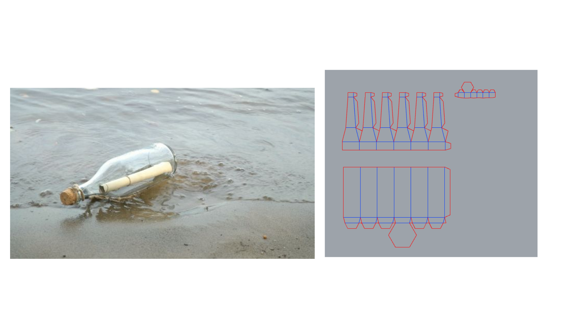

# sesion-04b

## apuntes sesión
# Proyecto: Puerto Adelante
En esta sesión logramos reunirnos todos los integrantes del grupo. La comunicación fue fluida y, aunque trabajamos contra el tiempo, decidimos repensar el proceso para quedar satisfechos con el resultado. A partir de una **bajada conceptual del poema**, surgieron las imágenes del mar, el puerto, la soledad y un barco. De ahí nació la idea central: una animación de un velero que simboliza el acto de alejarse del lugar de origen, o la ilusión de que la embarcación se escapa de la pantalla hacia otro horizonte.

## Poema utilizado
> *"Irse y no volver..."*  
> Fragmento del poema **Puerto adelante** de Alejandra Pizarnik.

Este verso fue el eje poético del proyecto, marcando la idea de partida, distancia y memoria.

## Interacción con el circuito

### Modo potenciómetro
- La posición de la perilla determina qué pantalla se muestra.  
- Al inicio aparecen las palabras del poema *Puerto Adelante*.  
- Finalmente se despliega la animación del barco navegando en el agua.  

### Modo demo (botón)
- Al presionar el botón, se activa un recorrido automático.  
- El poema y la animación se suceden a una velocidad que permite leer el texto cómodamente.  
- Este ciclo se repite en bucle hasta que se vuelve a presionar el botón, momento en que el sistema regresa al modo potenciómetro.  

## Animación y narrativa visual
- Se diseñaron **cuatro imágenes de un velero en movimiento**, transmitiendo la sensación de avance sobre el mar.  
- Nos dividimos las tareas: código, carcasa, diagrama de flujo y documentación.  

### Elementos destacados
- **Movimiento del mar**: se enfatizó la oscilación y fragilidad de las olas, en sintonía con el poema.  
- **Carcasa**: concebida como un objeto frágil y vulnerable, evocando tanto la debilidad humana como los mensajes que antiguamente se enviaban en botellas arrojadas al mar.  
- **Diagrama de flujo**: se revisó la interacción entre potenciómetro y botón, asegurando claridad y funcionalidad.  
- **Poema y legalidad**: se discutió cómo incorporar el texto sin caer en problemas de derechos, buscando un uso respetuoso y creativo.  

