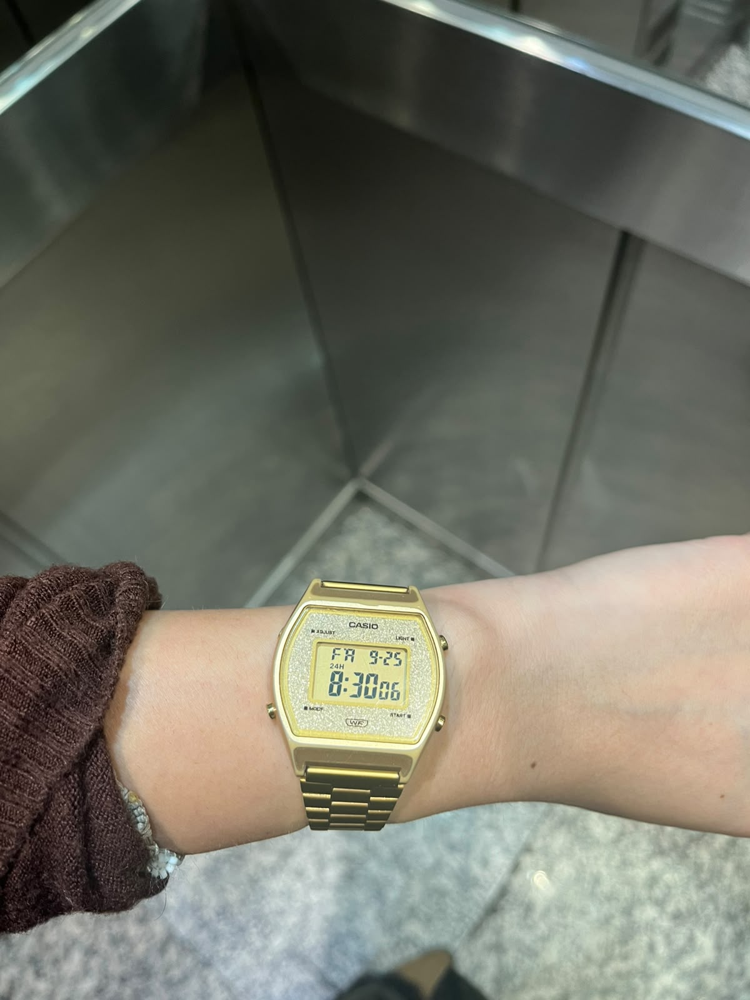
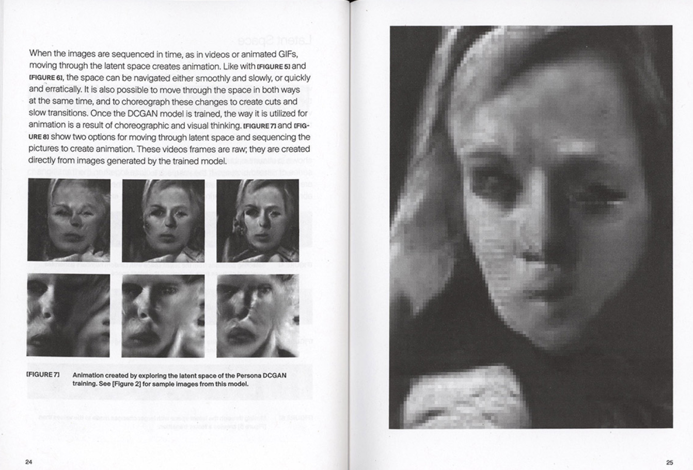

# sesion-06a

## apuntes sesión

La idea principal es entender que un objeto tiene:

- **datos**
- **acciones**

Los datos describen cómo es el objeto y las acciones indican qué puede hacer.


## Variables

Una **variable** sirve para guardar información.

### Tipos vistos

- `bool`: verdadero o falso → `true / false`
- `int`: números enteros
- `uint`: números enteros positivos o 0


## Clases

Una **clase** es como un molde.

Define qué características y acciones tendrán los objetos que pertenecen a esa clase.

Dentro de una clase tenemos:

- **atributos** → características
- **métodos** → acciones

### Para recordar

**Atributo = lo que tiene o cómo es.**

**Método = lo que hace.**


## Clase y objeto

La **clase** es la idea general.

El **objeto** es un individuo concreto creado a partir de esa clase.

### Ejemplo del perro

Podemos tener:

```text
Animal
↓
Perrito
↓
Poodle
```

`Perrito` puede ser una clase general y `Poodle` una clase más específica.

Después podemos tener distintos objetos:

- Copito → corto de genio
- Pelusa → dormilona

Aunque ambos sean perros, cada uno puede tener valores distintos en sus atributos.

### Ejemplo en código

```cpp
class Perrito {

    bool hambre = true;
    bool durmiendo = false;
    int edad = 4;

    void comer();
    void dormir();
    void ladrar();
};
```

En este ejemplo:

**Atributos:**

- hambre
- durmiendo
- edad

**Métodos:**

- comer()
- dormir()
- ladrar()


## Atributo y valor

No hay que confundir el atributo con su valor.

Ejemplo:

```cpp
colorAuto = "rojo";
```

- atributo → `colorAuto`
- valor → `"rojo"`

Otro ejemplo:

```cpp
puertaAbierta = true;
```

- atributo → `puertaAbierta`
- valor → `true`

También:

```cpp
cantidadRuedas = 4;
```

- atributo → `cantidadRuedas`
- valor → `4`

El **atributo** es la característica y el **valor** es la información concreta que tiene ese atributo.


## Métodos

Los métodos representan **acciones que puede realizar un objeto**.

También pueden consultar o modificar sus atributos.

Ejemplos:

```cpp
void saltar();
void abrirPuerta();
void cambiarCanal();
void subirVolumen();
```

También pueden recibir información:

```cpp
void caminar(int velocidad, int distancia);
```

`velocidad` y `distancia` indican de qué forma se realizará la acción.

Otro ejemplo:

```cpp
void cambiarColor(string nuevoColor);
```

Este método puede modificar el valor del atributo `color`.


## Forma de escribir

Generalmente:

- clases → empiezan con mayúscula
- atributos y métodos → empiezan con minúscula
- si hay varias palabras → se juntan usando mayúsculas

Ejemplo:

```text
Perrito
colorPelaje
estaDurmiendo
cambiarColor
```

`Perrito` y `perrito` no son lo mismo para el computador.


## Ejemplo Minecraft

En Minecraft los objetos pueden tener características y comportamientos.

Por ejemplo, la arena puede:

```text
caer()
```

Otros objetos podrían:

```text
explotar()
encenderse()
romperse()
```

La idea es:

- atributos → describen el objeto
- métodos → indican lo que puede hacer


# Encargo

## Categorías de Aristóteles — Reloj digital Casio

### 1. Sustancia

Reloj digital de pulsera Casio, formado por una caja, una pantalla y una correa. Lo uso principalmente para saber la hora.

### 2. Cantidad

Es pequeño, liviano y tiene una correa ajustable. En su pantalla aparecen horas, minutos y segundos.

### 3. Cualidad

Es dorado, con brillitos, de estilo retro y con pantalla digital. También es cómodo para usarlo durante el día.

### 4. Relación

Tiene una relación directa conmigo porque lo utilizo todos los días para organizarme.

Además, me lo regaló mi hermana cuando cumplí 19 años, por lo que tiene valor sentimental.

Lo tengo dos minutos adelantado para intentar no llegar tarde, aunque a veces igual llego tarde(ups).

### 5. Lugar

Generalmente está en mi muñeca. Lo llevo conmigo a la universidad, a mi casa y a distintos lugares.

### 6. Tiempo

Lo utilizo todos los días y me ayuda a saber cuánto tiempo tengo para hacer algo o llegar a algún lugar.

### 7. Posición

Normalmente está puesto alrededor de mi muñeca con la pantalla hacia arriba.

Cuando no lo uso, suele quedar sobre mi velador.

### 8. Posesión

El reloj me pertenece y es un objeto que utilizo diariamente.

### 9. Acción

El reloj puede realizar distintas acciones:

- contar el paso de los segundos;
- actualizar la hora;
- activar una alarma;
- iluminar la pantalla.

### 10. Pasión

Se refiere a las acciones que el reloj recibe.

- presiono sus botones;
- ajusto su correa;
- cambio su configuración;
- lo pongo o saco de mi muñeca.

## lectura



> “Moving through the latent space creates animation.”

Las imágenes que genera una GAN no están necesariamente aisladas. El modelo organiza distintas características visuales dentro de un **espacio latente**, y al desplazarse de un punto a otro se pueden generar imágenes intermedias.

Cuando esas imágenes se muestran de manera consecutiva, se produce una **animación**.
 la animación se construye explorando las posibilidades que existen dentro del modelo

Siento que acá cambia un poco la idea de crear, porque el artista no controla cada imagen directamente, sino que descubre resultados y decide cuáles utilizar.


> “The space can be navigated either smoothly and slowly, or quickly and erratically.”


Reas plantea que el espacio latente se puede recorrer de distintas maneras.

Un movimiento lento puede producir transformaciones progresivas entre las imágenes, mientras que un movimiento rápido puede generar cambios más bruscos o inesperados.

Por eso, el resultado depende no solo de la inteligencia artificial, sino también de **cómo el creador decide explorarla**.

Me parece interesante porque demuestra que la IA no hace todo sola.

Aunque el modelo genera las imágenes, **hay decisiones humanas detrás del ritmo, las transiciones y la selección de los resultados**.

un espacio que se puede explorar visualmente.

Al recorrer el espacio latente aparecen rostros y formas que se van transformando, y esas transformaciones incluso pueden convertirse en video o animación.

Esa mezcla entre algo familiar y algo artificial.
