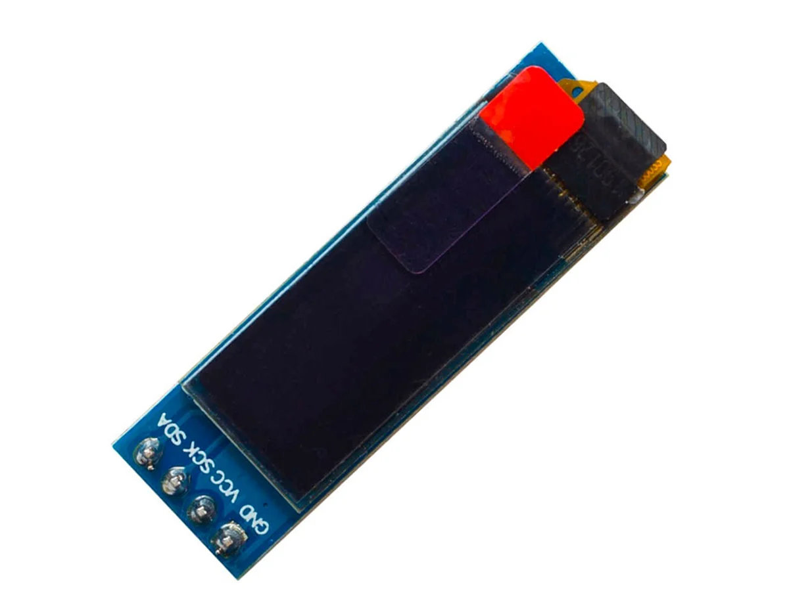
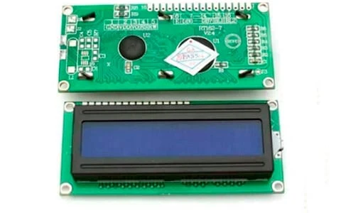

# sesion-04a

## apuntes sesión

## martes 01-09-2026

Esta sesión fue mayormente de trabajo en el proyecto:

Las primeros días estaba muy confundida en cuánto a empezar a escribir el código, debido a que aún no definía que funciones íbamos a utilizar. Y faltaba agregar uno que otro paso específico a la coreografía de cosas que iban a pasar.

En esta sesión ya teníamos mejor definida la coreografia.

### *poema-licencias-proyecto*

Nosotras nos habíamos encontrado primero con un poema de Victoria Ramirez Mansilla, una poeta contemporánea chilena, sin embargo, existen limitaciones con usar poemas que se encuentran sujetos a derechos de autor. a partir de este poema nosotras ya habíamos definido algunas acciones que queríamos que sucedieran en la pantalla. pero tuvimos que elegir otro poema, que sí estuviera en dominio público, e integramos de todas maneras algunas de las ideas principales que teníamos, como que el texto avance en la pantalla como carrusel o carrete de película de forma horizontal, o por ejemplo, tomar una palabra clave de cada verso y realizar algo distinto con ello.

- el siguiente poema que elegimos fue Soneto 22 de Elizabeth Barret Browning, poema escrito en el 1846 y que se encuentra en dominio público.  

**Soneto 22 "When our two souls stand up erect and strong"**

*When our two souls stand up erect and strong,*

*Face to face, silent, drawing nigh and nigher,*

*Until the lengthening wings break into fire*

*At either curvèd point,—what bitter wrong*

*Can the earth do to us, that we should not long*

*Be here contented? Think. In mounting higher,*

*The angels would press on us and aspire*

*To drop some golden orb of perfect song*

*Into our deep, dear silence. Let us stay*

*Rather on earth, Belovèd,—where the unfit*

*Contrarious moods of men recoil away*

*And isolate pure spirits, and permit*

*A place to stand and love in for a day,*

*With darkness and the death-hour rounding it.*

- las traduciones también pueden estar sujetas a derechos de autor, por lo que tomamos la decisión de traducir el poema por nuestra cuenta.

- también definir cómo es que queremos que se reproduzca el proyecto: nosotras optamos por la licencia de Creative Commons.

---

Decidimos cambiar la pantalla que nos entregaron en la primera clase: el **Módulo de pantalla OLED 0,91" I2C.**

**Características principales de esta pantalla:**

* Tamaño de pantalla: 0.91 pulgadas
* Resolución: 128 × 32 píxeles
* Color: Blanco sobre fondo negro (OLED monocromo)
* Dimensiones del módulo: 38 × 12 mm
* Controlador: SSD1306
* Interfaz: I2C (4 pines, VCC, GND, SCL, SDA). No compatible con SPI. 
* Voltaje de operación: 3.3 V – 5 V

Y la cambiamos por esta otra: **Pantalla LCD Azul 16x02**

**Características principales de esta pantalla:**

* Formato de Pantalla: 16 caracteres por 2 líneas.
* Controlador: SPLC780D1 o compatible con HD44780, el estándar de la industria.
* Voltaje de Operación: 5V DC.
* Retroiluminación (Backlight): LED de color azul con caracteres blancos.
* Interfaz: Paralela, configurable para operación de 4 bits u 8 bits.
* Tipo de Pantalla: STN (Super-twisted Nematic) de tipo negativo.
* Rango de Temperatura de Operación: -10°C a 60°C.

Los principales motivos por los que decidimos cambiar de pantalla fue por que no tenemos la intención de realizar animaciones y también que las cosas que queríamos hacer con el texto serían más notorias en una pantalla de superior tamaño.

## encargos

## lectura
