# sesion-04a → 31/08/26

## apuntes sesión

Avanzar en clase el proyecto-01 

Carpeta código proyecto-01

Estamos motivadas en mostrar una animación en la pantalla y ver como funcionaria el código para visualizar el poema en la pantalla, pero que aun no haga nada, hare diferentes ejemplo con el poema, me estoy ayudando con claude y gemeni para entender las funciones y el cómo funcionaria el código :)

- La ñ sera remmplazada por n

- no ocupar ino: sólo es lenguaje de arduino

---

### Código 1 → 28/08

visualiza el poema en el serial monitor en loop

código visto en clase y modificado con nuestros versos del  poema "queja"


```cpp
// poema "queja"
// de allfonsina storni

// Señor, mi queja es ésta,
// Tú me comprenderás;
// De amor me estoy muriendo,
// Pero no puedo amar.
// Persigo lo perfecto
// En mí y en los demás,
// Persigo lo perfecto
// Para poder amar.
// Me consumo en mi fuego,
// ¡Señor, piedad, piedad!
// De amor me estoy muriendo,
// ¡Pero no puedo amar.

char *misVersos[] = {
  "Señor, mi queja es ésta,",
  "Tú me comprenderás",
  "De amor me estoy muriendo,",
  "Pero no puedo amar.",
  "Persigo lo perfecto",
  "En mí y en los demás,",
  "Persigo lo perfecto",
  "Para poder amar.",
  "Me consumo en mi fuego,",
  "¡Señor, piedad, piedad!",
  "De amor me estoy muriendo,",
  "¡Pero no puedo amar!"
};

void setup() {
  // put your setup code here, to run once:
  Serial.begin(9600);
}

void loop() {

  // recorrer el arreglo
  // for es para recorrer conjuntos
  // adentro tiene 3 mini lineas
  // inicio de los tiempos
  // oye pero cuando paro
  // que hago despues de cada iteracion
  for (int i = 0; i < 5; i++) {
    Serial.println(misVersos[i]);
  }
}
```


REGISTRO EN SERIAL MONITOR


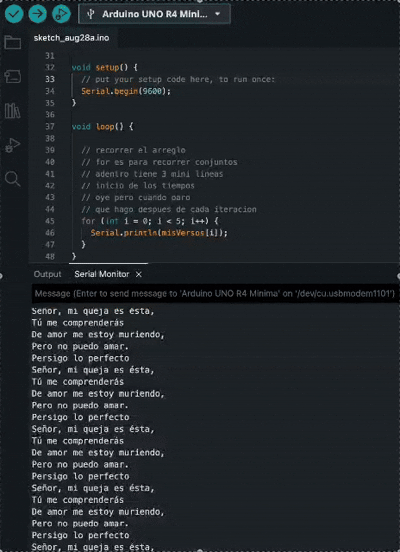


---


### Código 2 → 01/09

Conexión física de la Pantalla LCD Oled 0,91" I2C:

SCK/SCL → reloj (cable azul)

SDA → datos (cable verde)

GND → tierra (cable negro)

VCC → voltaje (cable rojo)

La parte que efectivamente "proyecta" el poema en la pantalla es la función mostrarVerso(), específicamente estas líneas:

```cpp
display.clearDisplay();      // Borra lo que estaba dibujado antes
display.setCursor(0, 0);     // Posiciona el cursor en x=0, y=0 (primera línea, arriba)
display.println(linea1);     // Escribe la primera línea (println además baja el cursor)
display.setCursor(0, 12);    // Mueve el cursor a x=0, y=12 (segunda línea, más abajo)
display.println(linea2);     // Escribe la segunda línea (vacía si no hizo falta cortar)
display.display();           // Envía todo el contenido al panel físico para que se vea
```

Cada vuelta del for toma un verso del arreglo, se lo pasa a mostrarVerso(), y esa función repite el ciclo borrar → escribir en buffer → enviar a pantalla para ese verso. Por eso el poema aparece verso por verso, cada 2.5 segundos, en bucle infinito.

```cpp
for (int i = 0; i < totalVersos; i++) {
    mostrarVerso(versosPantalla[i]); // <- acá se dispara todo el proceso de arriba
    Serial.println(misVersos[i]);
    delay(2500);
}
```

Código 2 completo:

Entra en un ciclo eterno donde muestra el poema "Queja" de Alfonsina Storni verso por verso, cambiando cada 2.5 segundos.

```cpp
// ================================================================
// Poema "Queja" de Alfonsina Storni
// Sketch para mostrar el poema en pantalla OLED 0,91" I2C (128x32)
// usando Adafruit_GFX + Adafruit_SSD1306
// ================================================================

#include <Wire.h>              // Maneja la comunicación I2C entre el Arduino y la pantalla
#include <Adafruit_GFX.h>      // Librería base de gráficos (dibuja texto, líneas, formas)
#include <Adafruit_SSD1306.h>  // Librería específica para el chip controlador SSD1306 de la OLED
#include <string.h>            // Nos da funciones para manejar texto: strlen, strcpy, strncpy

// Definimos el tamaño de la pantalla en píxeles (ancho x alto)
#define SCREEN_WIDTH 128
#define SCREEN_HEIGHT 32

// -1 significa que la pantalla comparte el pin de reset con el Arduino
// (no usa un pin de reset propio)
#define OLED_RESET -1

// Dirección I2C típica de estos módulos OLED (si no funciona, probar 0x3D)
#define SCREEN_ADDRESS 0x3C

// Creamos el objeto "display" que representa nuestra pantalla física,
// indicando ancho, alto, el bus I2C a usar (&Wire) y el pin de reset
Adafruit_SSD1306 display(SCREEN_WIDTH, SCREEN_HEIGHT, &Wire, OLED_RESET);

// Arreglo con los versos ORIGINALES (con tildes), que se usan
// para imprimir el poema completo y correcto en el Monitor Serie
char *misVersos[] = {
  "Señor, mi queja es ésta,",
  "Tú me comprenderás",
  "De amor me estoy muriendo,",
  "Pero no puedo amar.",
  "Persigo lo perfecto",
  "En mí y en los demás,",
  "Persigo lo perfecto",
  "Para poder amar.",
  "Me consumo en mi fuego,",
  "¡Señor, piedad, piedad!",
  "De amor me estoy muriendo,",
  "¡Pero no puedo amar!"
};

// Arreglo con los mismos versos SIN tildes ni signos especiales,
// porque la fuente por defecto de Adafruit_GFX no los dibuja bien
char *versosPantalla[] = {
  "Senor, mi queja es esta,",
  "Tu me comprenderas",
  "De amor me estoy muriendo,",
  "Pero no puedo amar.",
  "Persigo lo perfecto",
  "En mi y en los demas,",
  "Persigo lo perfecto",
  "Para poder amar.",
  "Me consumo en mi fuego,",
  "Senor, piedad, piedad!",
  "De amor me estoy muriendo,",
  "Pero no puedo amar!"
};

// Cantidad total de versos (para no tener que contarlos a mano en el for)
const int totalVersos = 12;

// setup() se ejecuta UNA sola vez, al encender o resetear la placa
void setup() {
  Serial.begin(9600); // Inicia la comunicación serial a 9600 baudios

  // Intenta inicializar la pantalla. SSD1306_SWITCHCAPVCC le dice que
  // genere su propio voltaje interno para el panel OLED
  if (!display.begin(SSD1306_SWITCHCAPVCC, SCREEN_ADDRESS)) {
    Serial.println(F("Error al iniciar la pantalla OLED")); // Si falla, avisa por Serial
    for (;;);   // Bucle infinito vacío: detiene el programa acá si la pantalla no arrancó
  }

  display.clearDisplay();       // Borra cualquier contenido inicial de la pantalla
  display.setTextSize(1);       // Tamaño de letra: 1 = el más chico (6x8 px por caracter aprox)
  display.setTextColor(SSD1306_WHITE); // Color del texto (en OLED monocromo, "blanco" = encendido)
}

// loop() se ejecuta UNA Y OTRA VEZ, sin parar
void loop() {
  // Recorremos ambos arreglos en paralelo usando el mismo índice i
  for (int i = 0; i < totalVersos; i++) {
    mostrarVerso(versosPantalla[i]); // Muestra en la OLED la versión sin tildes
    Serial.println(misVersos[i]);    // Imprime por Serial la versión completa con tildes
    delay(2500);                     // Espera 2.5 segundos antes del siguiente verso
  }
  // Al terminar el for (mostró los 12 versos), loop() arranca de nuevo desde el principio
}

// Función que recibe un verso y lo dibuja en pantalla,
// partiéndolo en dos líneas si no entra completo en el ancho disponible
void mostrarVerso(char *verso) {
  char linea1[35] = ""; // String vacío donde armamos la primera línea
  char linea2[35] = ""; // String vacío donde armamos la segunda línea (si hace falta)

  int len = strlen(verso); // Cantidad de caracteres del verso
  int maxChars = 21;       // Caracteres aprox. que entran en 128px con fuente tamaño 1

  if (len <= maxChars) {
    // Si el verso entra en una sola línea, lo copiamos completo a linea1
    strcpy(linea1, verso);
  } else {
    // Si es más largo, buscamos dónde cortarlo
    int corte = maxChars;

    // Retrocedemos desde el límite hasta encontrar un espacio,
    // para no cortar una palabra por la mitad
    while (corte > 0 && verso[corte] != ' ') corte--;

    // Si no hay ningún espacio antes del límite, cortamos igual ahí
    if (corte == 0) corte = maxChars;

    strncpy(linea1, verso, corte); // Copia los primeros "corte" caracteres a linea1
    linea1[corte] = '\0';          // Cierra el string (fin de cadena en C)

    strcpy(linea2, verso + corte + 1); // Copia el resto del verso (después del espacio) a linea2
  }

  display.clearDisplay();      // Borra lo que estaba dibujado antes
  display.setCursor(0, 0);     // Posiciona el cursor en x=0, y=0 (primera línea, arriba)
  display.println(linea1);     // Escribe la primera línea (println además baja el cursor)
  display.setCursor(0, 12);    // Mueve el cursor a x=0, y=12 (segunda línea, más abajo)
  display.println(linea2);     // Escribe la segunda línea (vacía si no hizo falta cortar)
  display.display();           // Envía todo el contenido al panel físico para que se vea
}
```


FOTO Y GIF CÓDIGO FUNCIONANDO


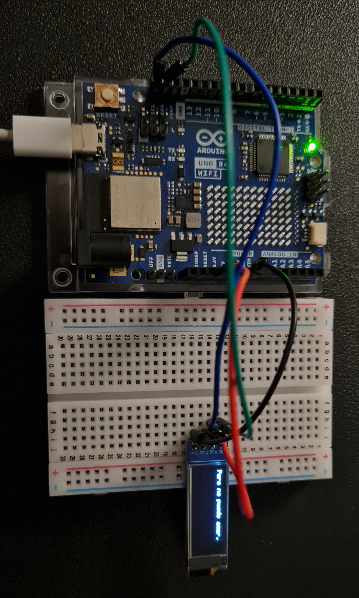

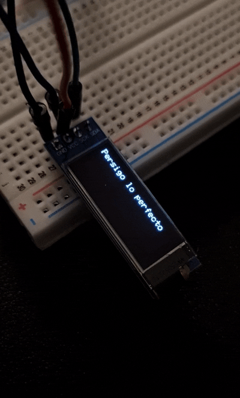


Para continuar nos preguntamos que queriamos que apareciera especificamente y se nos ocurrieron varias cosas.

- Potenciometro B10K: cambiar la velocidad del poema al mover la perilla

- El poema ya vendrá con ciertas palabras en grande cómo si estuvieran gritando, seran palabras que hablen del poema y representen su intensidad

Opciones Botón: 

- cambio de dirección del poema (abajo hacia arriba → derecha a izquierda)
  
- pausar el poema
  
- filtra las partes intensas y las convierte en negativo


Agregar animaciones :)

bitmaps para transformar imagenes a código: <https://tools.stonez56.com/u8g2/getBitmap.php>

OPCIONAL SOLO SI LOGRAMOS QUE LO ANTERIOR FUNCIONE!!! -_-


---


### Código 3 → 02/09

Agregar al código:

las palabras en grande cómo si estuvieran gritando, seran palabras que hablen del poema y representen su intensidad.

// agrandar la palabra “queja” 

  "Señor, mi queja es ésta,",
  
  "Tú me comprenderás",
  
// agrandar la palabra “muriendo” 

  "De amor me estoy muriendo,",
  
  "Pero no puedo amar.",}

  
// agrandar la palabra “persigo” 

  "Persigo lo perfecto",
  
  "En mí y en los demás,",
  
// agrandar la palabra “perfecto” 

  "Persigo lo perfecto",
  
  "Para poder amar.",
  

// agrandar la palabra “consumo” 

  "Me consumo en mi fuego,",
  
// agrandar las palabras “Piedad, piedad!” 

  "¡Señor, piedad, piedad!",
  
  "De amor me estoy muriendo,",
  
// agrandar las palabras “amar!” 

  "¡Pero no puedo amar!"

No, no existe una bibliotecas que haga esto de forma automática. Ni Adafruit_GFX, ni U8g2, ni ninguna otra biblioteca, para estas pantallas OLED chiquitas soporta "texto enriquecido" (como en HTML, donde le digo que una palabra va en negrita o más grande y ella se encarga sola de acomodar todo).

La razón es que estas pantallas trabajan a nivel de píxeles, no de texto como un procesador de palabras.

setTextSize() o setFont() →  elegir el tamaño/fuente antes de imprimir algo.

setCursor(x, y) →  para decir dónde arranca ese texto.

print() o drawStr() →  para dibujarlo ahí.


Partes nuevas que agregué al código anterior:

Nuevo arreglo: qué palabra agrandar en cada verso


```cpp
char *palabraGrande[] = {
  "queja",      // Verso 0 ("Señor, mi queja es ésta,") -> se agranda "queja"
  "",           // Verso 1 -> string vacío = ninguna palabra se agranda
  "muriendo",   // Verso 2 -> se agranda "muriendo"
  "",           // Verso 3 -> ninguna
  "persigo",    // Verso 4 -> se agranda "persigo"
  "",           // Verso 5 -> ninguna
  "perfecto",   // Verso 6 -> se agranda "perfecto"
  "",           // Verso 7 -> ninguna
  "consumo",    // Verso 8 -> se agranda "consumo"
  "piedad",     // Verso 9 -> se agranda "piedad" (coincide con las dos apariciones)
  "",           // Verso 10 -> ninguna
  "amar"        // Verso 11 -> se agranda "amar"
};
// Este arreglo tiene el MISMO orden e índices que versosPantalla[],
// para que palabraGrande[i] siempre corresponda a versosPantalla[i]
```


Nueva función: limpiar una palabra para poder compararla

```cpp
void limpiarPalabra(char *origen, char *destino) {
  int j = 0; // contador de posición donde vamos escribiendo en "destino"

  for (int i = 0; origen[i] != '\0'; i++) {  // recorremos "origen" letra por letra hasta el final del string
    if (isalpha(origen[i])) {                 // isalpha() pregunta: ¿este caracter es una letra? (descarta , . ! ¡)
      destino[j++] = tolower(origen[i]);       // si es letra, la pasamos a minúscula y la copiamos a "destino"
    }                                          // el "j++" avanza la posición para la próxima letra válida
  }

  destino[j] = '\0'; // agregamos el caracter nulo al final, para cerrar el string correctamente
}
// Ejemplo: limpiarPalabra("Piedad,", limpia) deja en "limpia" el valor "piedad"
```


mostrarVerso() reescrita: dibuja palabra por palabra

```cpp
void mostrarVerso(char *verso, char *palabraObjetivo) {
  display.clearDisplay(); // borra el buffer antes de dibujar el verso nuevo

  char copia[40];
  strcpy(copia, verso); // copiamos el verso, porque strtok() destruye el string original al usarlo

  int x = 0; // posición horizontal (en píxeles) donde se va a dibujar la próxima palabra
  int y = 0; // posición vertical: empieza en 0 (primera línea, arriba de la pantalla)

  char *palabra = strtok(copia, " ");
  // strtok(copia, " ") separa "copia" en pedazos usando el espacio como separador,
  // y devuelve un puntero a la PRIMERA palabra encontrada

  while (palabra != NULL) {           // mientras sigan quedando palabras por procesar...
    char limpia[20];
    limpiarPalabra(palabra, limpia);  // obtenemos la versión sin signos y en minúscula de esta palabra

    int tamano = (strlen(palabraObjetivo) > 0 && strcmp(limpia, palabraObjetivo) == 0) ? 2 : 1;
    // strlen(palabraObjetivo) > 0   -> este verso SÍ tiene una palabra para agrandar
    // strcmp(limpia, palabraObjetivo) == 0 -> y esta palabra puntual ES esa palabra
    // si ambas condiciones se cumplen, tamano = 2 (grande); si no, tamano = 1 (normal)

    int anchoPalabra = strlen(palabra) * 6 * tamano;
    // ancho estimado en píxeles de la palabra:
    // cada letra ocupa ~6px en tamaño 1, y ese valor se multiplica según el tamaño elegido

    int anchoEspacio = 6 * tamano;
    // ancho estimado de un espacio en blanco, también escalado según el tamaño

    if (x + anchoPalabra > SCREEN_WIDTH) {
      // si la palabra actual NO entra en lo que queda de la línea (128px)...
      x = 0;   // volvemos al margen izquierdo
      y = 16;  // y bajamos a la segunda línea (16px más abajo)
    }

    display.setTextSize(tamano); // elegimos el tamaño de letra para ESTA palabra puntual
    display.setCursor(x, y);     // ubicamos el cursor donde arranca a dibujarse
    display.print(palabra);      // dibujamos la palabra (con su puntuación original) en el buffer

    x += anchoPalabra + anchoEspacio;
    // corremos el cursor horizontal: sumamos el ancho de la palabra que acabamos de dibujar
    // más el espacio en blanco, para que la próxima palabra no quede pegada

    palabra = strtok(NULL, " ");
    // pedimos la SIGUIENTE palabra del mismo verso (NULL le dice a strtok "seguí donde dejaste")
  }

  display.display(); // enviamos todo lo dibujado en el buffer a la pantalla física
}
```


Cambio en el loop(): ahora se le pasa también la palabra a agrandar

```cpp
mostrarVerso(versosPantalla[i], palabraGrande[i]);
// antes solo se pasaba el verso; ahora también pasamos palabraGrande[i],
// que le dice a la función cuál palabra de ESE verso tiene que dibujar en tamaño 2
```

Código 3 completo:

```cpp
// ================================================================
// Poema "Queja" de Alfonsina Storni
// Sketch para mostrar el poema en pantalla OLED 0,91" I2C (128x32)
// usando Adafruit_GFX + Adafruit_SSD1306
// Ahora con palabras "gritadas" (mostradas más grandes)
// ================================================================

#include <Wire.h>              // Maneja la comunicación I2C entre el Arduino y la pantalla
#include <Adafruit_GFX.h>      // Librería base de gráficos (dibuja texto, líneas, formas)
#include <Adafruit_SSD1306.h>  // Librería específica para el chip controlador SSD1306 de la OLED
#include <string.h>            // Funciones para manejar texto: strlen, strcpy, strtok, strcmp
#include <ctype.h>             // Funciones para clasificar/transformar caracteres: isalpha, tolower

// Definimos el tamaño de la pantalla en píxeles (ancho x alto)
#define SCREEN_WIDTH 128
#define SCREEN_HEIGHT 32

// -1 significa que la pantalla comparte el pin de reset con el Arduino
#define OLED_RESET -1

// Dirección I2C típica de estos módulos OLED (si no funciona, probar 0x3D)
#define SCREEN_ADDRESS 0x3C

// Creamos el objeto "display" que representa nuestra pantalla física
Adafruit_SSD1306 display(SCREEN_WIDTH, SCREEN_HEIGHT, &Wire, OLED_RESET);

// Arreglo con los versos ORIGINALES (con tildes), usados
// para imprimir el poema completo y correcto en el Monitor Serie
char *misVersos[] = {
  "Señor, mi queja es ésta,",
  "Tú me comprenderás",
  "De amor me estoy muriendo,",
  "Pero no puedo amar.",
  "Persigo lo perfecto",
  "En mí y en los demás,",
  "Persigo lo perfecto",
  "Para poder amar.",
  "Me consumo en mi fuego,",
  "¡Señor, piedad, piedad!",
  "De amor me estoy muriendo,",
  "¡Pero no puedo amar!"
};

// Arreglo con los mismos versos SIN tildes ni signos especiales,
// porque la fuente por defecto de Adafruit_GFX no los dibuja bien
char *versosPantalla[] = {
  "Senor, mi queja es esta,",
  "Tu me comprenderas",
  "De amor me estoy muriendo,",
  "Pero no puedo amar.",
  "Persigo lo perfecto",
  "En mi y en los demas,",
  "Persigo lo perfecto",
  "Para poder amar.",
  "Me consumo en mi fuego,",
  "Senor, piedad, piedad!",
  "De amor me estoy muriendo,",
  "Pero no puedo amar!"
};

// NUEVO: por cada verso, indicamos qué palabra hay que agrandar.
// Si el string está vacío (""), ese verso se muestra todo en tamaño normal.
// Las palabras van en minúscula y sin signos, porque así las compara limpiarPalabra().
char *palabraGrande[] = {
  "queja",      // 0: Señor, mi queja es ésta,
  "",           // 1: Tú me comprenderás
  "muriendo",   // 2: De amor me estoy muriendo,
  "",           // 3: Pero no puedo amar.
  "persigo",    // 4: Persigo lo perfecto
  "",           // 5: En mí y en los demás,
  "perfecto",   // 6: Persigo lo perfecto
  "",           // 7: Para poder amar.
  "consumo",    // 8: Me consumo en mi fuego,
  "piedad",     // 9: ¡Señor, piedad, piedad!  (agranda las dos apariciones)
  "",           // 10: De amor me estoy muriendo,
  "amar"        // 11: ¡Pero no puedo amar!
};

// Cantidad total de versos
const int totalVersos = 12;

// setup() se ejecuta UNA sola vez, al encender o resetear la placa
void setup() {
  Serial.begin(9600); // Inicia la comunicación serial a 9600 baudios

  // Intenta inicializar la pantalla
  if (!display.begin(SSD1306_SWITCHCAPVCC, SCREEN_ADDRESS)) {
    Serial.println(F("Error al iniciar la pantalla OLED"));
    for (;;); // Detiene el programa si la pantalla no arrancó
  }

  display.clearDisplay();
  display.setTextColor(SSD1306_WHITE); // Color del texto (blanco = encendido en OLED monocroma)
  // Nota: ya no fijamos un setTextSize único acá, porque ahora
  // cada palabra puede usar tamaño 1 (normal) o 2 (agrandada/"gritada")
}

// loop() se ejecuta UNA Y OTRA VEZ, sin parar
void loop() {
  for (int i = 0; i < totalVersos; i++) {
    // Le pasamos el verso Y la palabra que hay que agrandar para ese verso
    mostrarVerso(versosPantalla[i], palabraGrande[i]);
    Serial.println(misVersos[i]); // Imprime por Serial la versión completa con tildes
    delay(2500);                  // Espera 2.5 segundos antes del siguiente verso
  }
}

// NUEVO: función auxiliar que limpia una palabra para poder compararla.
// - Se queda solo con las letras (isalpha), descartando comas, puntos, ¡ !
// - Convierte todo a minúscula (tolower)
// Ej: "Piedad," -> "piedad"    "amar!" -> "amar"
void limpiarPalabra(char *origen, char *destino) {
  int j = 0;
  for (int i = 0; origen[i] != '\0'; i++) {
    if (isalpha(origen[i])) {
      destino[j++] = tolower(origen[i]);
    }
  }
  destino[j] = '\0'; // cerramos el string con el caracter nulo
}

// Función que dibuja un verso palabra por palabra, agrandando la palabra
// indicada en "palabraObjetivo" (si el verso tiene una para agrandar)
void mostrarVerso(char *verso, char *palabraObjetivo) {
  display.clearDisplay(); // Borra el contenido anterior del buffer

  char copia[40];
  strcpy(copia, verso); // strtok() modifica el string original, por eso usamos una copia

  int x = 0; // posición horizontal donde se dibujará la próxima palabra
  int y = 0; // posición vertical de la línea actual (0 = arriba, 16 = abajo)

  // strtok separa el string en "tokens" (palabras) usando el espacio como separador.
  // La primera llamada lleva el string a trocear; las siguientes usan NULL
  // para indicar "seguir troceando el mismo string".
  char *palabra = strtok(copia, " ");

  while (palabra != NULL) {
    char limpia[20];
    limpiarPalabra(palabra, limpia); // versión sin signos y en minúscula, para comparar

    // Si la palabra objetivo no está vacía y coincide con esta palabra, se agranda
    int tamano = (strlen(palabraObjetivo) > 0 && strcmp(limpia, palabraObjetivo) == 0) ? 2 : 1;

    // Ancho aproximado en píxeles: la fuente por defecto usa 6px por caracter en tamaño 1,
    // y ese ancho se multiplica por el tamaño de letra elegido
    int anchoPalabra = strlen(palabra) * 6 * tamano;
    int anchoEspacio = 6 * tamano; // espacio en blanco entre palabras, también escalado

    // Si la palabra no entra en lo que queda de la línea (128px de ancho), saltamos de línea
    if (x + anchoPalabra > SCREEN_WIDTH) {
      x = 0;
      y = 16; // la segunda línea arranca 16px más abajo (deja lugar a palabras grandes)
    }

    display.setTextSize(tamano);   // 1 = tamaño normal, 2 = tamaño "gritado" (el doble)
    display.setCursor(x, y);       // ubicamos dónde va a empezar a dibujarse la palabra
    display.print(palabra);        // dibujamos la palabra en el buffer (con su puntuación original)

    x += anchoPalabra + anchoEspacio; // corremos el cursor horizontal para la próxima palabra

    palabra = strtok(NULL, " "); // pedimos la siguiente palabra del mismo verso
  }

  display.display(); // recién acá se envían todos los cambios al panel físico
}
```

FOTO Y GIF CÓDIGO FUNCIONANDO


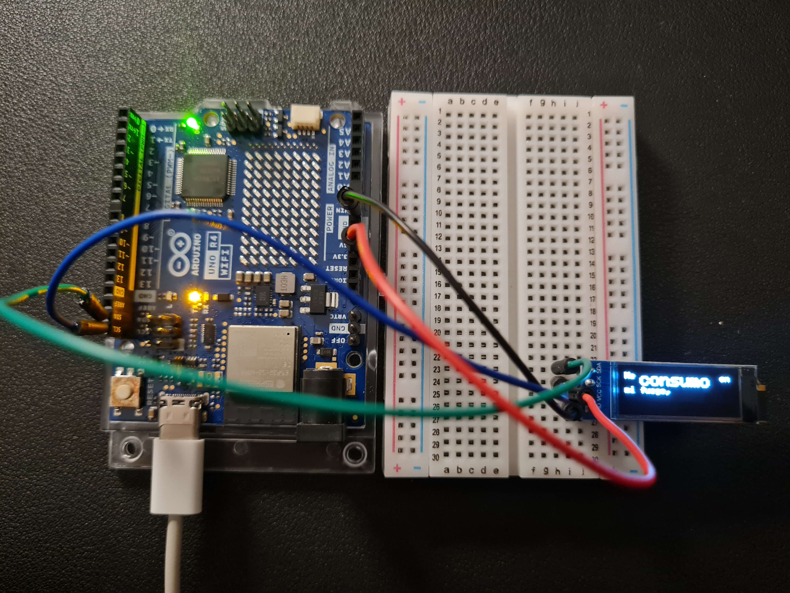


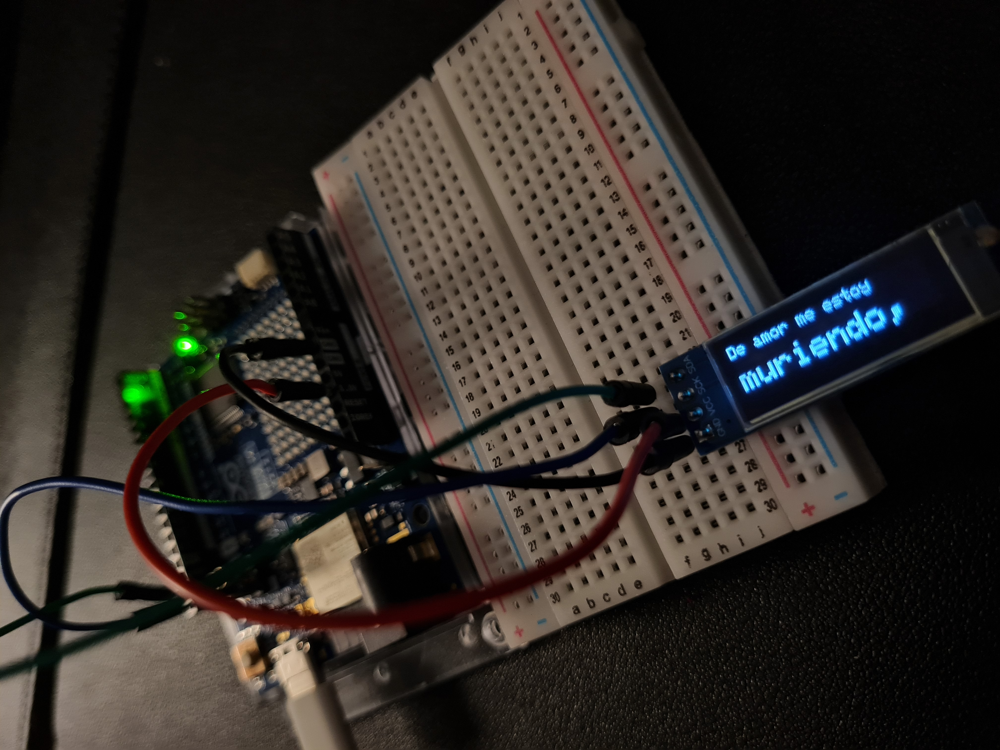


---


### código 4 → 03/09 

Controlar la velocidad de los versos del poema con el potenciómetro (B10K) → reemplazando el delay(2500)

Nueva constante: pin donde conectamos el potenciómetro

```cpp
#define POT_PIN A0
// A0 es un pin analógico del Arduino Uno R4 WiFi.
// Ahí conectamos el pin central (wiper) del potenciómetro B10K.
// Las dos patas externas del potenciómetro van a 5V y GND.
```

Nueva variable: rango de velocidad

```cpp
int tiempoEspera = 2500; // ms que se muestra cada verso; se recalcula en cada vuelta del loop según el pote
// Arranca en 2500 solo como valor inicial, después se sobreescribe con la lectura del potenciómetro
```

Cambios dentro de loop()

```cpp
void loop() {
  for (int i = 0; i < totalVersos; i++) {

    int valorPot = analogRead(POT_PIN);
    // analogRead() lee el voltaje en el pin A0 y lo traduce a un número.
    // En el Uno R4 WiFi, por defecto el rango es 0 a 1023 (resolución de 10 bits),
    // igual que en un Uno clásico, salvo que cambiemos la resolución con analogReadResolution().

    tiempoEspera = map(valorPot, 0, 1023, 4000, 200);
    // map(valor, desde_min, desde_max, hacia_min, hacia_max)
    // Traduce el rango de lectura del pote (0 a 1023) a un rango de milisegundos (4000 a 200).
    // Fijate que está "invertido" a propósito: pote al mínimo (0) -> 4000ms (lento),
    // pote al máximo (1023) -> 200ms (rápido). Si lo querés al revés, invertís esos dos últimos números.

    mostrarVerso(versosPantalla[i], palabraGrande[i]);
    Serial.println(misVersos[i]);

    Serial.print("Tiempo de espera actual: "); // (opcional) para ver el valor mientras probás
    Serial.println(tiempoEspera);

    delay(tiempoEspera);
    // en vez del 2500 fijo de antes, ahora usamos el valor que acabamos de calcular
    // según la posición del potenciómetro
  }
}
```
analogRead(POT_PIN) → devuelve un número entre 0 y 1023 según cuánto giraste la perilla.

map() → convierte ese número a un tiempo de espera en milisegundos: perilla al mínimo = versos lentos (4000ms), perilla al máximo = versos rápidos (200ms).

for →  permite girar el potenciómetro mientras el poema está corriendo, la velocidad cambia en tiempo real (verso a verso)


Conexión física del potenciómetro B10K:

Pata izquierda → GND (cable negro)

Pata derecha → 5V (cable rojo)

Pata del medio → A0 (cable amarillo)


Código 4 completo:

```cpp
// ================================================================
// Poema "Queja" de Alfonsina Storni
// Sketch para mostrar el poema en pantalla OLED 0,91" I2C (128x32)
// usando Adafruit_GFX + Adafruit_SSD1306
// - Palabras clave se muestran más grandes (efecto "grito")
// - La velocidad de cambio de verso se controla con un potenciómetro B10K
// - Placa: Arduino Uno R4 WiFi
// ================================================================

#include <Wire.h>              // Maneja la comunicación I2C entre el Arduino y la pantalla
#include <Adafruit_GFX.h>      // Librería base de gráficos (dibuja texto, líneas, formas)
#include <Adafruit_SSD1306.h>  // Librería específica para el chip controlador SSD1306 de la OLED
#include <string.h>            // Funciones para manejar texto: strlen, strcpy, strtok, strcmp
#include <ctype.h>             // Funciones para clasificar/transformar caracteres: isalpha, tolower

// Definimos el tamaño de la pantalla en píxeles (ancho x alto)
#define SCREEN_WIDTH 128
#define SCREEN_HEIGHT 32

// -1 significa que la pantalla comparte el pin de reset con el Arduino
#define OLED_RESET -1

// Dirección I2C típica de estos módulos OLED (si no funciona, probar 0x3D)
#define SCREEN_ADDRESS 0x3C

// Pin analógico donde conectamos el pin central (wiper) del potenciómetro B10K
#define POT_PIN A0

// Creamos el objeto "display" que representa nuestra pantalla física
Adafruit_SSD1306 display(SCREEN_WIDTH, SCREEN_HEIGHT, &Wire, OLED_RESET);

// Arreglo con los versos ORIGINALES (con tildes), usados
// para imprimir el poema completo y correcto en el Monitor Serie
char *misVersos[] = {
  "Señor, mi queja es ésta,",
  "Tú me comprenderás",
  "De amor me estoy muriendo,",
  "Pero no puedo amar.",
  "Persigo lo perfecto",
  "En mí y en los demás,",
  "Persigo lo perfecto",
  "Para poder amar.",
  "Me consumo en mi fuego,",
  "¡Señor, piedad, piedad!",
  "De amor me estoy muriendo,",
  "¡Pero no puedo amar!"
};

// Arreglo con los mismos versos SIN tildes ni signos especiales,
// porque la fuente por defecto de Adafruit_GFX no los dibuja bien
char *versosPantalla[] = {
  "Senor, mi queja es esta,",
  "Tu me comprenderas",
  "De amor me estoy muriendo,",
  "Pero no puedo amar.",
  "Persigo lo perfecto",
  "En mi y en los demas,",
  "Persigo lo perfecto",
  "Para poder amar.",
  "Me consumo en mi fuego,",
  "Senor, piedad, piedad!",
  "De amor me estoy muriendo,",
  "Pero no puedo amar!"
};

// Por cada verso, indicamos qué palabra hay que agrandar.
// Si el string está vacío (""), ese verso se muestra todo en tamaño normal.
// Van en minúscula y sin signos, porque así las compara limpiarPalabra().
char *palabraGrande[] = {
  "queja",      // 0: Señor, mi queja es ésta,
  "",           // 1: Tú me comprenderás
  "muriendo",   // 2: De amor me estoy muriendo,
  "",           // 3: Pero no puedo amar.
  "persigo",    // 4: Persigo lo perfecto
  "",           // 5: En mí y en los demás,
  "perfecto",   // 6: Persigo lo perfecto
  "",           // 7: Para poder amar.
  "consumo",    // 8: Me consumo en mi fuego,
  "piedad",     // 9: ¡Señor, piedad, piedad!  (agranda las dos apariciones)
  "",           // 10: De amor me estoy muriendo,
  "amar"        // 11: ¡Pero no puedo amar!
};

// Cantidad total de versos
const int totalVersos = 12;

// Tiempo (en milisegundos) que se muestra cada verso.
// Arranca en 2500 como valor inicial, pero se recalcula todo el tiempo
// según la posición del potenciómetro.
int tiempoEspera = 2500;

// setup() se ejecuta UNA sola vez, al encender o resetear la placa
void setup() {
  Serial.begin(9600); // Inicia la comunicación serial a 9600 baudios

  // Intenta inicializar la pantalla
  if (!display.begin(SSD1306_SWITCHCAPVCC, SCREEN_ADDRESS)) {
    Serial.println(F("Error al iniciar la pantalla OLED"));
    for (;;); // Detiene el programa si la pantalla no arrancó
  }

  display.clearDisplay();
  display.setTextColor(SSD1306_WHITE); // Color del texto (blanco = encendido en OLED monocroma)
  // No fijamos un setTextSize único acá, porque cada palabra
  // puede usar tamaño 1 (normal) o 2 (agrandada/"gritada")
}

// loop() se ejecuta UNA Y OTRA VEZ, sin parar
void loop() {
  for (int i = 0; i < totalVersos; i++) {

    int valorPot = analogRead(POT_PIN);
    // Lee el voltaje en el pin A0 y lo traduce a un número entre 0 y 1023
    // (resolución de 10 bits, la que trae por defecto el Uno R4 WiFi)

    tiempoEspera = map(valorPot, 0, 1023, 4000, 200);
    // Traduce el rango del potenciómetro (0 a 1023) a un rango de milisegundos.
    // Pote al mínimo -> 4000ms (lento). Pote al máximo -> 200ms (rápido).
    // Si lo querés al revés, invertís el 4000 y el 200.

    mostrarVerso(versosPantalla[i], palabraGrande[i]); // Muestra en la OLED la versión sin tildes
    Serial.println(misVersos[i]);                      // Imprime por Serial la versión completa con tildes

    Serial.print("Tiempo de espera actual (ms): "); // Para monitorear el valor mientras se prueba
    Serial.println(tiempoEspera);

    delay(tiempoEspera); // Espera el tiempo calculado antes de pasar al siguiente verso
  }
  // Al terminar el for (mostró los 12 versos), loop() arranca de nuevo desde el principio
}

// Función auxiliar que limpia una palabra para poder compararla.
// - Se queda solo con las letras (isalpha), descartando comas, puntos, ¡ !
// - Convierte todo a minúscula (tolower)
// Ej: "Piedad," -> "piedad"    "amar!" -> "amar"
void limpiarPalabra(char *origen, char *destino) {
  int j = 0;
  for (int i = 0; origen[i] != '\0'; i++) {
    if (isalpha(origen[i])) {
      destino[j++] = tolower(origen[i]);
    }
  }
  destino[j] = '\0'; // cerramos el string con el caracter nulo
}

// Función que dibuja un verso palabra por palabra, agrandando la palabra
// indicada en "palabraObjetivo" (si el verso tiene una para agrandar)
void mostrarVerso(char *verso, char *palabraObjetivo) {
  display.clearDisplay(); // Borra el contenido anterior del buffer

  char copia[40];
  strcpy(copia, verso); // strtok() modifica el string original, por eso usamos una copia

  int x = 0; // posición horizontal donde se dibujará la próxima palabra
  int y = 0; // posición vertical de la línea actual (0 = arriba, 16 = abajo)

  char *palabra = strtok(copia, " ");
  // strtok separa el string en "tokens" (palabras) usando el espacio como separador.
  // La primera llamada lleva el string a trocear; las siguientes usan NULL.

  while (palabra != NULL) {
    char limpia[20];
    limpiarPalabra(palabra, limpia); // versión sin signos y en minúscula, para comparar

    // Si la palabra objetivo no está vacía y coincide con esta palabra, se agranda
    int tamano = (strlen(palabraObjetivo) > 0 && strcmp(limpia, palabraObjetivo) == 0) ? 2 : 1;

    // Ancho aproximado en píxeles: la fuente por defecto usa 6px por caracter en tamaño 1,
    // y ese ancho se multiplica por el tamaño de letra elegido
    int anchoPalabra = strlen(palabra) * 6 * tamano;
    int anchoEspacio = 6 * tamano; // ancho aproximado de un espacio, también escalado

    // Si la palabra no entra en lo que queda de la línea (128px de ancho), saltamos de línea
    if (x + anchoPalabra > SCREEN_WIDTH) {
      x = 0;
      y = 16; // la segunda línea arranca 16px más abajo (deja lugar a palabras grandes)
    }

    display.setTextSize(tamano);   // 1 = tamaño normal, 2 = tamaño "gritado" (el doble)
    display.setCursor(x, y);       // ubicamos dónde va a empezar a dibujarse la palabra
    display.print(palabra);        // dibujamos la palabra en el buffer (con su puntuación original)

    x += anchoPalabra + anchoEspacio; // corremos el cursor horizontal para la próxima palabra

    palabra = strtok(NULL, " "); // pedimos la siguiente palabra del mismo verso
  }

  display.display(); // recién acá se envían todos los cambios al panel físico
}
```

PROBLEMA: los versos del poema siguen una velocidad determinada y mientras muevo la perilla del potenciómetro solo acelera el paso de los versos, pero no tengo el control total del movimiento.


FOTO Y GIF CÓDIGO FUNCIONANDO

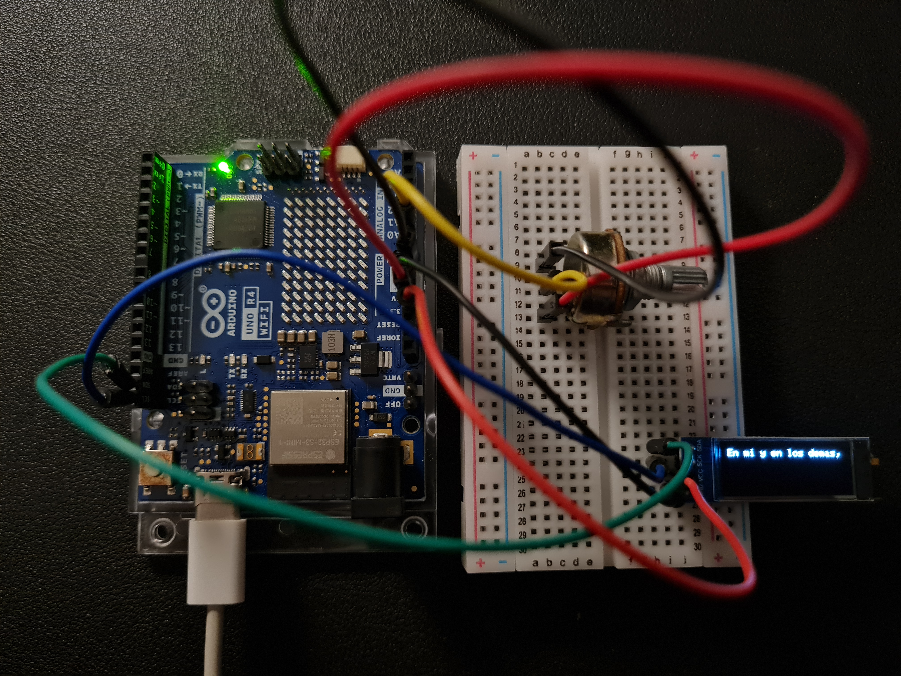

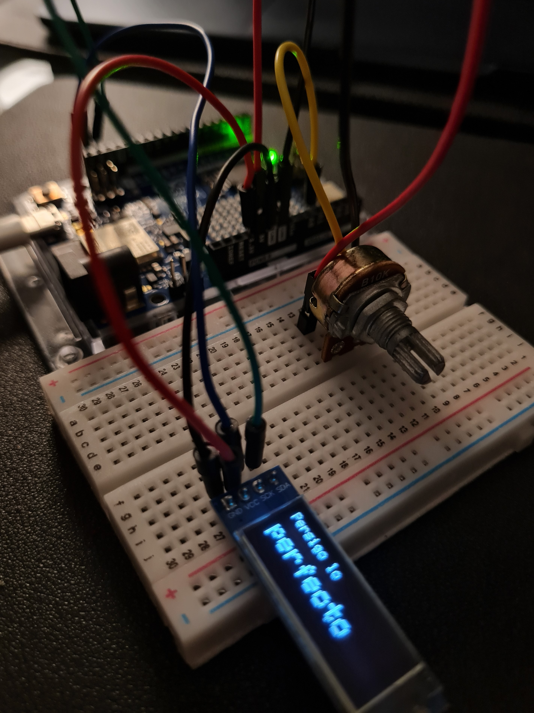


---


CAMBIOS CÓDIGO 4 → VERSIÓN 4.2 → 03/09 

- El poema seguía avanzando solo (automáticamente) → cumpla del for

- Agregar el nombre de la poetisa al comienzo (Alfonsina Storni)

- for → recorría los 12 versos solo, y delay(tiempoEspera) decidía cuánto tardaba cada paso → el pote controlaba velocidad.

- Hay de sacar el for con avance automático

- En cada vuelta de loop(): calcular qué verso corresponde la posición actual del potenciómetro y mostrar ese verso

- Centrado y alineación de base: me da toc cómo se ven las palabras de mayor tamaño, no respetaba una linea de base y eje x  →  antes todas las palabras arrancaban en y=0 o y=16 sin importar su tamaño

palabras grandes (16px de alto)  → quedan "flotando" 

palabras chicas (8px de alto)


FOTOOO PRUEBAAAAAA TOC :)


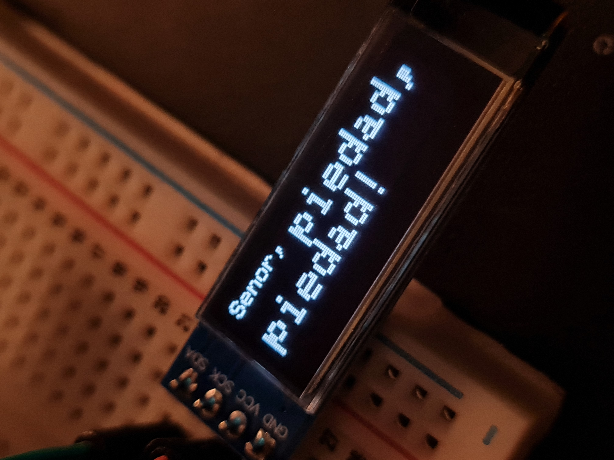


Parte que cambia: Ahora: no hay for ni avance automático (control total del pote)

```cpp
// NUEVA variable global: guarda qué verso se mostró la última vez,
// para no redibujar la pantalla si el verso no cambió (evita parpadeo)
int indiceAnterior = -1; // -1 fuerza a que la primera vuelta del loop sí dibuje algo

void loop() {

  int valorPot = analogRead(POT_PIN);
  // Lee la posición actual del potenciómetro: un número entre 0 y 1023

  int indiceActual = map(valorPot, 0, 1023, 0, totalVersos - 1);
  // Traducimos ese rango (0-1023) al rango de índices del poema (0 a 11).
  // Ahora el potenciómetro representa una POSICIÓN dentro del poema,
  // no una velocidad: pote al mínimo = verso 0, pote al máximo = verso 11,
  // y las posiciones intermedias reparten los otros versos en el medio.

  if (indiceActual != indiceAnterior) {
    // Solo actualizamos la pantalla si el verso correspondiente CAMBIÓ
    // respecto a la última vez. Si la perilla está quieta, no hacemos nada,
    // así no repetimos display.display() todo el tiempo sin necesidad.

    mostrarVerso(versosPantalla[indiceActual], palabraGrande[indiceActual]);
    Serial.println(misVersos[indiceActual]); // Verso completo (con tildes) por Serial

    indiceAnterior = indiceActual; // Actualizamos el "recuerdo" del último verso mostrado
  }

  delay(20);
  // Pequeña pausa para no saturar el procesador leyendo el potenciómetro
  // miles de veces por segundo. No afecta la fluidez del control.
}
```

En vez de usar el mismo "y" fijo para todas las palabras, calculo un "y" distinto por palabra → ahora las palabras estan sobre el mismo piso y no flotando 

```cpp
int y = yTecho + (alturaLinea - alturaPalabra);
```

Cambié la línea base por centrado: antes cada palabra se alineaba por su parte de abajo (y = techo + (altoLinea - alturaPalabra)).

```cpp
int centroLinea = topLinea[linea] + (altoLinea[linea] / 2);
int y = centroLinea - (alturaPalabra / 2);
```


Código 4.2 completo: 03/09

```cpp
// ================================================================
// Poema "Queja" de Alfonsina Storni
// Sketch para mostrar el poema en pantalla OLED 0,91" I2C (128x32)
// usando Adafruit_GFX + Adafruit_SSD1306
// - Palabras clave se muestran más grandes (efecto "grito")
// - El potenciómetro B10K controla directamente EN QUÉ VERSO estás
// - El texto se dibuja centrado horizontal y verticalmente
// - Las palabras grandes quedan centradas respecto a la línea
//   central de las palabras chicas (ya no alineadas por la base)
// - Interlineado configurable, y el bloque siempre se reacomoda
//   para entrar en la pantalla, sin importar cuántas líneas use
// - Placa: Arduino Uno R4 WiFi
// ================================================================

#include <Wire.h>              // Maneja la comunicación I2C entre el Arduino y la pantalla
#include <Adafruit_GFX.h>      // Librería base de gráficos (dibuja texto, líneas, formas)
#include <Adafruit_SSD1306.h>  // Librería específica para el chip controlador SSD1306 de la OLED
#include <string.h>            // Funciones para manejar texto: strlen, strcpy, strtok, strcmp
#include <ctype.h>             // Funciones para clasificar/transformar caracteres: isalpha, tolower

// Definimos el tamaño de la pantalla en píxeles (ancho x alto)
#define SCREEN_WIDTH 128
#define SCREEN_HEIGHT 32

// -1 significa que la pantalla comparte el pin de reset con el Arduino
#define OLED_RESET -1

// Dirección I2C típica de estos módulos OLED (si no funciona, probar 0x3D)
#define SCREEN_ADDRESS 0x3C

// Pin analógico donde conectamos el pin central (wiper) del potenciómetro B10K
#define POT_PIN A0

// NUEVO: cantidad de espacio extra (en píxeles) entre línea y línea.
// Subí este número si querés todavía más separación entre renglones.
#define INTERLINEADO 4

// NUEVO: máximo de líneas que puede llegar a usar un verso.
// Con este valor el código funciona igual para versos cortos (1 línea)
// o más largos (2 o 3 líneas), sin tener que tocar nada más.
#define MAX_LINEAS 3

// Creamos el objeto "display" que representa nuestra pantalla física
Adafruit_SSD1306 display(SCREEN_WIDTH, SCREEN_HEIGHT, &Wire, OLED_RESET);

// Arreglo con los versos ORIGINALES (con tildes), usados
// para imprimir el poema completo y correcto en el Monitor Serie
char *misVersos[] = {
  "Alfonsina Storni,",
  "Señor, mi queja es ésta,",
  "Tú me comprenderás",
  "De amor me estoy muriendo,",
  "Pero no puedo amar.",
  "Persigo lo perfecto",
  "En mí y en los demás,",
  "Persigo lo perfecto",
  "Para poder amar.",
  "Me consumo en mi fuego,",
  "¡Señor, piedad, piedad!",
  "De amor me estoy muriendo,",
  "¡Pero no puedo amar!"
};

// Arreglo con los mismos versos SIN tildes ni signos especiales,
// porque la fuente por defecto de Adafruit_GFX no los dibuja bien
char *versosPantalla[] = {
  "Alfonsina Storni",
  "Senor, mi queja es esta,",
  "Tu me comprenderas",
  "De amor me estoy muriendo,",
  "Pero no puedo amar.",
  "Persigo lo perfecto",
  "En mi y en los demas,",
  "Persigo lo perfecto",
  "Para poder amar.",
  "Me consumo en mi fuego,",
  "Senor, piedad, piedad!",
  "De amor me estoy muriendo,",
  "Pero no puedo amar!"
};

// Por cada verso, indicamos qué palabra hay que agrandar.
// Si el string está vacío (""), ese verso se muestra todo en tamaño normal.
char *palabraGrande[] = {
  "",           // 0: Alfonsina Storni,
  "queja",      // 1: Señor, mi queja es ésta,
  "",           // 2: Tú me comprenderás
  "muriendo",   // 3: De amor me estoy muriendo,
  "",           // 4: Pero no puedo amar.
  "persigo",    // 5: Persigo lo perfecto
  "",           // 6: En mí y en los demás,
  "perfecto",   // 7: Persigo lo perfecto
  "",           // 8: Para poder amar.
  "consumo",    // 9: Me consumo en mi fuego,
  "piedad",     // 10: ¡Señor, piedad, piedad!  (agranda las dos apariciones)
  "",           // 11: De amor me estoy muriendo,
  "amar"        // 12: ¡Pero no puedo amar!
};

// Cantidad total de versos
const int totalVersos = 13;

// Guarda qué verso se mostró la última vez, para no redibujar
// la pantalla si el potenciómetro no cambió de verso (evita parpadeo)
int indiceAnterior = -1; // -1 fuerza a que la primera vuelta del loop sí dibuje algo

// setup() se ejecuta UNA sola vez, al encender o resetear la placa
void setup() {
  Serial.begin(9600); // Inicia la comunicación serial a 9600 baudios

  // Intenta inicializar la pantalla
  if (!display.begin(SSD1306_SWITCHCAPVCC, SCREEN_ADDRESS)) {
    Serial.println(F("Error al iniciar la pantalla OLED"));
    for (;;); // Detiene el programa si la pantalla no arrancó
  }

  display.clearDisplay();
  display.setTextColor(SSD1306_WHITE); // Color del texto (blanco = encendido en OLED monocroma)
}

// loop() se ejecuta UNA Y OTRA VEZ, sin parar
void loop() {

  int valorPot = analogRead(POT_PIN);
  // Lee la posición actual del potenciómetro: un número entre 0 y 1023

  int indiceActual = map(valorPot, 0, 1023, 0, totalVersos - 1);
  // Traducimos esa posición al índice del verso correspondiente (0 a 12).

  if (indiceActual != indiceAnterior) {
    // Solo actualizamos la pantalla si el verso correspondiente CAMBIÓ
    mostrarVerso(versosPantalla[indiceActual], palabraGrande[indiceActual]);
    Serial.println(misVersos[indiceActual]); // Verso completo (con tildes) por Serial
    indiceAnterior = indiceActual;
  }

  delay(20); // pequeña pausa para no saturar el procesador leyendo el potenciómetro
}

// Función auxiliar que limpia una palabra para poder compararla.
// Se queda solo con las letras y las pasa a minúscula.
// Ej: "Piedad," -> "piedad"    "amar!" -> "amar"
void limpiarPalabra(char *origen, char *destino) {
  int j = 0;
  for (int i = 0; origen[i] != '\0'; i++) {
    if (isalpha(origen[i])) {
      destino[j++] = tolower(origen[i]);
    }
  }
  destino[j] = '\0';
}

// Función que dibuja un verso: agranda la palabra indicada, centra todo
// el bloque en la pantalla, agrega interlineado entre renglones, y
// centra verticalmente cada palabra respecto al alto de su línea
// (en vez de alinearlas por la base).
void mostrarVerso(char *verso, char *palabraObjetivo) {
  display.clearDisplay();

  char copia[40];
  strcpy(copia, verso); // strtok() modifica el string original, por eso usamos una copia

  // --- PASE 1: separar el verso en palabras y calcular tamaño y ancho de cada una ---
  char *palabras[10];
  int tamanos[10];
  int anchos[10];
  int cantidadPalabras = 0;

  char *token = strtok(copia, " ");
  while (token != NULL && cantidadPalabras < 10) {
    char limpia[20];
    limpiarPalabra(token, limpia);

    int tam = (strlen(palabraObjetivo) > 0 && strcmp(limpia, palabraObjetivo) == 0) ? 2 : 1;

    palabras[cantidadPalabras] = token;
    tamanos[cantidadPalabras] = tam;
    anchos[cantidadPalabras] = strlen(token) * 6 * tam;
    cantidadPalabras++;

    token = strtok(NULL, " ");
  }

  // --- PASE 2: repartir las palabras en varias líneas (hasta MAX_LINEAS) ---
  int lineaDe[10];
  int anchoLinea[MAX_LINEAS];
  int altoLinea[MAX_LINEAS];
  for (int l = 0; l < MAX_LINEAS; l++) { anchoLinea[l] = 0; altoLinea[l] = 0; }

  int lineaActual = 0;
  int anchoAcumulado = 0;
  const int espacioBase = 6; // ancho de un espacio en blanco a tamaño 1

  for (int i = 0; i < cantidadPalabras; i++) {
    int espacioExtra = (anchoAcumulado > 0) ? (espacioBase * tamanos[i]) : 0;

    // Si la palabra no entra en lo que queda de la línea, pasamos a la siguiente
    // (mientras no nos pasemos del máximo de líneas permitidas)
    if (anchoAcumulado + espacioExtra + anchos[i] > SCREEN_WIDTH && lineaActual < MAX_LINEAS - 1) {
      lineaActual++;
      anchoAcumulado = 0;
      espacioExtra = 0;
    }

    lineaDe[i] = lineaActual;
    anchoAcumulado += espacioExtra + anchos[i];
    anchoLinea[lineaActual] = anchoAcumulado;

    int alturaPalabra = 8 * tamanos[i]; // 8px a tamaño 1, 16px a tamaño 2
    if (alturaPalabra > altoLinea[lineaActual]) {
      altoLinea[lineaActual] = alturaPalabra;
    }
  }

  int numLineas = lineaActual + 1; // cuántas líneas se usaron realmente

  // --- PASE 3: calcular el alto total del bloque, CON interlineado incluido ---
  int interlineado = INTERLINEADO;
  int altoTotal = 0;
  for (int l = 0; l < numLineas; l++) altoTotal += altoLinea[l];
  altoTotal += interlineado * (numLineas - 1); // el espacio extra va ENTRE líneas, no en los bordes

  // NUEVO: si el bloque no entra en la pantalla (verso muy largo con palabra grande),
  // vamos reduciendo el interlineado automáticamente hasta que entre
  while (altoTotal > SCREEN_HEIGHT && interlineado > 0) {
    interlineado--;
    altoTotal = 0;
    for (int l = 0; l < numLineas; l++) altoTotal += altoLinea[l];
    altoTotal += interlineado * (numLineas - 1);
  }

  // --- Centrado vertical del bloque completo ---
  int yInicio = (SCREEN_HEIGHT - altoTotal) / 2;
  if (yInicio < 0) yInicio = 0; // si de última no entra, arrancamos arriba del todo (sin recortar)

  // Calculamos el techo de cada línea, sumando alturas + interlineado de las líneas anteriores
  int topLinea[MAX_LINEAS];
  int acumulado = yInicio;
  for (int l = 0; l < numLineas; l++) {
    topLinea[l] = acumulado;
    acumulado += altoLinea[l] + interlineado;
  }

  // --- Centrado horizontal de cada línea ---
  int xInicio[MAX_LINEAS];
  for (int l = 0; l < numLineas; l++) {
    xInicio[l] = (SCREEN_WIDTH - anchoLinea[l]) / 2;
    if (xInicio[l] < 0) xInicio[l] = 0;
  }

  // --- PASE 4: dibujar cada palabra, centrada horizontal y VERTICALMENTE ---
  int xActual[MAX_LINEAS];
  for (int l = 0; l < numLineas; l++) xActual[l] = xInicio[l];

  for (int i = 0; i < cantidadPalabras; i++) {
    int linea = lineaDe[i];
    int alturaPalabra = 8 * tamanos[i];

    // CAMBIO CLAVE: antes alineábamos por la base (parte de abajo).
    // Ahora centramos cada palabra respecto al CENTRO del renglón:
    // así, una palabra grande queda con su medio a la misma altura
    // que el medio de las palabras chicas de esa misma línea.
    int centroLinea = topLinea[linea] + (altoLinea[linea] / 2);
    int y = centroLinea - (alturaPalabra / 2);

    display.setTextSize(tamanos[i]);
    display.setCursor(xActual[linea], y);
    display.print(palabras[i]);

    xActual[linea] += anchos[i] + (espacioBase * tamanos[i]);
  }

  display.display();
}
```

Cambios nuevos :)

- Se agregó "Alfonsina Storni," como primer elemento en misVersos[] y versosPantalla[], y ahora hay 13 versos en total (totalVersos = 13).

- palabraGrande[] se corrió un lugar: el índice 0 (nombre de la poetisa)

- Se sacó el for de avance automático: ahora loop() lee el potenciómetro en cada vuelta y muestra directamente el verso que corresponde a esa posición → contol total

- Centrado y alineación de base: me daba toc como se veian las palabras de mayor tamaño, no respetaba una linea de base y eje x antes todas las palabras arrancaban en y=0 o y=16 sin importar su tamaño

- Interlineado: las palabras estaban muy pegadas, necesitaba mas aire entre ellas → agregué #define INTERLINEADO 4


FOTOOO Y GIF CÓDIGO FUNCIONANDO


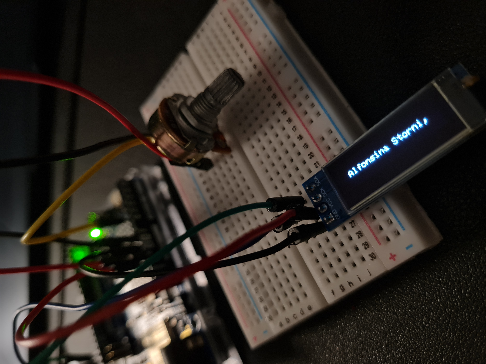


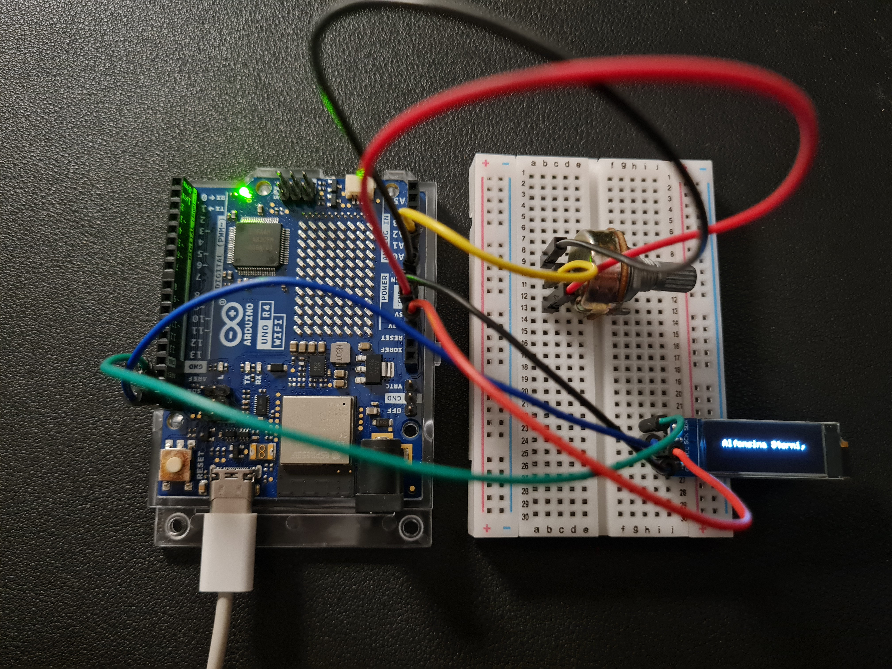


PROBLEMA: En los versos del poema en la linea 95 en pantalla se ve así:

"piedad",     // 10: ¡Señor, piedad, piedad!  (agranda las dos apariciones) → se corta por espacio en pantalla, al ser 2 palabras de mayor tamaño

deberia aparecer:

```cpp
// agrandar las palabras “Piedad, piedad!” 
  "¡Señor, piedad, piedad!",
```

¿SOLUCION? → dejar solo un "piedad" por espacio en pantalla.


FOTOOOO PROBLEMAAAA :P

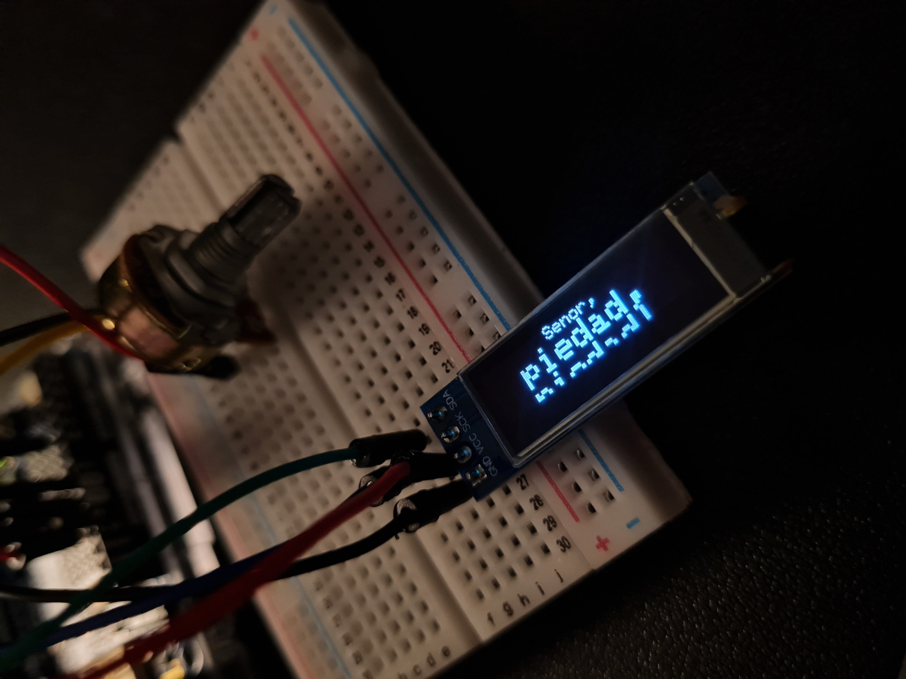


## encargos

## lectura

Libro: A New Program for Graphic Design

Autor: David Reinfurt

El libro está dividido en 3 grandes capítulos.

I. T--Y-P-O-G-R-A-P-H-Y

II. G-E-S-T-A-L-T

III. I-N-T-E-R-F-A-C-E

El autor plantea las bases de lo que significa enseñar diseño gráfico hoy. Introduce la idea de que el diseño no se trata de "estilo" o decoración, sino de sistemas, reglas y tecnología aplicadas a la comunicación.


BLOQUE 2 — Inicio del curso Typography (pp. 19-29)

**Tema central**

Empece el capítulo "Typography". Reinfurt plantea que la tipografía tiene una "doble personalidad": es a la vez la técnica de dar forma a las palabras y una forma de entender el mundo a través de esas formas escritas. Anuncia que recorrerá 500 años de tradición tipográfica en tres tecnologías: metal typesetting, phototypesetting y digital typesetting. El recorrido arranca con Albrecht Dürer (grabador, matemático, orfebre) y su obra Melancholia I, pasa por su tratado On the Just Formation of Letters (construcción geométrica de las letras romanas), sigue con Gutenberg y la imprenta de tipos móviles, con Joseph Moxon y sus manuales de impresión, con el caso clínico de Howard Engel (alexia sin agrafia, relatado por Oliver Sacks), con un diagrama de William James sobre el circuito neuronal de la escritura, con Charlotte's Web de E.B. White como metáfora de la tipografía "hecha a mano", y cierra con Benjamin Franklin como diseñador total.


**Análisis**

- Tipografía de doble vía (Elliman): leer y escribir no son opuestos, son la misma acción vista desde dos lados.

- Tres tecnologías, no tres estilos: Reinfurt ordena la historia por el hardware (metal, foto, digital), no por movimientos estéticos. Cambia la máquina, cambia la letra.

- Dürer: convierte la letra en geometría, no en caligrafía. La "A" con regla y compás es una fórmula replicable, no un gesto manual. Antecede directamente a la letra digital.

- Gutenberg: no es "el inventor", es quien resolvió un problema de materiales (aleación). Su frase clave: "printing was power". Controlar la impresión es controlar qué circula y quién es autor.

- Moxon: usa la imprenta para enseñar a imprimir. Un manual que se autodocumenta, como el código abierto hoy.

- Howard Engel: pierde la lectura pero no la escritura. Prueba clínica de que leer y escribir son procesos neurológicos distintos, aunque se los trate como uno solo.
  
- Charlotte (E.B. White): tejer letras a mano es la metáfora más literal de tipografiar: ejecutar forma, trazo por trazo, sin necesidad de procesar significado.
  
- Franklin: cierra el bloque como diseñador total. Tipografía, distribución y poder político van juntos.


**Citas**

Cita 1 (p. 19)

INGLÉS: "Typography has something of a split personality—it's both the technical act of writing words into the world by giving them form, and it's also a way of understanding the world through the forms of its writing."

ESPAÑOL: "La tipografía tiene algo de personalidad dividida —es tanto el acto técnico de escribir palabras en el mundo dándoles forma, como también una manera de entender el mundo a través de las formas de su escritura."

Análisis: Define la tipografía como un sistema de doble función: produce forma y, al mismo tiempo, es una lente de lectura del mundo. No es solo herramienta, es también epistemología.


Cita 2 (p. 23)

INGLÉS: "Gutenberg's scheme leaked to Nuremberg... Printers decided what got printed, how it looked, where it went, and who was an author. Printing was power."

ESPAÑOL: "El esquema de Gutenberg se filtró hasta Núremberg... Los impresores decidían qué se imprimía, cómo se veía, adónde iba, y quién era autor. Imprimir era poder."

Análisis: Reinfurt corta con la narrativa romántica de la imprenta como "progreso neutral". La deja planteada como tecnología de control: definir qué circula es una forma de poder, no solo un logro técnico.


Cita 3 (p. 25)

INGLÉS: "Reading and writing are intimately connected. There's probably a biological reason why we learn both at the same time."

ESPAÑOL: "Leer y escribir están íntimamente conectados. Probablemente haya una razón biológica por la que aprendemos ambas cosas al mismo tiempo."

Análisis: Cierra el caso Howard Engel con una hipótesis biológica, no estética. Reinfurt usa neurociencia para reforzar su tesis inicial: tipografía es leer y escribir operando como un mismo sistema, aunque puedan desacoplarse.


**Glosario**

| Término (INGLÉS) | Traducción (ESPAÑOL) | Explicación |
|---|---|---|
| Metal typesetting | Composición en metal | Armado de texto con tipos móviles de metal. |
| Phototypesetting | Fotocomposición | Composición tipográfica mediante proyección de luz sobre película. |
| Digital typesetting | Composición digital | Composición tipográfica mediante software y fuentes digitales. |
| Movable type | Tipos móviles | Piezas individuales de letras reutilizables para imprimir. |
| Blackletter | Letra gótica | Alfabeto europeo de trazos angulares, previo a la letra romana. |
| Monogram | Monograma | Firma o marca compuesta por iniciales combinadas. |
| Alloy | Aleación | Mezcla de metales usada para fundir tipos de imprenta. |
| Letterpress | Tipografía (impresión con tipos) | Técnica de impresión por presión directa de tipos entintados. |
| Alexia | Alexia | Pérdida de la capacidad de leer, sin pérdida de escritura. |
| Pseudonym | Seudónimo | Nombre falso usado para publicar sin revelar identidad real. |
