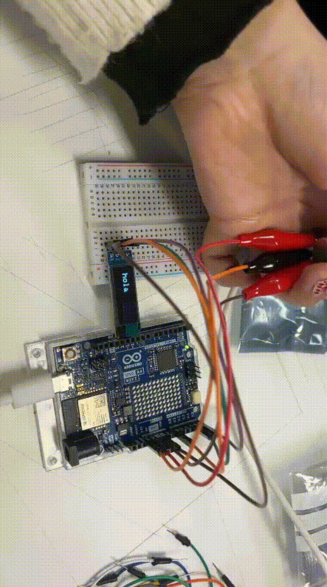
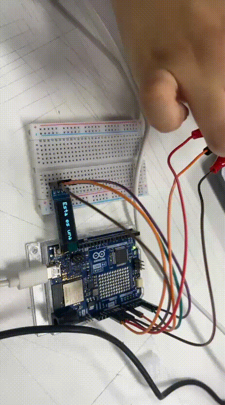

# sesion-03b

## apuntes sesión
> 1. apuntes personales de String, string, array, con bibliografia y con pantallazos de resultados, y dudas textuales.

- tener en cuenta que nuestro proyecto se pueda trabajar en c++ y raspberry
- palabras -- moléculas
- cuando algo está en mayúscula es porque es una clase
  
**String**
```
elementos fundamentales de la programación
clase o el tipo de objeto en lenguajes orientados a objetos -- C++/Java/C#
nos permite trabajar de manera más fácil con cadenas de texto
```
**string**
```
array de caracteres
caracteres alfanuméricos -- secuencia de estos
almacenan juntos como una unidad
fin de string -- cuenta como un carácter más
string -- declarar variables de una forma rápida y sencilla
```
**comillas**
```  
- comillas en c++
- comillas simples, un carácter
- comillas dobles más de un carácter, cadenas de texto (string)
```
---

### Arreglo
- en esta clase nos enfocamos en realizar un *arreglo/array*, el cual permite guardar varios elementos del mismo tipo bajo un solo nombre de variable.
- ocupamos diferentes códigos de ejemplos, los cuales durante la clase los aplicamos a nuestro código del poema para poder visualizarlos en nuestra pantalla.
- lo utilizamos en esta clase para hacer que nuestros códigos no solo hablen lenguaje que Arduino pueda interpretar
---
- char (caracteres)
- [] implica arreglo -- varios caracteres, cuan grande es ese arreglo
- char palabrita[] = "valor variable";
- "*" arreglo de arreglos
- i++ -- lo que sea que valga uno, súmale uno más
- secuencia de datos del mismo tipo
```
char palabrita[] = "hola";
palabra[0] --> "h"
palabra[1] --> "o"
palabra[2] --> "l"
palabra[3] --> "a"
palabra[4] --> "0"
//siempre considerar un carácter más, en este caso sería palabra[4], en donde termina el string
//siempre se comienza desde la posición 0
//el 0 es muy importante
```

```
char palabra [] = "hola";
//se crea arreglo de caracteres 
```
```cpp
char *misVersos[] = {
  "Huye luna, luna, luna.",
  "Si vinieran los gitanos,",
  "Harían con tu corazón",
  "Collares y anillos blancos.",
  "Niño, déjame que baile.",
  "Cuando vengan los gitanos,", 
  "Te encontrarán sobre el yunque", 
  "Con los ojillos cerrados.", 
  "Huye luna, luna, luna,", 
  "Que ya siento sus caballos.", 
  "Niño, déjame, no pises",
  "Mi blancor almidonado.",
};

void setup() {
  Serial.begin(9600);
}

void loop() {

  for (int i = 0; i < 13; i++) {
    Serial.println(misVersos[i]);
  }
```
> aquí realicé un ejemplo en el cual integré el sistema de char y además el tema de i++, en donde puse los versos escogidos de nuestro poema para que corrieran de forma continúa en el monitor serial
---
### códigos ejemplos de la clase

```cpp
// declaracion de arreglo de enteros
// que se llama edades
// no influye orden de las variables
int edades[3] = { 37, 22, 24 };

void setup() {
  Serial.begin(9600);
}

void loop() {
  Serial.print(edades[0]);
  Serial.print(", ");
  Serial.print(edades[1]);
  Serial.print(", ");
  Serial.println(edades[2]);
// poner comas y espacios, ya que se usaa print y eso escribe todo de forma fluida
// las variables parten del 0
}
```
```cpp
// bah que raro
// con 5 no funciono
// siempre agregar uno más
char nombre[6] = "aaron";

void setup() {
  Serial.begin(9600);
}

void loop() {
  Serial.print(nombre[0]);
  Serial.print(nombre[1]);
  Serial.print(nombre[2]);
  Serial.print(nombre[3]);
  Serial.println(nombre[4]);
}
```
```cpp
// un poemario
// es un arreglo de paginas
// una pagina es un arreglo de lineas
// una linea es un arreglo de caracteres

char *misVersos[] = {
  "Mami, no te haga' de rogar",
  "No me gustaría perder el tiempo",
  "Que tenemo' pa' poderte tocar",
  "Y estás con otro, esa mierda no lo entiendo, yeah",
  "Que te lo juro, no eres nada pa' mí, te lo juro, ah",};

// bah que raro
// con 5 no funciono
char nombre[6] = "aaron";

void setup() {
  Serial.begin(9600);
}

void loop() {
  Serial.println(misVersos[0]);
}
```
```cpp
// un poemario
// es un arreglo de paginas
// una pagina es un arreglo de lineas
// una linea es un arreglo de caracteres

char *misVersos[] = {
  "Mami, no te haga' de rogar",
  "No me gustaría perder el tiempo",
  "Que tenemo' pa' poderte tocar",
  "Y estás con otro, esa mierda no lo entiendo, yeah",
  "Que te lo juro, no eres nada pa' mí, te lo juro, ah",
};

// bah que raro
// con 5 no funciono
char nombre[6] = "aaron";

void setup() {
  Serial.begin(9600);
}

void loop() {

  // recorrer el arreglo
  // for es para recorrer conjuntos
  // adentro tiene 3 mini lineas
  // inicio de los tiempos
  // oye pero cuando paro
  // que hago despues de cada iteracion
  for (int i = 0; i < 5; i++) {
    Serial.println(misVersos[i]);
  }
}
```
---
## encargos

encargo-03b:
> 2. subir código a su bitácora ordenado con el formato de backticks a continuación, del proyecto hasta ahora.
> 3. definir y escribir el corpus a usar: autora, poemas, licencias, poblarlo en la carpeta 00-proyecto-1

### Federico García Lorca

Poeta Español, en sus poemas se revela como agudo observador del habla, de la música y de las costumbres de la sociedad rural y cotidiana española, en las cuales el ambiente que él describe en sus obras se llega a convertir en un espacio en donde abre a la expresión e inquietudes más profundas del ser humano, como lo son el deseo, amor, muerte, misterio de la identidad.

### Poema escogido
Este poema se destaca principalmente por ser el inaugural de su más conocida obra llamada "Romancero Gitano", en donde se narra la trágica y lírica la muerte inevitable de un niño gitano.

```
**“Romance de la luna, luna”**

La luna vino a la fragua 
con su polisón de nardos.
El niño la mira, mira. 
El niño la está mirando. 

En el aire conmovido 
mueve la luna sus brazos 
y enseña, lúbrica y pura, 
sus senos de duro estaño. 

Huye luna, luna, luna. 
Si vinieran los gitanos,
harían con tu corazón 
collares y anillos blancos.

Niño, déjame que baile. 
Cuando vengan los gitanos, 
te encontrarán sobre el yunque 
con los ojillos cerrados. 

Huye luna, luna, luna, 
que ya siento sus caballos. 
Niño, déjame, no pises 
mi blancor almidonado. 

El jinete se acercaba 
tocando el tambor del llano. 
Dentro de la fragua el niño 
tiene los ojos cerrados. 

Por el olivar venían, 
bronce y sueño, los gitanos. 
Las cabezas levantadas 
y los ojos entornados. 


Cómo canta la zumaya, 
¡ay, cómo canta en el árbol! 
Por el cielo va la luna 
con un niño de la mano. 

Dentro de la fragua lloran, 
dando gritos, los gitanos. 
El aire la vela, vela.
El aire la está velando.  
```
### Corpus a utilizar en nuestro proyecto
```
Huye luna, luna, luna. 
Si vinieran los gitanos,
harían con tu corazón 
collares y anillos blancos.

Niño, déjame que baile. 
Cuando vengan los gitanos, 
te encontrarán sobre el yunque 
con los ojillos cerrados. 

Huye luna, luna, luna, 
que ya siento sus caballos. 
Niño, déjame, no pises 
mi blancor almidonado. 
```

```cpp
#include <SPI.h>
#include <Wire.h>
#include <Adafruit_GFX.h>
#include <Adafruit_SSD1306.h>


#define SCREEN_WIDTH 128 // OLED display width, in pixels
#define SCREEN_HEIGHT 32 // OLED display height, in pixels


#define OLED_RESET     -1
#define SCREEN_ADDRESS 0x3C
Adafruit_SSD1306 display(SCREEN_WIDTH, SCREEN_HEIGHT, &Wire, OLED_RESET);


#define POT_PIN A0


const char* texto = "Esta es una frase larga de ejemplo";
int16_t textWidth, textHeight;
int minX; // posición X mas negativa permitida


void setup() {
  Serial.begin(9600);


  delay(500);


  if (!display.begin(SSD1306_SWITCHCAPVCC, SCREEN_ADDRESS)) {
    Serial.println(F("SSD1306 allocation failed"));
    for (;;);
  }


  display.display();
  delay(1000);
  display.clearDisplay();


  display.setTextSize(2);
  display.setTextColor(SSD1306_WHITE);
  display.setTextWrap(false);   // <-- CLAVE: evita que el texto salte de línea


  // Calculamos el ancho real de la frase completa
  int16_t x1, y1;
  display.getTextBounds(texto, 0, 0, &x1, &y1, (uint16_t*)&textWidth, (uint16_t*)&textHeight);


  minX = SCREEN_WIDTH - textWidth;
  if (minX > 0) minX = 0;


  // Debug: confirmar que el ancho se calculó bien
  Serial.print("Ancho del texto: ");
  Serial.println(textWidth);
  Serial.print("minX: ");
  Serial.println(minX);
}


void loop() {
  int potValue = analogRead(POT_PIN);
  int xPos = map(potValue, 0, 1023, 0, minX);


  int yPos = (SCREEN_HEIGHT - textHeight) / 2;


  display.clearDisplay();
  display.setTextWrap(false);   // por si acaso, reforzar antes de imprimir
  display.setCursor(xPos, yPos);
  display.print(texto);
  display.display();


  // Debug para verificar que el potenciómetro sí cambia el valor
  Serial.print("Pot: ");
  Serial.print(potValue);
  Serial.print(" | xPos: ");
  Serial.println(xPos);


  delay(20);
}
```
- este código lo ocupamos tanto para visualizar el "hola" y la frase larga de ejemplo, en el cual utilizamos de base el "char" para que nos tirara espacios en donde poner una frse, luego modificamos el código pidiéndole a la IA que este se pudiera desplazar de un lado hacia el otro utilizando el potenciómetro para mover la frase, la cual se visualizara de forma completa para desplazarla
  




## algunos links + bibliografía 

https://docs.arduino.cc/language-reference/en/variables/data-types/stringObject/

https://docs.arduino.cc/built-in-examples/strings/StringCharacters/

https://www.lenovo.com/cl/es/glosario/string/?orgRef=https%253A%252F%252Fwww.google.com%252F&srsltid=AfmBOorGBNsdfsI2qOsT63j-DnkzEZRtcvOZuDG8ZQ-UvgrawbfpSiVK

https://dev.to/aws/strings-en-programacion-mas-que-un-simple-array-de-caracteres-1knd

https://dev.to/aws/arrays-los-bloques-fundamentales-de-la-programacion-3jmf

https://www.cervantesvirtual.com/portales/federico_garcia_lorca/biografia/

https://www.gradesaver.com/romancero-gitano/guia-de-estudio/summary-romance-de-la-luna-luna


