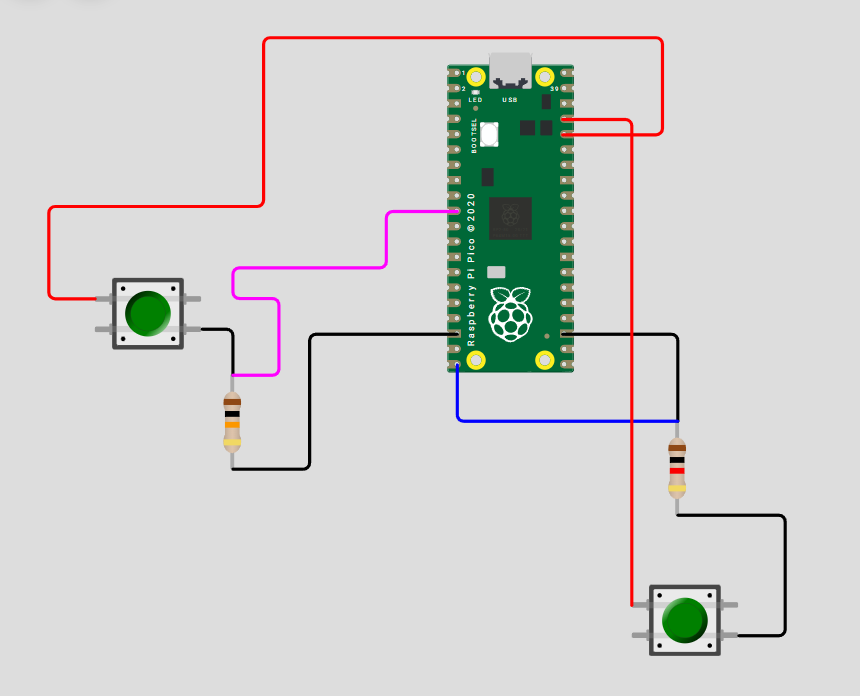
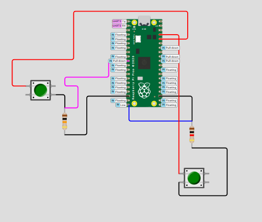
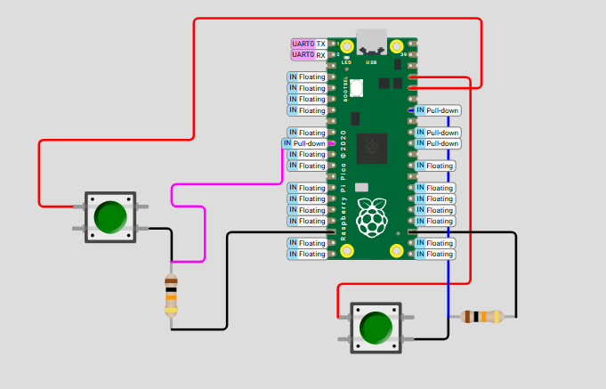
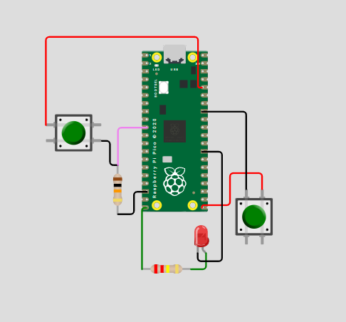

# sesion-07a

## apuntes sesión

### Código
partimos la clase analizando con mayor profundidad este código de ejemplo

```cpp
// include con <>
// este archivo esta en un que tiene que ver
// con la instalacion general de cpp 
#include <stdio.h>

// include con ""
// esto es literalmente en ese lugar
// al lado de este archivo
// hay una carpeta pico/
// y adentro esta stdlib.h
#include "pico/stdlib.h"

// declaracion de clase Termo
class Termo {
  // palabra clave public
  // la usaremos este semestre
  public:
    // atributos de la clase
    // (variables internas) 
    bool existencia = true;
    bool abierto = false;
    int posicion = 0;
    int cantidadML;
    float temperatura = 100.0;
    int rodamientos = 5;

    // metodo constructor
    // con un parametro cuantosML
    Termo(int cuantosML) {
      cantidadML = cuantosML;
    }
    
    // metodos para abrir y cerrar
    void abrir() {
      abierto = true;
    }
    void cerrar() {
      abierto = false;
    }

    // metodo para enfriar
    void enfriar () {
      temperatura = temperatura - 0.7;
    }

};


// mi propia funcion
// sintaxis es
// tipo nombre parentesis murcielagos
// diseno top-down
// esta funcion retorna el entero mayor
int cualEsMayor(int x, int y) {

  // si x es mayor o igual a y
  // retorna x
  if (x >= y) {
    return x;
  }
  // en otro caso retorna y
  else {
    return y;
  }
}

// funcion main()
// es de tipo int
// las int cuando corren
// retornan un entero
int main() {
  // esta funcion
  // inicializa raspico
  stdio_init_all();

  // constructor
  // con parametro
  // para cuantosML
  Termo elDeCata(800);
  Termo elDeMati(500);

  while (true) {
   
    // imprimir resultado de
    // cual entero es mayor
    printf("entre 6 y 7, el mayor es: %d\n", cualEsMayor(6, 7));
    // imprimir contenidos de termo de catalina
    printf("termo de cata: %d ml\n", elDeCata.cantidadML);

    if (elDeCata.abierto) {
      printf("el termo de cata esta abierto\n");
    } else {
      printf("el termo de cata esta cerrado\n");
    }

    printf("termo de mati: %.1f grados\n", elDeMati.temperatura);
   
    printf("\n");
    
    // actualizar termos
     
    // si esta abierto, cerrarlo
    // si esta cerrado, abrirlo
    if (elDeCata.abierto) {
      elDeCata.cerrar();
    } else {
      elDeCata.abrir();
    }

    // enfriar el termo de mati
    elDeMati.enfriar();

    // pausa en milisegundos
    sleep_ms(1000);
  }
}      
```

### Programación orientada a objetos 
- **variables:**
```
características, propiedades, estado de un objeto (cambiantes)
almacenan información o dato que identifican a cada objeto
```

- **método - función:**
```
comportamiento u acciones que el objeto puede realizar
modifica atributos o interactúa con otros objetos
envoltorio
conversar entre ellos o con los atributos
```
- **método constructor:**
```
se llama solo una vez
tiene el mismo nombre de la clase pero no tiene ningún tipo de retorno
iniciar objeto, asignando valores requeridos a los atributos 
```
  
```cpp
class Termo {
  // nueva clase llamada Termo
  // palabra clave public
  // la usaremos este semestre
  public:
    // atributos de la clase
    // (variables internas)
    // características o estados que tendrá cada objeto  
    bool existencia = true;
    bool abierto = false;
    int posicion = 0;
    int cantidadML;
    float temperatura = 100.0;
    int rodamientos = 5;

    // metodo constructor
    // con un parametro cuantosML
    // se crea automáticamente
    // parámetro entero + atributo
    Termo(int cuantosML) {
      cantidadML = cuantosML;
    }
    
    // metodos para abrir y cerrar
    // modifican estado de los atributos del termo 
    void abrir() {
      abierto = true;
    }
    void cerrar() {
      abierto = false;
    }

    // metodo para enfriar
    void enfriar () {
      temperatura = temperatura - 0.7;
    }

};
```
```
while (true) -- mientras esto sea verdad, hazlo
else e.o.c "en otro caso"
.% -- place holder 
f -- float, mentira, aproximación, ruido 
int -- verdad
double -- float de mayor resolución
sleep -- delay
main.cpp -- en main está la estructura general
archivos h y archivos cpp, por cada clase 
en el h hay un resumen de todo, una declaración, es más pequeño 
en cpp un archivo grande, donde explica como se hace
```
### Programar un botón
tomar información y filtrarla

describir función

se mantiene en 0

si lo presiono es un leve pestañeo

doble click 

sensor inerte 

orden, diagrama de flujo -- SIEMPRE
```
Boton pausa (GP1);
Boton reproducir (GP3);
Boton apagar (GP30);
```
- realizamos en conjunto el código en wokwi
- en el cual siempre tenemos un ```maincpp``` ```Boton.h``` ```Boton.cpp```

<https://wokwi.com/projects/476507507193136129>

## encargos

1. usar el ejemplo base visto en clases <https://wokwi.com/projects/476507507193136129>, agregar un segundo botón en la simulación de hardware, agregar una segunda instancia de la clase Boton, agregarle un atributo y un método a la clase Boton, y hacer que el segundo botón haga algo diferente al primero.
2. descargar todos los archivos de wokwi, descomprimir el archivo.zip y subir esa carpeta a tu repositorio en esta sesión.

primero realicé distintas pruebas, manteniendo las conexiones similaares del primer botón, para que el otro al presionarlo mandara otro mensaje distinto, lo cual no me funcionó, entonces me rendí y quise probar algo distinto

<https://wokwi.com/projects/476535764702876673> -- 1er intento







para este nuevo código le pedí ayuda a la IA, especificándole el proyecto anterior y que quería integrar un nuevo botón que prendiera un LED

<https://wokwi.com/projects/476795657278740481> -- 2do intento 

<https://wokwi.com/projects/476824146410140673> -- final



## lectura
### Mindstorms: Children, Computers and Powerful Ideas - Seymour Papert
- sigo en la continuación del capítulo llamado "Turtle Geometry: A Mathematics Made for Learning"

*apuntes lectura*
- los ejemplos del texto muestran el cómo la continuidad hacen que la geomtería de la tortuga se pueda aprender de manera fácil y aplicable
- conocimiento matemático
- conocimiento matemático sobre el aprendizaje
- dar sentido a lo que quieres aprender
- geometría de tortugas -- sintónica -- alienta a la conciencia
- atribuir las problemáticas y plasmarlas en la vida real, de esta forma es más fácil poder proyectarlas para poder resolver los problemas
- variables como un medio de comunicación, fuente de poder personal

"Lo que más importa es que al crecer con unos pocos teoremas muy poderosos, uno llega a apreciar cómo ciertas ideas se pueden usar como herramientas para pensar a lo largo de toda la vida. Uno aprende a disfrutar y respetar el poder de las ideas poderosas. Uno aprende que la idea más poderosa de todas es la idea de ideas poderosas."

### George Polya

  1. pensamiento eurístico

<https://es.wikipedia.org/wiki/George_P%C3%B3lya>

<https://es.wikipedia.org/wiki/Heur%C3%ADstica>


