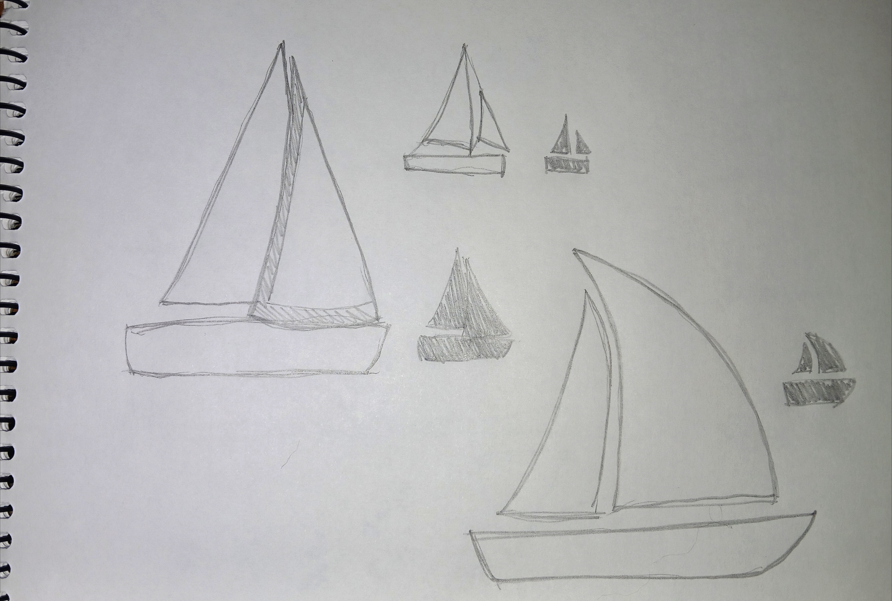

# sesion-04b

2026.09.04

## apuntes sesión

### Teloneo pre-9:00

Misaa volvió y nos contó sobre su residencia artística en Suiza.

### Bloque 9:00-12:50

Ya que no asistí la clase pasada y nuestro otro compañero de grupo congeló? aparentemente, Hugo quedó solo, así que Aarón nos fusionó con el grupo 6.

Para el proyecto se decidió usar de poeta a Alejandra Pizarnik, específicamente su poema "Puerto Adelante"

> Noche tibia sensación placentera. Los sones abstractos de las vías colmaban sus oídos eufóricos. Pensaba en el puerto que veía tan seguido... puerto de colores impresionistas y hombrea sucios de brazos mojados y brillosos y vello crecido y húmedo. Hombres impasibles a la lejanía maravillosa, al cielo entre los barcos, al paisaje de conjunto, al suelo atiborrado de objetos de lugares remotos como pedazos de mundo en el melancólico corazón de un mar...
> Sí. Hundirse una noche en las calles del puerto. Caminar, caminar... Sí. Sola. Siempre sola. Lenta, muy lentamente. Y el aire estará enrarecido, será un aire cosmopolita y el suelo lleno de papeles de cigarrillos que alguna vez existieron, blancos y hermosos.
> Sí. Se seguirá caminando. Hundirse, oscuridad, caminar...
> Sí. Y una estrella dará su color al ancla de plata que llevaba en su pecho. Tirar el ancla. Sí. Muy junto a ese barco gigante de rayas rojas y blancas y verdes...irse, y no volver.

Nos dividimos partes del trabajo, y yo quedé encargado de trabajar en las imágenes que vamos a colocar.

Ya que el fragmento que vamos a usar es "... irse, y no volver." y el poema en sí habla sobre el mar, decidimos que lo que mejor para las imágenes sería una secuencia de 4 fotogramas de un bote/barco.

Dibujé un velero para representar said bote/barco

Hice una animación? del velero yendo desde el lado izquierdo de la pantalla hasta el derecho

El cual luego traspasé a bitmap

Utilicé [image2cpp](https://javl.github.io/image2cpp/) para convertir cada frame en código para Arduino, pero aún no sé si funcionará. Will update. Would paste the code here, but it's wayyyy too lenghty para apuntes me thinks.

Update: funciona yipee. Solo que tuve que volver a pasar las imágenes por image2cpp porque necesitaba invertir los colores para el código.

## encargos

## lectura
