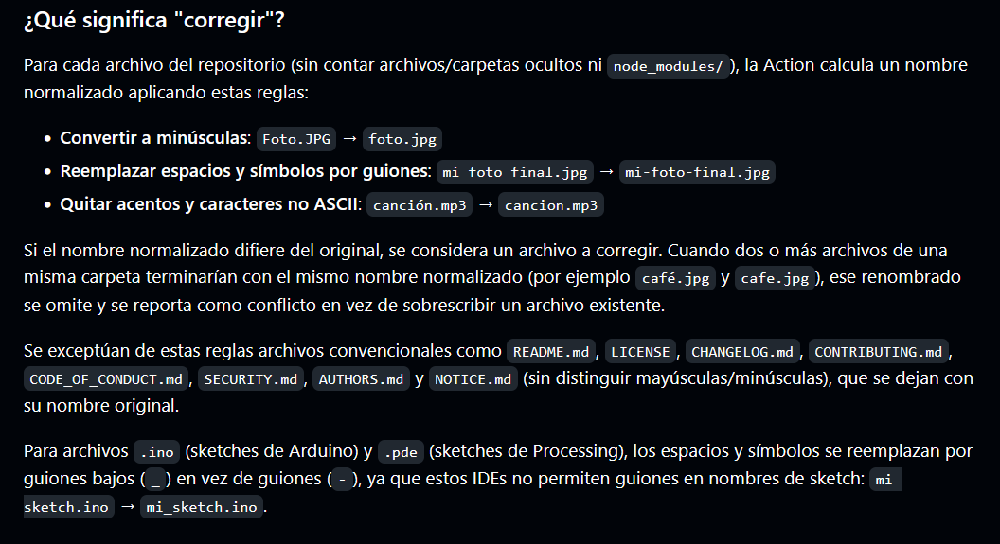

# sesion-05a

2026.09.08

## apuntes sesión

Hoy es el día de la presentación del proyecto-01. Elegimos ser el 7° grupo en presentar, así que en teoría tenemos tiempo para prepararnos hasta las 11:20

Aarón dijo que para el viernes, va a dar la oportunidad? de mejorar el README, cosas como jerarquía por ejemplo

---

Algo random que descubrí durante el break, hace unas clases, subí un archivo .ino al repo, y el arreglador de nombres lo cambió de 8-28 a 8_28, lo cual me pareció curioso ya que sé que, al menos con las imágenes, los guíones bajos (`_`) se cambian a guíones estándar (`-`). La cosa es que ahora subí algo a mi repo y corrió la acción del arreglador de archivos, así que decidí [ir a ver](https://github.com/piruetasxyz/arreglador-nombres-archivos) si podía entender qué tipos de archivos usaban guíon bajo y cuáles usaban guión regular, y me encontré esto

Aparentemente solo los archivos de Arduino (.ino) usan el guíon bajo

## lectura
