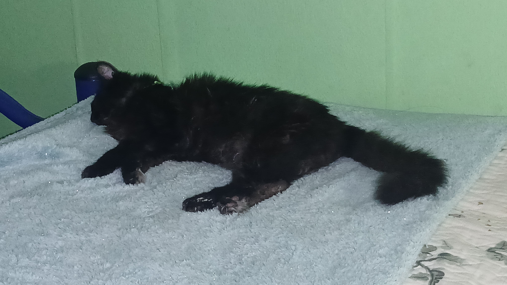

# sesion-06a

2026.09.22

## apuntes sesión

### Pre-clase

Aarón habló con Kristel sobre su práctica?, recomendó **NO** hacer titulación por práctica

### 9:00 - 10:30

¿Qué fue lo más difícil del proyecto anterior? En mi caso, antes del merge, fue decidir qué poema usar basado en cómo podríamos animar(?) los versos lol

`bool` es 1 o 0, `uint` es SOLO números positivos + el cero. `int` is ]-32,0[ & ]0,32[. En el `boolean` "cabe algo, o nada" pero en `int` "caben muchas cosas". la u de uint means "unsigned"

`class` [is a template to create objects having similar properties and behavior](https://www.geeksforgeeks.org/cpp/c-classes-and-objects/). type always starts with caps


eg.

```cpp
class Perrite {

bool hambre = true;
bool durmiendo = true;
int pelaje = #000000;

comer();
dormir();
}
```

. . . &rarr; datos, variables (atributos)

. . . ( . . . ) &rarr; acciones, funciones (métodos)

3 atributos y 3 métodos míos: i'm awake (bool), i'm wearing black (int? could be hex code? as in `int clothes = #000000;`), i have a cat (uint? i have *a* cat, but i could have more, eg. `uint petCats = 1;`) / teñirme el pelo, vestirme, conducir

### samplers de Aarón


&uarr; [KORG volca sample](https://www.korg.com/us/products/dj/volca_sample/)


&uarr; [RIDDIM supertone EP-40](https://www.korg.com/us/products/dj/volca_sample/)

---

TIL en VSCode, si escribo un color en hex code, me da un preview!


### 11:00 - 12:50

PCBA = PCB Assembly


[Wokwi](https://wokwi.com/)

Micropython está **prohibido** lol

## encargos

### Elegir un objeto, buscar las categorías del ser de Aristóteles. Analizar el objeto a partir de sus categorías.



&uarr; Mi gato, Pancho

- **Sustancia**: Mi gato, Pancho. Un ser viviente individual, una sustancia primaria. Pertenece a las sustancias secundarias *gato*, *animal*, y *ser viviente*

- **Cantidad**: Pancho pesa alrededor de 4.7 kg, y mide cerca de 48cm desde su nariz hasta la base de la cola. Tiene 16 años, y es un solo gato singular

- **Cualidad**: Su pelaje es completamente negro, con algunas canas debido a la edad, con ojos amarillos y una personalidad relativamente calmada. Puede maullar, ronronear, y trepar

- **Relación**: Pancho es mi mascota, y yo, junto a mi familia, somos sus dueños o cuidadores, por lo tanto depende de nosotros para comer y tener un lugar donde vivir

- **Lugar (dónde)**: Generalmente pasa su tiempo en la pieza de mi hermana, específicamente en su cama o su silla de escritorio

- **Tiempo (cuándo)**: Pancho es más activo en la tarde, pasado las 4pm, ya que ahí es cuando suele haber más gente en casa. Normalmente duerme de corrido desde las 10pm hasta las 6am. Nació en 2009

- **Situación (posición)**: En este mismo momento, está acostado a los pies de mi cama, durmiendo. Le gusta estar de lado, completamente estirado

- **Hábito (posesión)**: Tiene un collar verde recubierto en plástico, del cual cuelga una medalla que dice su nombre (Panchito) por un lado, y el número de teléfono de mi papá por el otro lado

- **Acción**: Pancho a menudo maulla y llora por comida, lava su propio pelaje, e intenta atrapar cosas que uno lanza en su dirección (eg. al rebotar una pelotita contra la pared)

- **Pasión**: Él es afectado al ser acariciado, alimentado, lo asustan los ruidos de los autos, le gusta que le cepillen su pelo

---

### De una red social, descargar e investigar qué es lo que piensa de mí el algoritmo

Elegí descargar mi información de Instagram

Basado en mi dispositivo, it accurately know que estoy actualmente en Santiago, Chile

## lectura
