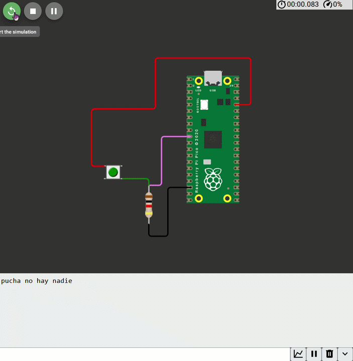

# sesion-07a

2026.09.29

## apuntes sesión

### Bloque 9:00 - 10:30

Comenzamos hablando del [código actualizado](https://wokwi.com/projects/476140065507309569) que mandó Aarón al discord durante el fin de semana
`%d` es un placeholder número `int`, `\n` es el salto de línea

Un botón solo tiene dos estados, 0 y 1. Si mantengo apretado el botón, lo lee como "0111111...0" con el cero final siendo cuando dejé de presionar el botón. El código puede leer cuándo (en tiempo) se dejó de presionar el botón, y definir una ventana de tiempo en el que puedo volver a presionar el botón y se defina como un "doble click" (0111111...01111...0)

```cpp
clase Nombre {
    // public permite cambiarlo externamente? 
    // i assume it means the code itself can change it
    // while private makes it so the code can only be read, and not affected
   public:
   // aquí van variables o atributos 
   int variableInt = 0;
   char variableChar = v;
   bool variableBool = true;

   Nombre(. . .);

   abrir(. . .);
   cerrar(. . .);
}
```

```cpp
// método constructor
// con un parámetro cuantosML
Termo(int, cuantosML) {
    cantidadML = cuantosML;
}
```

I state `cuantosML` as separate from `cantidadML` so I can independently change one parameter, like in line 23, it reads `int cantidadML;` rather than `int cantidadML = 500`

Clase &rarr; Perro / instancia &rarr; Copito

En la misma clase puede haber más de un constructor con los mismos parámetros

`while (true)` is basically Arduino's `void loop()`

`} else {` &rarr; "E.O.C" (En Otro Caso)

`%.1f` % &rarr; placeholder, f &rarr; float, .1 &rarr; return one (1) decimal

(random reminder to myself: it is BACKSLASH N `\n`, **NOT** SLASH N `/n`)

`double` has more memory than `float`, but it's not accurate regardless

`sleep_ms(1000);` is like `delay(1000);` in Arduino

```cpp
Class Boton {
    // atributos
    bool presionado = false;
    bool normalAbierto = true;
    uint duracionPresionado = 0;
    int patita;
    uint vecesPresionado = 0;
    char [] nombre;

    // constructor
    Boton(int, nuevaPatita) {
        patita = nuevaPatita;
    }

    // método
    // estos pueden conversar entre si
    // o con los atributos
    // esto es una declaración que va en los archivos .h
    void leer();
    void actualizar();
    
}
```

### Bloque 11:00 - 12:50

Continuando con "método" en el código

Tendremos dos tipos de archivo, .cpp (C++) y .h (header) por cada clase

We'll write some code on WOKWI, utilizamos el template de Pi Pico SDK

SDK &rarr; Software Development Kit

[Código escrito por Aarón en clase](https://wokwi.com/projects/476507507193136129)



## encargos

## lectura
