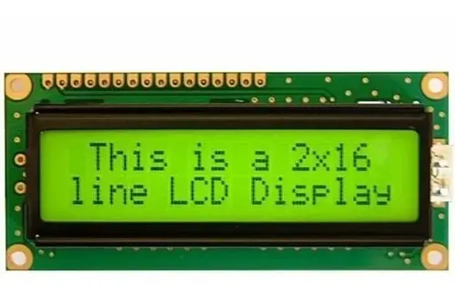
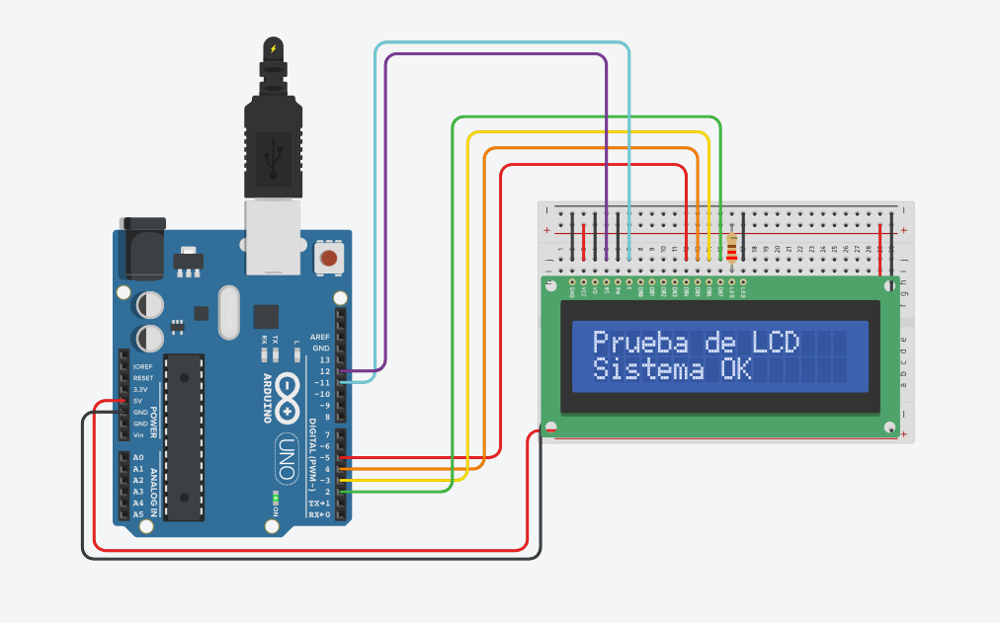
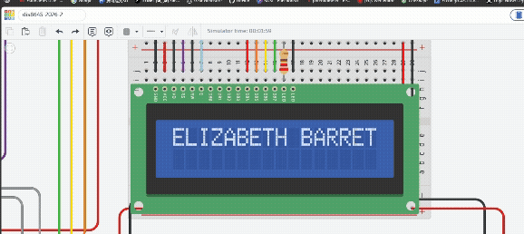
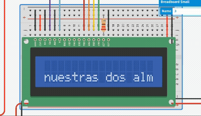

# sesion-03b

## apuntes sesión

### Licencias

Iniciamos hablando sobre la importancia de preservar las ideas, por lo que vamos a desglosar que es una licencia y sus variaciones.

**Licencia:** Es un contrato mediante el cual una persona recibe de otra el derecho de uso, de copia, de distribución, de estudio y de modificación (en el caso del Software Libre) de varios de sus bienes, normalmente de carácter no tangible o intelectual, pudiendo darse a cambio del pago de un monto determinado por el uso de los mismos. 

> Licencia. (2026, 11 de julio). En Wikipedia. <https://es.wikipedia.org/w/index.php?title=Licencia&oldid=>

<br>

Una vez entendida la defincioón de licencia, pasamos a los tipos de:

1. Copyright: Le otorga al dueño el derecho exclusivo de copiar, distribuir, adaptar, exhibir, y producir obras creativas, generalmente por un tiempo limitado. Este tiempo es aproximadamente de 70 años 

> [!NOTE]
> De ahora en adelante se mencionan licencias más enfocadas al código

2. MIT: Permite usar, modificar, distribuir e incluso vender el software, con la única condición de mantener el aviso de derechos de autor original

3. GPL (General Public License): Permite cualquier modificación, pero exige que cualquier proyecto derivado que se publique deba distribuirse obligatoriamente bajo esta misma licencia GPL, garantizando que el código se mantenga siempre libre. 

4. Creative Commons: Se enfoca en textos, documentación, fotografías y arte visual. Existen diversos módulos

      - CC0 (Dominio Público): El autor renuncia a todos los derechos de autor. Cualquier persona puede usar la obra para cualquier fin sin necesidad de dar crédito
  
      - CC BY (Atribución): Permite distribuir, mezclar y usar la obra con fines comerciales, siempre y cuando se mencione explícitamente al creador original
  
      - CC BY-SA (Compartir Igual): Permite el uso comercial y las modificaciones, pero exige que las obras derivadas se publiquen bajo esta misma licencia
  
      - CC BY-NC (No Comercial): Permite modificar y distribuir la obra, pero prohíbe estrictamente generar ganancias económicas directas con ella o con los proyectos que deriven de esta
  
   Luego de este mareo legal, procedo a mostrar la 2da parte de la clase

<br>

---

En esta clase vimos que es importante diferenciar entre: 

- String(): Es una clase, que nos permite crear un objeto dinamico, es decir que puede crecer, encogerse y mutar xd

- string: Es una variable, similar a _char_. La diferencia radica en que _char_ solo aloja un _char_acter, en cambio _string_ es un conjunto de caracteres.

 En base a lo anterior, existe una manera más eficiente de combinar un conjunto de caracteres. Además, esto nos sirve para exportar parte del código fuera de Arduino IDE, ya que utiliza principios propios de C++. Para esto se utiliza un array, que es un conjunto de variables y en este caso un conjunto de variables del tipo _char_

 ### Ejemplo

```cpp

// bah que raro
// con 5 no funciono
char nombre[6] = "aaron";

void setup() {
  Serial.begin(9600);
}

void loop() {
  Serial.print(nombre[0]);
  Serial.print(nombre[1]);
  Serial.print(nombre[2]);
  Serial.print(nombre[3]);
  Serial.println(nombre[4]);
}

```

Acá podemos ver como existe un conjunto de 5 caracteres que forman la palabra "_aaron_". Pero ¿Si quiero un conjunto de arrays del tipo _char_?

Bueno, podemos hacer un array de punteros. Esto busca optimizar memoria y ordenar de mejor manera las variables. Ejemplo


```cpp

// un poemario
// es un arreglo de paginas
// una pagina es un arreglo de lineas
// una linea es un arreglo de caracteres

char *misVersos[] = {
  "Mami, no te haga' de rogar",
  "No me gustaría perder el tiempo",
  "Que tenemo' pa' poderte tocar",
  "Y estás con otro, esa mierda no lo entiendo, yeah",
  "Que te lo juro, no eres nada pa' mí, te lo juro, ah",};

```

Acá podemos ver como poder guardar conjunto de caracteres, que forman palabras y que a su vez forman frases

<br>

#### Ejemplos propios

##### String

```cpp

String pokemonFavoritoA = "Bulbasaur";
String pokemonFavoritoB = "Growlithe";
String pokemonFavoritoC = "Sylveon";
String pokemonFavoritoD = "Delphox";
String pokemonFavoritoE = "Sableye";


void setup() {
  Serial.begin(9600);

  //baudios > simbolo
}

void loop() {
  // put your main code here, to run repeatedly:
  Serial.println(pokemonFavoritoA);
  Serial.println(pokemonFavoritoB);
  Serial.println(pokemonFavoritoC);
  Serial.println(pokemonFavoritoD);
  Serial.println(pokemonFavoritoE);
 
 delay(200); // Pausa de 0,2 segundos para no saturar el monitor 

 }

```


##### string

```cpp

char pokemonFavoritoA[] = "Sableye";
char pokemonFavoritoB[] = "Delphox";
char pokemonFavoritoC[] = "Bulbasaur";     

void setup() {
  Serial.begin(9600);

  //baudios > simbolo
}

void loop() {
  // put your main code here, to run repeatedly:
  Serial.println(pokemonFavoritoA);
  Serial.println(pokemonFavoritoB);
  Serial.println(pokemonFavoritoC);

 delay(200); // Pausa de 2 segundos para no saturar el monitor 

 }


```


##### array

```cpp

char *pokemonFavoritos[] = {
"Bulbasaur",
"Growlithe",
"Sylveon",
"Delphox",
"Sableye",
};

void setup() {
  Serial.begin(9600);

  //baudios > simbolo
}

void loop() {
  // put your main code here, to run repeatedly:
 for (int i = 0; i < 5; i++) {
  Serial.println(pokemonFavoritos[i]);
 }
}


```


<br>

## encargos

encargo-03b:

1. apuntes personales de String, string, array, con bibliografia y con pantallazos de resultados, y dudas textuales.

> se encuentra más arriba la info 

<br>

2. subir código a su bitácora ordenado con el formato de backticks a continuación, del proyecto hasta ahora.

### test Pantalla 

Ya que consideramos utilizar una pantalla LCD Azul 16 x 02 que solo acepta caracteres, busque un código de prueba para entender cómo funciona este tipo de _display_

> Pantalla LCD Verde / Azul 16 x 02
>
> 
>
> [Afel](https://afel.cl/products/pantalla-lcd-azul-16x02)

```cpp

// 1. Incluir la biblioteca que maneja la comunicación
#include <LiquidCrystal.h>

// 2. Indicarle al Arduino a qué pines físicos está conectada la pantalla
// El orden es: RS, E, D4, D5, D6, D7
LiquidCrystal lcd(12, 11, 5, 4, 3, 2);

void setup() {
  // 3. Inicializar la pantalla especificando su tamaño (16 columnas, 2 filas)
  lcd.begin(16, 2);
  
  // 4. Ubicar el cursor (columna 0, fila 0 es la esquina superior izquierda)
  lcd.setCursor(0, 0);
  lcd.print("Prueba de LCD"); // Imprimir en la primera línea
  
  // 5. Mover el cursor a la segunda línea (columna 0, fila 1)
  lcd.setCursor(0, 1);
  lcd.print("Sistema OK");    // Imprimir en la segunda línea
}

void loop() {
  // Para una prueba básica donde el texto no se mueve, 
  // el loop se deja completamente vacío. 
  // Lo que escribiste en el setup() permanecerá fijo en la pantalla.
}

```

<br>



En base al código base, intente hacer una prueba de texto que forma parte de muestro inicio, es decir:

- Licencia Crative Commons BY-SA
- Nombre del poema
- Nombre de la autora

```cpp

#include <LiquidCrystal.h>
LiquidCrystal lcd(12, 11, 5, 4, 3, 2);


char textoInicialA[] = "[PLACEHOLDER] - CC BY-SA 4.0";
char textoInicialB[] = "Cuando nuestras dos almas se eleven";
char textoInicialC[] = "ELIZABETH BARRETT BROWNING";

// ocurre al inicio una sola vez
void setup() {
Serial.begin(9600);

lcd.begin(16, 2);
}


//ocurre de manera repetida despues de setup
void loop(){

lcd.setCursor(0, 0);
lcd.print(textoInicialA); // Imprimir en la primera línea

lcd.setCursor(0, 1);
lcd.print(textoInicialB); // Imprimir en la segunda línea

lcd.clear();

lcd.setCursor(0,0);
lcd.print(textoInicialC);
}

```

<br>

Lastimosamente este código falló estrepitosamente, pero eso es bueno, nos ayuda a entender que elementos fallaron. En este caso, no existe un _delay()_ entre cada elemento a imprimir, por lo que "pelean" por cual va a ocupar la pantalla 



<br>

Finalmente tenemos nuestro inicio de poema funcional, para ello se agregaron _delay()_ después de cada sección a mostrar del texto

```cpp

#include <LiquidCrystal.h>

// versos del poema

char *versosPoema[] = {
  "Cuando estan nuestras almas frente a frente,", 
  "mudas, erguidas, fuertes, ya muy proximas,",
  "y sus alas se encienden al tocarse,",
  "en cada punta curva ¿qué mal amargo" ,
  "puede hacernos la tierra, que no debiéramos",
  "quedarnos aquí, contentos? Piénsalo. Al subir más alto,",
  "los ángeles nos oprimirían y aspirarían",
  "a dejar caer algún áureo orbe de canto perfecto",
  "en nuestro hondo, querido silencio. Quedémonos",
  "mejor en la tierra, Amado mío, donde los ánimos",
  "contrarios e injustos de los hombres retroceden",
  "y aíslan a los espíritus puros, y permiten",
  "un lugar donde estar y amar por un día,",
  "con la oscuridad y la hora de la muerte rodeándolo.",
};

// estado del boton A: true si esta presionado ahora mismo
bool botonA = false;
// estado del boton B: true si esta presionado ahora mismo
bool botonB = false;
// pin fisico donde esta conectado el boton A
const int botonAPin = 2;
// pin fisico donde esta conectado el boton B
const int botonBPin = 3;
// bandera: true cuando el texto esta congelado y no debe avanzar
bool versoDetenido = false;
// bandera: true cuando la palabra clave esta visible en pantalla
bool palabraVisible = false;

// arreglo con las palabras clave, una por seccion del poema
// se ordenan de manera correlatiava
// 1er verso corresponde a palabra clave #1
char *palabrasClave[] = {
  "PLACEHOLDER1",
  "PLACEHOLDER2",
  "PLACEHOLDER3"
  "PLACEHOLDER4",
  "PLACEHOLDER5",
  "PLACEHOLDER6",
  "PLACEHOLDER7",
  "PLACEHOLDER8",
  "PLACEHOLDER9",
  "PLACEHOLDER10",
  "PLACEHOLDER11",
  "PLACEHOLDER12",
  "PLACEHOLDER13",
  "PLACEHOLDER14",
  "PLACEHOLDER15",
};

// corresponde a los pines que utiliza la pantalla 
// pantalla lcd verde 16 x 02 con controlador SPLC780D1 o HD44780
LiquidCrystal lcd(12, 11, 5, 4, 3, 2);

// texto que se muestra al inciar el dispositivo
const char textoInicialCC[] = "[PLACEHOLDER] - CC BY-SA 4.0"; // licencia de uso, Creative Commons BY-SA 4.0
const char textoInicialTitulo[] = "Cuando nuestras dos almas se eleven"; // titulo del poema
const char textoInicialAutora[] = "Elizabeth Barret Brown"; // autora del poema

void setup() {
  lcd.begin(16, 2); //define el tamaño de la pantalla

  // --- PANTALLA 1: textoInicialCC / Creative Commons BY - SA --- 

  lcd.setCursor(0, 0); //define la seccion superior de la pantalla
  for(int i = 0; i < 16 && textoInicialCC[i] != '\0'; i++) {
    lcd.print(textoInicialCC[i]);
  }
  lcd.setCursor(0, 1); //define la seccion inferior de la pantalla
  lcd.print(textoInicialCC + 16); 
  
  delay(4000); 
  lcd.clear();


  // --- PANTALLA 2: Carrusel de textoInicialB en la fila inferior (0, 1) ---
  int largoB = strlen(textoInicialTitulo); // Calculamos el largo (35 letras)
  
  // Calculamos cuántos pasos debe avanzar para mostrarlo todo.
  // Si el texto es más corto de 16, no se mueve (0 pasos).
  int pasosTotales = (largoB > 16) ? (largoB - 16 + 3) : 0; // +3 para dejar unos espacios al final
  
  for(int pos = 0; pos <= pasosTotales; pos++) {
    lcd.setCursor(0, 1);
    
    // Imprimimos la "ventana" de 16 caracteres
    for(int i = 0; i < 16; i++) {
      if (pos + i < largoB) {
        lcd.print(textoInicialTitulo[pos + i]);
      } else {
        lcd.print(' '); // Rellena con espacios en blanco cuando se acaba el texto
      }
    }
    
    // Si estamos en el primer cuadro (pos = 0), hacemos una pausa más larga
    // para que el usuario pueda empezar a leer antes de que se mueva.
    if (pos == 0) {
      delay(2000); 
    } else {
      delay(350); // Velocidad del carrusel (350ms por letra)
    }
  }
  
  lcd.clear();


  // --- PANTALLA 3: textoInicialC ---
  lcd.setCursor(0, 0);
  for(int i = 0; i < 16 && textoInicialAutora[i] != '\0'; i++) {
    lcd.print(textoInicialAutora[i]);
  }
  lcd.setCursor(0, 1);
  lcd.print(textoInicialC + 16); 
  
  delay(4000); 
  lcd.clear();
}

//ocurre de manera repetida despues de setup
void loop(){

//botón es 1 o 0
//si un botón es 1 y el otro 0 ocurre el punto 4
//si ambos botones son 1 y 1 ocurre el 5, 6 y 7

// leerBotones (botón a, botón b) {
// if (bóton a + botón b)
// return true: // devolver true si ambos botones son 1
// return false: // devolver false si un botón es 1 y el otro 0
} 

// contarVersos() 

//leerVerso() 
//avanzarVerso()
//detenerVerso()
//reiniciarVerso()
//mostrarPalabra()
//deshacerPalabra()


```



<br >

3. definir y escribir el corpus a usar: autora, poemas, licencias, poblarlo en la carpeta 00-proyecto-1

Se encuentra toda la info en el repo grupo-01

<br>


## lectura


