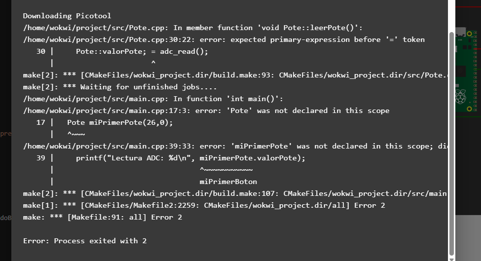
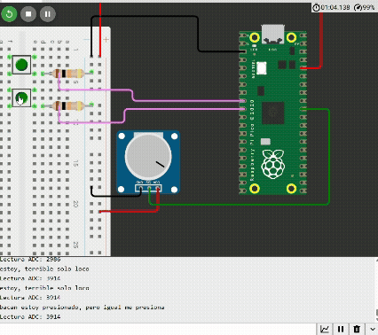
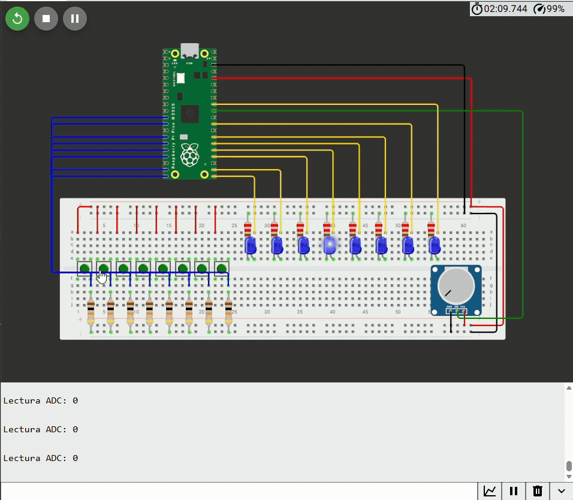
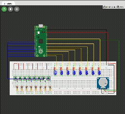
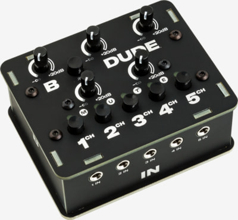
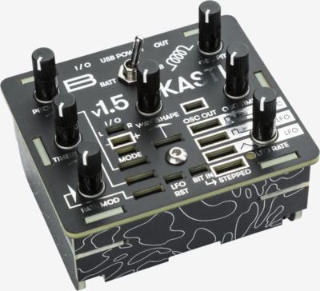
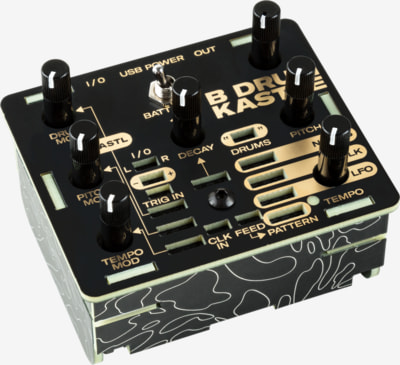
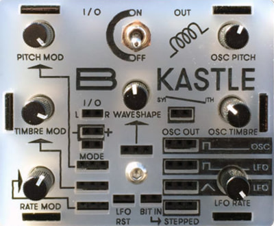
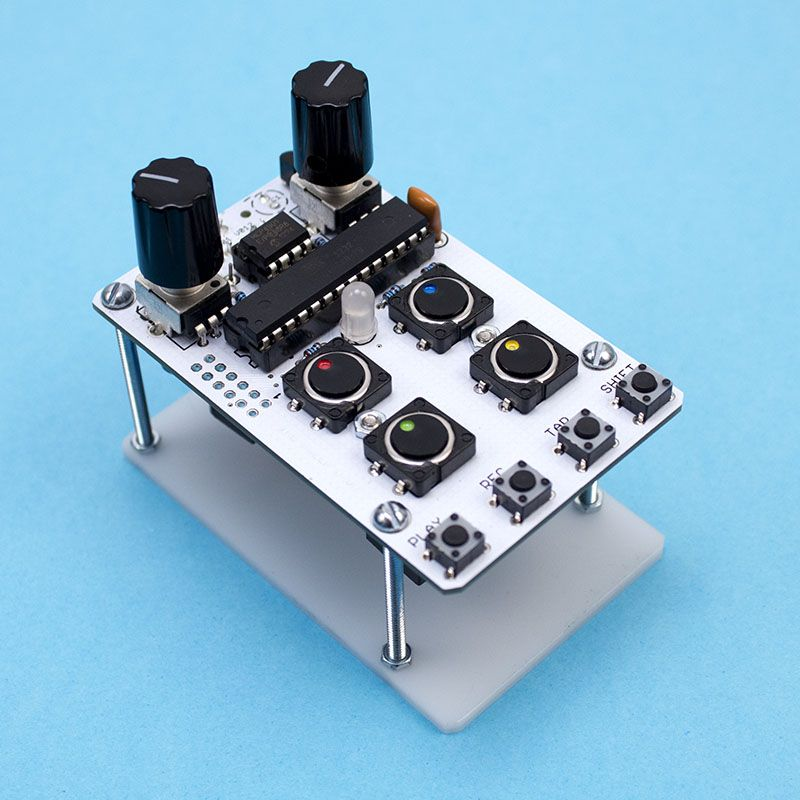

# sesion-07a

## apuntes sesión

Revisamos el código de ejemplo de la semana pasada y observamos lo siguiente:

```cpp

    printf("Hola mundo\n");

```

Antes de terminar las comillas podemos observar `\n`, este corresponde a un salto de línea. Cumpla misma función que en Arduino IDE `Serial.println()`.

<br>

```cpp

printf("entre 6 y 7, el mayor es: %d\n", cualEsMayor(6, 7));

```

En este caso visto en la sesión anterior observamos un nuevo elemento, `%d`. La función que cumple es de un "placeholder", es decir una casilla reservada para un caracter alfanumerico, el equivalente a dejar la mochila en una silla guardando puesto a una amiga que viene tarde desde San Bernardo.

A continuación obervamos un ejemplo del texto que se imprime:

```

entre 6 y 7, el mayor es: 7

```

Tal como se mencionó, el número `7` ocupo el lugar de `%d`. ¿Que sucede si ahora queremos añadir decimales? Muy buena pregunta vocesilla interna.

Para añadir decimales existe `%.xf`, vamos a desglozar este conjunto de elementos que parecen una risa de gen z

- `%` Tal como mencionamos, este simbolo indica caracteres alfanumericos
- `.x` Indica decimales, la x es la cantidad de estos
- `f` es por la variable `float`, que nos indica decimales

Ejemplo:

```cpp

printf("termo de mati: %.1f grados\n", elDeMati.temperatura);

```

Imprimiendo:

```

termo de mati: 71.3 grados

```

<br>

### Clases

La estructura de una clase se corresponde a:

```cpp

class Name;{

    public:

        int numero;
        bool pregunta;
        char caracter;

    Nombre(nombreConstructor) 

    void metodo()

}

```

En resumen una clase se estructura de la siguiente manera:

1. class + Nombre de clase
2. atributos / variables de clase
3. metodo constructor 
4. metodos

En clase sucedio que me perdí peor que en el nether de Minecraft con los constructores, ya que poseen una estructura algo singular:

```cpp

class Boton {

bool normalAbierto = true;
bool presionado = 0;
uint duracionPresionado = 0; //en ms
int patita;
uint vecesPresionado = 0;
char[] nombre;


//constructor
Boton(int nuevaPatita) {
patita = nuevaPatita;


//métodos
void leer()

//main.cpp
//clase Boton.cpp y Boton.h por cada clase
//h de header
}

```

El constructor funciona al ingresar una variable `int nuevaPatita`, sumado a esto en la siguiente linea observamos que este valor corresponde a la variable `int patita;`. La razón de esto, se debe a que el constructur se asocia a mínimo una variable y este se renombra luego para evitar confusiones con la o las variables asociadas, es decir que el constructor es del tipo `int` y se llama `nuevaPatita` y para crearlo se le asigna una valor que corresponderá a `int patita`.

Es importante mencionar que se requiere siempre de al menos un constructor, ya que es el encargado de pasarnos los ladrillos al construir nuestra muralla ficticia, sin él, no nos llegan los ladrillos (datos) a nuestra pared (metodos)

<br>

### incluir clases en el código

Ahora sabemos la estructura de una clase, pero la implementación no es solo llegar, escribirlo y magia. Vamos a desglozar.

- `Boton.h` Corresponde a un nivel de abstracción medio, acá se declaran variables y métodos, más no se definene
- `Boton.cpp` Es el nivel más técnico, se describe el desarrollo de la clase completamente

Tenemos como ejemplo el siguiente en [Wokwi](https://wokwi.com/projects/476507507193136129)

<details>
<summary><h4> 🔴 <b>código visto en clases - main.cpp</b></h4></summary>

```cpp

// esto venia en wokwi
#include <stdio.h>
#include "pico/stdlib.h"

// incluir mis archivos
#include "Boton.h"

int main() {

  stdio_init_all();

  // crear Boton que se llama miPrimerBoton
  // con el constructor
  Boton miPrimerBoton(7);
  
  while (true) {

    miPrimerBoton.leer();

    if (miPrimerBoton.presionado) {
      printf("bacan estoy presionado, pero igual me presiona\n");
    }
    else {
      // cuando no este presionado
      printf("no hay nadie presionandome\n");
    }

    sleep_ms(10);

  }
}

```

</details>

<br>

<details>
<summary><h4> 🔴 <b>código visto en clases - Boton.h</b></h4></summary>

```cpp

#ifndef BOTON_H
#define BOTON_H

// esto lo agregamos para GPIO
// general purpose input output
#include "hardware/gpio.h"


// Boton.h
// declaraciones de la clase Boton


// definir clase Boton
class Boton {

  // todo publico
  // nada de andar privatizando
  public:

  // atributos
  bool presionado = false;
  int duracionPresionado = 0;
  int patita;


  // constructor
  Boton(int nuevaPatita);

  // metodos
  void leer();
  void presionar();
  void soltar();

};

#endif

```

</details>

<br>

<details>
<summary><h4> 🔴 <b>código visto en clases - Boton.cpp</b></h4></summary>

```cpp

// Boton.cpp
// implementaciones de la clase

// importar el archivo header
#include "Boton.h"

// constructor
Boton::Boton(int nuevaPatita) {

  // guardar el valor
  Boton::patita = nuevaPatita;

   // inicializar patita
  gpio_init(Boton::patita);
  // la patita es entrada
  gpio_set_dir(Boton::patita, GPIO_IN);
}

void Boton::leer() {
    // leer boton
    Boton::presionado = gpio_get(Boton::patita);
}

// metodos
void Boton::presionar() {
  Boton::presionado = true;
  // queda pendiente calcular
  // cuanto rato lleva presionado
}
  
void Boton::soltar() {
   Boton::presionado = false;
   Boton::duracionPresionado = 0;
}

```

</details>

## encargos

_1. usar el ejemplo base visto en clases <https://wokwi.com/projects/476507507193136129>, agregar un segundo botón en la simulación de hardware, agregar una segunda instancia de la clase Boton, agregarle un atributo y un método a la clase Boton, y hacer que el segundo botón haga algo diferente al primero._

<br>

### añadir 2do botón

Para poder realizar un segundo botón no fue complejo, la dificultad que tuve radicó en añadir una función que ocurriera al no estar ningún botón presionado, para ello recurrí a la lógica boolena y utilize una compuerta AND. Es decir que para algo ocurra 2 elementos deben cumplir un parámetro, en este caso que `miPrimerBoton` y `miSegundoBoton` en su variable de `presionado` posea valor `false`

```cpp

 if (miPrimerBoton.presionado == false && miSegundoBoton.presionado == false) {
      printf("estoy, terrible solo loco\n");
    }

```

Como observamos, es necesario que exista `==` para definir una igualdad matemática (valores iguales) y al momento de definir AND se hace con `&&`

Para acceder a los archivos, hacer click [ACÁ](./ejemplo2-botones/) 

<br>

### añadir pote

Ahora quiero pavimentar el camino para las próximas clases (xddd), por lo que vamos a describir que atributos corresponden a un potenciómetro:

```cpp

#ifndef POTE_H
#define POTE_H

// esto lo agregamos para GPIO
// general purpose input output
#include "hardware/gpio.h"

class Pote {


//atributos -----
int conexion; //en que GPio se encuentra conectado
uint16_t valorPote = 0; //valor que se obtiene de la lectura del pote (solo es positivo)
// ademas se indica que inicia en 0 para identificar si no posee lectura


//constructor -----
Pote(int nuevaConexion) {

conexion = nuevaConexion;

//metodos -----
void leerPote()
}
};

#endif // esto sumado a la primera linea sirven para que solo sea llamado una vez y no caiga en un bucle

```

<br>

Lo anterior posee un nivel de abstracción aún, ya que aún no nos hacemos responsables de como va a leer el pote, es decir que hicimos `Pote.cpp`

```cpp

// Pote.cpp
// implementaciones de la clase

// importar el archivo header
#include "Pote.h"
#include "hardware/adc.h" // biblioteca ADC

// constructor
Pote::Pote(int nuevaConexion) {

  // guardar el valor
  // el doble : es para hacer un llamado dentro de un elemento
  Pote::conexion = nuevaConexion;

    // inicializar ADC
    // Analog to Digital Converte
    adc_init();

    //preparar GPio para entrada analoga
    adc_gpio_init(conexion);

    //seleccionar canal del ADC
    adc_select_input(pinADC);
    // debemos añadir esa variable a nuestra Pote.h

}

void Pote::leerPote() {
    // leer un pote
    while (true) {
       uint16_t Pote::valorPote = adc_read(); 
    }
}

```

Luego de revisar posibles errores soluciona la mitad, pero varios me dieron problemas:



<br>

[Ejemplo pote 01](./2botones1pote-v-0-1/)

<br>

Para ver que solucionar me acerque al inicio de las clases (a las primeras sesiones, donde hicimos pruebas con el potenciometro en Arduino) y [acá](/00-docentes/sesion-02a/ej_pico_pote/main.c) observé el código y busqúe como implementarlo a la clase Pote

Luego de múltiples búsquedas y solucionar errores pequeños, llegue al código final [aquí](./2botones1pote-v-0-2/)




El principal problema que tuve fue que al leer el pote me dejaba un valor estático, se soluciono añadiendo `miPrimerPote.leerPote();`, de esta manera se genera una lectura de manera consistente

<br>

### arrays + clases

Luego de varias pruebas y errores logre comprender y añadir potenciometros y ampliar el concepto de las clases. Me fue de gran ayuda entender como combinar los arrays al momento de _construir_ instancias.

Acá adjunto gif de la última actualización, donde las luces oscilan (la idea es poder reemplazar/sumar una onda que genere sonido) una vez seleccionado el boton correspondiente. La idea es que el potenciometro altere la oscilación, pero es algo para el futuro



Luego de diversos cambios e investigación se implementó el potenciométro para alterar la velocidad de oscilación



<br>

Adjunto PDF del chat con Gemini que me ayudó a comprender ciertos elementos [ACÁ](./imagenes/chat-gemini.pdf)

Además si clickean [AQUÍ](./luces-oscilando) podran observar los archivos que se crearon, sin olvidar el link del proyecto [Link Wokwi](https://wokwi.com/projects/476512284795190273)

<br>

### ideas proyecto 02 - 03

#### referente raspi

A continuación adjunto video que me ayuda a entender y comprender que se podria realizar para un futuro proyecto

- <https://www.youtube.com/watch?v=jm5V9wdTMXQ>

#### funcionamiento - Korg Volca Sample

Un referente que considero relevante a la hora de desarrollar un sampler, es el Korg Volca Sample. Este posee disitintos botones y perrilas que funcionan en un sistema estructurado para generar una infinidad de posibilidades.

- [Video](https://www.youtube.com/watch?v=bSTxg43_wBM&t=35s)

- 

#### carcasa - bastl









Todos estos modelos de la serie Bastl, consisten de laminas encajadas y aseguradas mediante pernos, lo curioso es que estas son de PCB, a las cuales se le aplica serigrafía

#### otros - Bleep Drum

- 

Este es un controlador MIDI, que además es una caja de ritmos que funciona mediante un microcontrolador del tipo ATMEGA

---

_2. descargar todos los archivos de wokwi, descomprimir el archivo.zip y subir esa carpeta a tu repositorio en esta sesión._

Archivos ya subidos :p

## lectura
