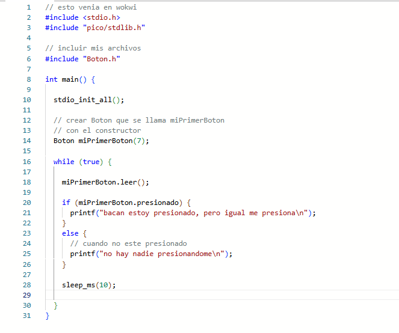
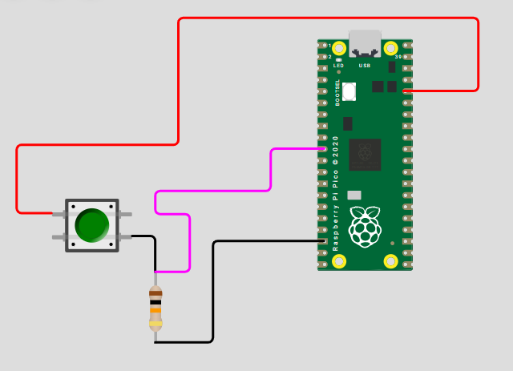
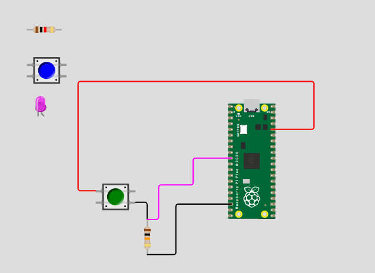
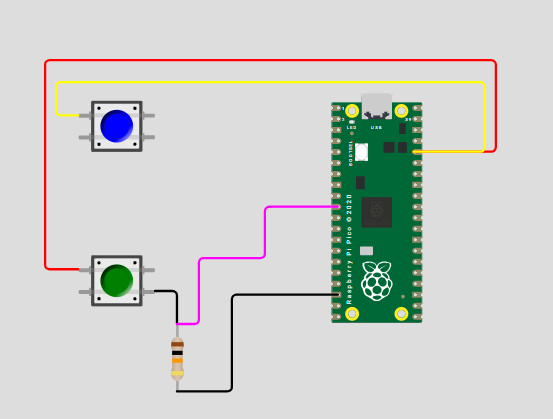
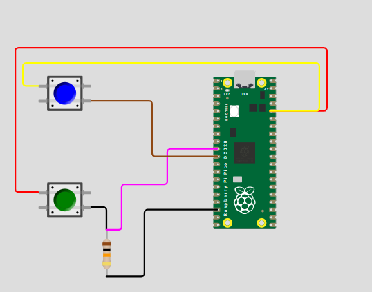
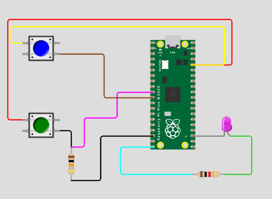
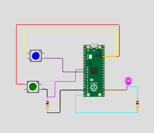

# sesion-07a

martes 2026-09-29

## apuntes sesión

aaron hizo el codigo el fin de semana para poder ponerlo de ejemplo el día de hoy


este es el código de la semana pasada

```c++
// include con <>
// este archivo esta en un que tiene que ver
// con la instalacion general de cpp 
#include <stdio.h>

// include con ""
// esto es literalmente en ese lguar
// al lado de este archivo
// hay una carpeta pico/
// y adentro esta stdlib.h
#include "pico/stdlib.h"

// declaracion de clase Termo
class Termo {
  // palabra clave public
  // la usaremos este semestre
  public:
    // atributos de la clase
    // (variables internas) 
    bool existencia = true;
    bool abierto = false;
    int posicion = 0;
    int cantidadML;
    float temperatura = 100.0;
    int rodamientos = 5;

    // metodo constructor
    // con un parametro cuantosML
    Termo(int cuantosML) {
      cantidadML = cuantosML;
    }
    
    // metodos para abrir y cerrar
    void abrir() {
      abierto = true;
    }
    void cerrar() {
      abierto = false;
    }

    // metodo para enfriar
    void enfriar () {
      temperatura = temperatura - 0.7;
    }

};

// mi propia funcion
// sintaxis es
// tipo nombre parentesis murcielagos
// diseno top-down
// esta funcion retorna el entero mayor
int cualEsMayor(int x, int y) {

  // si x es mayor o igual a y
  // retorna x
  if (x >= y) {
    return x;
  }
  // en otro caso retorna y
  else {
    return y;
  }
}

// funcion main()
// es de tipo int
// las int cuando corren
// retornan un entero
int main() {
  // esta funcion
  // inicializa raspico
  stdio_init_all();

  // constructor
  // con parametro
  // para cuantosML
  Termo elDeCata(800);
  Termo elDeMati(500);

  while (true) {
   
    // imprimir resultado de
    // cual entero es mayor
    printf("entre 6 y 7, el mayor es: %d\n", cualEsMayor(6, 7));
    // imprimir contenidos de termo de catalina
    printf("termo de cata: %d ml\n", elDeCata.cantidadML);

    if (elDeCata.abierto) {
      printf("el termo de cata esta abierto\n");
    } else {
      printf("el termo de cata esta cerrado\n");
    }

    printf("termo de mati: %.1f grados\n", elDeMati.temperatura);
   
    printf("\n");
    
    // actualizar termos
     
    // si esta abierto, cerrarlo
    // si esta cerrado, abrirlo
    if (elDeCata.abierto) {
      elDeCata.cerrar();
    } else {
      elDeCata.abrir();
    }

    // enfriar el termo de mati
    elDeMati.enfriar();

    // pausa en milisegundos
    sleep_ms(1000);
  }
}
```

### apuntes
- existen class privadas y publicas (en realidad existen más)
- %.1f (f = float)
- los float son aproximaciones no son números enteros

ejemplo

```c++
    printf("termo de mati: %.1f grados\n", elDeMati.temperatura);
```

- **double** es como float pero con mayor resolución/capacidad (es el doble de float)
- los métodos son un envoltorio/ son funciones
- una clase contiene dos archivos main.cpp / Archivos.h(pp) / Archivos.cpp
- Archivos.**cpp** son archivos mas grandes que Archivos.**h**
- **Archivos.cpp** son las especificaciones de los códigos
- **Archivos.h** solo dice las estructuras


materia
- classNombre{
    - public:
       - int
       - bool
       - char
   
**variables/atributos**

   - construcción:
   - Nombre(...)

}


- métodos
     - abrir (...)
     - cerrar(...)


### ejemplo realizado en clases de clases

**classBoton{**

atributos
  - bool presionado = 0;
  - bool normalAbierto = true;
  - int duracionPresinado = 0;
  - int patita; (acción del constructor)
  - uint vecesPresionado = 0;


constructor
   - se hacen con parentesis **()**
   - murcielagos **{}**
   - y con el nombre de la clase **Boton**

```c++
Boton(int nuevaPatita){
patita = nuevaPatita;
}
```
  - Boton pausa (GP1);
  - Boton reproducir(GP3);
  - Boton apagar(GP30);


métodos


### ejercicio en clases

código en crudo

```cpp
// esto venia en wokwi
#include <stdio.h>
#include "pico/stdlib.h"


// esto lo agregamos para GPIO
// general purpose input output
#include "hardware/gpio.h"

// incluir mis archivos
#include "Boton.h"

int main() {

  stdio_init_all();

  // inicializar patita 7
  gpio_init(7);
  // la patita 7 es entrada
  gpio_set_dir(7, GPIO_IN);
  
  // crear Boton
  // que se llama miPrimerBoton
  // con el constructor
  // habia hecho un error
  // que era usar parentesis sin nada
  // que no son necesarios cuando
  // el constructor no tiene parametros
  // Boton miPrimerBoton();
  Boton miPrimerBoton;
  
  while (true) {


    // leer boton
    bool lectura = gpio_get(7);


    if (lectura) {
     printf("caramba estoy presionado\n"); 
    } else {
      printf("pucha no hay nadie\n"); 
    }

    // digitalRead();

    // if (miPrimerBoton.presionado) {
    //   printf("bacan estoy presionado, pero igual me presiona\n");
    //   printf("o como dice matias, estoy impresionado jaja\n");
    //   miPrimerBoton.soltar();
    // }
    // else {
    //   // cuando no este presionado
    //   printf("no hay nadie presionandome\n");
    //   miPrimerBoton.presionar();
    // }


    // printf("Hello, Wokwi!\n");
    sleep_ms(1000);
  }
}
```

## encargos

1. usar el ejemplo base visto en clases <https://wokwi.com/projects/476507507193136129>, agregar un segundo botón en la simulación de hardware, agregar una segunda instancia de la clase Boton, agregarle un atributo y un método a la clase Boton, y hacer que el segundo botón haga algo diferente al primero.
2. descargar todos los archivos de wokwi, descomprimir el archivo.zip y subir esa carpeta a tu repositorio en esta sesión.

implementar botón en simulador wokwi


### agregar segundo botón

la idea es agregar un botón que haga encender un LED si este esta presionado 

código sin modificar



**paso 1**

a la clase Boton le añadí los atributos **patitaLed** y **ledEncendido**


```c++
  int patitaLed = -1;
  bool ledEncendido = false;
```

donde -1 significa no existe led


**paso 2**

cree los nuevos métodos para este segundo botón que son: configurarLed(), encenderLed() y apagarLed()


```c++
  void configurarLed(int nuevaPatitaLed);
  void encenderLed();
  void apagarLed();
```

**paso 3**

luego en el código **main.cpp** creé **miSegundoBoton(8)** (patita 8) y le asigné el LED con **configurarLed(15)** (el LED se encuentra en la patita 15)


```c++
  // crear segundo Boton en la patita 8
  Boton miSegundoBoton(8);
  // este boton controla un LED en la patita 15
  miSegundoBoton.configurarLed(15);
```


a comparación del primer botón este tiene un comportamiento distinto, el primer botón imprime un mensaje al ser y no ser presionado, en cambio el segundo botón solo enciende el LED mientras está presionado y lo apaga al soltarlo


### fotos de simulación paso a paso

**componentes a implementar**
- botón 2
- resistencia 100k
- LED
- cables (conexciones)

**imagen del ejemplo de clases en wokwi sin modificación**



**imagen de wokwi y los componentes a utilizar**



**paso 1: primero conecte una de las patitas del botón a 3v3**



**paso 2: conecte una de las patitas del botón a GP8**



**paso 3: agregué un LED con una resistencia de 100k, conectado a GP15 y a GND**



**paso 4: botón presioado y LED encendido**



## lectura

nos dejaron elegir un libro para leer durante el semestre en el cual debemos dejar 2 citas por clase y leer mínimo 100 paginas durante el semestre

libro escogido **La Música electroacústica en Chile** de Federico Schumacher

### capítulo leído del libro 
- **Juan Amenábar y Los Peces**
   - Juan Amenábar (1922-1999) fue un ingeniero civil, compositor, profesor de la Universidad de Chile y socio fundador de la SCD (sociedad chilena del derecho de autor)
   - fusiono la ingeniería con la música electroacústica, integrando la tecnología y las matemáticas en sus obras
   - en 1957 compuso **Los Peces**, considerada la primera obra electroacústica chilena y latinoamericana escrita en partitura
   - la obra se creó con acordes de piano grabado, aplicando cortes de cinta, bucles (*loops*) y control de volumen
   - usó la serie de Fibonacci para definir las duraciones de los sonidos, priorizando siempre el libre albedrío del compositor sobre la matemática
   - instaló su propio estudio en casa y promovió la música electroacústica fundando recintos como el Gabinete GEMA


### citas del libro

**cita 1**: 

**_"...sin estar sujeto a los vaivenes de la creación de un estudio..."_**

página 36

**opinión:** él fue decisivo, no esperó a ninguna institución y creó su propio estudio en su casa.

**cita 2**: 

**_"...descabezábamos el sonido y uníamos la cola con el tronco descabezado..."_**

página 41

**opinión:** suena maquiavélico 

