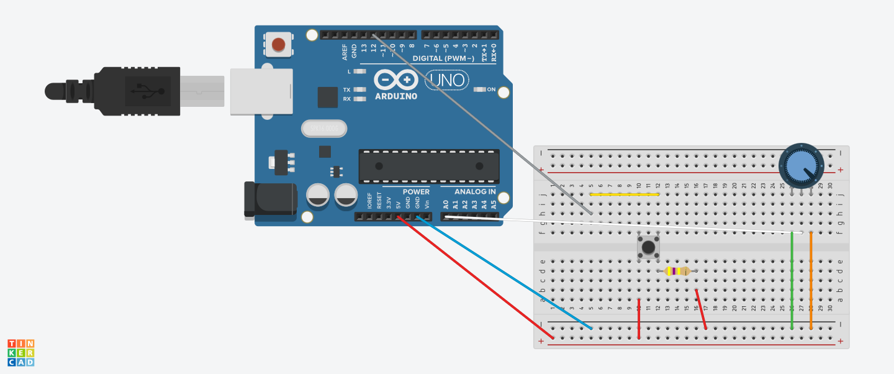
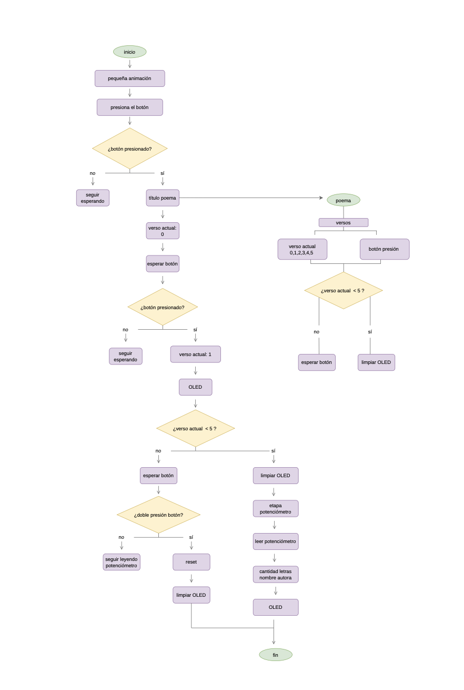

# sesion-04a

## apuntes sesión

En esta clase nos dividimos el trabajo pero igual íbamos avanzando a la par, yo en esta clase me encargué de organizar el diagrama de flujo y seguir organizando los componentes para que se adaptaran a la carcasa que estábamos haciendo. 

en la clase anterior, dejamos en la protoboard el botón y el potenciómetro, conectado al Arduino

En esta clase con ayuda pude agregar las pantalla a la conexión, además también entender como extender los componentes para poder adaptarlos a la carcasa. Por tiempo decidimos avanzar la carcasa y terminar los últimos detalles de los componentes.

<https://youtube.com/shorts/WhwTfn6NerA>

Como se puede observar en el vídeo en código ya estaba listo y solo se tuvieron que reorganizar algunos detalles y cambios, pero ya tenía todo el orden que teníamos pensado 

Luego terminé de avanzar le digrama de flujo y Aaron me dio algunas correcciones según lo que teníamos, que era poder mejorar más los elementos del diagrama para que se diferenciara 

Y para la carcasa decidimos hacerlo con cartón corrugado, el más delgado y hacer una cajita tipo baúl que guardara la pantallita en su interior, La Marce dijo que iba a hacer un ptotipo para que el viernes podamos armarlo y cortar en láser! ;)

## encargos

## lectura

página 40/50

En esta lectura el autor menciona que el consumo ya no busque satisfacer necesidades reales, sino mantener el funcionamiento de la economía, haciendo que las personas consuman ilusiones que el espectáculo presenta como felicidad y bienestar, por lo que terminamos consumiendo más ilusiones que cosas realmente necesarias. Luego pasé al siguiente capítulo que este hablaba de estilos de vida ideales que parecen alcanzables mediante el consumo (que miedo que es lo que se vive hoy en día) y que la abundancia de posibilidades y opciones pero que en verdad todas son falsas porque las alternativas terminan reproduciendo la misma sociedad de consumo, creo que es decir que a pesar de que las marcas, celebridades, cantantes abordan diferentes públicos e identidades, todas llegan a un mismo resultado: el consumismo (aunque esto aun no me queda claro a que se refiere con todas "las opciones" que menciona) .

Una crítica que menciona es que los trabajadores deberían recuperar el control sobre su trabajo y sobre su propia vida, en vez de dejar que la economía los dominen 

- “El consumidor real se convierte en consumidor de ilusiones”
- “La mercancía es esta ilusión efectivamente real, y el espectáculo su manifestación general”
