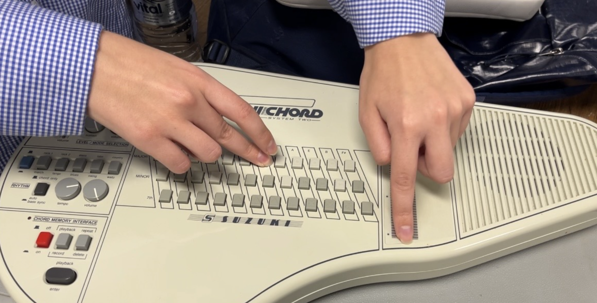
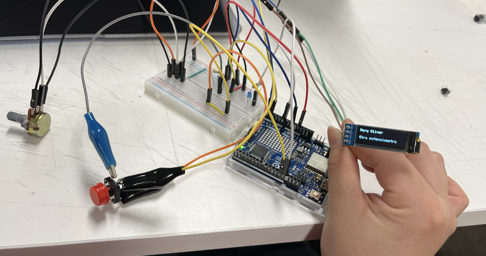
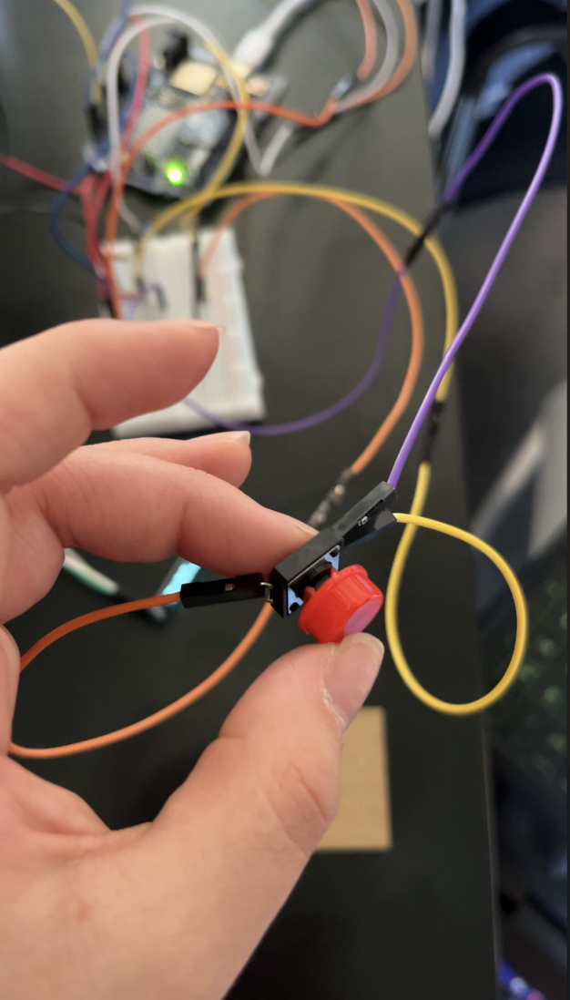

# sesion-04b

## apuntes sesión

En esta clase fue harta conversación, y sobre todo estaba muy emocionada porque por primera vez pude ver y tocar un Omnichord, hace mucho que me interesaba este instrumento y fue increíble escucharlo en persona! Además gracias a Mati que volvió de sus viaje y nos trajo dulces ;)

Para avance del proyecto 01 en esta clase, ya teníamos casi listo el programa solo faltaban algunos detalles mini pero de eso se encargó Magda, Marce terminó de armar el archivo de la carcasa para enviarlo a cortar en láser, Cata estuvo organizando el documento y yo estuve terminando las conexiones finales

en clase pude extender la pantalla desde la protoboard con cables Dupont macho-hembra, lo mismo con el potenciometro y una solución momentánea fue conectar el botón a caimanes para poder hacer la extensión. Luego de comprobar que estuviera funcionando y que corriera bien el código, sumamos un LED al proyecto que alumbrara cuando se apretara el botón también la extensión se hizo con cable dupont macho-hembra y hembra-hembra. 

Finalmente decidí soldar los cables al botón porque los cables se soltaba muy fácil, también soldé las patitas del potenciómetro a los cables para que quedara más seguro

<https://youtube.com/shorts/PEDALl7zob8>

Mis compañeras armaron la carcasa y ya con los componentes listos, empezamos con el armado, esta parte fue entretenida pero tuvimos algunos problemas que aún no entendemos porque. El botón tenía mucha sensibilidad y si no lo poníamos en cierta posición o dejarlo firme en un lugar, cambiaba solo el código y también nos pasaba lo mismo con el potenciómetro, creímos que fue quizás por algun cable con alguna conexión inestable. 

El día viernes quedó casi todo listo en la carcasa y componentes, tengo que subir una foto porque ese día no le tomamos foto 

## encargos

## lectura
