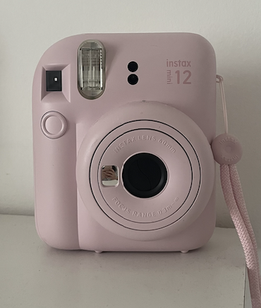

# sesion-06a

## apuntes sesión

### Clase

Una clase sirve para representar un tipo de objeto o cosa dentro del programa. En ella podemos definir qué información tiene y qué cosas puede hacer

+ Por ejemplo:

      class Perrito {

      };

La clase sería como una especie de molde. Después, a partir de ese molde, se pueden crear objetos que tengan las características y acciones que definimos.

Por ejemplo, si la clase es Perrito, podemos guardar información sobre el perro y también definir acciones que puede realizar.

### atributos

Los atributos sirven para guardar información sobre el objeto.

Por ejemplo, de un perrito nos podría interesar saber:
+hambre
+pelaje
+durmiendo

En código:


      class Perrito {

          bool hambre;
          bool durmiendo;
          int pelaje;

      };

Estas variables están dentro de la clase, por lo que funcionan como atributos del objeto.

Los atributos pueden representar características, datos o el estado en que se encuentra algo.

### Métodos

los métodos representan las cosas que un objeto puede realizar

Poodemos pensar que normalmente los métodos representan acciones o verbos, mientras que los atributos representan características o información.

PARA RECORDAR:

+ las clases comienzan con letra mayúscula: Perrito, Poodle
+ para variables, atributos y métodos, se comienza normalmente con minúscula: hambre, pelaje, ladrar
+ cuando el nombre tiene varias palabras, se juntan y cada palabra nueva comienza con mayúscula 


Ejemplo: 


clase: poodle 

instancia: copito 

(esta clase me recordó mucho a mi poodle copito gruñon que estuvo conmigo desde los 9 años <3)

```cpp
class Perrite

// atributos
bool hambre = true;
bool durmiendo = true;
pelaje = #000000;

// metodos
ladrar ();
comer ();
jugar();
portarseMal ();
ladrar (int volumen, int frecuencia);
```

```cpp
class Poodle {
superclass Perrite ();

bool molestando = true;
}
```

## encargos

próximos encargos: 

+ viernes 25-09: 

seleccionar un objeto y clasificarlo según las categorías del ser de aristóteles 


+ Sustancia: Cámara Instax
+ Cantidad: Una cámara, de aproximadamente 300 g.
+ Cualidad: Rosada, pequeña, rectangular y de plástico.
+ Relación: Sirve para tomar fotografías y guardar recuerdos.
+ Lugar: Está sobre mi escritorio o la llevo en mi bolso.
+ Tiempo: La uso cuando quiero tomar fotografías de momentos especiales.
+ Posición: Está apoyada sobre su base cuando no la estoy utilizando.
+ Posesión: Tiene una correa, un compartimento para las pilas y un espacio para los cartuchos de fotografías.
+ Acción: Toma e imprime fotografías.
+ Pasión:

  

+ martes 29-09:

bajar una red social e investigar que piensa esa red de mi, cuál es mi algoritmo
(listar 10 categorías que deciden qué y quién eres)


## lectura

Todavía voy en la parte donde se habla del proletariado y de cómo este debería convertirse en el actor de la transformación de la sociedad. Una de las cosas que más se repite es que no basta con tener una teoría o saber cómo funciona la sociedad, sino que ese conocimiento tiene que convertirse en acción. 

+ la organización de los trabajadores es muy importante

Menciona también a Marx, Bakunin, como los anarquistas y la socialdemocracia, y que buscaban de alguna forma cambiar la sociedad. 

Algo que se me hizo un poco difícil de comprender es que, crítica al anarquismo, porque aunque buscaba rechazar el Estado y las clases sociales, y que solo predomina la idea de que la revolución puede solucionar las cosas, sin considerar que las formas de organización también pueden.

+ "es en la lucha histórica misma donde es necesario realizar la fusión de conocimiento y de acción"
+ "la representación obrera se ha opuesto radicalmente a la clase"
