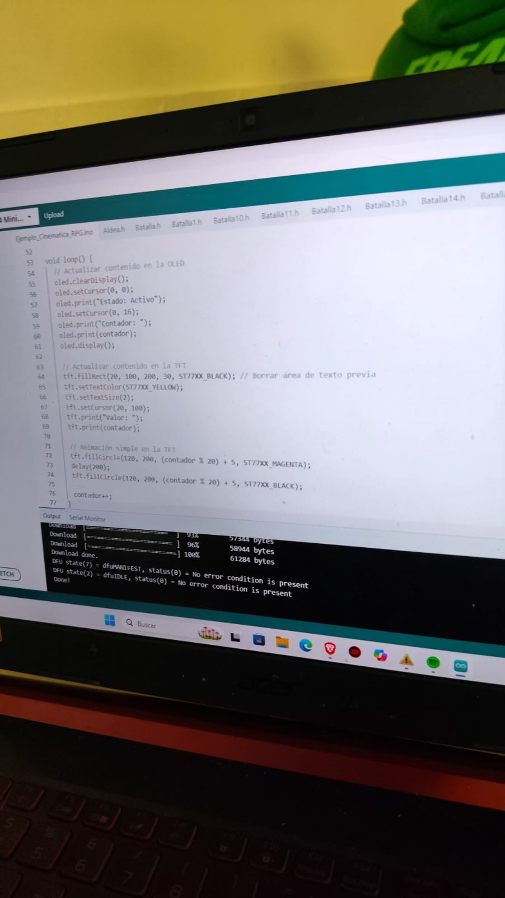
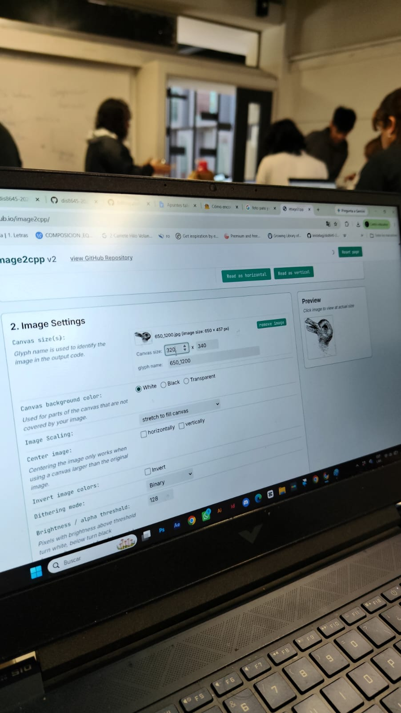
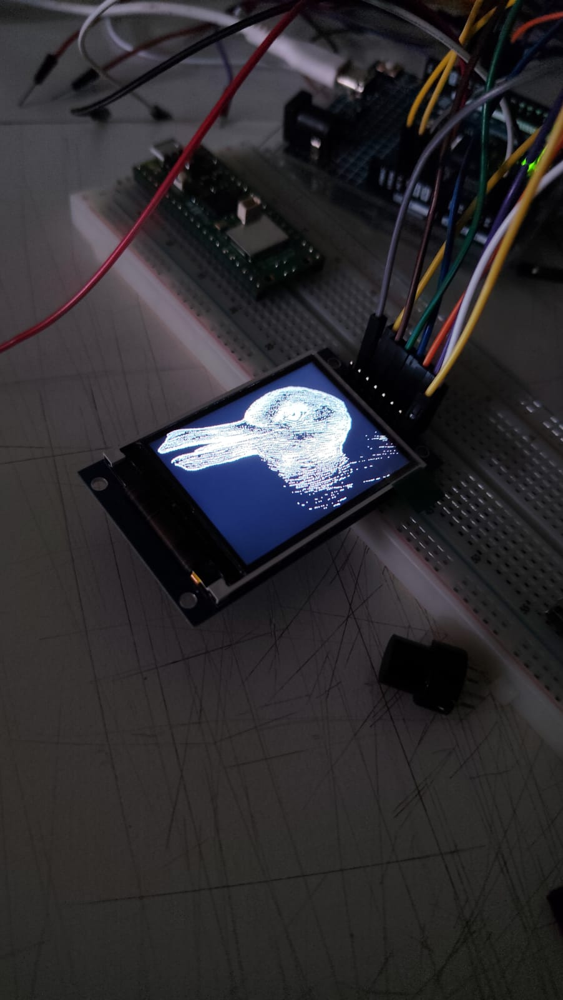

# sesion-04a

01-09-2026

## apuntes sesión

Avanzamos en el proyecto de manera autónoma como grupo.

Descubrimos (el Tomás) que el tecno-mesianismo es la idea de que la tecnología, especialmente la inteligencia artificial, va a salvar a la humanidad y de todos sus problemas de manera mágica.

En general hicimos experimentación en el proyecto más que nada para saber qué tipos de usos podíamos darle, con las pantallas y lo que se podía hacer con estas.

Dejaré ejemplos de imágenes tomadas en este proceso.

Este es un código que se utilizó para poder encender las 2 pantallas, la TFT y la I2C, que por lo que nos explicó el profe, esto habla 2 idiomas distintos y que es complicado hacer que hablen entre ellas, por eso nos pasó otras pantallas para intentar con esas, ya que tienen el mismo lenguaje y veremos en una próxima imagen, pero al final decidimos descartarlas, ya que no nos gustó cómo se veían estéticamente para lo que queríamos hacer nosotros con nuestro poema:

---

Acá, como podemos observar, están ya conviviendo las 2 pantallas a la vez y era el primer paso para saber que podíamos utilizar las 2 para los fines de nuestro poema y proyecto.

---

En esta foto se puede apreciar una de las pantallas TFT (la azul) de las 2 que nos había dado para probar con ellas y efectivamente también nos funcionó pero como mencioné antes, no nos gustó la estética.

---

Esta es la imagen de un pato conejo donde el profesor nos dijo que no tenía nada que ver con la materia y que no nos hicieran caso porque esto no iba a entrar en la clase, pero como somos rebeldes XD, lo pusimos en la pantalla I2C con código, lo que al final sí hace que entre en la clase, pero lo más importante es que vemos, ¿un conejo?, ¿un pato? o un Patonejo :V

---

Acá el código que se fue modificando del patonejo para que se pueda ver la imagen y, como lo hicimos con ayuda de la IA, pues a veces se cansaba, entonces tuvimos que borrar las líneas con espacios en blanco una por una para que la imagen no saliera desfasada.

---

Y, finalmente, este fue el resultado de la imagen escalada en la pantalla OLED, tanto en su forma original como en negativo.

## encargos

No hubo encargos en esta clase, ya que avanzamos en el proyecto y nuestros avances corresponden al autoencargo.

## lectura

**Resumen:**

Comienzo en la pág. 25, donde se describe la importancia de instalar la Raspberry Pi dentro de una carcasa oficial para protegerla y mantener correctamente sus componentes.

Luego, en la pág. 26, se menciona cómo conectar la tarjeta microSD. Esta solo puede entrar en un sentido y debería encajar en su lugar sin demasiada presión. Si es necesario forzarla, probablemente existe algún problema.

En la pág. 27 se explica cómo conectar un teclado y un ratón. Estos también deberían conectarse sin demasiada fuerza, ya que si es necesario forzar el conector, puede ser señal de que existe algún problema. También se explica que, en informática, el teclado y el ratón se conocen como dispositivos de entrada, a diferencia de la pantalla, que es un dispositivo de salida.

En la pág. 28 se explica cómo conectar una pantalla. Se muestra cómo conectar los cables micro-HDMI y HDMI respectivamente en cada lugar. Además, se menciona que en el televisor es necesario seleccionar la entrada correspondiente para poder visualizar la Raspberry Pi.

En la pág. 29 se explica cómo conectar un cable de red, aunque este paso es opcional. Se conecta el cable Ethernet de la misma forma en los puertos correspondientes, tanto en la Raspberry Pi como en el conmutador o enrutador de la red.

En la pág. 30 se explica cómo conectar una fuente de alimentación. Este es el último paso del proceso de instalación del hardware. La fuente también se conecta a una toma de corriente y, con esto, la Raspberry Pi ya queda montada.

Finalmente, en la pág. 31 se explica que la primera vez que se conecta la Raspberry Pi hay que esperar algunos minutos, debido a que debe realizar algunas tareas en segundo plano. Después de esto, aparece el asistente de configuración y el sistema operativo Raspberry Pi queda listo para ser configurado. Este procedimiento se aprenderá en el capítulo 3.

**2 Citas:**

1. “Solo puede entrar en un sentido y debería encajar en un sitio sin demasiada presión”.

2. “En informática, se conocen como dispositivos de entrada, a diferencia de la pantalla que es un dispositivo de salida”.

**Pregunta:**

¿Por qué la Raspberry Pi necesita realizar tareas en segundo plano durante varios minutos la primera vez que se conecta antes de mostrar el asistente de configuración?

**Referente:**

Raspberry Pi y sus diferentes componentes de hardware, especialmente la carcasa oficial, la tarjeta microSD, el teclado, el ratón, la pantalla, el cable Ethernet y la fuente de alimentación.
