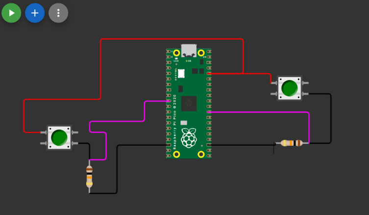
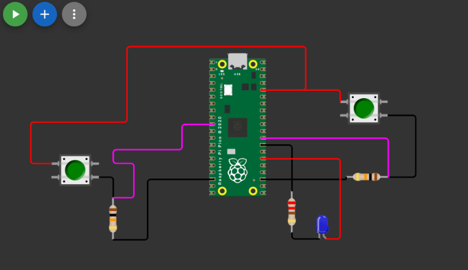
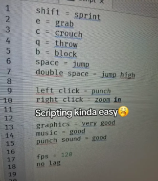

# sesion-07a

## apuntes sesión

una función tiene un int main, dentro de eso está todo lo que ocurre. todo lo que está fuera, es infraestructura que nos ayuda a que cuando pase int main todo funcione

> el if es una pregunta

+ ``printf("..")`` = imprimir texto
+ ``%d`` = placeholder (jefe lo hago al tiro), número entero
+ ``\n`` = enter, salto de línea 

```cpp
// estructura típica:
class Nombre {
public:
// int     // variables, atributos
// bools
// char

Nombre (...) { // método constructor 
}
	abrir(...); // métodos en general (funciones en una clase)
	cerrar(...);
};
```

> en la misma clase puede haber más de un constructor

``while (true)`` = _mientras sea verdad, hazlo. cuando sea falso, para._ esto es como un ``void loop()`` de Arduino pero más crudo. el main sucede una vez pero nunca va a parar ya que se queda atrapado en un while true:)

+ ``e.o.c`` = en otro caso

---

#### _%.1f_

``%.`` = place holder, aquí va un valor que voy a cambiar

``f`` = float, para mostrar decimales 
  
``.1`` = dame solo un decimal

---

## botones

atributos:

+ bool presionado = 0;
+ bool normallyOpen = true;
+ int patita; // este es buen candidato para constructor
+ Uint vecesPresionado = 0;
+ char [] nombre;

constructor:

```cpp
Boton (nuevaPatita) { // esto solia ser Boton (int patita)
	 patita = nuevaPatita; // esto solia ser patita = int patita
}
```

métodos:

```cpp
void leer();
```

al hacer archivos tendremos:

+ main.cpp (aquí está el funcionamiento total)
+ Boton.h (aquí se define la clase. van atributos, constructor y métodos)
+ Boton.cpp (aquí van las implementaciones de la clase)

> se llaman Boton porque estamos haciendo el ejemplo con botones, no confundirse. de lo que hablamos acá es sobre tener el _main_, _cpp_ y _header_
---

## encargos

1. usar el ejemplo base visto en clases <https://wokwi.com/projects/476507507193136129>, agregar un segundo botón en la simulación de hardware, agregar una segunda instancia de la clase Boton, agregarle un atributo y un método a la clase Boton, y hacer que el segundo botón haga algo diferente al primero.
2. descargar todos los archivos de wokwi, descomprimir el archivo.zip y subir esa carpeta a tu repositorio en esta sesión.

### avance en clases

durante clases primero me dediqué a hacer las nuevas conexiones para añadir el segundo botón, para luego dedicarme a intervenir el código y lograr que cumpla los mismos requisitos mínimos que el primer botón. para esto, dupliqué el botón y la resistencia, conectando el botón a ``GP22``, quedando así:



luego, me puse a intervenir el código que hizo Aarón en clases para poder lograr que, al presionar el nuevo botón que añadí, se muestre un mensaje al igual que lo hacía el botón inicial.

para partir, creé el botón como constructor en ``Boton miSegundoBoton(22)``, indicando que se encuentra en el pin GP22 de la raspi. luego, copié y pegué lo que había dentro de ``while (true)`` para que miSegundoBoton haga lo mismo que miPrimerBoton, es decir, lo siguiente:

```cpp
   miPrimerBoton.leer();

    if (miPrimerBoton.presionado) {
      printf("bacan estoy presionado, pero igual me presiona\n");
    }
    else {
      // cuando no este presionado
      printf("no hay nadie presionandome\n");
```

como dije, copié y pegué, pero edité el texto que se imprime a mi gusto y tuve que añadirle ``\n`` al inicio y al final de cada uno ya que estos al mostrarse en el monitor se pegaban al texto anterior.

fuera de eso, no hice nada más ya que los dos botones hacían el mismo trabajo solo que con distinto texto, por lo que quedé con lo siguiente dentro de los archivos:

### main.cpp

```cpp
// este es main.cpp

// esto venia en wokwi
#include <stdio.h>
#include "pico/stdlib.h"

// incluir mis archivos
#include "Boton.h"

int main() {

  stdio_init_all();

  // crear Boton que se llama miPrimerBoton
  // con el constructor
  Boton miPrimerBoton(7);
  Boton miSegundoBoton(22);
  
  while (true) {

    miPrimerBoton.leer();

    if (miPrimerBoton.presionado) {
      printf("bacan estoy presionado, pero igual me presiona\n");
    }
    else {
      // cuando no este presionado
      printf("\n no hay nadie presionandome\n");
    }

// agrego otro boton kkkkkk hola

    miSegundoBoton.leer();

    if (miSegundoBoton.presionado) {
        printf("hola soy el otro y estoy presionado\n");
    }
    else {
      printf("\n alguien plis \n");
    }

    sleep_ms(800);

  }

  
}
```

### Boton.h

```cpp
// Boton.h
// declaraciones de la clase Boton

#ifndef BOTON_H
#define BOTON_H

// esto lo agregamos para GPIO
// general purpose input output
#include "hardware/gpio.h"

// definir clase Boton
class Boton {

  // todo publico
  // nada de andar privatizando
  public:

  // atributos
  bool presionado = false;
  int duracionPresionado = 0;
  int patita;


  // constructor
  Boton(int nuevaPatita);

  // metodos
  void leer();
  void presionar();
  void soltar();

};

#endif
```

### Boton.cpp

```cpp
// Boton.cpp
// implementaciones de la clase

// importar el archivo header
#include "Boton.h"

// constructor
Boton::Boton(int nuevaPatita) {

  // guardar el valor
  Boton::patita = nuevaPatita;

   // inicializar patita
  gpio_init(Boton::patita);
  // la patita es entrada
  gpio_set_dir(Boton::patita, GPIO_IN);
}

void Boton::leer() {
    // leer boton
    Boton::presionado = gpio_get(Boton::patita);
}

// metodos
void Boton::presionar() {
  Boton::presionado = true;
  // queda pendiente calcular
  // cuanto rato lleva presionado
}
  
void Boton::soltar() {
   Boton::presionado = false;
   Boton::duracionPresionado = 0;
}
```
---

## trabajo en casa

una vez ya tenía logrado lo del segundo botón, me dediqué a probar agregar un LED que se controle con miSegundoBoton, por lo que agregué en la simulación un LED y una resistencia de 220Ω conectando la patita negativa del LED a una patita de la resistencia, mientras que la otra iba a GND. la patita positiva del LED la conecté a GP20:)

> mientras hacía esto, recordé que la primera vez que quise controlar un LED con un botón en una raspi puse el botón y el LED en el mismo GP (fue el semestre pasado lol)



ahora, para intervenir el código y añadir el LED creé nuevos archivos ya que no me gustaba la idea de añadir la clase _Led_ en el archivo de _Boton_, asi que hice _Led.h_ y _Led.cpp_. no sé si es lo correcto, pero era lo que me parecía más correcto en mi mente(?

para añadir el LED, dentro de _main.cpp_ añadí ``#include "Led.h"``, y dentro de ``int main()`` creé ``Led miUnicoLed(20);``. luego, con mucha esperanza añadí dentro de ``miSegundoBoton.leer()`` que si el botón estaba siendo presionado, entonces ``miUnicoLed.encendido = true;``.... me sentí como el meme de scripting kinda easy



en _Led.cpp_ y _Led.h_, copié y pegué lo que había dentro de _Boton.cpp_ y _Boton.h_, haciendo las siguientes modificaciones:

+ cambiar todo lo que decía Boton por Led (para ambos archivos, .h y .cpp)
+ dentro de _Led.h_ cambiar el atributo _presionado_ a _encendido_, y _duracionPresionado_ a _duracionEncendido_. mantuve _patita_ :V
+ cambiar métodos a _leer_ y _encender_... yo realmente tenía un sueño
+ dentro de _Led.cpp_ solo añadí el método de ``Led::encender()``, ignorando _leer_ LOLOLOLOLOL epic trolleo (a wokwi asumo???)

esta creación quedó de la siguiente forma:

### main.cpp

```cpp
// este es main.cpp

// esto venia en wokwi
#include <stdio.h>
#include "pico/stdlib.h"

// incluir mis archivos
#include "Boton.h"
#include "Led.h"

int main() {

  stdio_init_all();

  // crear Boton que se llama miPrimerBoton
  // con el constructor
  Boton miPrimerBoton(7);
  Boton miSegundoBoton(22);

  // crear LED que es mi unico LED... hola
  Led miUnicoLed(20);
  
  while (true) {

    miPrimerBoton.leer();

    if (miPrimerBoton.presionado) {
      printf("bacan estoy presionado, pero igual me presiona\n");
    }
    else {
      // cuando no este presionado
      printf("\n no hay nadie presionandome\n");
    }

// agrego otro boton kkkkkk hola

    miSegundoBoton.leer();

    if (miSegundoBoton.presionado) {
        printf("hola soy el otro y estoy presionado\n");
        miUnicoLed.encendido = true;
    }
    else {
      printf("\n alguien plis \n");
    }

    sleep_ms(800);

  }

  
}
```

### Led.h

```cpp
// Led.h
// declaraciones de la clase Led

#ifndef LED_H
#define LED_H

// esto lo agregamos para GPIO
// general purpose input output
#include "hardware/gpio.h"

// definir clase Led
class Led {

  // todo publico
  // nada de andar privatizando
  public:

  // atributos
  bool encendido = false;
  int duracionEncendido = 0;
  int patita;

 // constructor
  Led(int nuevaPatita);

  // metodos
  void leer();
  void encender();

};
          
#endif
```

### Led.cpp

```cpp
// Led.cpp
// implementaciones de la clase

// importar el archivo header
#include "Led.h"

// constructor
Led::Led(int nuevaPatita) {

  // guardar el valor
  Led::patita = nuevaPatita;

   // inicializar patita
  gpio_init(Led::patita);
  // la patita es entrada
  gpio_set_dir(Led::patita, GPIO_IN);
}


// metodos
void Led::encender() {
  Led::encendido = true;
  // queda pendiente calcular
  // cuanto rato lleva presionado
}

```

> no muestro _Boton.h_ ni _Boton.cpp_ ya que en estos no cambió nada, siguen siendo los de arriba.

#### atados que tuve por inventar LOL:

1. puse la patita del LED como entrada ya que copié y pegué el constructor del botón LOLOLOLOL y no le cambié la patita a salida
2. puse con mucha fe ``miUnicoLed.encendido = true;`` esperando que hiciera que se prenda el LED cuando se presione miSegundoBoton... solo soy una persona con muchos sueños y un computador.
3.  dentro de ``Led::encender()`` (en Led.cpp) también tenía ``encendido = true`` sin llamar a ``gpio_put``. al final lo cambié por ``gpio_put(Led::patita, 1)`` lololololol (1 es que le llega voltaje)

> recordar que ``Led::patita`` es en donde va el pin. esto se me olvidó mientras trabajaba en esto y fue horrible lo que me costó recordarlo

4. como método del LED puse ``leer()``, pensando que este leía cuándo había voltaje y cuándo no dependiendo del estado de miSegundoBoton, pero en realidad solo necesitaba ``encender()`` y ``apagar()`` ya que la señal le llegará cuando dentro de main.cpp se le explique que sucederá ``miUnicoLed.encender()`` cuando se lea ``miSegundoBoton`` en ``miSegundoBoton.leer()``

el código final con las correcciones que menciono está en la carpeta ``encargo-clases``. es un proyecto humilde, pero hecho con mucho esfuerzo a pesar de haber sido con un proceso torpe. de no querer descargarlo, pueden meterse al siguiente link: <https://wokwi.com/projects/477091575567790081> :)

### fuentes que me ayudaron... gracias internet

+ <https://www.kevsrobots.com/learn/c_pico/08_gpio_basics.html>
+ <https://ohyaan.github.io/programming/2._controlling_led_with_gpio/#understanding-the-code>

---

## lectura: Program Or Be Programmed: Ten Commands for a Digital Age - Douglas Rushkoff

“Websites and programs become laboratories where our keystrokes and mouse clicks are measured and compared, our every choice registered for its ability to predict and influence the next choice” esto me recordó al encargo que al final Aarón suspendió ya que dijo que ya teníamos mucha carga con la materia pesada (creo, o algo así era kkkkkk), por lo que al final no descargué mis datos pero de igual manera me quedé pensando en qué tan correcto es el perfil que tienen de mi(?. yo desde pequeño soy sonámbulo, lo cual me ha llevado a situaciones incómodas ya que mientras duermo, a veces mando mensajes (texto y/o audios) los cuales no siempre tienen sentido LOL, pero aparte de eso he notado que también tengo actividad en aplicaciones como lo es darle me gusta a cosas o hacer repost XDDD y no siempre son cosas que realmente me gustan o estoy de acuerdo con ellas, asi que creo que en todas mis redes sociales los datos que tienen las compañías sobre mi perfil no son 100% verídicas, ya que se ven afectadas por mi actividad mientras estoy en estado de sonámbulo cosa que no creo que sepan(?

“Withholding choice is not death. Quite on the contrary, it is one of the few things distinguishing life from its digital imitators” omg la cantidad de gente que conozco que no puede ni quiere tomar decisiones.... me incluyo LOLOLOLOL pero es horrible cuando somos todos iguales y no llegamos a ningún lado por no saber tomar una simple decisión como lo es el "qué comer", pero ahora que lo pienso es verdad que esto es algo que nos distingue de manera fuerte con todo lo digital, en donde todo es 0 o 1 y no hay ningún punto medio entre estos dos como lo menciona el libro.
