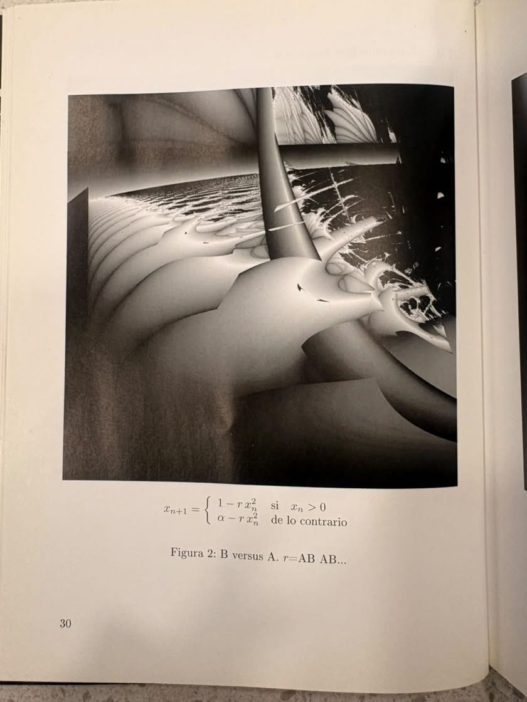
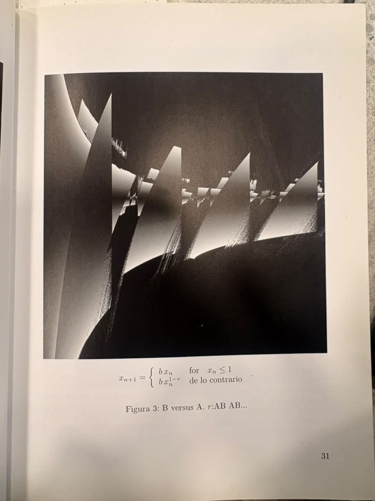

# sesion-06a

## apuntes sesión

### variables recordatorio 

antes de programar tengo que **declarar las variables y saber cuántas necesito**. cada dato del objeto que quiero representar tiene su tipo:

- **escalera**: `int`, porque cuento escalones y son números enteros
- **rampa**: `float`, porque su inclinación necesita decimales
- **botón**: `bool`, porque su estado es solo 0 o 1 (presionado o no)
- **u int** (`unsigned int`): la duración del presionado, un entero que nunca es negativo

```cpp
int escalera;
float rampa;
bool boton;
unsigned int duracionPresionado;
```

**paralelismo - complejidad: mientras más cosas quiero representar, más variables sueltas tengo y más difícil es seguirles el rastro. **paralelismo** es cuando varias variables o arreglos se corresponden entre sí (por ejemplo, la posición 3 de un arreglo va con la posición 3 de otro). eso funciona, pero la complejidad crece rápido. las clases sirven para bajar esa complejidad: en vez de muchas variables paralelas, agrupo todo lo de un objeto en un solo lugar.**

---

### arreglos

`[]` los arreglos son **colecciones**: guardan muchos valores bajo un mismo nombre. son colecciones de valores internos donde solo caben valores del mismo tipo, y cada uno se ubica por su posición (índice, que parte en 0).

```cpp
char saludo[] = "hola";
```

acá `saludo` es una colección de caracteres: `'h'`, `'o'`, `'l'`, `'a'` (más el carácter de fin de texto).

---

### clases

una clase es una **super estructura** que agrupa datos y acciones de una misma cosa. por ejemplo, la clase `estudiante`.

```cpp
class Estudiante {
  // ...
};
```

- **mayúscula** en el nombre de la clase
- **datos / variables / atributos**: lo que el objeto *tiene* o *es*
- **funciones / acciones / métodos**: lo que el objeto *hace*, se escriben con paréntesis `()`

### la relación con el lenguaje

- **sustantivos / materia / género**: los atributos son como los sustantivos, la materia de la que está hecho el objeto
- **verbos / energía / individuo**: los métodos son como los verbos, la energía, lo que hace que el individuo actúe

---

### aristóteles: categorizar

aristóteles **categorizaba** las cosas ordenándolas de lo general a lo particular. es la misma lógica de las clases:

- **especie**: perro
- **género**: poodle
- **individuo**: copito

el individuo es el caso concreto (un perro en particular), y arriba de él van las categorías que comparte con otros.

---

### atributos y métodos: class perrite

### atributos

son las variables de la clase, lo que el perrito *tiene*:

```cpp
class Perrite {
  public:
    bool hambre = true;
    bool durmiendo = true;
    int pelaje = 0x000000;   // color del pelaje, en hexadecimal (negro)
```

### métodos

son las acciones, lo que el perrito *hace*:

```cpp
    void comer();
    void dormir();
    void cagar();
    void ladrar(int volumen, int frecuencia);
};
```

`ladrar` recibe dos **parámetros**, `volumen` y `frecuencia`, para que no ladre siempre igual.

---

### modelo

un **modelo** sirve para comprender la realidad y así poder hacer **simulaciones**. cuando armo una clase no copio todo el objeto real: elijo solo los atributos y métodos que me importan para lo que quiero simular.

---

### herencia

`Poodle` **hereda** de `Perrite`: tiene todos sus atributos y métodos (perrito → poodle) y además puede sumar los suyos.

```cpp
class Poodle : public Perrite {
};

Poodle copito;
Poodle pelusa;
```

### arreglo de objetos

puedo guardar varios poodles en un arreglo (una colección) y recorrerlos con un `for`, haciendo que cada uno ladre:

```cpp
Poodle perrites[] = { copito, pelusa };

for (Poodle perrite : perrites) {
  perrite.ladrar(10, 2);
}
```

así no tengo que llamar uno por uno: el ciclo repite la misma acción para cada individuo de la colección.

---

### ejercicio

definir para un objeto:

- **3 atributos**: pelo negro, uñas largas, ...
- **3 métodos**: `dormir()`, `pintarUnias()`, ... (el color de uñas es un atributo que el método de pintar puede cambiar)

---


cosas que tengo que tener en cuenta:

- la estela de datos
- tímidos radicales
- atributos con **grados de importancia**: no todos los atributos pesan lo mismo
- **paramétrico**: los atributos como parámetros que puedo ir variando
- programas
- formas sistémicas, **pensamiento modular**: armar el objeto como piezas que se combinan
- entender cómo se lee un programa
- **paradigma**: la orientación a objetos es una forma de pensar los programas, no solo una sintaxis

---

### herramientas

- simulación: **tinkercad** y **wokwi**
- **raspberry pi pico**
- **micropython prohibido**
- **pico sdk examples**: los ejemplos parten desde `int main`, la función principal donde empieza el programa
  
## encargos

encargo
elegir un objeto
buscar la categoría de aristóteles que le corresponde (categorías del ser)
analizarlo esquemáticamente
citar la fuente

*Aristóteles estableció que estas ideas eran diez, a saber: sustancia, cantidad, cualidad, relación, lugar (ubi), tiempo (quando), posición (situs), posesión (habitus), acción y pasión.*

*Para el filósofo, la sustancia es el soporte real de todo lo demás. Las otras nueve categorías son solo accidentes o propiedades que dependen de esa sustancia.*

| Categoría                          | Idea simple                         | Ejemplo                                    |
| ---------------------------------- | ----------------------------------- | ------------------------------------------ |
| **1. Sustancia**                   | **Qué es algo / quién es**          | Una persona, un perro, una silla           |
| **2. Cantidad**                    | **Cuánto tiene o cuánto mide**      | 1,70 m de altura, 5 kg                     |
| **3. Cualidad**                    | **Cómo es**                         | Alto, blanco, inteligente, frío            |
| **4. Relación**                    | **Cómo se relaciona con otra cosa** | Padre de alguien, más grande que otro      |
| **5. Lugar (ubi)**                 | **Dónde está**                      | En una casa, en Santiago, sobre una mesa   |
| **6. Tiempo (quando)**             | **Cuándo está o sucede**            | Hoy, ayer, en 2026                         |
| **7. Posición (situs)**            | **Cómo está ubicado o dispuesto**   | Sentado, acostado, de pie                  |
| **8. Posesión / hábito (habitus)** | **Qué tiene, lleva o posee**        | Vestido, con zapatos, con armadura         |
| **9. Acción**                      | **Qué hace**                        | Correr, calentar, golpear                  |
| **10. Pasión**                     | **Qué recibe o experimenta**        | Ser golpeado, ser calentado, entristecerse |

https://filosofia.net/piezas/categorias.htm

**para memorizar: ¿Qué es? → ¿Cuánto? → ¿Cómo es? → ¿Con qué se relaciona? → ¿Dónde? → ¿Cuándo? → ¿En qué posición? → ¿Qué tiene? → ¿Qué hace? → ¿Qué recibe?**

Sí, te las dejo todas en ese mismo formato, **breves y directamente aplicadas a tu espejo**:

**Sustancia** dos partes que hacen uno

**Cantidad** tiene un tamaño, peso, grosor y proporción determinados.

**Cualidad** es brillante, reflectante, liso y tiene una superficie decorada con distintos patrones.

**Relación →** establece una relación entre quien lo observa y la imagen que aparece en su superficie.

**Lugar** puede estar en la mano, dentro de un bolso, sobre una superficie o frente al rostro.

**Tiempo** se utiliza en momentos específicos, como al maquillarse, arreglarse o revisar la apariencia.

**Posición** dependiendo de cómo se abra, sostenga o incline, cambia aquello que aparece reflejado.

**Posesión** puede ser llevado como un objeto personal y transportarse mediante su cadena.

**Acción** refleja la luz y genera una imagen de aquello que se encuentra frente a él.

**Pasión** recibe la luz y las imágenes provenientes del entorno y de quien se encuentra frente a él.


## lectura

### Análisis Figuras 2 y 3

### 7.3 Ecuación logística discontinua — Figura 2

La figura 2 trabaja con una **discontinuidad dentro de la ecuación logística**.

### Fórmula

```text
xₙ₊₁ = {
    1 - r xₙ²       si xₙ > 0
    α - r xₙ²       de lo contrario
}
```

La fórmula utiliza **dos reglas diferentes** dependiendo del valor de `xₙ`.

El cambio principal está en:

```text
1 → α
```

Es decir, cambia el término constante de la ecuación.


### Visualmente

* Predominan las **curvas**.
* Se generan superficies envolventes.
* Hay superposición y profundidad.
* La forma se siente más **orgánica y fluida**.
* La tridimensionalidad aparece principalmente mediante curvas, volumen y profundidad.

### Supuesto

Creo que la forma tridimensional de esta imagen se relaciona con el carácter **parabólico** de la ecuación.

Al mantener `xₙ²`, la función genera un comportamiento curvo que se transforma y se repite. La discontinuidad introduce cambios dentro de esta estructura y produce las deformaciones que vemos en la imagen.




### 7.4 Discontinuidad de la pendiente — Figura 3

La figura 3 trabaja con una **discontinuidad en la pendiente**.

### Fórmula

```text
xₙ₊₁ = {
    b xₙ       para xₙ ≤ 1
    b xₙʳ      de lo contrario
}
```

Aquí el cambio ocurre cuando:

```text
xₙ = 1
```

Antes de ese punto se utiliza:

```text
b xₙ
```

Después se utiliza:

```text
b xₙʳ
```

Por lo tanto, cambia la **forma en que la función crece**.

### ¿Qué provoca?

La función cambia su pendiente y esto genera un comportamiento más abrupto.

Es como si una trayectoria llegara a un punto y desde ahí cambiara su dirección o su forma de crecimiento.

### Visualmente

* Aparecen formas más **angulares**.
* Se observan planos y cortes.
* Hay repeticiones de elementos.
* Se genera una sensación más **rígida y fragmentada**.
* La tridimensionalidad aparece mediante planos, sombras, profundidad y cambios de dirección.

### Supuesto

Creo que la geometría de esta imagen se relaciona con el cambio de pendiente de la función.

El cambio en la manera de crecer puede asociarse visualmente con los **quiebres y formas puntiagudas** que aparecen en la imagen.




### se puede decir que: 

Una modificación pequeña en la ecuación puede producir un cambio importante en el comportamiento visual.

Figura 2: la discontinuidad modifica la ecuación.

Figura 3: la discontinuidad modifica la pendiente.

Por eso las dos imágenes tienen comportamientos visuales distintos:

Figura 2 = más curva y tridimensional.
Figura 3 = más angular y plana.


### Cita textual 

#### 7.3. La ecuación logística discontinua

*El comportamiento dinámico cambia totalmente si en la ecuación logística (o en cualquier función con un máximo parabólico) se introduce una discontinuidad en su máximo. La figura 2 muestra un ejemplo, usando una ecuación de las referencias [100, 101]. Para esta figura, se utilizó el valor $\alpha = 0,25$.*

*Una manera adicional de introducir una discontinuidad en la ecuación logística se indica en la fórmula bajo la figura coloreada 127. Para esta figura se usó $\alpha = 0,9935$. La misma fórmula genera las figuras 128 ($\alpha = 0,907$), 129 (fragmento de la figura 128), 130 ($\alpha = 0,908$) y 131 ($\alpha = 0,907$).*

#### 7.4. Discontinuidad de la pendiente

*En una conocida publicación en la revista *Nature*, Robert May presentó ecuaciones extremadamente simples, pero que tienen comportamientos dinámicos sorprendentemente complejos [103]. Una de esas ecuaciones se encuentra bajo la figura 3; se trata de una función continua, pero con una discontinuidad en la pendiente; para esta figura se usó $b = 50$.*

