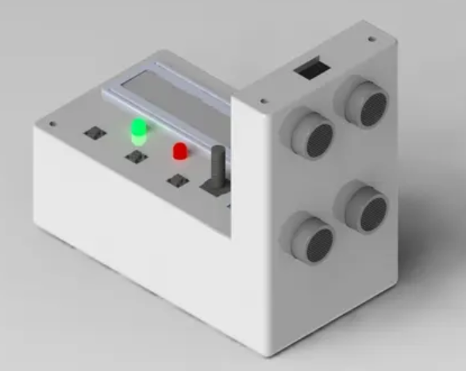
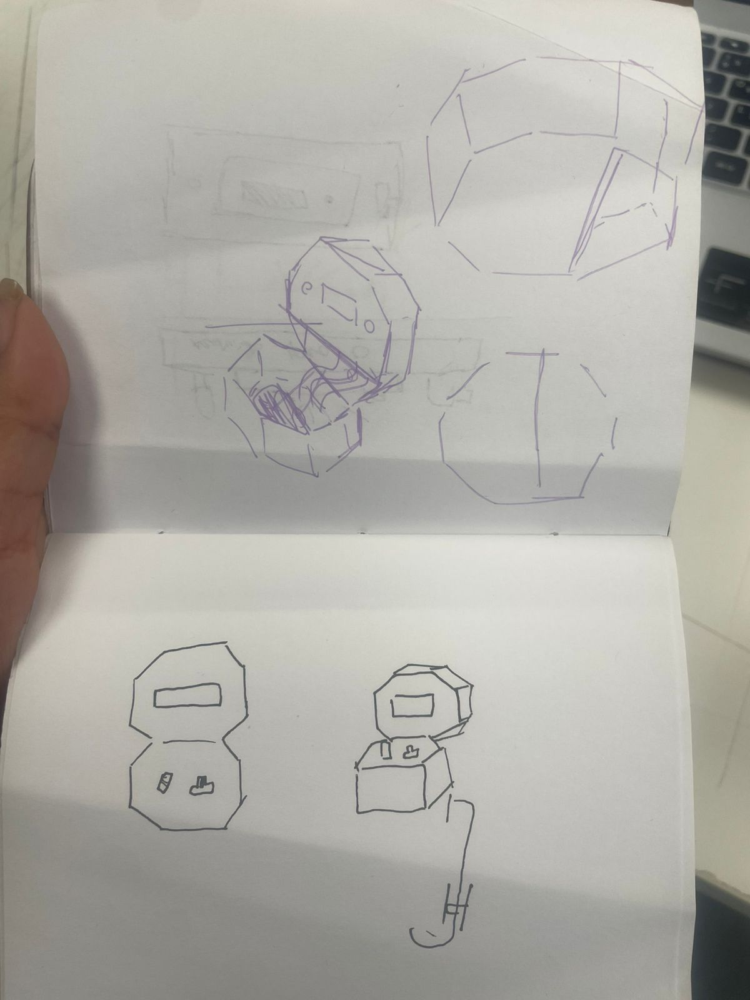
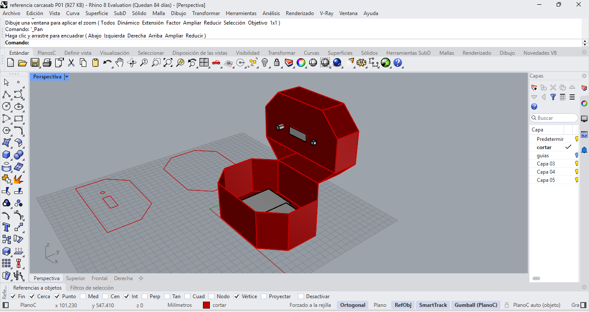

# sesion-04a
Martes 1 de Septiembre

## apuntes sesión
En esta clase nos dividimos las cosas por hacer para avanzar de mejor manera en clases.

Yo me estuve encargando de lo que seria el diseño de la carcasa, me enfoque en ver referentes con el material que utilizaremos que es cartón.

La primera idea que tomamos fue en base a un proyecto que vimos de un contador de ocupaciones en una habitación.
[referente](https://www.instructables.com/Rom-Occupancy-Counter/?utm_source=Pinterest&utm_medium=organic)

La idea es que en la parte horizontal quedara la protoboard, en el mismo cartón vaya la pantalla, el potenciómetro y el botón, en vertical iría el Arduino.

Luego pensamos que quizás el diseño/estructura de la carcasa debia ser mas acorde a el poema, en donde tomados la decisión de que no era necesario esconder todo el cableado ya que por nuestra perspectiva de el poema no todo debe ser "perfecto" entonces comenzamos a hacer distintos bocetos hasta que llegamos a uno que nos gusto.

ya teniendo la idea de la carcasa definida comencé a hacer un boceto final en Rhino, esto con la idea de ahorrarnos tiempo en cuanto a prototipado y medidas.

## encargos

## lectura
página 56

pág. 42: "Todo esto es claro: valor es tiempo, capital es valor o tiempo acumulado, y los bancos guardan este tiempo acumulado. Entonces, de repente, algo nuevo pasa en la relación entre tiempo, trabajo y valor, y algo pasa en la tecnologia"

pág. 48: "Es de esta manera que el significado puede ser totalmente olvidado, pero la información puede continuar en movimiento"
