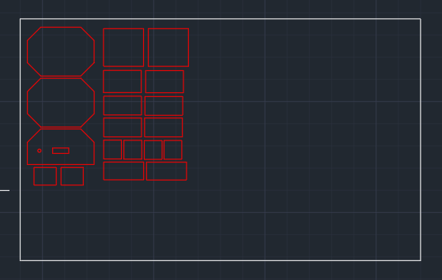

# sesion-04b
Viernes 4 de Agosto

## apuntes sesión
En esta clase ya se terminaron de hacer los últimos arreglos de el código y se terminaron las conexiones.

Yo estuve haciendo un archivo en AutoCAD en donde todas las piezas quedaron separadas para mandar a cortar en laser, ya que esto es lo mas rápido y preciso, nos quedamos después de clase avanzando en el lid para tratar de dejar todo listo este día.

Hicimos el armado de la carcasa y una vez armada comenzamos de una vez a incluir los componentes a esta.

Quedo prácticamente lista pero encontramos una pequeña falla al darnos cuenta de que las conexiones quedaron bastan sensibles entonces si la movíamos muy fuerte o pasábamos a llevar los cables. todo el código se ejecutaba tal cual como si se estuviera apretando el botón, para solucionar este problema tratamos de dejar los cables lo mas fijos posibles para que no se estuvieran moviendo tanto.

## encargos

## lectura
